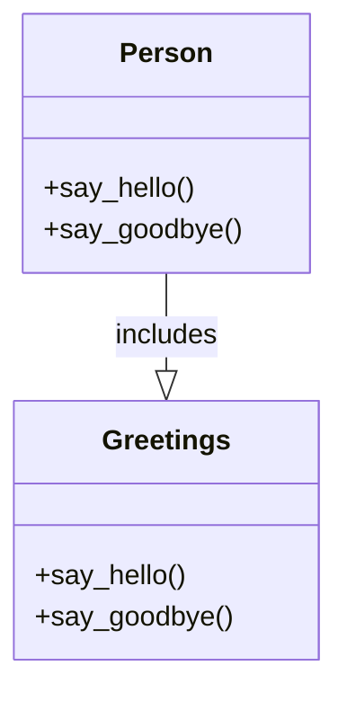

## 2.7 Modules and Mixins

In the realm of Ruby programming, modules and mixins play a pivotal role in promoting code reusability and maintainability. They offer a flexible alternative to multiple inheritance, allowing developers to share behavior across different classes without the complexities and pitfalls associated with traditional inheritance hierarchies. In this section, we will delve into the concept of modules, explore how they can be used as mixins, and demonstrate their practical applications in building scalable Ruby applications.

### Understanding Modules in Ruby

**Modules** in Ruby are a way to group together methods, classes, and constants. They serve two primary purposes:

1. **Namespace Management**: Modules help prevent name clashes by encapsulating related methods and constants.
2. **Mixins**: Modules can be mixed into classes to share reusable code, providing a mechanism for code reuse that is more flexible than inheritance.

#### Defining a Module

To define a module in Ruby, use the `module` keyword followed by the module name. Here's a simple example:

```ruby
module Greetings
  def say_hello
    puts "Hello!"
  end

  def say_goodbye
    puts "Goodbye!"
  end
end
```

In this example, the `Greetings` module contains two methods: `say_hello` and `say_goodbye`. These methods can be mixed into any class that needs them.

### Using `include` and `extend` to Mix in Modules

Ruby provides two primary ways to mix modules into classes: `include` and `extend`. Understanding the difference between these two is crucial for effectively using modules as mixins.

#### Using `include`

The `include` method is used to mix a module's instance methods into a class. When you include a module in a class, the module's methods become available as instance methods of the class.

```ruby
class Person
  include Greetings
end

person = Person.new
person.say_hello  # Outputs: Hello!
person.say_goodbye  # Outputs: Goodbye!
```

In this example, the `Person` class includes the `Greetings` module, making its methods available to instances of `Person`.

#### Using `extend`

The `extend` method is used to mix a module's methods as class methods. When you extend a class with a module, the module's methods become available as class methods.

```ruby
class Robot
  extend Greetings
end

Robot.say_hello  # Outputs: Hello!
Robot.say_goodbye  # Outputs: Goodbye!
```

Here, the `Robot` class extends the `Greetings` module, making its methods available as class methods.

### Shared Behavior Across Different Classes

Modules are particularly useful for sharing behavior across different classes. Let's consider an example where we have multiple classes that need to log messages.

```ruby
module Logger
  def log_info(message)
    puts "INFO: #{message}"
  end

  def log_error(message)
    puts "ERROR: #{message}"
  end
end

class Application
  include Logger
end

class Service
  include Logger
end

app = Application.new
app.log_info("Application started")  # Outputs: INFO: Application started

service = Service.new
service.log_error("Service failed")  # Outputs: ERROR: Service failed
```

In this example, both `Application` and `Service` classes include the `Logger` module, allowing them to log messages without duplicating code.

### Advantages of Mixins Over Multiple Inheritance

Ruby does not support multiple inheritance, but mixins provide a powerful alternative. Here are some advantages of using mixins:

- **Flexibility**: Mixins allow you to compose behavior from multiple modules, giving you the flexibility to mix and match functionality as needed.
- **Avoiding Inheritance Hierarchies**: Mixins help avoid the complexities and rigidity of deep inheritance hierarchies, promoting a more modular design.
- **Code Reusability**: By encapsulating reusable code in modules, you can easily share functionality across different classes without duplication.

### Designing Modules for Maximum Reusability and Cohesion

When designing modules, aim for maximum reusability and cohesion. Here are some best practices:

- **Single Responsibility**: Each module should have a single responsibility, encapsulating related methods and functionality.
- **Loose Coupling**: Avoid dependencies on specific classes or objects within modules to ensure they can be reused in different contexts.
- **Clear Naming**: Use descriptive names for modules and methods to convey their purpose and functionality.

### Try It Yourself

To solidify your understanding of modules and mixins, try modifying the examples provided. For instance, add new methods to the `Greetings` or `Logger` modules and see how they can be used in different classes. Experiment with using both `include` and `extend` to see how they affect method availability.

### Visualizing Module Inclusion

To better understand how modules are included in classes, let's visualize the method lookup path using a class diagram.



In this diagram, the `Person` class includes the `Greetings` module, inheriting its methods.

### References and Further Reading

For more information on Ruby modules and mixins, consider exploring the following resources:

- [Ruby Modules and Mixins](https://ruby-doc.org/core-3.0.0/Module.html) - Ruby documentation on modules.
- [Programming Ruby: The Pragmatic Programmer's Guide](https://pragprog.com/titles/ruby3/programming-ruby-3-2/) - A comprehensive guide to Ruby programming.

### Knowledge Check

- What are the two primary purposes of modules in Ruby?
- How do `include` and `extend` differ in terms of method availability?
- What are some advantages of using mixins over multiple inheritance?

### Summary

Modules and mixins are powerful tools in Ruby for promoting code reusability and maintainability. By encapsulating reusable code in modules and mixing them into classes, you can create flexible, scalable applications without the complexities of multiple inheritance. Remember, this is just the beginning. As you progress, you'll build more complex and interactive applications. Keep experimenting, stay curious, and enjoy the journey!

## Quiz: Modules and Mixins



### What is the primary purpose of modules in Ruby?

- [x] To group related methods and constants
- [ ] To create new classes
- [ ] To handle exceptions
- [ ] To manage memory

> **Explanation:** Modules are used to group related methods and constants, providing a way to organize code and prevent name clashes.

### How does the `include` method affect a class?

- [x] It adds module methods as instance methods
- [ ] It adds module methods as class methods
- [ ] It creates a subclass
- [ ] It overrides existing methods

> **Explanation:** The `include` method mixes a module's methods into a class as instance methods, making them available to instances of the class.

### What does the `extend` method do?

- [x] It adds module methods as class methods
- [ ] It adds module methods as instance methods
- [ ] It creates a new module
- [ ] It deletes existing methods

> **Explanation:** The `extend` method mixes a module's methods into a class as class methods, making them available to the class itself.

### Which of the following is an advantage of mixins over multiple inheritance?

- [x] Flexibility in composing behavior
- [ ] Increased complexity
- [ ] Deeper inheritance hierarchies
- [ ] More rigid design

> **Explanation:** Mixins provide flexibility in composing behavior from multiple modules, avoiding the complexities of multiple inheritance.

### What should be avoided when designing modules for reusability?

- [x] Dependencies on specific classes
- [ ] Single responsibility
- [ ] Descriptive naming
- [ ] Encapsulation of related methods

> **Explanation:** Avoiding dependencies on specific classes ensures that modules can be reused in different contexts without modification.

### What keyword is used to define a module in Ruby?

- [x] module
- [ ] class
- [ ] def
- [ ] include

> **Explanation:** The `module` keyword is used to define a module in Ruby.

### Which method makes module methods available as instance methods?

- [x] include
- [ ] extend
- [ ] require
- [ ] load

> **Explanation:** The `include` method makes module methods available as instance methods in a class.

### What is a key benefit of using modules for namespace management?

- [x] Preventing name clashes
- [ ] Increasing method visibility
- [ ] Enhancing performance
- [ ] Reducing code size

> **Explanation:** Modules help prevent name clashes by encapsulating related methods and constants within a namespace.

### How can you make a module's methods available as class methods?

- [x] Use the `extend` method
- [ ] Use the `include` method
- [ ] Use the `require` method
- [ ] Use the `load` method

> **Explanation:** The `extend` method makes a module's methods available as class methods.

### True or False: Ruby supports multiple inheritance.

- [ ] True
- [x] False

> **Explanation:** Ruby does not support multiple inheritance, but mixins provide a flexible alternative for sharing behavior across classes.


