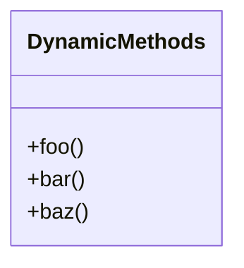

## 2.8 Metaprogramming Basics

Metaprogramming in Ruby is a fascinating and powerful technique that allows developers to write code that can generate, modify, or introspect other code at runtime. This capability can lead to more flexible and dynamic applications, but it also comes with its own set of challenges and risks. In this section, we will explore the basics of metaprogramming in Ruby, providing you with the foundational knowledge needed to harness its power effectively.

### What is Metaprogramming?

Metaprogramming refers to the practice of writing code that can manipulate other code. In Ruby, this is achieved through a variety of techniques that allow you to define methods, alter classes, and evaluate code dynamically. This can be incredibly useful for creating domain-specific languages (DSLs), reducing boilerplate code, and implementing design patterns more elegantly.

#### Significance in Ruby Development

Ruby is particularly well-suited for metaprogramming due to its dynamic nature and flexible syntax. The language's open classes, dynamic method definitions, and reflection capabilities make it an ideal candidate for metaprogramming. This allows developers to create more expressive and concise code, which can lead to increased productivity and maintainability when used judiciously.

### Key Concepts and Techniques

Let's delve into some of the fundamental techniques used in Ruby metaprogramming, including `define_method`, `class_eval`, and `instance_eval`.

#### `define_method`

The `define_method` is a powerful tool in Ruby that allows you to define methods dynamically. This can be particularly useful when you need to create multiple methods with similar behavior.

```ruby
class DynamicMethods
  [:foo, :bar, :baz].each do |method_name|
    define_method(method_name) do
      puts "You called #{method_name}!"
    end
  end
end

dm = DynamicMethods.new
dm.foo  # Output: You called foo!
dm.bar  # Output: You called bar!
dm.baz  # Output: You called baz!
```

**Explanation:** In this example, we define three methods (`foo`, `bar`, `baz`) dynamically using `define_method`. Each method, when called, outputs a message indicating which method was invoked.

#### `class_eval`

The `class_eval` method allows you to evaluate a block of code in the context of a class. This can be used to add methods or modify existing ones.

```ruby
class MyClass
end

MyClass.class_eval do
  def hello
    puts "Hello from MyClass!"
  end
end

obj = MyClass.new
obj.hello  # Output: Hello from MyClass!
```

**Explanation:** Here, we use `class_eval` to define a new method `hello` within `MyClass`. This method can then be called on instances of `MyClass`.

#### `instance_eval`

The `instance_eval` method is similar to `class_eval`, but it operates on an instance level, allowing you to evaluate code in the context of a specific object.

```ruby
obj = Object.new

obj.instance_eval do
  def greet
    puts "Greetings from this object!"
  end
end

obj.greet  # Output: Greetings from this object!
```

**Explanation:** In this example, `instance_eval` is used to define a method `greet` directly on a specific object, rather than on the class itself.

### The Power and Risks of Metaprogramming

Metaprogramming is a double-edged sword. While it offers immense power and flexibility, it also introduces potential risks and challenges.

#### Power

- **Flexibility:** Metaprogramming allows you to write more flexible and reusable code. You can create methods and classes on the fly, reducing redundancy and boilerplate.
- **Expressiveness:** It enables the creation of DSLs, which can make your code more readable and expressive, closely aligning with the problem domain.
- **Dynamic Behavior:** You can adapt your code's behavior at runtime, which is particularly useful for plugins, configuration, and testing frameworks.

#### Risks

- **Complexity:** Metaprogramming can make your code harder to understand and maintain. It can obscure the flow of logic, making debugging more challenging.
- **Performance:** Dynamically generated code can sometimes be slower than statically defined code, as it may involve additional overhead.
- **Readability:** Overuse of metaprogramming can lead to code that is difficult for others (or even yourself) to read and understand.

### Best Practices for Metaprogramming

To use metaprogramming effectively, it's important to follow best practices that emphasize readability and maintainability.

- **Use Sparingly:** Only use metaprogramming when it provides a clear benefit. Avoid using it for simple tasks that can be accomplished with regular Ruby code.
- **Document Thoroughly:** Clearly document any metaprogramming techniques you use, explaining why they are necessary and how they work.
- **Test Rigorously:** Ensure that your metaprogrammed code is thoroughly tested to catch any unexpected behavior or edge cases.
- **Prioritize Readability:** Strive to write metaprogrammed code that is as readable as possible. Use descriptive method names and comments to clarify complex logic.

### Preparing for Advanced Metaprogramming

This introduction to metaprogramming in Ruby provides a foundation for more advanced topics, which we will explore in later sections. As you continue your journey, remember to balance the power of metaprogramming with the need for clear, maintainable code.

### Try It Yourself

Experiment with the examples provided by modifying them to suit your needs. Try creating your own dynamic methods or using `class_eval` and `instance_eval` to alter classes and objects. As you practice, consider the implications of your changes on code readability and maintainability.

### Visualizing Metaprogramming Concepts

To better understand how metaprogramming works, let's visualize the process of dynamically defining methods using a class diagram.



**Description:** This diagram represents the `DynamicMethods` class with dynamically defined methods `foo`, `bar`, and `baz`.

### References and Further Reading

- [Ruby Metaprogramming: A Primer](https://www.rubyguides.com/2018/11/ruby-metaprogramming/)
- [Metaprogramming Ruby 2: Program Like the Ruby Pros](https://pragprog.com/titles/ppmetr2/metaprogramming-ruby-2/)
- [Ruby Documentation on `define_method`](https://ruby-doc.org/core-2.7.0/Module.html#method-i-define_method)

### Knowledge Check

- What is metaprogramming, and why is it significant in Ruby development?
- How does `define_method` differ from regular method definitions?
- What are the potential risks associated with metaprogramming?
- How can `class_eval` and `instance_eval` be used to modify classes and objects?

### Embrace the Journey

Remember, metaprogramming is just one of many tools in your Ruby toolkit. As you continue to explore its capabilities, keep in mind the importance of writing clear, maintainable code. Stay curious, experiment with new techniques, and enjoy the journey of mastering Ruby development!

## Quiz: Metaprogramming Basics



### What is metaprogramming in Ruby?

- [x] Writing code that can manipulate other code at runtime
- [ ] Writing code that only runs during compilation
- [ ] Writing code that cannot be changed after execution
- [ ] Writing code that is purely functional

> **Explanation:** Metaprogramming in Ruby involves writing code that can dynamically modify or generate other code at runtime.

### Which method allows you to define methods dynamically in Ruby?

- [x] `define_method`
- [ ] `eval`
- [ ] `instance_eval`
- [ ] `class_eval`

> **Explanation:** `define_method` is used to define methods dynamically in Ruby, allowing for flexible and reusable code structures.

### What is a potential risk of using metaprogramming?

- [x] Increased complexity and reduced readability
- [ ] Improved performance and speed
- [ ] Enhanced security and stability
- [ ] Simplified debugging and maintenance

> **Explanation:** Metaprogramming can increase complexity and reduce readability, making code harder to maintain and debug.

### How does `class_eval` differ from `instance_eval`?

- [x] `class_eval` evaluates code in the context of a class, while `instance_eval` evaluates code in the context of an instance
- [ ] `class_eval` is used for defining instance methods, while `instance_eval` is used for class methods
- [ ] `class_eval` is faster than `instance_eval`
- [ ] `class_eval` is only available in Ruby 3.x

> **Explanation:** `class_eval` operates at the class level, allowing modifications to the class itself, whereas `instance_eval` operates at the instance level, affecting individual objects.

### What is a best practice when using metaprogramming?

- [x] Use it sparingly and document thoroughly
- [ ] Use it as often as possible for all tasks
- [ ] Avoid testing metaprogrammed code
- [ ] Prioritize performance over readability

> **Explanation:** Metaprogramming should be used sparingly and documented thoroughly to ensure code remains readable and maintainable.

### What is the purpose of `instance_eval`?

- [x] To evaluate code in the context of a specific object
- [ ] To evaluate code in the context of a class
- [ ] To define class-level methods
- [ ] To improve performance

> **Explanation:** `instance_eval` allows you to evaluate code in the context of a specific object, enabling dynamic modifications at the instance level.

### Why is Ruby well-suited for metaprogramming?

- [x] Due to its dynamic nature and flexible syntax
- [ ] Because it is a statically typed language
- [ ] Because it has a strong focus on functional programming
- [ ] Because it lacks reflection capabilities

> **Explanation:** Ruby's dynamic nature and flexible syntax make it ideal for metaprogramming, allowing for dynamic code generation and modification.

### What is a common use case for metaprogramming?

- [x] Creating domain-specific languages (DSLs)
- [ ] Improving algorithmic efficiency
- [ ] Enhancing security features
- [ ] Simplifying user interfaces

> **Explanation:** Metaprogramming is often used to create DSLs, which can make code more expressive and closely aligned with the problem domain.

### What should you prioritize when writing metaprogrammed code?

- [x] Readability and maintainability
- [ ] Performance and speed
- [ ] Complexity and abstraction
- [ ] Security and encryption

> **Explanation:** Prioritizing readability and maintainability ensures that metaprogrammed code remains understandable and manageable over time.

### True or False: Metaprogramming can be used to modify existing methods at runtime.

- [x] True
- [ ] False

> **Explanation:** Metaprogramming allows for the modification of existing methods at runtime, providing flexibility and adaptability in code behavior.




