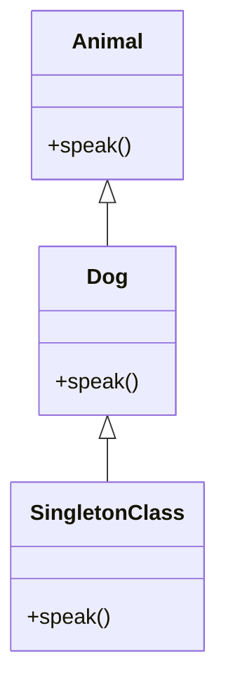

## 2.9 Singleton Classes and Eigenclasses

In Ruby, the concepts of singleton classes and eigenclasses are powerful tools that allow developers to customize individual objects. This capability is a testament to Ruby's flexibility and dynamic nature, enabling per-object behavior modification without altering the class definition itself. In this section, we will delve into the intricacies of singleton classes and eigenclasses, exploring their purpose, how to define them, and their practical applications.

### Understanding Singleton Classes

**Singleton classes** in Ruby are special, hidden classes that allow you to define methods on individual objects. When you add a method to a single object, Ruby creates a singleton class for that object, and the method is stored there. This allows the object to have unique behavior that other instances of the same class do not share.

#### Defining Singleton Methods

To define a singleton method on an object, you simply define a method on that object directly. Here's a basic example:

```ruby
class Animal
  def speak
    "generic sound"
  end
end

dog = Animal.new
cat = Animal.new

# Define a singleton method on the dog object
def dog.speak
  "woof!"
end

puts dog.speak # Outputs: woof!
puts cat.speak # Outputs: generic sound
```

In this example, we define a `speak` method specifically for the `dog` object. The `cat` object, which is also an instance of `Animal`, remains unaffected and continues to use the `speak` method defined in the `Animal` class.

### Accessing an Object's Singleton Class

Every object in Ruby can have a singleton class, whether or not it has any singleton methods. You can access an object's singleton class using the `singleton_class` method:

```ruby
puts dog.singleton_class # Outputs: #<Class:#<Animal:0x00007f9c8b0c8c58>>
```

This output indicates that `dog` has a singleton class, which is a subclass of the `Animal` class. The singleton class is where Ruby stores the `speak` method defined specifically for `dog`.

### Practical Uses of Singleton Classes

Singleton classes are particularly useful in scenarios where you need to add behavior to specific instances without affecting other instances of the same class. Here are some practical applications:

1. **Customizing Library Objects**: When using third-party libraries, you might want to add methods to specific objects without modifying the library's source code.

2. **Testing and Mocking**: In testing, you can use singleton methods to mock or stub methods on specific objects.

3. **Dynamic Behavior**: Singleton classes allow you to dynamically alter an object's behavior at runtime, which can be useful in applications that require high flexibility.

### Clarifying Terminology: Singleton Class vs. Eigenclass

The terms **singleton class** and **eigenclass** are often used interchangeably in the Ruby community. However, they refer to the same concept. The term "eigenclass" is more commonly used in academic discussions and among Ruby enthusiasts who delve into the language's internals. In practice, "singleton class" is the more widely recognized term.

### Visualizing Singleton Classes

To better understand the relationship between an object, its class, and its singleton class, let's visualize it using a class diagram:



In this diagram, `Animal` is the base class, `Dog` is an instance of `Animal`, and `SingletonClass` represents the singleton class of `Dog`, which contains the custom `speak` method.

### Code Example: Singleton Classes in Action

Let's explore a more complex example that demonstrates the power of singleton classes:

```ruby
class Vehicle
  def initialize(make, model)
    @make = make
    @model = model
  end

  def details
    "Vehicle: #{@make} #{@model}"
  end
end

car = Vehicle.new("Toyota", "Camry")
truck = Vehicle.new("Ford", "F-150")

# Add a singleton method to the car object
def car.details
  "Car: #{@make} #{@model} - Special Edition"
end

puts car.details  # Outputs: Car: Toyota Camry - Special Edition
puts truck.details # Outputs: Vehicle: Ford F-150
```

In this example, we define a `details` method specifically for the `car` object, giving it a unique description. The `truck` object remains unaffected and uses the `details` method from the `Vehicle` class.

### Try It Yourself

To deepen your understanding, try modifying the code examples above. For instance, add more singleton methods to different objects or experiment with accessing and modifying singleton classes directly. Observe how these changes affect the behavior of individual objects.

### Practical Considerations

While singleton classes offer great flexibility, they should be used judiciously. Overusing singleton methods can lead to code that is difficult to understand and maintain. It's important to strike a balance between flexibility and maintainability.

### Summary

In this section, we've explored the concept of singleton classes and eigenclasses in Ruby. We've seen how they allow for per-object customization, enabling unique behavior for individual instances. By understanding and utilizing singleton classes, you can write more flexible and dynamic Ruby code.

### Further Reading

For more information on singleton classes and eigenclasses, consider exploring the following resources:

- [Ruby Documentation on Singleton Classes](https://ruby-doc.org/core-2.7.0/Object.html#method-i-singleton_class)
- [Metaprogramming Ruby 2: Program Like the Ruby Pros](https://pragprog.com/titles/ppmetr2/metaprogramming-ruby-2/)

## Quiz: Singleton Classes and Eigenclasses



### What is a singleton class in Ruby?

- [x] A special class that allows defining methods on individual objects.
- [ ] A class that can only have one instance.
- [ ] A class that inherits from another class.
- [ ] A class that cannot be instantiated.

> **Explanation:** A singleton class in Ruby is a special, hidden class that allows you to define methods on individual objects, enabling per-object customization.

### How do you define a singleton method on an object?

- [x] By defining a method directly on the object.
- [ ] By creating a new class for the object.
- [ ] By modifying the object's class.
- [ ] By using a module.

> **Explanation:** You define a singleton method on an object by defining a method directly on that object, which is then stored in the object's singleton class.

### What is the purpose of a singleton class?

- [x] To allow individual objects to have unique behavior.
- [ ] To restrict the number of instances of a class.
- [ ] To provide a template for creating objects.
- [ ] To encapsulate related methods and data.

> **Explanation:** The purpose of a singleton class is to allow individual objects to have unique behavior that other instances of the same class do not share.

### How can you access an object's singleton class?

- [x] Using the `singleton_class` method.
- [ ] Using the `class` method.
- [ ] Using the `superclass` method.
- [ ] Using the `ancestors` method.

> **Explanation:** You can access an object's singleton class using the `singleton_class` method, which returns the singleton class of the object.

### What is another term for a singleton class?

- [x] Eigenclass
- [ ] Superclass
- [ ] Subclass
- [ ] Metaclass

> **Explanation:** Another term for a singleton class is "eigenclass," which is often used in academic discussions and among Ruby enthusiasts.

### What is a practical use of singleton classes?

- [x] Customizing behavior of specific instances.
- [ ] Defining global variables.
- [ ] Creating new classes.
- [ ] Managing memory allocation.

> **Explanation:** A practical use of singleton classes is to customize the behavior of specific instances without affecting other instances of the same class.

### What happens when you define a method on an individual object?

- [x] A singleton class is created for the object.
- [ ] The object's class is modified.
- [ ] A new class is created.
- [ ] The method is added to the superclass.

> **Explanation:** When you define a method on an individual object, a singleton class is created for that object, and the method is stored there.

### Can every object in Ruby have a singleton class?

- [x] Yes
- [ ] No

> **Explanation:** Yes, every object in Ruby can have a singleton class, whether or not it has any singleton methods.

### What is the risk of overusing singleton methods?

- [x] Code can become difficult to understand and maintain.
- [ ] Objects will become immutable.
- [ ] Methods will be shared across all instances.
- [ ] The program will run slower.

> **Explanation:** The risk of overusing singleton methods is that the code can become difficult to understand and maintain, as it introduces unique behavior to individual objects.

### True or False: Singleton classes are a form of metaprogramming in Ruby.

- [x] True
- [ ] False

> **Explanation:** True. Singleton classes are a form of metaprogramming in Ruby, as they allow you to dynamically alter the behavior of individual objects at runtime.



Remember, this is just the beginning. As you progress, you'll build more complex and interactive Ruby applications. Keep experimenting, stay curious, and enjoy the journey!
