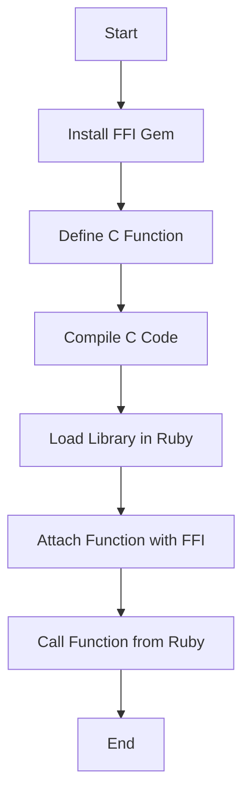

## 20.1 Interfacing with C Libraries Using Ruby FFI

In the world of software development, the ability to integrate different technologies can significantly enhance the capabilities and performance of an application. Ruby, known for its simplicity and elegance, can be extended with the power of C libraries using the Foreign Function Interface (FFI). This section will guide you through the process of interfacing Ruby with C libraries, allowing you to leverage native code for improved performance and access to system-level functionalities.

### Understanding Ruby FFI

**Foreign Function Interface (FFI)** is a mechanism that allows a programming language to call functions or use services written in another language. In the context of Ruby, FFI enables Ruby programs to call C functions directly, without the need for writing C extensions. This is particularly useful for:

- **Performance Optimization**: C is a lower-level language that can execute operations faster than Ruby. By offloading performance-critical tasks to C, you can enhance the speed of your Ruby applications.
- **Accessing System Libraries**: Many system-level operations are exposed through C libraries. FFI allows Ruby applications to access these libraries, expanding their functionality.
- **Reusing Existing Code**: If you have existing C libraries, FFI provides a way to reuse this code within Ruby applications, saving development time and effort.

### Installing the FFI Gem

To use FFI in Ruby, you need to install the `ffi` gem. This gem provides the necessary tools to interface with C libraries.

```bash
gem install ffi
```

Once installed, you can require it in your Ruby scripts:

```ruby
require 'ffi'
```

### Defining and Calling C Functions

To call a C function from Ruby using FFI, you need to define the function signature in Ruby. Let's walk through an example where we call the `strlen` function from the C standard library, which calculates the length of a string.

```ruby
require 'ffi'

module CString
  extend FFI::Library
  ffi_lib FFI::Library::LIBC

  # Attach the C function 'strlen' to Ruby
  attach_function :strlen, [:string], :size_t
end

# Use the attached function
puts CString.strlen("Hello, FFI!")  # Output: 10
```

**Explanation**:
- **`extend FFI::Library`**: This module extension allows you to define C functions within a Ruby module.
- **`ffi_lib`**: Specifies the library from which to load the function. `FFI::Library::LIBC` is a constant that refers to the standard C library.
- **`attach_function`**: Binds a C function to a Ruby method. The first argument is the name of the method in Ruby, the second is an array of argument types, and the third is the return type.

### Use Cases for Ruby FFI

#### Performance Enhancement

Consider a scenario where you need to perform complex mathematical computations. Implementing these in C and calling them from Ruby can significantly reduce execution time.

```c
// math_operations.c
#include <math.h>

double calculate_square_root(double number) {
    return sqrt(number);
}
```

Compile this C code into a shared library:

```bash
gcc -shared -o libmath_operations.so -fPIC math_operations.c
```

Now, use FFI in Ruby to call this function:

```ruby
require 'ffi'

module MathOperations
  extend FFI::Library
  ffi_lib './libmath_operations.so'

  attach_function :calculate_square_root, [:double], :double
end

puts MathOperations.calculate_square_root(16.0)  # Output: 4.0
```

#### Accessing System Libraries

FFI can be used to access system libraries for tasks such as file manipulation, network communication, or interacting with hardware.

```ruby
require 'ffi'

module SystemLib
  extend FFI::Library
  ffi_lib FFI::Library::LIBC

  attach_function :getpid, [], :int
end

puts "Process ID: #{SystemLib.getpid}"  # Output: Process ID: <current_process_id>
```

### Best Practices and Challenges

#### Memory Management

When interfacing with C, memory management becomes crucial. C does not have automatic garbage collection like Ruby, so you must ensure that memory is allocated and freed appropriately to prevent leaks.

#### Error Handling

C functions often return error codes rather than raising exceptions. You need to handle these error codes in Ruby to ensure robust error handling.

#### Data Type Compatibility

Ensure that the data types used in Ruby match those expected by the C functions. FFI provides a range of data types, such as `:int`, `:double`, `:string`, etc., to facilitate this.

### Alternative Methods: Writing C Extensions

While FFI is a powerful tool, writing C extensions is another way to integrate C with Ruby. C extensions involve writing Ruby bindings in C, which can offer more control and potentially better performance. However, they require a deeper understanding of both Ruby's and C's internals.

### Try It Yourself

Experiment with the examples provided. Try modifying the C functions or creating new ones to see how they interact with Ruby. For instance, create a C function that performs a different mathematical operation and call it from Ruby using FFI.

### Visualizing the Process

Let's visualize the process of interfacing Ruby with C libraries using FFI:



This flowchart outlines the steps involved in using FFI to call C functions from Ruby.

### Further Reading

For more information on Ruby FFI, consider exploring the following resources:
- [Ruby FFI GitHub Repository](https://github.com/ffi/ffi)
- [Ruby FFI Documentation](https://www.rubydoc.info/gems/ffi)

### Summary

Interfacing with C libraries using Ruby FFI is a powerful technique that allows you to extend Ruby applications with native code. By understanding how to define and call C functions, manage memory, and handle errors, you can leverage the full potential of C libraries in your Ruby projects. Remember, this is just the beginning. As you progress, you'll discover more complex integrations and optimizations. Keep experimenting, stay curious, and enjoy the journey!

## Quiz: Interfacing with C Libraries Using Ruby FFI



### What is the primary purpose of Ruby FFI?

- [x] To call functions from C libraries directly in Ruby
- [ ] To compile Ruby code into C
- [ ] To convert Ruby objects into C objects
- [ ] To replace Ruby's garbage collector with C's memory management

> **Explanation:** Ruby FFI allows Ruby programs to call functions from C libraries directly, enabling integration with native code.

### Which gem is used to enable FFI in Ruby?

- [x] ffi
- [ ] cffi
- [ ] ruby-ffi
- [ ] native-ffi

> **Explanation:** The `ffi` gem is used to enable Foreign Function Interface capabilities in Ruby.

### How do you specify the C library to load in Ruby using FFI?

- [x] Using the `ffi_lib` method
- [ ] Using the `require` method
- [ ] Using the `attach_function` method
- [ ] Using the `load_library` method

> **Explanation:** The `ffi_lib` method is used to specify the C library from which functions will be loaded.

### What is a common use case for using Ruby FFI?

- [x] Performance optimization by calling C functions
- [ ] Replacing Ruby's syntax with C syntax
- [ ] Compiling Ruby code into machine code
- [ ] Debugging Ruby applications

> **Explanation:** A common use case for Ruby FFI is performance optimization by calling C functions for computationally intensive tasks.

### What is a potential challenge when using Ruby FFI?

- [x] Memory management
- [ ] Syntax errors
- [ ] Lack of documentation
- [ ] Incompatibility with Ruby 3.x

> **Explanation:** Memory management is a potential challenge when using Ruby FFI, as C does not have automatic garbage collection.

### Which method is used to bind a C function to a Ruby method in FFI?

- [x] `attach_function`
- [ ] `bind_function`
- [ ] `link_function`
- [ ] `connect_function`

> **Explanation:** The `attach_function` method is used to bind a C function to a Ruby method in FFI.

### What is the return type of the `strlen` function in the provided example?

- [x] `:size_t`
- [ ] `:int`
- [ ] `:string`
- [ ] `:double`

> **Explanation:** The return type of the `strlen` function is `:size_t`, which represents an unsigned integer type.

### What is an alternative to using FFI for integrating C with Ruby?

- [x] Writing C extensions
- [ ] Using Ruby gems
- [ ] Compiling Ruby code into C
- [ ] Using JavaScript

> **Explanation:** Writing C extensions is an alternative method for integrating C with Ruby, offering more control over the integration.

### True or False: FFI allows Ruby to automatically manage memory for C functions.

- [ ] True
- [x] False

> **Explanation:** False. FFI does not automatically manage memory for C functions; developers must handle memory management manually.

### What is the first step in using FFI to call a C function from Ruby?

- [x] Install the FFI gem
- [ ] Write the C function
- [ ] Compile the C code
- [ ] Attach the function in Ruby

> **Explanation:** The first step is to install the FFI gem, which provides the necessary tools to interface with C libraries.


