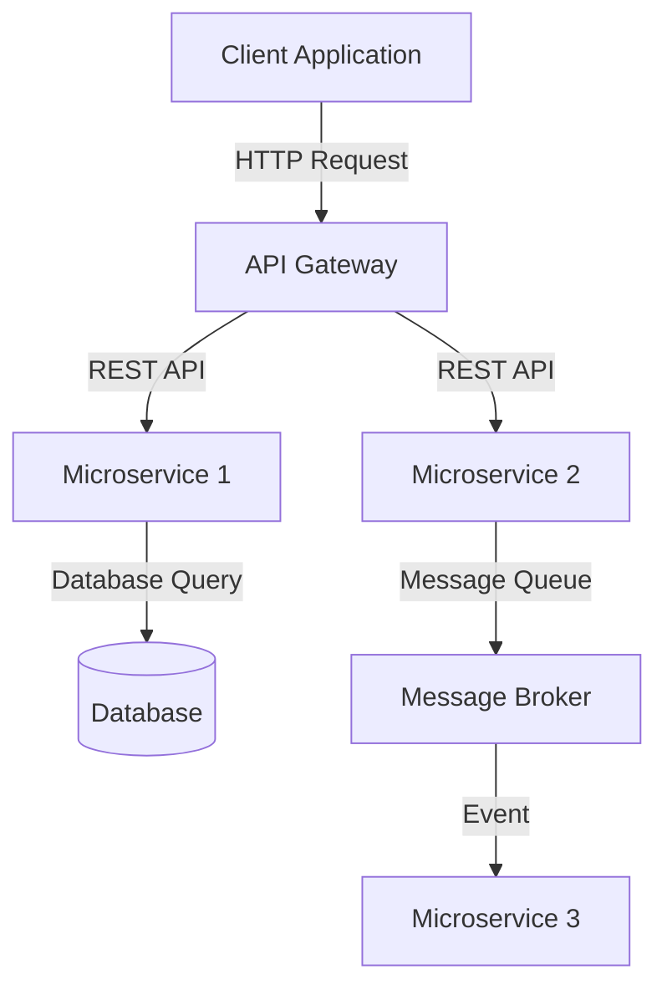

## 20.10 Best Practices for System Integration

In today's interconnected world, integrating Ruby applications with other systems is a common requirement. Whether you're connecting to a database, consuming a web service, or interacting with a message queue, following best practices in system integration is crucial for building reliable and maintainable applications. This section will guide you through essential practices to ensure your integrations are robust and efficient.

### Importance of Loose Coupling and Clear Interfaces

Loose coupling is a fundamental principle in system integration. It ensures that changes in one part of the system do not have a ripple effect on others. By designing clear interfaces, you can achieve loose coupling and make your system more adaptable to change.

#### Key Strategies for Loose Coupling

- **Use Interfaces and Abstract Classes**: Define clear interfaces or abstract classes that specify the expected behavior. This allows different components to interact without being tightly bound to each other's implementations.

- **Employ Dependency Injection**: Inject dependencies rather than hardcoding them. This makes it easier to swap out components without altering the core logic.

- **Adopt the Adapter Pattern**: Use the Adapter pattern to bridge incompatible interfaces. This pattern allows you to integrate third-party libraries or legacy systems without modifying their code.

```ruby
# Adapter Pattern Example
class LegacySystem
  def old_method
    "Legacy System Response"
  end
end

class NewSystemAdapter
  def initialize(legacy_system)
    @legacy_system = legacy_system
  end

  def new_method
    @legacy_system.old_method
  end
end

legacy_system = LegacySystem.new
adapter = NewSystemAdapter.new(legacy_system)
puts adapter.new_method # Outputs: Legacy System Response
```

### Proper Error Handling and Retries

Error handling is critical in system integration, where network issues, service downtimes, and unexpected data can cause failures. Implementing robust error handling and retry mechanisms can significantly enhance the reliability of your integrations.

#### Best Practices for Error Handling

- **Use Exceptions Wisely**: Raise exceptions for unexpected conditions and handle them at appropriate levels. Avoid using exceptions for control flow.

- **Implement Retry Logic**: Use retry mechanisms for transient errors, such as network timeouts. Libraries like `retryable` can simplify this process.

```ruby
require 'retryable'

Retryable.retryable(tries: 3, on: [Net::ReadTimeout, Net::OpenTimeout]) do
  # Code that might fail
  response = Net::HTTP.get_response(URI('http://example.com'))
  puts response.body
end
```

- **Graceful Degradation**: Design your system to degrade gracefully in case of failures. Provide fallback mechanisms or default responses when possible.

### Strategies for Dealing with Network Latency and Failures

Network latency and failures are inevitable in distributed systems. Preparing for these challenges can help maintain the performance and reliability of your integrations.

#### Techniques to Mitigate Network Issues

- **Use Asynchronous Processing**: Offload network calls to background jobs using libraries like Sidekiq or Resque. This prevents blocking the main application flow.

- **Implement Circuit Breakers**: Use the Circuit Breaker pattern to prevent cascading failures. This pattern temporarily halts requests to a failing service, allowing it time to recover.

```ruby
# Circuit Breaker Example
class CircuitBreaker
  def initialize(threshold)
    @threshold = threshold
    @failure_count = 0
  end

  def call
    if @failure_count >= @threshold
      puts "Circuit open, skipping call"
      return
    end

    begin
      yield
      @failure_count = 0
    rescue
      @failure_count += 1
      puts "Failure count: #{@failure_count}"
    end
  end
end

breaker = CircuitBreaker.new(3)
breaker.call { raise "Simulated failure" }
```

- **Optimize Network Requests**: Batch requests when possible and use efficient data formats like JSON or MessagePack to reduce payload size.

### The Role of Logging and Monitoring in Integrations

Logging and monitoring are essential for diagnosing issues and understanding the behavior of your integrations. They provide insights into system performance and help identify bottlenecks or failures.

#### Effective Logging Practices

- **Log at Appropriate Levels**: Use different log levels (DEBUG, INFO, WARN, ERROR) to categorize messages. This helps in filtering logs based on the severity of issues.

- **Use Structured Logging**: Employ structured logging to capture logs in a machine-readable format. This facilitates easier parsing and analysis.

```ruby
require 'logger'

logger = Logger.new(STDOUT)
logger.info("Integration started")
logger.error("Failed to connect to service")
```

- **Monitor Key Metrics**: Set up monitoring for key metrics such as response times, error rates, and throughput. Tools like Prometheus and Grafana can help visualize these metrics.

### Data Validation and Transformation Considerations

Data validation and transformation are crucial when integrating systems with different data formats or schemas. Ensuring data integrity and consistency is vital for successful integrations.

#### Best Practices for Data Handling

- **Validate Input Data**: Perform validation on incoming data to ensure it meets the expected format and constraints. Use libraries like `dry-validation` for complex validations.

- **Transform Data as Needed**: Use transformation layers to convert data between different formats or schemas. This can be achieved using tools like `jbuilder` or `active_model_serializers`.

```ruby
# Data Transformation Example
class UserSerializer
  def initialize(user)
    @user = user
  end

  def to_json
    {
      id: @user.id,
      name: @user.name,
      email: @user.email
    }.to_json
  end
end

user = User.new(id: 1, name: "John Doe", email: "john@example.com")
serializer = UserSerializer.new(user)
puts serializer.to_json
```

- **Handle Data Mismatches**: Implement strategies to handle data mismatches, such as default values or error notifications.

### Documentation and Adherence to Standards

Thorough documentation and adherence to standards are essential for maintainable integrations. They ensure that your integrations are understandable and consistent.

#### Documentation Practices

- **Document APIs and Interfaces**: Provide clear documentation for APIs and interfaces, including expected inputs, outputs, and error codes.

- **Use Standard Protocols**: Adhere to standard protocols and formats, such as REST, SOAP, or GraphQL, to ensure compatibility and ease of integration.

- **Maintain Up-to-Date Documentation**: Regularly update documentation to reflect changes in the system or integration points.

### Visualizing System Integration

To better understand the flow of data and interactions between systems, visualizing the integration architecture can be helpful. Below is a simple diagram illustrating a typical integration scenario.



**Diagram Description**: This diagram shows a client application making HTTP requests to an API Gateway, which routes requests to different microservices. Microservice 1 interacts with a database, while Microservice 2 communicates with a message broker, which in turn triggers events for Microservice 3.

### Try It Yourself

To solidify your understanding of these concepts, try modifying the code examples provided. Experiment with different retry strategies, logging formats, and data transformation techniques. Consider setting up a simple integration scenario using a Ruby application and a mock service to practice these best practices.

### Knowledge Check

- What are the benefits of loose coupling in system integration?
- How can you implement retry logic in Ruby applications?
- Why is structured logging important in integrations?
- What are some strategies for handling network latency?
- How can data validation improve the reliability of integrations?

### Embrace the Journey

Remember, mastering system integration is a journey. As you apply these best practices, you'll build more resilient and maintainable Ruby applications. Keep experimenting, stay curious, and enjoy the process of learning and improving your skills.

## Quiz: Best Practices for System Integration



### What is the primary benefit of loose coupling in system integration?

- [x] It allows components to change independently without affecting others.
- [ ] It increases the speed of data processing.
- [ ] It reduces the need for documentation.
- [ ] It simplifies the user interface design.

> **Explanation:** Loose coupling allows components to change independently, enhancing system adaptability and maintainability.

### Which pattern is useful for bridging incompatible interfaces in system integration?

- [x] Adapter Pattern
- [ ] Singleton Pattern
- [ ] Observer Pattern
- [ ] Factory Pattern

> **Explanation:** The Adapter Pattern is used to bridge incompatible interfaces, allowing integration without modifying existing code.

### What is a key strategy for handling transient errors in network communication?

- [x] Implementing retry logic
- [ ] Increasing timeout durations
- [ ] Ignoring errors
- [ ] Using synchronous processing

> **Explanation:** Implementing retry logic helps handle transient errors by attempting the operation multiple times.

### Why is structured logging beneficial in system integration?

- [x] It allows for easier parsing and analysis of logs.
- [ ] It reduces the size of log files.
- [ ] It eliminates the need for error handling.
- [ ] It simplifies the codebase.

> **Explanation:** Structured logging captures logs in a machine-readable format, facilitating easier parsing and analysis.

### What is the purpose of a circuit breaker in system integration?

- [x] To prevent cascading failures by temporarily halting requests to a failing service
- [ ] To increase the speed of data processing
- [ ] To simplify the user interface design
- [ ] To reduce the need for documentation

> **Explanation:** A circuit breaker prevents cascading failures by temporarily halting requests to a failing service, allowing it time to recover.

### How can you ensure data integrity during system integration?

- [x] By validating input data
- [ ] By ignoring data mismatches
- [ ] By using synchronous processing
- [ ] By increasing timeout durations

> **Explanation:** Validating input data ensures it meets expected formats and constraints, maintaining data integrity.

### What is a common tool for visualizing key metrics in system integration?

- [x] Prometheus
- [ ] Git
- [ ] Docker
- [ ] RubyGems

> **Explanation:** Prometheus is a tool used for monitoring and visualizing key metrics in system integration.

### Why is it important to document APIs and interfaces?

- [x] To provide clear expectations for inputs, outputs, and error codes
- [ ] To reduce the size of the codebase
- [ ] To eliminate the need for error handling
- [ ] To simplify the user interface design

> **Explanation:** Documenting APIs and interfaces provides clear expectations for inputs, outputs, and error codes, aiding integration.

### What is a benefit of using asynchronous processing in system integration?

- [x] It prevents blocking the main application flow.
- [ ] It increases the size of log files.
- [ ] It eliminates the need for error handling.
- [ ] It simplifies the codebase.

> **Explanation:** Asynchronous processing offloads network calls to background jobs, preventing blocking of the main application flow.

### True or False: Adhering to standard protocols like REST or SOAP is unnecessary in system integration.

- [ ] True
- [x] False

> **Explanation:** Adhering to standard protocols like REST or SOAP ensures compatibility and ease of integration.




