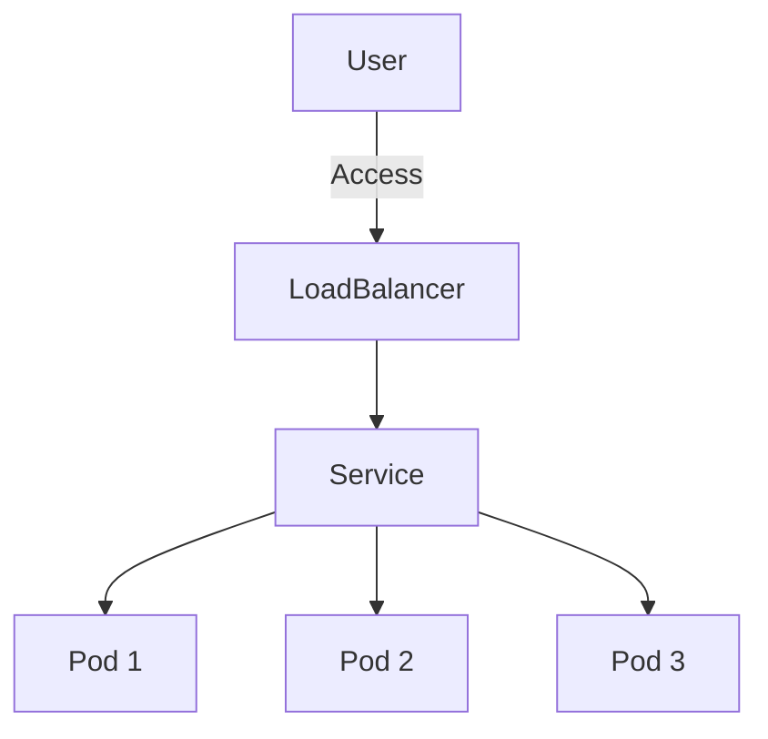

## 20.12 Containerization with Docker and Kubernetes

In today's fast-paced development environment, containerization has become a cornerstone for deploying applications consistently across various environments. Docker and Kubernetes are two pivotal technologies that enable developers to build, ship, and run applications efficiently. In this section, we will explore how to leverage these tools to containerize Ruby applications, ensuring they are scalable and maintainable.

### Introduction to Containerization

Containerization is a lightweight form of virtualization that allows developers to package applications and their dependencies into a single unit, known as a container. This approach ensures that applications run consistently regardless of the environment, be it development, testing, or production.

#### Benefits of Containerization

- **Consistency**: Containers encapsulate all dependencies, ensuring the application behaves the same across different environments.
- **Isolation**: Each container runs in its own isolated environment, preventing conflicts between applications.
- **Scalability**: Containers can be easily scaled up or down to meet demand.
- **Portability**: Containers can run on any system that supports the container runtime, making them highly portable.

### Creating Dockerfiles for Ruby Applications

A Dockerfile is a script containing a series of instructions on how to build a Docker image. Let's create a simple Dockerfile for a Ruby application.

```dockerfile
# Use the official Ruby image from the Docker Hub
FROM ruby:3.1

# Set the working directory
WORKDIR /usr/src/app

# Copy the Gemfile and Gemfile.lock into the image
COPY Gemfile Gemfile.lock ./

# Install the dependencies
RUN bundle install

# Copy the rest of the application code
COPY . .

# Expose the application port
EXPOSE 4567

# Command to run the application
CMD ["ruby", "app.rb"]
```

#### Key Points

- **Base Image**: We start with an official Ruby image, which includes Ruby and Bundler pre-installed.
- **Working Directory**: The `WORKDIR` instruction sets the working directory inside the container.
- **Dependency Installation**: We copy the `Gemfile` and `Gemfile.lock` and run `bundle install` to install dependencies.
- **Code Copying**: The rest of the application code is copied into the container.
- **Port Exposure**: We expose the port the application listens on.
- **Command Execution**: The `CMD` instruction specifies the command to run the application.

### Best Practices for Building Docker Images

1. **Use Official Base Images**: Start with official images to ensure security and reliability.
2. **Minimize Image Size**: Use multi-stage builds to reduce image size by separating build and runtime dependencies.
3. **Leverage Caching**: Order instructions to maximize caching and reduce build times.
4. **Security**: Regularly update base images and scan for vulnerabilities.

### Using Docker Compose for Multi-Container Setups

Docker Compose is a tool for defining and running multi-container Docker applications. It uses a YAML file to configure the application's services, networks, and volumes.

#### Example `docker-compose.yml`

```yaml
version: '3.8'
services:
  web:
    build: .
    ports:
      - "4567:4567"
    volumes:
      - .:/usr/src/app
    depends_on:
      - db

  db:
    image: postgres:13
    environment:
      POSTGRES_USER: user
      POSTGRES_PASSWORD: password
      POSTGRES_DB: myapp
```

#### Key Components

- **Services**: Define each component of the application (e.g., web server, database).
- **Volumes**: Mount host directories as volumes to persist data.
- **Dependencies**: Use `depends_on` to specify service dependencies.

### Introduction to Kubernetes

Kubernetes is an open-source platform for automating the deployment, scaling, and management of containerized applications. It abstracts the underlying infrastructure, allowing developers to focus on application logic.

#### Key Kubernetes Components

- **Pods**: The smallest deployable units in Kubernetes, encapsulating one or more containers.
- **Services**: Define how to access pods, providing load balancing and service discovery.
- **Deployments**: Manage the deployment and scaling of pods.

### Deploying a Ruby Application on Kubernetes

Let's deploy our Ruby application on a Kubernetes cluster.

#### Step 1: Create a Deployment

```yaml
apiVersion: apps/v1
kind: Deployment
metadata:
  name: ruby-app
spec:
  replicas: 3
  selector:
    matchLabels:
      app: ruby-app
  template:
    metadata:
      labels:
        app: ruby-app
    spec:
      containers:
      - name: ruby-app
        image: ruby:3.1
        ports:
        - containerPort: 4567
```

#### Step 2: Create a Service

```yaml
apiVersion: v1
kind: Service
metadata:
  name: ruby-app-service
spec:
  selector:
    app: ruby-app
  ports:
    - protocol: TCP
      port: 80
      targetPort: 4567
  type: LoadBalancer
```

#### Key Considerations

- **Configuration**: Use ConfigMaps and Secrets to manage configuration and sensitive data.
- **Scaling**: Adjust the number of replicas in the deployment to scale the application.
- **Monitoring**: Integrate monitoring tools like Prometheus and Grafana for observability.

### Try It Yourself

Experiment with the Dockerfile and Kubernetes configurations. Try modifying the application code, adding new services, or scaling the deployment. This hands-on approach will deepen your understanding of containerization and orchestration.

### Visualizing Kubernetes Architecture



**Diagram Description**: This diagram illustrates the flow of traffic from a user to a Kubernetes service, which then routes the traffic to multiple pods running the Ruby application.

### References and Further Reading

- [Docker Documentation](https://docs.docker.com/)
- [Kubernetes Documentation](https://kubernetes.io/docs/)
- [Ruby Docker Images](https://hub.docker.com/_/ruby)

### Knowledge Check

- What are the benefits of containerizing applications?
- How does Docker Compose help in managing multi-container applications?
- What are the key components of Kubernetes?

### Embrace the Journey

Remember, mastering containerization and orchestration is a journey. As you progress, you'll build more complex and scalable applications. Keep experimenting, stay curious, and enjoy the journey!

## Quiz: Containerization with Docker and Kubernetes



### What is the primary benefit of containerization?

- [x] Consistency across environments
- [ ] Increased application size
- [ ] Reduced security
- [ ] Slower deployment

> **Explanation:** Containerization ensures that applications run consistently across different environments by packaging all dependencies together.

### Which tool is used for defining and running multi-container Docker applications?

- [ ] Kubernetes
- [x] Docker Compose
- [ ] Docker Swarm
- [ ] Helm

> **Explanation:** Docker Compose is used to define and run multi-container Docker applications using a YAML file.

### What is the smallest deployable unit in Kubernetes?

- [ ] Service
- [ ] Deployment
- [x] Pod
- [ ] Node

> **Explanation:** A Pod is the smallest deployable unit in Kubernetes, encapsulating one or more containers.

### What is the purpose of a Kubernetes Service?

- [ ] To manage container images
- [x] To provide load balancing and service discovery
- [ ] To scale applications
- [ ] To store application logs

> **Explanation:** A Kubernetes Service provides load balancing and service discovery for accessing pods.

### How can you manage configuration and sensitive data in Kubernetes?

- [ ] Using Pods
- [x] Using ConfigMaps and Secrets
- [ ] Using Deployments
- [ ] Using Services

> **Explanation:** ConfigMaps and Secrets are used in Kubernetes to manage configuration and sensitive data.

### What command is used to build a Docker image from a Dockerfile?

- [ ] docker run
- [x] docker build
- [ ] docker compose
- [ ] docker push

> **Explanation:** The `docker build` command is used to create a Docker image from a Dockerfile.

### What type of Kubernetes object is used to manage the deployment and scaling of pods?

- [ ] Service
- [ ] Pod
- [x] Deployment
- [ ] Node

> **Explanation:** A Deployment is used in Kubernetes to manage the deployment and scaling of pods.

### Which component in Kubernetes is responsible for routing traffic to multiple pods?

- [ ] Pod
- [ ] Deployment
- [x] Service
- [ ] ConfigMap

> **Explanation:** A Service in Kubernetes routes traffic to multiple pods, providing load balancing.

### What is the purpose of the `EXPOSE` instruction in a Dockerfile?

- [ ] To install dependencies
- [ ] To copy files
- [x] To specify the port the application listens on
- [ ] To set the working directory

> **Explanation:** The `EXPOSE` instruction in a Dockerfile specifies the port the application listens on.

### True or False: Docker images are platform-independent.

- [x] True
- [ ] False

> **Explanation:** Docker images are platform-independent, allowing them to run on any system that supports the container runtime.




