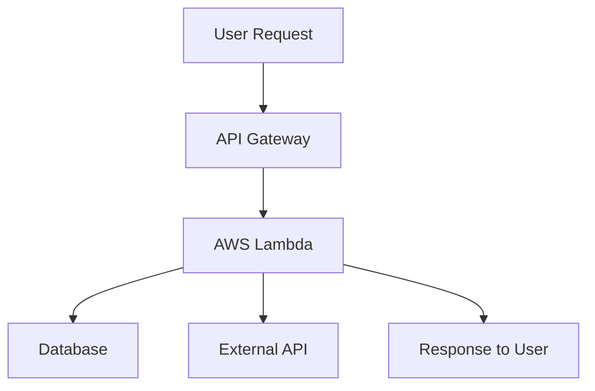

## 20.13 Serverless Computing with AWS Lambda and Others

Serverless computing has revolutionized the way developers build and deploy applications by abstracting away the complexities of server management. In this section, we will delve into the world of serverless computing, focusing on how Ruby can be leveraged within platforms like AWS Lambda, Azure Functions, and Google Cloud Functions. We will explore the benefits, provide practical examples, and discuss deployment strategies and considerations.

### Understanding Serverless Computing

Serverless computing is a cloud computing execution model where the cloud provider dynamically manages the allocation and provisioning of servers. Despite the name, servers are still involved, but they are abstracted away from the developer. This model allows developers to focus on writing code without worrying about infrastructure management.

#### Key Advantages of Serverless Computing

1. **Cost Efficiency**: Pay only for the compute time you consume. There is no charge when your code is not running.
2. **Scalability**: Automatically scales with the demand, handling thousands of concurrent requests.
3. **Reduced Operational Overhead**: No need to manage servers, patch operating systems, or handle scaling.
4. **Faster Time to Market**: Focus on writing code and deploying features quickly.

### Ruby in Serverless Platforms

Ruby is supported on several serverless platforms, allowing developers to write functions in a language they are comfortable with. Let's explore how Ruby can be utilized in some of the major serverless platforms.

#### AWS Lambda

AWS Lambda is one of the most popular serverless platforms, offering robust support for Ruby. It allows you to run Ruby code in response to events such as HTTP requests, file uploads, or scheduled tasks.

##### Writing a Ruby Function for AWS Lambda

Here's a simple example of a Ruby function that handles an HTTP request:

```ruby
require 'json'

def lambda_handler(event:, context:)
  # Extracting the name from the event
  name = event['queryStringParameters']['name'] || 'World'
  
  # Creating a response
  {
    statusCode: 200,
    body: JSON.generate("Hello, #{name}!")
  }
end
```

- **Event Object**: Contains data about the request, such as query parameters.
- **Context Object**: Provides runtime information about the Lambda function.

##### Deploying Ruby Functions with AWS Lambda

To deploy Ruby functions, you can use tools like the Serverless Framework or AWS SAM (Serverless Application Model).

###### Using the Serverless Framework

The Serverless Framework simplifies the deployment of serverless applications. Here's how you can deploy a Ruby function:

1. **Install the Serverless Framework**:
   ```bash
   npm install -g serverless
   ```

2. **Create a Serverless Service**:
   ```bash
   serverless create --template aws-ruby --path my-service
   cd my-service
   ```

3. **Deploy the Service**:
   ```bash
   serverless deploy
   ```

This will package and deploy your Ruby function to AWS Lambda.

#### Azure Functions

Azure Functions also supports Ruby, although it may require additional configuration compared to AWS Lambda. You can use custom handlers to run Ruby code in Azure Functions.

#### Google Cloud Functions

Google Cloud Functions supports Ruby through custom runtimes. You can create a Docker container with your Ruby environment and deploy it to Google Cloud Functions.

### Use Cases for Serverless Ruby Functions

Serverless functions are versatile and can be used in various scenarios:

1. **Event-Driven Processing**: Trigger functions in response to events like file uploads or database changes.
2. **APIs**: Build RESTful APIs using serverless functions to handle HTTP requests.
3. **Background Tasks**: Offload long-running tasks to serverless functions to avoid blocking main application threads.

### Considerations for Serverless Computing

While serverless computing offers many benefits, there are some considerations to keep in mind:

#### Cold Starts

- **Explanation**: A cold start occurs when a serverless function is invoked after being idle, leading to increased latency.
- **Mitigation**: Use provisioned concurrency or keep functions warm by periodically invoking them.

#### Limitations

- **Execution Time**: Functions have a maximum execution time (e.g., 15 minutes for AWS Lambda).
- **Resource Limits**: Memory and CPU resources are limited per function invocation.

#### Cost Management

- **Monitoring**: Use cloud provider tools to monitor usage and optimize costs.
- **Optimization**: Optimize function code and resource allocation to reduce costs.

### Visualizing Serverless Architecture

Below is a diagram illustrating a typical serverless architecture using AWS Lambda:



- **API Gateway**: Manages HTTP requests and routes them to Lambda functions.
- **AWS Lambda**: Executes the business logic.
- **Database**: Stores and retrieves data.
- **External API**: Interacts with third-party services.

### Try It Yourself

Experiment with the provided Ruby function by modifying the response message or adding additional logic. Deploy the function using the Serverless Framework and test it by making HTTP requests.

### References and Further Reading

- [AWS Lambda Documentation](https://docs.aws.amazon.com/lambda/latest/dg/welcome.html)
- [Azure Functions Documentation](https://docs.microsoft.com/en-us/azure/azure-functions/)
- [Google Cloud Functions Documentation](https://cloud.google.com/functions)
- [Serverless Framework](https://www.serverless.com/)

### Knowledge Check

- What are the benefits of using serverless computing?
- How does AWS Lambda handle Ruby functions?
- What are some common use cases for serverless functions?
- How can cold starts be mitigated in serverless applications?

### Embrace the Journey

Remember, serverless computing is just one of the many tools available to developers. As you explore and experiment with serverless platforms, you'll discover new ways to build scalable and efficient applications. Keep learning, stay curious, and enjoy the journey!

## Quiz: Serverless Computing with AWS Lambda and Others



### What is a key advantage of serverless computing?

- [x] Cost efficiency
- [ ] Complex server management
- [ ] Fixed pricing
- [ ] Manual scaling

> **Explanation:** Serverless computing is cost-efficient because you only pay for the compute time you consume.

### Which platform supports Ruby for serverless functions?

- [x] AWS Lambda
- [ ] Heroku
- [x] Google Cloud Functions
- [ ] Firebase

> **Explanation:** AWS Lambda and Google Cloud Functions support Ruby, while Heroku and Firebase do not natively support serverless Ruby functions.

### What is a cold start in serverless computing?

- [x] Increased latency when a function is invoked after being idle
- [ ] A function that runs continuously
- [ ] A function that is always warm
- [ ] A function with no execution time limit

> **Explanation:** A cold start occurs when a serverless function is invoked after being idle, leading to increased latency.

### How can you mitigate cold starts in AWS Lambda?

- [x] Use provisioned concurrency
- [ ] Increase memory allocation
- [ ] Decrease function timeout
- [ ] Use a different programming language

> **Explanation:** Provisioned concurrency keeps functions warm, reducing the impact of cold starts.

### What tool can be used to deploy Ruby functions to AWS Lambda?

- [x] Serverless Framework
- [ ] Docker
- [ ] Kubernetes
- [ ] Terraform

> **Explanation:** The Serverless Framework is a tool used to deploy serverless applications, including Ruby functions, to AWS Lambda.

### What is a common use case for serverless functions?

- [x] Event-driven processing
- [ ] Running a database server
- [ ] Hosting a static website
- [ ] Managing a virtual machine

> **Explanation:** Serverless functions are commonly used for event-driven processing, such as responding to file uploads or database changes.

### What is a limitation of serverless functions?

- [x] Maximum execution time
- [ ] Unlimited memory
- [ ] Infinite scalability
- [ ] No cost

> **Explanation:** Serverless functions have a maximum execution time, which is a limitation to consider when designing applications.

### What is the purpose of an API Gateway in serverless architecture?

- [x] Manage HTTP requests and route them to functions
- [ ] Store data
- [ ] Execute business logic
- [ ] Monitor application performance

> **Explanation:** An API Gateway manages HTTP requests and routes them to the appropriate serverless functions.

### How can you optimize costs in serverless computing?

- [x] Monitor usage and optimize function code
- [ ] Increase function memory
- [ ] Use more functions
- [ ] Deploy on multiple platforms

> **Explanation:** Monitoring usage and optimizing function code and resource allocation can help reduce costs in serverless computing.

### True or False: Serverless computing eliminates the need for servers.

- [ ] True
- [x] False

> **Explanation:** Serverless computing does not eliminate servers; it abstracts server management away from the developer.


