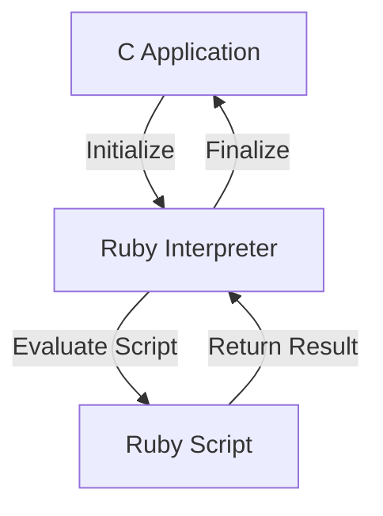

## 20.2 Embedding Ruby in Other Applications

As software systems grow in complexity, the need for flexible and dynamic components becomes increasingly important. Embedding Ruby in other applications is a powerful technique that allows developers to leverage Ruby's expressive syntax and dynamic capabilities within larger systems. This section will guide you through the process of embedding Ruby, exploring scenarios where it is beneficial, providing practical examples, and discussing best practices.

### Why Embed Ruby?

Embedding Ruby in other applications can offer several advantages:

1. **Scripting Capabilities**: Allow users to write scripts to automate tasks or extend functionality without modifying the core application code.
2. **Rapid Prototyping**: Quickly test new features or algorithms within an existing application environment.
3. **Customization**: Enable end-users to customize application behavior through Ruby scripts.
4. **Interoperability**: Integrate Ruby's rich ecosystem of libraries and gems into applications written in other languages.

### Scenarios for Embedding Ruby

Consider embedding Ruby in the following scenarios:

- **Game Development**: Use Ruby for scripting game logic, allowing designers to tweak gameplay without recompiling the game engine.
- **Data Processing Pipelines**: Embed Ruby to allow dynamic data transformation scripts in a data processing application.
- **Configuration Management**: Use Ruby scripts to define complex configurations in applications like web servers or network devices.
- **Scientific Computing**: Integrate Ruby for scripting complex mathematical models or simulations.

### Embedding Ruby in C Applications

One of the most common use cases for embedding Ruby is within C applications. The Ruby interpreter can be embedded using the `libruby` library, which provides the necessary APIs to initialize and interact with Ruby from C.

#### Setting Up the Environment

To embed Ruby in a C application, you need to link against `libruby`. Ensure you have Ruby installed on your system and the development headers available. You can typically install these via your package manager:

```bash
# On Ubuntu/Debian
sudo apt-get install ruby-dev

# On macOS using Homebrew
brew install ruby
```

#### Initializing the Ruby Interpreter

The first step in embedding Ruby is to initialize the Ruby interpreter within your C application. This is done using the `ruby_init()` function.

```c
#include <ruby.h>

int main(int argc, char **argv) {
    // Initialize the Ruby interpreter
    ruby_init();
    
    // Your application logic here

    // Finalize the Ruby interpreter
    ruby_finalize();
    return 0;
}
```

#### Evaluating Ruby Code

Once the interpreter is initialized, you can evaluate Ruby code using the `rb_eval_string()` function. This allows you to execute Ruby scripts from within your C application.

```c
#include <ruby.h>

int main(int argc, char **argv) {
    ruby_init();

    // Evaluate a Ruby expression
    rb_eval_string("puts 'Hello from Ruby!'");

    ruby_finalize();
    return 0;
}
```

#### Interacting with Ruby Objects

To interact with Ruby objects, use the Ruby C API functions. For example, you can create Ruby objects, call methods, and manipulate data.

```c
#include <ruby.h>

int main(int argc, char **argv) {
    ruby_init();

    // Create a Ruby string
    VALUE str = rb_str_new_cstr("Hello, Ruby!");

    // Call a method on the string
    rb_funcall(str, rb_intern("upcase!"), 0);

    // Print the modified string
    rb_p(str);

    ruby_finalize();
    return 0;
}
```

### APIs for Interacting with the Ruby Interpreter

The Ruby C API provides a rich set of functions for interacting with the Ruby interpreter. Here are some key functions:

- **`ruby_init()`**: Initializes the Ruby interpreter.
- **`ruby_finalize()`**: Finalizes the Ruby interpreter.
- **`rb_eval_string()`**: Evaluates a Ruby expression from a C string.
- **`rb_funcall()`**: Calls a method on a Ruby object.
- **`rb_str_new_cstr()`**: Creates a new Ruby string from a C string.
- **`rb_intern()`**: Converts a C string to a Ruby symbol.

### Thread Safety and Resource Management

When embedding Ruby, it's crucial to consider thread safety and resource management:

- **Thread Safety**: Ruby's Global Interpreter Lock (GIL) can affect multi-threaded applications. Ensure that Ruby operations are performed within a single thread or use Ruby's native threading model.
- **Resource Management**: Properly manage memory and resources to avoid leaks. Use Ruby's garbage collector to manage Ruby objects, and ensure C resources are freed appropriately.

### Embedding Ruby in Memory-Constrained Environments

For applications running in memory-constrained environments, consider using [MRuby](https://mruby.org/), a lightweight implementation of the Ruby language designed for embedding.

#### MRuby Features

- **Small Footprint**: MRuby is designed to have a minimal memory footprint, making it ideal for embedded systems.
- **Fast Execution**: MRuby is optimized for performance, providing fast execution of Ruby scripts.
- **Flexible Integration**: MRuby can be easily integrated into C applications, providing a flexible scripting environment.

#### Example: Embedding MRuby

Here's a simple example of embedding MRuby in a C application:

```c
#include <mruby.h>
#include <mruby/compile.h>

int main() {
    // Create a new MRuby state
    mrb_state *mrb = mrb_open();

    // Evaluate a Ruby script
    mrb_load_string(mrb, "puts 'Hello from MRuby!'");

    // Close the MRuby state
    mrb_close(mrb);
    return 0;
}
```

### Use Cases and Best Practices

#### Use Cases

- **Embedded Systems**: Use MRuby to add scripting capabilities to embedded devices, such as IoT sensors or controllers.
- **Custom Applications**: Embed Ruby to allow users to write custom scripts for automation or data processing.
- **Game Engines**: Integrate Ruby for scripting game logic, enabling rapid iteration and testing.

#### Best Practices

- **Modular Design**: Design your application to separate core logic from scripting logic, allowing for easier maintenance and updates.
- **Security Considerations**: Be cautious when executing user-provided scripts. Implement sandboxing or validation to prevent malicious code execution.
- **Performance Monitoring**: Monitor the performance of embedded Ruby scripts to ensure they do not degrade application performance.

### Visualizing Ruby Embedding

To better understand how Ruby can be embedded in other applications, consider the following diagram illustrating the interaction between a C application and the Ruby interpreter:



**Diagram Description**: This flowchart illustrates the process of embedding Ruby in a C application. The C application initializes the Ruby interpreter, evaluates a Ruby script, and then finalizes the interpreter.

### References and Further Reading

- [Ruby C API Documentation](https://ruby-doc.org/core-3.0.0/doc/extension_rdoc.html)
- [MRuby Official Website](https://mruby.org/)
- [Embedding Ruby in C Applications](https://www.ruby-lang.org/en/documentation/embedding/)
- [Ruby and C Integration](https://www.rubyguides.com/2018/11/ruby-c-extension/)

### Knowledge Check

- **Question**: What are the benefits of embedding Ruby in other applications?
- **Exercise**: Modify the provided C code examples to evaluate a different Ruby script.

### Embrace the Journey

Remember, embedding Ruby in other applications is just one of the many ways to harness the power of Ruby. As you explore these techniques, you'll discover new possibilities for enhancing your applications. Keep experimenting, stay curious, and enjoy the journey!

## Quiz: Embedding Ruby in Other Applications



### What is one of the main benefits of embedding Ruby in other applications?

- [x] To provide scripting capabilities
- [ ] To increase application size
- [ ] To reduce application performance
- [ ] To complicate the codebase

> **Explanation:** Embedding Ruby allows applications to provide scripting capabilities, enabling users to automate tasks or extend functionality.

### Which function is used to initialize the Ruby interpreter in a C application?

- [x] `ruby_init()`
- [ ] `rb_eval_string()`
- [ ] `ruby_finalize()`
- [ ] `rb_funcall()`

> **Explanation:** The `ruby_init()` function is used to initialize the Ruby interpreter in a C application.

### What is MRuby designed for?

- [x] Embedding in memory-constrained environments
- [ ] High-performance computing
- [ ] Web development
- [ ] Desktop applications

> **Explanation:** MRuby is a lightweight implementation of Ruby designed for embedding in memory-constrained environments.

### Which function is used to evaluate a Ruby expression from a C string?

- [x] `rb_eval_string()`
- [ ] `ruby_init()`
- [ ] `ruby_finalize()`
- [ ] `rb_funcall()`

> **Explanation:** The `rb_eval_string()` function is used to evaluate a Ruby expression from a C string.

### What should be considered when embedding Ruby in multi-threaded applications?

- [x] Thread safety and the Global Interpreter Lock (GIL)
- [ ] Increasing the number of threads
- [ ] Reducing memory usage
- [ ] Simplifying the codebase

> **Explanation:** When embedding Ruby in multi-threaded applications, it's important to consider thread safety and the Global Interpreter Lock (GIL).

### What is a key feature of MRuby?

- [x] Small memory footprint
- [ ] Large library ecosystem
- [ ] High-level syntax
- [ ] Built-in web server

> **Explanation:** MRuby is designed to have a small memory footprint, making it suitable for embedded systems.

### Which of the following is a best practice when embedding Ruby?

- [x] Implement sandboxing for user-provided scripts
- [ ] Allow unrestricted script execution
- [ ] Ignore performance monitoring
- [ ] Combine core logic with scripting logic

> **Explanation:** Implementing sandboxing for user-provided scripts is a best practice to prevent malicious code execution.

### What is the purpose of the `ruby_finalize()` function?

- [x] To finalize the Ruby interpreter
- [ ] To initialize the Ruby interpreter
- [ ] To evaluate a Ruby expression
- [ ] To call a method on a Ruby object

> **Explanation:** The `ruby_finalize()` function is used to finalize the Ruby interpreter.

### Which of the following is a use case for embedding Ruby?

- [x] Game development
- [ ] Operating system development
- [ ] Database management
- [ ] Hardware design

> **Explanation:** Embedding Ruby can be used in game development to allow scripting of game logic.

### True or False: Embedding Ruby can help in rapid prototyping of new features.

- [x] True
- [ ] False

> **Explanation:** True. Embedding Ruby allows for rapid prototyping by enabling quick testing of new features within an existing application environment.


