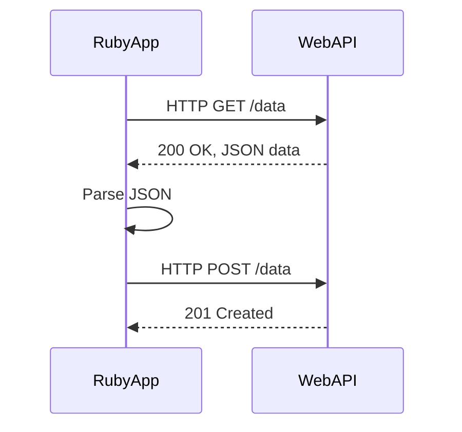

## 20.3 Consuming and Exposing Web APIs

Web APIs are an essential part of modern software development, enabling applications to communicate with each other over the internet. In this section, we will explore how to consume and expose web APIs using Ruby, leveraging various libraries and frameworks to build scalable and maintainable applications.

### Consuming Web APIs in Ruby

Consuming web APIs involves making HTTP requests to external services and processing the responses. Ruby provides several libraries to facilitate this process, each with its own strengths and use cases.

#### Making HTTP Requests

1. **Net::HTTP**

   `Net::HTTP` is a built-in Ruby library that provides a simple way to make HTTP requests. It is part of the Ruby standard library, so you don't need to install any additional gems to use it.

   ```ruby
   require 'net/http'
   require 'uri'
   require 'json'

   uri = URI.parse("https://api.example.com/data")
   response = Net::HTTP.get_response(uri)

   if response.is_a?(Net::HTTPSuccess)
     data = JSON.parse(response.body)
     puts data
   else
     puts "Error: #{response.message}"
   end
   ```

   In this example, we use `Net::HTTP.get_response` to send a GET request to an API endpoint. We then parse the JSON response and handle any errors that may occur.

2. **Faraday**

   Faraday is a popular HTTP client library that provides a flexible and modular interface for making HTTP requests. It supports middleware, allowing you to customize request and response handling.

   ```ruby
   require 'faraday'
   require 'json'

   conn = Faraday.new(url: "https://api.example.com") do |faraday|
     faraday.request :url_encoded
     faraday.response :logger
     faraday.adapter Faraday.default_adapter
   end

   response = conn.get('/data')

   if response.success?
     data = JSON.parse(response.body)
     puts data
   else
     puts "Error: #{response.status}"
   end
   ```

   Faraday's middleware architecture makes it easy to add features like logging, authentication, and error handling.

3. **HTTParty**

   HTTParty is another popular library that simplifies making HTTP requests. It provides a clean and intuitive interface for interacting with APIs.

   ```ruby
   require 'httparty'

   response = HTTParty.get("https://api.example.com/data")

   if response.success?
     data = response.parsed_response
     puts data
   else
     puts "Error: #{response.code}"
   end
   ```

   HTTParty automatically parses JSON and XML responses, making it a convenient choice for consuming APIs.

#### Handling JSON/XML Data

When consuming APIs, you'll often encounter data in JSON or XML format. Ruby provides built-in libraries for parsing these formats.

- **JSON**

  ```ruby
  require 'json'

  json_data = '{"name": "John", "age": 30}'
  parsed_data = JSON.parse(json_data)
  puts parsed_data["name"]  # Output: John
  ```

- **XML**

  ```ruby
  require 'nokogiri'

  xml_data = '<person><name>John</name><age>30</age></person>'
  doc = Nokogiri::XML(xml_data)
  puts doc.xpath('//name').text  # Output: John
  ```

  Nokogiri is a powerful library for parsing and manipulating XML and HTML documents.

#### Error Handling and Retries

Network operations are prone to errors, such as timeouts or server errors. It's important to implement error handling and retry logic to make your application more robust.

```ruby
require 'faraday'
require 'json'

conn = Faraday.new(url: "https://api.example.com")

begin
  response = conn.get('/data')
  raise "Request failed" unless response.success?

  data = JSON.parse(response.body)
  puts data
rescue Faraday::TimeoutError, Faraday::ConnectionFailed => e
  puts "Network error: #{e.message}"
  retry
rescue JSON::ParserError => e
  puts "Failed to parse JSON: #{e.message}"
end
```

In this example, we handle network errors and JSON parsing errors, retrying the request if a network error occurs.

### Exposing Web APIs in Ruby

Exposing web APIs allows other applications to interact with your Ruby application. Several frameworks make it easy to build APIs in Ruby.

#### Building APIs with Sinatra

Sinatra is a lightweight web framework that is ideal for building simple APIs quickly.

```ruby
require 'sinatra'
require 'json'

get '/data' do
  content_type :json
  { name: "John", age: 30 }.to_json
end
```

This example defines a simple GET endpoint that returns JSON data. Sinatra's simplicity makes it a great choice for small APIs.

#### Building APIs with Grape

Grape is a REST-like API framework for Ruby that provides a more structured approach to building APIs.

```ruby
require 'grape'

class API < Grape::API
  format :json

  resource :data do
    get do
      { name: "John", age: 30 }
    end
  end
end
```

Grape's DSL allows you to define resources and endpoints in a clear and organized manner.

#### Building APIs with Rails API Mode

Rails provides a powerful framework for building full-featured web applications, and its API mode allows you to create APIs without the overhead of a full Rails application.

```ruby
class DataController < ApplicationController
  def show
    render json: { name: "John", age: 30 }
  end
end
```

Rails' API mode includes features like routing, controllers, and serializers, making it a robust choice for building complex APIs.

### Best Practices for API Design

1. **Versioning**

   Always version your APIs to ensure backward compatibility and allow for future changes.

   ```ruby
   namespace :v1 do
     resources :data, only: [:show]
   end
   ```

2. **Documentation**

   Provide clear and comprehensive documentation for your API. Tools like Swagger and Apiary can help generate interactive documentation.

3. **Error Handling**

   Return meaningful error messages and status codes to help clients understand what went wrong.

   ```ruby
   render json: { error: "Not Found" }, status: :not_found
   ```

4. **Security**

   Implement authentication and authorization to protect your API. OAuth and JWT are common methods for securing APIs.

5. **Testing and Mocking**

   Use tools like RSpec and VCR to test your API and mock external services.

   ```ruby
   require 'rspec'
   require 'webmock/rspec'

   describe 'GET /data' do
     it 'returns data' do
       stub_request(:get, "https://api.example.com/data").
         to_return(status: 200, body: '{"name": "John"}', headers: {})

       response = HTTParty.get("https://api.example.com/data")
       expect(response.parsed_response["name"]).to eq("John")
     end
   end
   ```

### Visualizing API Interaction

Below is a sequence diagram illustrating the interaction between a Ruby application and a web API.



This diagram shows the flow of requests and responses between a Ruby application and a web API, highlighting the typical sequence of operations.

### Try It Yourself

Experiment with the code examples provided in this section. Try modifying the endpoints, adding error handling, or integrating with a different API. Remember, practice is key to mastering API integration in Ruby.

### Knowledge Check

- What are the differences between Net::HTTP, Faraday, and HTTParty?
- How can you handle errors when making HTTP requests?
- What are some best practices for designing web APIs?
- How can you secure your API endpoints?

### Embrace the Journey

Integrating with web APIs is a powerful skill that opens up a world of possibilities for your Ruby applications. Keep experimenting, stay curious, and enjoy the journey!

## Quiz: Consuming and Exposing Web APIs



### Which Ruby library is part of the standard library for making HTTP requests?

- [x] Net::HTTP
- [ ] Faraday
- [ ] HTTParty
- [ ] Nokogiri

> **Explanation:** Net::HTTP is a built-in Ruby library for making HTTP requests.

### What is a key feature of Faraday that makes it flexible for HTTP requests?

- [x] Middleware support
- [ ] Automatic JSON parsing
- [ ] Built-in XML support
- [ ] OAuth integration

> **Explanation:** Faraday's middleware architecture allows for flexible request and response handling.

### How can you parse JSON data in Ruby?

- [x] Using the JSON library
- [ ] Using the Nokogiri library
- [ ] Using the HTTParty library
- [ ] Using the Faraday library

> **Explanation:** The JSON library in Ruby is used for parsing JSON data.

### Which framework is ideal for building simple APIs quickly in Ruby?

- [x] Sinatra
- [ ] Rails
- [ ] Grape
- [ ] RSpec

> **Explanation:** Sinatra is a lightweight web framework ideal for building simple APIs quickly.

### What is a common method for securing APIs?

- [x] OAuth
- [ ] JSON parsing
- [ ] XML parsing
- [ ] Middleware

> **Explanation:** OAuth is a common method for securing APIs.

### What tool can be used for testing APIs in Ruby?

- [x] RSpec
- [ ] Sinatra
- [ ] Faraday
- [ ] Nokogiri

> **Explanation:** RSpec is a testing tool that can be used for testing APIs in Ruby.

### Which library is used for parsing XML in Ruby?

- [x] Nokogiri
- [ ] JSON
- [ ] HTTParty
- [ ] Faraday

> **Explanation:** Nokogiri is used for parsing XML and HTML documents in Ruby.

### What is a best practice for API design?

- [x] Versioning
- [ ] Ignoring errors
- [ ] Using only GET requests
- [ ] Avoiding documentation

> **Explanation:** Versioning is a best practice for API design to ensure backward compatibility.

### What does the HTTP status code 201 indicate?

- [x] Created
- [ ] OK
- [ ] Not Found
- [ ] Unauthorized

> **Explanation:** The HTTP status code 201 indicates that a resource has been successfully created.

### True or False: HTTParty automatically parses JSON and XML responses.

- [x] True
- [ ] False

> **Explanation:** HTTParty automatically parses JSON and XML responses, making it convenient for consuming APIs.




