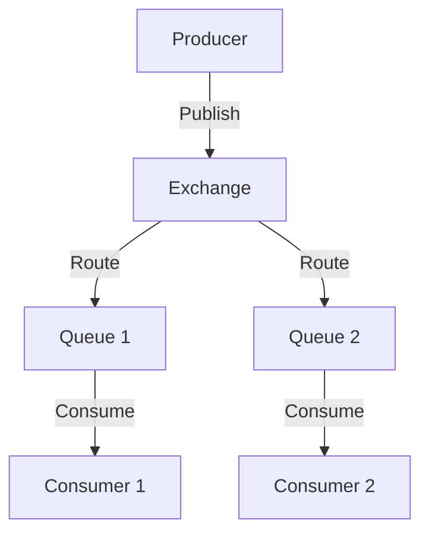

## 20.4 Working with Message Queues (RabbitMQ, Kafka)

In today's fast-paced digital world, building scalable and maintainable applications is crucial. One of the key strategies to achieve this is by decoupling components and enabling asynchronous communication. Message queues are a powerful tool in this regard, allowing different parts of an application to communicate without being directly connected. In this section, we will explore how to integrate Ruby applications with popular message queue systems like RabbitMQ and Kafka, leveraging the Bunny and ruby-kafka gems, respectively.

### Introduction to Message Queues

Message queues are a form of asynchronous communication protocol that allows applications to communicate by sending messages to a queue. These messages are then processed by consumers, which can be other applications or services. This architecture provides several benefits:

- **Decoupling**: Producers and consumers of messages do not need to know about each other. They only need to know about the queue.
- **Scalability**: By decoupling components, you can scale them independently.
- **Resilience**: If a consumer fails, messages remain in the queue until they are processed.
- **Load Balancing**: Multiple consumers can process messages from the same queue, distributing the load.

### Integrating with RabbitMQ using the Bunny Gem

RabbitMQ is a widely used message broker that implements the Advanced Message Queuing Protocol (AMQP). It is known for its reliability, flexibility, and ease of use. The Bunny gem is a popular Ruby client for RabbitMQ, providing a simple and intuitive API.

#### Setting Up RabbitMQ

Before we dive into the code, ensure that RabbitMQ is installed and running on your system. You can download it from the [official RabbitMQ website](https://www.rabbitmq.com/).

#### Installing the Bunny Gem

To start using RabbitMQ in your Ruby application, you need to install the Bunny gem. Add it to your Gemfile:

```ruby
gem 'bunny'
```

Then run:

```bash
bundle install
```

#### Connecting to RabbitMQ

Let's start by establishing a connection to RabbitMQ using Bunny:

```ruby
require 'bunny'

# Establish a connection to RabbitMQ
connection = Bunny.new
connection.start

# Create a channel
channel = connection.create_channel

# Declare a queue
queue = channel.queue('hello')

# Publish a message to the queue
channel.default_exchange.publish('Hello, World!', routing_key: queue.name)
puts " [x] Sent 'Hello, World!'"

# Close the connection
connection.close
```

In this example, we create a connection to RabbitMQ, open a channel, declare a queue named 'hello', and publish a message to it. Finally, we close the connection.

#### Consuming Messages

To consume messages from the queue, we can use the following code:

```ruby
require 'bunny'

# Establish a connection to RabbitMQ
connection = Bunny.new
connection.start

# Create a channel
channel = connection.create_channel

# Declare a queue
queue = channel.queue('hello')

# Subscribe to the queue
puts ' [*] Waiting for messages. To exit press CTRL+C'
queue.subscribe(block: true) do |_delivery_info, _properties, body|
  puts " [x] Received #{body}"
end

# Close the connection
connection.close
```

This script connects to RabbitMQ, declares the same queue, and subscribes to it. When a message is received, it prints the message body to the console.

### Integrating with Apache Kafka using the ruby-kafka Gem

Apache Kafka is a distributed event streaming platform capable of handling trillions of events a day. It is designed for high-throughput, fault-tolerant, and scalable messaging.

#### Setting Up Kafka

Ensure that Kafka is installed and running on your system. You can download it from the [official Apache Kafka website](https://kafka.apache.org/).

#### Installing the ruby-kafka Gem

To interact with Kafka in Ruby, we use the ruby-kafka gem. Add it to your Gemfile:

```ruby
gem 'ruby-kafka'
```

Then run:

```bash
bundle install
```

#### Producing Messages to Kafka

Let's produce messages to a Kafka topic:

```ruby
require 'kafka'

# Create a new Kafka client
kafka = Kafka.new(seed_brokers: ['localhost:9092'])

# Produce a message to the 'greetings' topic
kafka.deliver_message('Hello, Kafka!', topic: 'greetings')
puts " [x] Sent 'Hello, Kafka!'"
```

In this example, we create a Kafka client, connect to a broker, and deliver a message to the 'greetings' topic.

#### Consuming Messages from Kafka

To consume messages from a Kafka topic, use the following code:

```ruby
require 'kafka'

# Create a new Kafka client
kafka = Kafka.new(seed_brokers: ['localhost:9092'])

# Create a consumer
consumer = kafka.consumer(group_id: 'my-consumer')

# Subscribe to the 'greetings' topic
consumer.subscribe('greetings')

# Consume messages
consumer.each_message do |message|
  puts " [x] Received #{message.value}"
end
```

This script creates a Kafka consumer, subscribes to the 'greetings' topic, and processes each message as it arrives.

### Patterns in Message Queues

#### Publish/Subscribe

In the publish/subscribe pattern, messages are published to a topic or exchange and delivered to all subscribers. This pattern is useful for broadcasting messages to multiple consumers.

#### Message Routing

Message routing involves directing messages to different queues based on certain criteria. RabbitMQ supports complex routing using exchanges, while Kafka uses topics and partitions.

#### Consumer Groups

Consumer groups allow multiple consumers to read from the same topic or queue, balancing the load among them. In Kafka, each consumer in a group reads from a different partition, ensuring that each message is processed only once.

### Considerations for Message Queues

#### Message Serialization

When sending messages, consider how they are serialized. Common formats include JSON, XML, and Avro. Choose a format that balances readability and performance.

#### Delivery Guarantees

Different message queue systems offer varying delivery guarantees, such as at-most-once, at-least-once, and exactly-once. Choose the appropriate guarantee based on your application's requirements.

#### Error Handling

Implement robust error handling to deal with message processing failures. This may include retry mechanisms, dead-letter queues, and logging.

### Use Cases for Message Queues

Message queues are ideal for scenarios where decoupling, scalability, and resilience are important. Common use cases include:

- **Microservices Communication**: Decouple services and enable asynchronous communication.
- **Event-Driven Architectures**: Trigger actions based on events.
- **Load Balancing**: Distribute tasks among multiple workers.
- **Data Streaming**: Process large volumes of data in real-time.

### Try It Yourself

Experiment with the provided code examples by modifying the message content, queue names, or topics. Try setting up multiple consumers to see how load balancing works. Explore different message serialization formats and delivery guarantees.

### Visualizing Message Queue Architecture

Below is a simple diagram illustrating the flow of messages in a publish/subscribe architecture using RabbitMQ:



This diagram shows a producer publishing messages to an exchange, which routes them to multiple queues. Each queue is consumed by a different consumer.

### Summary

In this section, we've explored how to integrate Ruby applications with message queue systems like RabbitMQ and Kafka. We've covered the basics of setting up these systems, producing and consuming messages, and implementing patterns like publish/subscribe and consumer groups. We've also discussed important considerations such as message serialization, delivery guarantees, and error handling. By leveraging message queues, you can build scalable, resilient, and decoupled applications.

## Quiz: Working with Message Queues (RabbitMQ, Kafka)



### What is a primary benefit of using message queues?

- [x] Decoupling components
- [ ] Increasing code complexity
- [ ] Reducing system reliability
- [ ] Decreasing scalability

> **Explanation:** Message queues decouple components, allowing them to communicate asynchronously without direct connections.

### Which Ruby gem is commonly used to interact with RabbitMQ?

- [x] Bunny
- [ ] ruby-kafka
- [ ] Sidekiq
- [ ] Resque

> **Explanation:** The Bunny gem is a popular Ruby client for interacting with RabbitMQ.

### What is the purpose of consumer groups in Kafka?

- [x] To balance the load among multiple consumers
- [ ] To increase message size
- [ ] To reduce message latency
- [ ] To serialize messages

> **Explanation:** Consumer groups allow multiple consumers to read from the same topic, balancing the load among them.

### How does RabbitMQ route messages to different queues?

- [x] Using exchanges
- [ ] Using partitions
- [ ] Using brokers
- [ ] Using topics

> **Explanation:** RabbitMQ uses exchanges to route messages to different queues based on routing keys.

### What is a common message serialization format?

- [x] JSON
- [ ] CSV
- [ ] HTML
- [ ] YAML

> **Explanation:** JSON is a common format for serializing messages due to its readability and ease of use.

### What delivery guarantee does Kafka provide by default?

- [x] At-least-once
- [ ] At-most-once
- [ ] Exactly-once
- [ ] No guarantee

> **Explanation:** Kafka provides at-least-once delivery by default, ensuring that messages are delivered at least once.

### Which pattern involves broadcasting messages to multiple consumers?

- [x] Publish/Subscribe
- [ ] Request/Response
- [ ] Point-to-Point
- [ ] Load Balancing

> **Explanation:** The publish/subscribe pattern involves broadcasting messages to multiple consumers.

### What is a dead-letter queue used for?

- [x] Handling message processing failures
- [ ] Increasing message throughput
- [ ] Reducing message size
- [ ] Enhancing message serialization

> **Explanation:** Dead-letter queues are used to handle message processing failures by storing messages that cannot be processed.

### Which gem is used to interact with Kafka in Ruby?

- [x] ruby-kafka
- [ ] Bunny
- [ ] Resque
- [ ] Sidekiq

> **Explanation:** The ruby-kafka gem is used to interact with Kafka in Ruby applications.

### True or False: Message queues can enhance the scalability of an application.

- [x] True
- [ ] False

> **Explanation:** True. Message queues enhance scalability by allowing components to be scaled independently.



Remember, this is just the beginning. As you progress, you'll build more complex and interactive systems using message queues. Keep experimenting, stay curious, and enjoy the journey!
