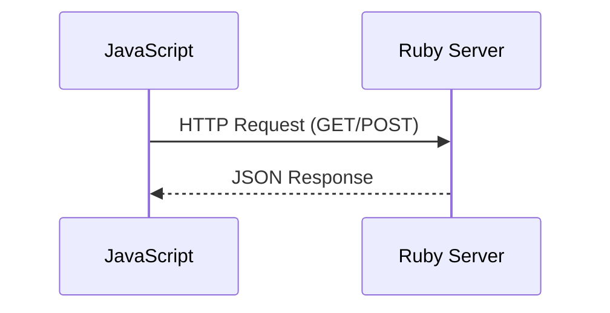
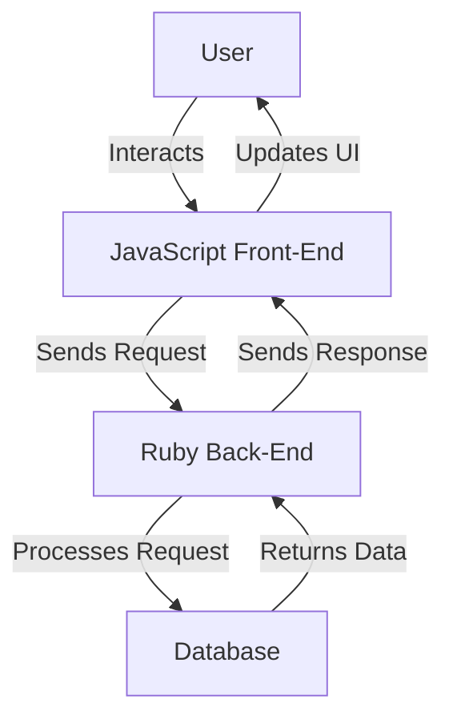

## 20.5 Integrating with Front-End Technologies (JavaScript, WebAssembly)

In the modern web development landscape, integrating Ruby with front-end technologies like JavaScript and WebAssembly is essential for building interactive and responsive web applications. This section will guide you through the techniques and tools necessary to achieve seamless integration between Ruby backends and front-end technologies.

### The Role of JavaScript in Front-End Development

JavaScript is the cornerstone of front-end development, enabling dynamic content, interactive user interfaces, and enhanced user experiences. It interacts with Ruby backends primarily through HTTP requests, often facilitated by RESTful APIs or GraphQL. JavaScript frameworks like React, Angular, and Vue.js are commonly used to build sophisticated client-side applications that communicate with Ruby-based servers.

#### JavaScript and Ruby Interaction

To effectively integrate JavaScript with Ruby, it's crucial to understand how these technologies communicate. Typically, JavaScript sends requests to Ruby backends, which process the requests and return data, often in JSON format. This interaction can be visualized as follows:



**Key Points:**
- JavaScript sends HTTP requests to the Ruby server.
- The server processes the request and returns a response, usually in JSON format.
- JavaScript uses the response to update the UI dynamically.

### Managing JavaScript Assets with Webpacker

[Webpacker](https://github.com/rails/webpacker) is a tool that integrates Webpack with Ruby on Rails, providing a modern way to manage JavaScript assets. It allows you to bundle JavaScript, CSS, and other assets efficiently, ensuring that your application is fast and responsive.

#### Setting Up Webpacker in Rails

To use Webpacker in a Rails application, follow these steps:

1. **Install Webpacker:**
   ```bash
   rails webpacker:install
   ```

2. **Add JavaScript Dependencies:**
   Use Yarn to add JavaScript libraries:
   ```bash
   yarn add react react-dom
   ```

3. **Configure Webpack:**
   Customize `config/webpacker.yml` to suit your application's needs.

4. **Include JavaScript Packs:**
   In your Rails views, include the JavaScript pack:
   ```erb
   <%= javascript_pack_tag 'application' %>
   ```

**Try It Yourself:** Experiment by adding a new JavaScript library and integrating it into your Rails application. Observe how Webpacker manages the assets.

### Full-Stack Frameworks: Ruby on Rails

[Ruby on Rails](https://rubyonrails.org/) is a full-stack framework that simplifies the integration of Ruby with front-end technologies. It provides built-in support for JavaScript through tools like Webpacker and Turbolinks, enabling developers to build rich web applications efficiently.

#### Building a Rails Application with JavaScript

1. **Generate a New Rails App:**
   ```bash
   rails new myapp --webpack=react
   ```

2. **Create a Controller and View:**
   ```bash
   rails generate controller Home index
   ```

3. **Add React Component:**
   Create a React component in `app/javascript/components` and render it in your view.

4. **Run the Server:**
   ```bash
   rails server
   ```

**Key Takeaways:**
- Rails provides a seamless environment for integrating Ruby with JavaScript.
- Webpacker and Turbolinks enhance the development experience by managing assets and optimizing page loads.

### Transpiling Ruby to JavaScript with Opal

[Opal](https://opalrb.com/) is a Ruby-to-JavaScript transpiler that allows you to write Ruby code that runs in the browser. This can be particularly useful for developers who prefer Ruby's syntax and want to leverage it on the client side.

#### Using Opal in Your Project

1. **Install Opal:**
   Add Opal to your Gemfile:
   ```ruby
   gem 'opal'
   ```

2. **Write Ruby Code:**
   Create a Ruby file and write your client-side logic:
   ```ruby
   # app/assets/javascripts/application.rb
   puts "Hello from Ruby!"
   ```

3. **Compile to JavaScript:**
   Use Opal to compile your Ruby code to JavaScript:
   ```bash
   opal -c application.rb > application.js
   ```

**Try It Yourself:** Modify the Ruby code and recompile it to see the changes in your browser. Experiment with different Ruby features and observe how they translate to JavaScript.

### Introducing WebAssembly

WebAssembly (Wasm) is a binary instruction format that allows code written in multiple languages, including Ruby, to run in the browser with near-native performance. It opens up new possibilities for running complex Ruby applications on the client side.

#### Running Ruby in the Browser with wasm.rb

[wasm.rb](https://github.com/wasmerio/wasmer-ruby) is a project that enables Ruby code to run in WebAssembly. It allows developers to leverage Ruby's capabilities in environments where JavaScript is traditionally used.

1. **Install wasm.rb:**
   Add wasm.rb to your Gemfile:
   ```ruby
   gem 'wasm-rb'
   ```

2. **Compile Ruby to WebAssembly:**
   Use wasm.rb to compile your Ruby code:
   ```bash
   wasm-rb compile my_script.rb
   ```

3. **Run in the Browser:**
   Load the compiled WebAssembly module in your JavaScript code and execute it.

**Key Considerations:**
- WebAssembly provides performance benefits for compute-intensive tasks.
- Ensure that your Ruby code is compatible with WebAssembly's constraints.

### API Design and Data Serialization

When integrating Ruby with front-end technologies, designing robust APIs and handling data serialization are critical. JSON is the most common format for data exchange between Ruby backends and JavaScript front-ends.

#### Designing RESTful APIs

1. **Define Endpoints:**
   Plan the endpoints your application will expose, e.g., `/api/v1/products`.

2. **Use Rails for API Development:**
   Rails provides tools like `rails-api` to create lightweight APIs.

3. **Serialize Data:**
   Use libraries like ActiveModel::Serializers or Fast JSON API to serialize Ruby objects to JSON.

**Security Considerations:**
- Validate and sanitize input data to prevent injection attacks.
- Implement authentication and authorization mechanisms to secure your API.

### Security Considerations

Security is paramount when integrating Ruby with front-end technologies. Consider the following best practices:

- **Input Validation:** Always validate and sanitize user input to prevent XSS and SQL injection attacks.
- **Authentication and Authorization:** Use secure methods like OAuth2 for authentication and ensure proper authorization checks.
- **Data Encryption:** Encrypt sensitive data both in transit and at rest.

### Visualizing the Integration Process

To better understand the integration process, let's visualize the interaction between Ruby and front-end technologies:



**Diagram Explanation:**
- The user interacts with the JavaScript front-end.
- The front-end sends requests to the Ruby back-end.
- The back-end processes the request, interacts with the database, and returns data.
- The front-end updates the UI based on the response.

### Conclusion

Integrating Ruby with front-end technologies like JavaScript and WebAssembly enables developers to build powerful, interactive web applications. By leveraging tools like Webpacker, Opal, and wasm.rb, you can create seamless experiences that take advantage of both Ruby's and JavaScript's strengths.

Remember, this is just the beginning. As you progress, you'll build more complex and interactive web pages. Keep experimenting, stay curious, and enjoy the journey!

## Quiz: Integrating with Front-End Technologies (JavaScript, WebAssembly)



### What is the primary role of JavaScript in front-end development?

- [x] Enabling dynamic content and interactive user interfaces
- [ ] Managing server-side logic
- [ ] Handling database operations
- [ ] Compiling Ruby code

> **Explanation:** JavaScript is primarily used for enabling dynamic content and interactive user interfaces on the client side.

### Which tool is used to manage JavaScript assets in a Rails application?

- [x] Webpacker
- [ ] Bundler
- [ ] Rake
- [ ] Capistrano

> **Explanation:** Webpacker is used to manage JavaScript assets in Rails applications by integrating Webpack.

### What is Opal used for in Ruby development?

- [x] Transpiling Ruby to JavaScript
- [ ] Compiling Ruby to WebAssembly
- [ ] Managing Ruby gems
- [ ] Testing Ruby applications

> **Explanation:** Opal is a Ruby-to-JavaScript transpiler, allowing Ruby code to run in the browser.

### What is the primary benefit of using WebAssembly in web applications?

- [x] Near-native performance for running code in the browser
- [ ] Simplifying JavaScript syntax
- [ ] Enhancing CSS styling capabilities
- [ ] Managing server-side sessions

> **Explanation:** WebAssembly provides near-native performance for running code in the browser, making it ideal for compute-intensive tasks.

### Which format is commonly used for data exchange between Ruby backends and JavaScript front-ends?

- [x] JSON
- [ ] XML
- [ ] YAML
- [ ] CSV

> **Explanation:** JSON is the most common format for data exchange between Ruby backends and JavaScript front-ends.

### What is the purpose of ActiveModel::Serializers in Rails?

- [x] Serializing Ruby objects to JSON
- [ ] Managing database migrations
- [ ] Handling user authentication
- [ ] Compiling assets

> **Explanation:** ActiveModel::Serializers is used to serialize Ruby objects to JSON, facilitating data exchange with front-end technologies.

### Which security practice is essential when integrating Ruby with front-end technologies?

- [x] Input validation and sanitization
- [ ] Using plain text for data transmission
- [ ] Disabling HTTPS
- [ ] Ignoring user authentication

> **Explanation:** Input validation and sanitization are essential to prevent security vulnerabilities like XSS and SQL injection.

### What is the role of the Ruby back-end in the integration process?

- [x] Processing requests and returning data
- [ ] Rendering HTML templates
- [ ] Managing client-side interactions
- [ ] Compiling JavaScript code

> **Explanation:** The Ruby back-end processes requests from the front-end and returns data, often in JSON format.

### Which tool allows Ruby code to run in WebAssembly?

- [x] wasm.rb
- [ ] Opal
- [ ] Webpacker
- [ ] Bundler

> **Explanation:** wasm.rb enables Ruby code to run in WebAssembly, allowing it to execute in the browser.

### True or False: WebAssembly can only be used with JavaScript.

- [ ] True
- [x] False

> **Explanation:** False. WebAssembly can be used with multiple languages, including Ruby, to run code in the browser.




