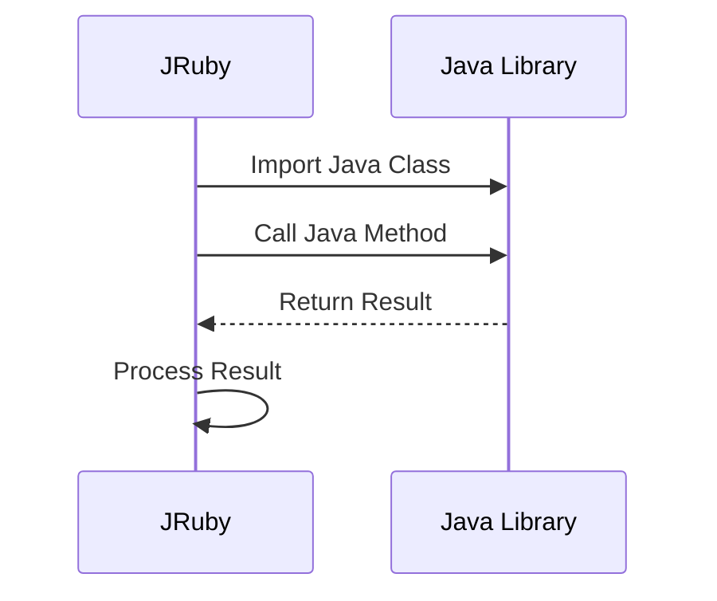

## 20.6 Interoperability with Java Using JRuby

In the ever-evolving landscape of software development, the ability to integrate different technologies seamlessly is crucial. JRuby, a Ruby implementation on the Java Virtual Machine (JVM), offers a powerful solution for developers looking to leverage the strengths of both Ruby and Java. This section will guide you through the capabilities of JRuby, how to call Java classes and methods from JRuby, and the benefits and considerations of integrating JRuby into Java applications.

### Introduction to JRuby

JRuby is a high-performance, stable, and fully-featured implementation of the Ruby programming language on the JVM. It allows Ruby developers to harness the power of the JVM, providing access to a vast array of Java libraries and tools. This integration opens up a world of possibilities, from improved performance to enhanced scalability.

#### Key Features of JRuby

- **JVM Integration**: JRuby runs on the JVM, allowing Ruby code to interact with Java libraries seamlessly.
- **Performance**: JRuby can leverage JVM optimizations, often resulting in faster execution compared to traditional Ruby interpreters.
- **Concurrency**: With JRuby, you can take advantage of Java's robust concurrency model, including threads and synchronization primitives.
- **Tooling**: Access to Java's extensive ecosystem of tools and libraries, including IDEs, build tools, and testing frameworks.

### Calling Java from JRuby

One of the most compelling features of JRuby is its ability to call Java classes and methods directly from Ruby code. This interoperability allows developers to use Java libraries as if they were native Ruby libraries.

#### Basic Java Integration

To call a Java class from JRuby, you simply require the Java class and use it as you would in Java. Here's a basic example:

```ruby
# Import the Java class
java_import 'java.util.ArrayList'

# Create a new instance of ArrayList
list = ArrayList.new

# Add elements to the list
list.add('Ruby')
list.add('Java')

# Iterate over the list
list.each do |element|
  puts element
end
```

In this example, we import `java.util.ArrayList` and use it to create a list, demonstrating how seamlessly JRuby integrates with Java.

#### Advanced Java Integration

JRuby also supports more advanced Java integration features, such as calling static methods, handling exceptions, and using Java interfaces.

```ruby
# Import the Java class
java_import 'java.lang.System'

# Call a static method
System.out.println('Hello from JRuby!')

# Handling Java exceptions
begin
  # Some Java code that might throw an exception
rescue java.lang.Exception => e
  puts "Caught a Java exception: #{e.message}"
end
```

### Integrating JRuby into Java Applications

JRuby can be embedded into Java applications, allowing developers to use Ruby for scripting and automation within a Java environment. This integration can enhance the flexibility and maintainability of Java applications.

#### Embedding JRuby

To embed JRuby in a Java application, you need to include the JRuby library in your Java project and use the JRuby API to execute Ruby scripts.

```java
import org.jruby.embed.ScriptingContainer;

public class JRubyIntegration {
    public static void main(String[] args) {
        ScriptingContainer container = new ScriptingContainer();
        container.runScriptlet("puts 'Hello from embedded JRuby!'");
    }
}
```

In this example, we use the `ScriptingContainer` class from the JRuby API to execute a Ruby script within a Java application.

#### Use Cases for Embedding JRuby

- **Scripting and Automation**: Use Ruby scripts to automate tasks within a Java application.
- **Customization**: Allow end-users to customize application behavior using Ruby scripts.
- **Rapid Prototyping**: Quickly prototype new features in Ruby before implementing them in Java.

### Benefits of Using JRuby

JRuby offers several benefits that make it an attractive choice for developers looking to integrate Ruby with Java.

#### Access to JVM Libraries

One of the most significant advantages of JRuby is access to the extensive ecosystem of Java libraries. This access allows Ruby developers to leverage powerful tools and frameworks that may not be available in the Ruby ecosystem.

#### Improved Performance

By running on the JVM, JRuby can take advantage of JVM optimizations, such as Just-In-Time (JIT) compilation and garbage collection, often resulting in improved performance compared to traditional Ruby interpreters.

#### Enhanced Concurrency

JRuby supports Java's robust concurrency model, allowing developers to build highly concurrent applications using threads and synchronization primitives.

### Considerations for Using JRuby

While JRuby offers many benefits, there are also some considerations to keep in mind when integrating it into your projects.

#### Compatibility

JRuby aims to be compatible with the standard Ruby language, but there may be some differences in behavior, especially when dealing with native extensions or certain Ruby libraries.

#### Deployment

Deploying JRuby applications requires a JVM, which may add complexity to your deployment process. Ensure that your deployment environment supports the JVM and any required Java libraries.

### Use Cases for JRuby

JRuby is well-suited for a variety of use cases, including:

- **Web Development**: Use JRuby with frameworks like Rails to build web applications that can leverage Java libraries for backend processing.
- **Data Processing**: Integrate JRuby with Java-based data processing tools for efficient data manipulation and analysis.
- **Enterprise Applications**: Embed JRuby in enterprise applications to provide scripting capabilities and enhance flexibility.

### Visualizing JRuby's Interaction with Java

To better understand how JRuby interacts with Java, let's visualize the process using a sequence diagram.



This diagram illustrates the flow of interaction between JRuby and a Java library, highlighting the seamless integration between the two.

### Try It Yourself

To get hands-on experience with JRuby, try modifying the examples provided in this section. Experiment with different Java classes and methods, and explore how JRuby can enhance your Ruby applications.

### Knowledge Check

- What are the key benefits of using JRuby for Ruby developers?
- How can you call a Java method from JRuby?
- What are some considerations to keep in mind when deploying JRuby applications?

### Summary

JRuby provides a powerful solution for integrating Ruby with Java, offering access to the JVM's extensive ecosystem of libraries and tools. By leveraging JRuby, developers can build scalable, high-performance applications that combine the best of both Ruby and Java.

## Quiz: Interoperability with Java Using JRuby



### What is JRuby?

- [x] A Ruby implementation on the Java Virtual Machine (JVM)
- [ ] A Java implementation on the Ruby Virtual Machine
- [ ] A tool for converting Java code to Ruby
- [ ] A library for integrating Ruby with Python

> **Explanation:** JRuby is a Ruby implementation that runs on the Java Virtual Machine (JVM), allowing Ruby code to interact with Java libraries.

### How can you import a Java class in JRuby?

- [x] Using `java_import`
- [ ] Using `require`
- [ ] Using `import`
- [ ] Using `include`

> **Explanation:** In JRuby, you use `java_import` to import Java classes.

### What is a benefit of using JRuby?

- [x] Access to Java libraries
- [x] Improved performance through JVM optimizations
- [ ] Limited concurrency support
- [ ] Incompatibility with Ruby syntax

> **Explanation:** JRuby provides access to Java libraries and can leverage JVM optimizations for improved performance.

### How can you embed JRuby in a Java application?

- [x] Using the JRuby API and `ScriptingContainer`
- [ ] Using a Ruby interpreter
- [ ] Using a Java compiler
- [ ] Using a Python script

> **Explanation:** You can embed JRuby in a Java application using the JRuby API and the `ScriptingContainer` class.

### What is a use case for embedding JRuby in a Java application?

- [x] Scripting and automation
- [x] Customization by end-users
- [ ] Replacing Java with Ruby
- [ ] Compiling Ruby to Java bytecode

> **Explanation:** Embedding JRuby allows for scripting, automation, and customization within Java applications.

### What is a consideration when deploying JRuby applications?

- [x] JVM compatibility
- [ ] Lack of concurrency support
- [ ] Limited access to Java libraries
- [ ] Incompatibility with Ruby syntax

> **Explanation:** Deploying JRuby applications requires a JVM, so compatibility with the deployment environment is important.

### What is a key feature of JRuby?

- [x] JVM integration
- [ ] Limited access to Java libraries
- [ ] Incompatibility with Ruby syntax
- [ ] Lack of concurrency support

> **Explanation:** JRuby integrates with the JVM, providing access to Java libraries and tools.

### How does JRuby improve performance?

- [x] By leveraging JVM optimizations
- [ ] By limiting access to Java libraries
- [ ] By reducing concurrency support
- [ ] By converting Ruby to Java bytecode

> **Explanation:** JRuby can leverage JVM optimizations, such as JIT compilation, for improved performance.

### What is a benefit of using JRuby for web development?

- [x] Access to Java libraries for backend processing
- [ ] Incompatibility with Ruby frameworks
- [ ] Limited concurrency support
- [ ] Lack of performance improvements

> **Explanation:** JRuby allows web applications to use Java libraries for backend processing, enhancing functionality.

### True or False: JRuby can only be used for web development.

- [ ] True
- [x] False

> **Explanation:** JRuby can be used for various applications, including web development, data processing, and enterprise applications.



Remember, integrating Ruby with Java using JRuby is just the beginning. As you explore the possibilities, you'll discover new ways to enhance your applications and leverage the strengths of both languages. Keep experimenting, stay curious, and enjoy the journey!
