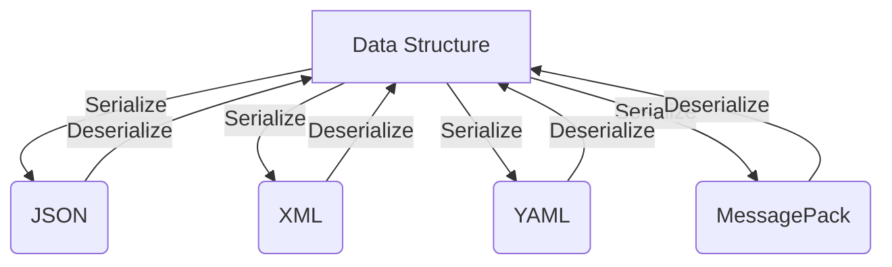

## 20.7 Data Serialization Formats (JSON, XML, YAML, MessagePack)

In the realm of software development, data serialization is a crucial process that involves converting data structures or object states into a format that can be easily stored or transmitted and later reconstructed. This is especially important in Ruby applications that need to exchange data with other systems or persist data across sessions. In this section, we will explore four popular data serialization formats: JSON, XML, YAML, and MessagePack. We will delve into their usage in Ruby, discuss their trade-offs, and provide best practices for handling serialization securely and efficiently.

### Understanding Data Serialization

Data serialization is the process of translating data structures or object states into a format that can be stored (e.g., in a file or memory buffer) or transmitted (e.g., over a network connection) and reconstructed later. Serialization is essential for:

- **Data Persistence**: Storing data in a file or database.
- **Data Exchange**: Transmitting data between different systems or components.
- **Remote Procedure Calls (RPCs)**: Invoking methods on remote objects.

### Common Data Serialization Formats

Let's explore the four common serialization formats used in Ruby applications:

1. **JSON (JavaScript Object Notation)**
2. **XML (eXtensible Markup Language)**
3. **YAML (YAML Ain't Markup Language)**
4. **MessagePack**

Each format has its own strengths and weaknesses, which we will discuss in detail.

### JSON: JavaScript Object Notation

JSON is a lightweight data interchange format that is easy for humans to read and write and easy for machines to parse and generate. It is language-independent but uses conventions familiar to programmers of the C family of languages.

#### Using JSON in Ruby

Ruby provides a built-in `json` library to handle JSON serialization and deserialization.

**Serializing Data to JSON**

```ruby
require 'json'

# Define a Ruby hash
data = {
  name: "Alice",
  age: 30,
  languages: ["Ruby", "Python", "JavaScript"]
}

# Serialize the hash to a JSON string
json_string = data.to_json
puts json_string
# Output: {"name":"Alice","age":30,"languages":["Ruby","Python","JavaScript"]}
```

**Deserializing JSON to Ruby Objects**

```ruby
require 'json'

# JSON string
json_string = '{"name":"Alice","age":30,"languages":["Ruby","Python","JavaScript"]}'

# Deserialize the JSON string to a Ruby hash
data = JSON.parse(json_string)
puts data['name']  # Output: Alice
```

#### JSON Trade-offs

- **Readability**: JSON is human-readable and easy to understand.
- **Size**: JSON is more compact than XML but less so than MessagePack.
- **Performance**: JSON parsing is generally faster than XML but slower than MessagePack.

### XML: eXtensible Markup Language

XML is a markup language that defines a set of rules for encoding documents in a format that is both human-readable and machine-readable. It is widely used for data interchange between systems.

#### Using XML in Ruby

Ruby developers commonly use the `nokogiri` gem for XML parsing and generation.

**Serializing Data to XML**

```ruby
require 'nokogiri'

# Create an XML document
builder = Nokogiri::XML::Builder.new do |xml|
  xml.person {
    xml.name "Alice"
    xml.age 30
    xml.languages {
      xml.language "Ruby"
      xml.language "Python"
      xml.language "JavaScript"
    }
  }
end

# Output the XML
puts builder.to_xml
```

**Deserializing XML to Ruby Objects**

```ruby
require 'nokogiri'

# XML string
xml_string = <<-XML
<person>
  <name>Alice</name>
  <age>30</age>
  <languages>
    <language>Ruby</language>
    <language>Python</language>
    <language>JavaScript</language>
  </languages>
</person>
XML

# Parse the XML string
doc = Nokogiri::XML(xml_string)
name = doc.xpath('//name').text
puts name  # Output: Alice
```

#### XML Trade-offs

- **Readability**: XML is verbose but highly readable.
- **Size**: XML is larger in size compared to JSON and MessagePack.
- **Performance**: XML parsing is slower due to its verbosity and complexity.

### YAML: YAML Ain't Markup Language

YAML is a human-readable data serialization standard that can be used in conjunction with all programming languages and is often used for configuration files.

#### Using YAML in Ruby

Ruby's standard library includes the `yaml` module for YAML serialization and deserialization.

**Serializing Data to YAML**

```ruby
require 'yaml'

# Define a Ruby hash
data = {
  name: "Alice",
  age: 30,
  languages: ["Ruby", "Python", "JavaScript"]
}

# Serialize the hash to a YAML string
yaml_string = data.to_yaml
puts yaml_string
```

**Deserializing YAML to Ruby Objects**

```ruby
require 'yaml'

# YAML string
yaml_string = <<-YAML
---
name: Alice
age: 30
languages:
- Ruby
- Python
- JavaScript
YAML

# Deserialize the YAML string to a Ruby hash
data = YAML.load(yaml_string)
puts data['name']  # Output: Alice
```

#### YAML Trade-offs

- **Readability**: YAML is highly readable and often used for configuration files.
- **Size**: YAML is more verbose than JSON and MessagePack.
- **Performance**: YAML parsing is slower due to its complexity.

#### Security Considerations

Be cautious when deserializing YAML from untrusted sources, as it can execute arbitrary code. Use `YAML.safe_load` to mitigate this risk.

### MessagePack

MessagePack is an efficient binary serialization format that is more compact than JSON and XML, making it suitable for high-performance applications.

#### Using MessagePack in Ruby

The `msgpack` gem provides support for MessagePack serialization and deserialization.

**Serializing Data to MessagePack**

```ruby
require 'msgpack'

# Define a Ruby hash
data = {
  name: "Alice",
  age: 30,
  languages: ["Ruby", "Python", "JavaScript"]
}

# Serialize the hash to a MessagePack binary string
msgpack_string = data.to_msgpack
puts msgpack_string
```

**Deserializing MessagePack to Ruby Objects**

```ruby
require 'msgpack'

# MessagePack binary string
msgpack_string = "\x83\xA4name\xA5Alice\xA3age\x1E\xA9languages\x93\xA4Ruby\xA6Python\xABJavaScript"

# Deserialize the MessagePack string to a Ruby hash
data = MessagePack.unpack(msgpack_string)
puts data['name']  # Output: Alice
```

#### MessagePack Trade-offs

- **Readability**: MessagePack is not human-readable due to its binary nature.
- **Size**: MessagePack is more compact than JSON and XML.
- **Performance**: MessagePack offers faster serialization and deserialization compared to JSON and XML.

### Best Practices for Data Serialization

- **Choose the Right Format**: Select a serialization format based on your application's requirements for readability, size, and performance.
- **Security**: Be cautious when deserializing data from untrusted sources. Use safe methods like `YAML.safe_load`.
- **Encoding and Decoding**: Ensure consistent encoding and decoding to avoid data corruption.
- **Versioning**: Consider versioning your serialized data to handle changes in data structures over time.

### Visualizing Data Serialization Formats



*Figure: Data serialization and deserialization process for various formats.*

### Try It Yourself

Experiment with the code examples provided above. Try modifying the data structures, adding new fields, or using different data types to see how each serialization format handles them. This hands-on practice will deepen your understanding of data serialization in Ruby.

### Summary

In this section, we explored four popular data serialization formats: JSON, XML, YAML, and MessagePack. We discussed their usage in Ruby, examined their trade-offs, and highlighted best practices for secure and efficient serialization. Understanding these formats and their characteristics will enable you to choose the right one for your Ruby applications, ensuring data is exchanged and persisted effectively.

## Quiz: Data Serialization Formats (JSON, XML, YAML, MessagePack)



### Which serialization format is known for its human-readability and is often used for configuration files?

- [ ] JSON
- [ ] XML
- [x] YAML
- [ ] MessagePack

> **Explanation:** YAML is known for its human-readability and is often used for configuration files.

### What is a key advantage of using MessagePack over JSON?

- [ ] Readability
- [ ] Verbosity
- [x] Compactness
- [ ] Complexity

> **Explanation:** MessagePack is more compact than JSON, making it suitable for high-performance applications.

### Which Ruby library is commonly used for XML parsing and generation?

- [ ] json
- [x] nokogiri
- [ ] yaml
- [ ] msgpack

> **Explanation:** The `nokogiri` gem is commonly used for XML parsing and generation in Ruby.

### What method should you use to safely deserialize YAML from untrusted sources?

- [ ] YAML.load
- [x] YAML.safe_load
- [ ] YAML.parse
- [ ] YAML.unpack

> **Explanation:** `YAML.safe_load` should be used to safely deserialize YAML from untrusted sources to prevent code execution.

### Which serialization format is not human-readable due to its binary nature?

- [ ] JSON
- [ ] XML
- [ ] YAML
- [x] MessagePack

> **Explanation:** MessagePack is a binary serialization format and is not human-readable.

### What is the primary use case for data serialization?

- [x] Data persistence and exchange
- [ ] Data encryption
- [ ] Data compression
- [ ] Data visualization

> **Explanation:** Data serialization is primarily used for data persistence and exchange between systems.

### Which serialization format is typically larger in size compared to others?

- [ ] JSON
- [x] XML
- [ ] YAML
- [ ] MessagePack

> **Explanation:** XML is typically larger in size due to its verbosity.

### What is a common trade-off when choosing a serialization format?

- [ ] Colorfulness
- [x] Readability vs. size
- [ ] Sound quality
- [ ] Temperature

> **Explanation:** A common trade-off when choosing a serialization format is between readability and size.

### Which format is language-independent but uses conventions familiar to C family languages?

- [x] JSON
- [ ] XML
- [ ] YAML
- [ ] MessagePack

> **Explanation:** JSON is language-independent but uses conventions familiar to the C family of languages.

### True or False: JSON is faster to parse than MessagePack.

- [ ] True
- [x] False

> **Explanation:** MessagePack is generally faster to parse than JSON due to its binary nature.



Remember, mastering data serialization formats is a step towards building scalable and maintainable Ruby applications. Keep experimenting, stay curious, and enjoy the journey!
