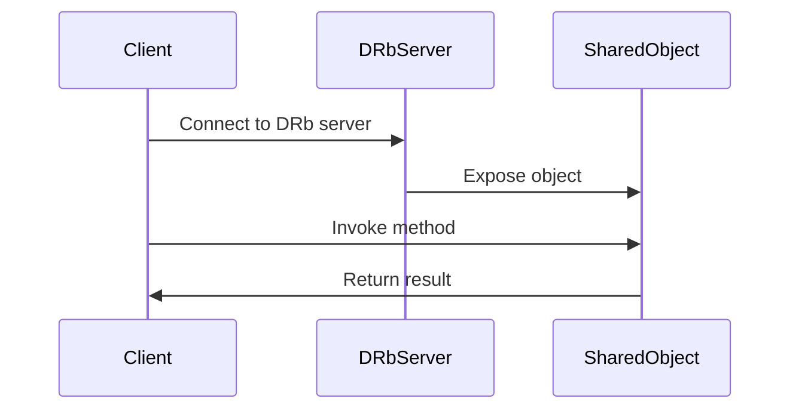

## 20.9 Interprocess Communication and DRb

In the world of software development, processes often need to communicate with each other to share data, coordinate actions, or distribute workloads. This is where Interprocess Communication (IPC) comes into play. In Ruby, one of the most powerful tools for IPC is Distributed Ruby (DRb), which allows Ruby programs to communicate seamlessly over a network. In this section, we'll explore the need for IPC, delve into DRb, and examine other IPC mechanisms available in Ruby.

### Understanding the Need for Interprocess Communication

Interprocess Communication is essential in scenarios where multiple processes need to work together. This could be for:

- **Load Balancing**: Distributing tasks across multiple processes to optimize resource usage.
- **Data Sharing**: Allowing processes to access shared data without duplicating it.
- **Coordination**: Synchronizing actions between processes to ensure consistency.
- **Modular Design**: Separating concerns into different processes for better maintainability.

### Approaches to Interprocess Communication

There are several approaches to IPC, each with its own advantages and use cases:

1. **Sockets**: Allow processes to communicate over a network using TCP or UDP protocols.
2. **Pipes**: Enable communication between processes on the same machine using a unidirectional or bidirectional data stream.
3. **Message Queues**: Facilitate communication by sending messages between processes, often used in distributed systems.
4. **Shared Memory**: Allow multiple processes to access the same memory space, providing fast data exchange.
5. **DRb (Distributed Ruby)**: A Ruby-specific solution that allows Ruby objects to interact with each other over a network.

### Introducing Distributed Ruby (DRb)

Distributed Ruby (DRb) is a part of the Ruby standard library that enables Ruby programs to communicate with each other over a network. It allows Ruby objects to be shared between different processes, making it an excellent choice for building distributed applications.

#### How DRb Works

DRb operates by creating a server that exposes Ruby objects to clients over a network. Clients can then interact with these objects as if they were local, calling methods and accessing data seamlessly.

#### Setting Up a DRb Server

To set up a DRb server, follow these steps:

1. **Require the DRb Library**: Ensure that your Ruby script includes the DRb library.
2. **Define the Object to be Shared**: Create the Ruby object that you want to expose to clients.
3. **Start the DRb Server**: Use the `DRb.start_service` method to start the server and bind the object to a URI.

Here's a simple example of a DRb server:

```ruby
require 'drb/drb'

# Define a simple class to be shared
class Calculator
  def add(a, b)
    a + b
  end
end

# Create an instance of the class
calculator = Calculator.new

# Start the DRb server
DRb.start_service('druby://localhost:8787', calculator)

# Keep the server running
puts "DRb server running at druby://localhost:8787"
DRb.thread.join
```

#### Setting Up a DRb Client

To interact with the DRb server, you'll need to set up a client:

1. **Require the DRb Library**: Include the DRb library in your client script.
2. **Connect to the DRb Server**: Use `DRbObject.new_with_uri` to connect to the server and obtain a reference to the shared object.
3. **Invoke Methods on the Shared Object**: Call methods on the object as if it were local.

Here's an example of a DRb client:

```ruby
require 'drb/drb'

# Connect to the DRb server
calculator = DRbObject.new_with_uri('druby://localhost:8787')

# Use the shared object
result = calculator.add(5, 3)
puts "The result of 5 + 3 is #{result}"
```

### Security Considerations with DRb

When using DRb, it's crucial to consider security, as exposing objects over a network can introduce vulnerabilities:

- **Authentication**: Implement authentication mechanisms to ensure only authorized clients can access the server.
- **Encryption**: Use encryption to protect data transmitted over the network.
- **Access Control**: Restrict access to sensitive methods or data within shared objects.
- **Firewalls**: Configure firewalls to limit access to the DRb server.

### Alternative IPC Mechanisms in Ruby

While DRb is a powerful tool for IPC in Ruby, there are other mechanisms you might consider:

- **Sockets**: Use Ruby's `Socket` library for low-level network communication.
- **Pipes**: Utilize Ruby's `IO.pipe` for simple data exchange between processes.
- **Message Queues**: Leverage libraries like `redis` or `bunny` for message-based communication.
- **Shared Memory**: Use the `mmap` gem for shared memory access.

### Use Cases for Interprocess Communication

IPC is beneficial in various scenarios, including:

- **Distributed Systems**: Enable communication between components in a distributed architecture.
- **Microservices**: Facilitate interaction between microservices in a service-oriented architecture.
- **Parallel Processing**: Coordinate tasks across multiple processes for improved performance.
- **Real-Time Applications**: Share data between processes to support real-time features.

### Visualizing DRb Communication

To better understand how DRb facilitates communication, let's visualize the process using a sequence diagram:



This diagram illustrates the flow of communication between a DRb client and server, highlighting the interaction with the shared object.

### Try It Yourself

Now that we've covered the basics of DRb, try setting up your own DRb server and client. Experiment with different objects and methods to see how DRb can facilitate communication in your applications. Consider implementing security measures to protect your DRb services.

### Summary

In this section, we've explored the concept of Interprocess Communication and how DRb can be used to facilitate communication between Ruby processes. We've covered the basics of setting up a DRb server and client, discussed security considerations, and highlighted alternative IPC mechanisms. Remember, IPC is a powerful tool for building scalable and maintainable applications, and DRb is a valuable asset in your Ruby toolkit.

## Quiz: Interprocess Communication and DRb



### What is the primary purpose of Interprocess Communication (IPC)?

- [x] To enable communication between processes
- [ ] To compile Ruby code
- [ ] To manage memory allocation
- [ ] To handle exceptions

> **Explanation:** IPC is used to enable communication between different processes, allowing them to share data and coordinate actions.

### Which Ruby library is used for Distributed Ruby (DRb)?

- [x] drb
- [ ] socket
- [ ] redis
- [ ] bunny

> **Explanation:** The `drb` library is part of the Ruby standard library and is used for Distributed Ruby (DRb).

### What method is used to start a DRb server?

- [x] DRb.start_service
- [ ] DRb.run_server
- [ ] DRb.connect
- [ ] DRb.initialize

> **Explanation:** The `DRb.start_service` method is used to start a DRb server and bind an object to a URI.

### What is a key security consideration when using DRb?

- [x] Implementing authentication
- [ ] Increasing memory allocation
- [ ] Using more threads
- [ ] Disabling encryption

> **Explanation:** Implementing authentication is crucial to ensure that only authorized clients can access the DRb server.

### Which of the following is an alternative IPC mechanism in Ruby?

- [x] Sockets
- [ ] Threads
- [ ] Variables
- [ ] Classes

> **Explanation:** Sockets are an alternative IPC mechanism that can be used for network communication between processes.

### What is the role of a DRb client?

- [x] To connect to a DRb server and interact with shared objects
- [ ] To compile Ruby code
- [ ] To manage memory allocation
- [ ] To handle exceptions

> **Explanation:** A DRb client connects to a DRb server and interacts with shared objects, invoking methods and accessing data.

### Which method is used by a DRb client to connect to a server?

- [x] DRbObject.new_with_uri
- [ ] DRb.connect
- [ ] DRb.start_service
- [ ] DRb.run_client

> **Explanation:** The `DRbObject.new_with_uri` method is used by a DRb client to connect to a server and obtain a reference to the shared object.

### What is a benefit of using IPC in distributed systems?

- [x] Enabling communication between components
- [ ] Increasing memory allocation
- [ ] Using more threads
- [ ] Disabling encryption

> **Explanation:** IPC enables communication between components in a distributed system, allowing them to share data and coordinate actions.

### Which of the following is a use case for IPC?

- [x] Real-time applications
- [ ] Compiling Ruby code
- [ ] Managing memory allocation
- [ ] Handling exceptions

> **Explanation:** IPC is beneficial in real-time applications where processes need to share data and coordinate actions.

### True or False: DRb allows Ruby objects to interact with each other over a network.

- [x] True
- [ ] False

> **Explanation:** True. DRb allows Ruby objects to interact with each other over a network, enabling seamless communication between processes.



Remember, this is just the beginning. As you progress, you'll discover more advanced techniques and patterns for building scalable and maintainable applications. Keep experimenting, stay curious, and enjoy the journey!
