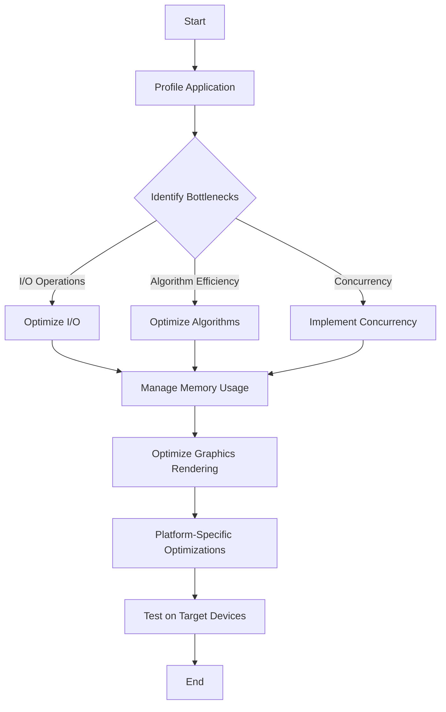

## 21.10 Performance Optimization in Desktop/Mobile Apps

In today's fast-paced digital world, users expect applications to be fast, responsive, and efficient. Performance optimization is crucial in desktop and mobile applications to ensure a smooth user experience. In this section, we'll explore various strategies and techniques to optimize performance in Ruby-based desktop and mobile applications.

### The Impact of Performance on User Experience

Performance directly impacts user satisfaction and engagement. Slow applications can lead to frustration, decreased productivity, and ultimately, user abandonment. Therefore, optimizing performance is not just about improving speed but also enhancing the overall user experience.

### Profiling Desktop Applications

Profiling is the first step in performance optimization. It involves analyzing your application to identify bottlenecks and resource-intensive tasks. Ruby provides several tools for profiling desktop applications:

- **RubyProf**: A fast code profiler for Ruby that provides detailed reports on method calls, execution time, and memory usage.
- **StackProf**: A sampling call-stack profiler for Ruby, useful for identifying CPU-bound bottlenecks.
- **MemoryProfiler**: Helps track memory usage and identify memory leaks.

#### Example: Using RubyProf

```ruby
require 'ruby-prof'

RubyProf.start

# Code to profile
def perform_task
  # Simulate a resource-intensive task
  1000.times { |i| puts i }
end

perform_task

result = RubyProf.stop

# Print a flat profile to text
printer = RubyProf::FlatPrinter.new(result)
printer.print(STDOUT)
```

### Identifying and Optimizing Resource-Intensive Tasks

Once you've identified bottlenecks, the next step is optimization. Focus on tasks that consume the most resources, such as:

- **I/O Operations**: Minimize disk and network I/O by caching data and using asynchronous operations.
- **Algorithm Efficiency**: Optimize algorithms for better performance. Consider using more efficient data structures or algorithms.
- **Concurrency**: Use threads or fibers to perform tasks concurrently, reducing wait times.

### Managing Memory Usage and Garbage Collection

Memory management is crucial for performance optimization. Ruby's garbage collector (GC) can impact performance if not managed properly. Here are some tips:

- **Reduce Object Allocation**: Minimize the creation of temporary objects to reduce GC pressure.
- **Use Symbols**: Prefer symbols over strings for identifiers to save memory.
- **Tune GC Settings**: Adjust GC settings using environment variables like `RUBY_GC_HEAP_GROWTH_FACTOR` to optimize performance.

#### Example: Tuning Garbage Collection

```ruby
# Set environment variables to tune GC
ENV['RUBY_GC_HEAP_GROWTH_FACTOR'] = '1.5'
ENV['RUBY_GC_MALLOC_LIMIT'] = '90000000'

# Run your application
system('ruby my_app.rb')
```

### Optimizing Graphics Rendering and Event Handling

Graphics rendering and event handling are critical in desktop and mobile applications. Here are some strategies:

- **Batch Rendering**: Group rendering operations to reduce the number of draw calls.
- **Use Hardware Acceleration**: Leverage GPU acceleration for rendering tasks.
- **Optimize Event Handling**: Debounce or throttle event handlers to prevent excessive processing.

### Platform-Specific Considerations and Optimizations

Different platforms have unique characteristics and constraints. Consider the following:

- **Desktop Applications**: Focus on optimizing for different operating systems (Windows, macOS, Linux) and hardware configurations.
- **Mobile Applications**: Optimize for battery life, network usage, and varying screen sizes.

### Testing Performance on Target Devices

Testing on target devices is essential to ensure your optimizations are effective. Consider:

- **Device Diversity**: Test on a range of devices with different specifications.
- **Real-World Conditions**: Simulate real-world conditions, such as poor network connectivity or low battery.
- **Automated Testing**: Use automated testing tools to streamline the testing process.

### Encouraging Experimentation

Remember, performance optimization is an iterative process. Experiment with different techniques and measure their impact. Here's a simple exercise to get started:

**Try It Yourself:**

- Modify the `perform_task` method in the RubyProf example to include more complex operations.
- Use different profiling tools to analyze the performance.
- Experiment with GC tuning parameters and observe the effects.

### Visualizing Performance Optimization Strategies



### Key Takeaways

- Performance optimization enhances user experience and engagement.
- Profiling tools are essential for identifying bottlenecks.
- Focus on optimizing resource-intensive tasks and managing memory effectively.
- Consider platform-specific optimizations and test on target devices.

## Quiz: Performance Optimization in Desktop/Mobile Apps



### What is the primary goal of performance optimization in applications?

- [x] Enhance user experience
- [ ] Increase code complexity
- [ ] Reduce application size
- [ ] Improve aesthetics

> **Explanation:** Performance optimization aims to enhance user experience by making applications faster and more responsive.

### Which Ruby tool is used for profiling memory usage?

- [ ] RubyProf
- [ ] StackProf
- [x] MemoryProfiler
- [ ] GCProfiler

> **Explanation:** MemoryProfiler is used to track memory usage and identify memory leaks in Ruby applications.

### What is the benefit of using symbols over strings in Ruby?

- [x] Saves memory
- [ ] Increases execution time
- [ ] Enhances readability
- [ ] Improves security

> **Explanation:** Symbols are immutable and reused, which saves memory compared to strings.

### What is a common strategy for optimizing graphics rendering?

- [ ] Increase draw calls
- [x] Batch rendering operations
- [ ] Use software rendering
- [ ] Disable hardware acceleration

> **Explanation:** Batch rendering operations reduce the number of draw calls, improving performance.

### Which environment variable can be used to tune Ruby's garbage collector?

- [x] RUBY_GC_HEAP_GROWTH_FACTOR
- [ ] RUBY_GC_MAX_HEAP_SIZE
- [ ] RUBY_GC_MIN_HEAP_SIZE
- [ ] RUBY_GC_FREE_SLOTS

> **Explanation:** RUBY_GC_HEAP_GROWTH_FACTOR is used to adjust the growth factor of Ruby's garbage collector.

### What is the purpose of debouncing event handlers?

- [ ] Increase event frequency
- [x] Prevent excessive processing
- [ ] Enhance event accuracy
- [ ] Improve event aesthetics

> **Explanation:** Debouncing event handlers prevents excessive processing by limiting the rate at which a function is executed.

### Why is testing on target devices important?

- [x] Ensures optimizations are effective
- [ ] Reduces development time
- [ ] Increases code complexity
- [ ] Improves aesthetics

> **Explanation:** Testing on target devices ensures that optimizations are effective under real-world conditions.

### What is a key consideration for mobile application optimization?

- [ ] Focus on desktop hardware
- [ ] Ignore battery life
- [x] Optimize for varying screen sizes
- [ ] Increase network usage

> **Explanation:** Mobile applications should be optimized for varying screen sizes and other mobile-specific constraints.

### Which tool is used for sampling call-stack profiling in Ruby?

- [ ] RubyProf
- [x] StackProf
- [ ] MemoryProfiler
- [ ] GCProfiler

> **Explanation:** StackProf is a sampling call-stack profiler for Ruby, useful for identifying CPU-bound bottlenecks.

### True or False: Performance optimization is a one-time process.

- [ ] True
- [x] False

> **Explanation:** Performance optimization is an iterative process that requires continuous monitoring and improvement.



Remember, performance optimization is an ongoing journey. Keep experimenting, stay curious, and enjoy the process of making your applications faster and more efficient!
