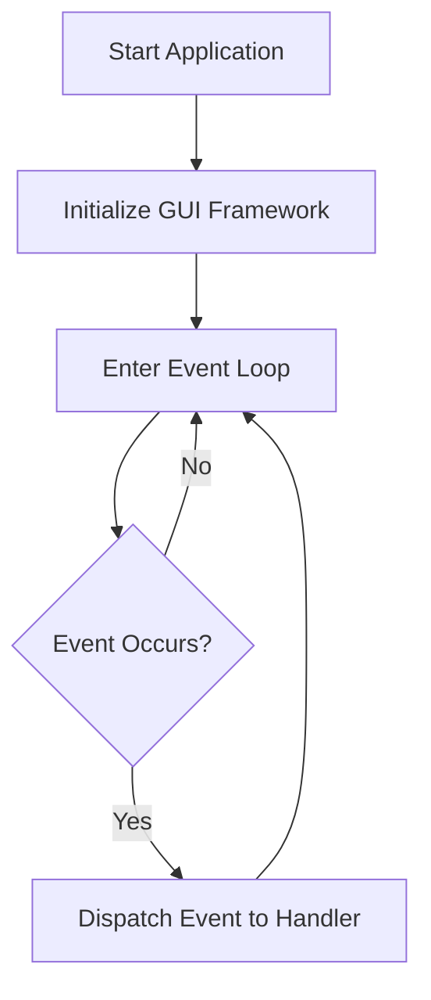

## 21.2 Event-Driven Programming in Desktop Apps

### Introduction to Event-Driven Programming

Event-driven programming is a paradigm that revolves around the occurrence of events and the responses to those events. In the context of desktop applications, this means that the application waits for user actions such as clicks, keystrokes, or other interactions, and responds accordingly. This approach is crucial for creating interactive and responsive graphical user interfaces (GUIs).

#### Significance in GUI Development

In GUI development, event-driven programming allows applications to remain idle until an event occurs, thus conserving resources and providing a seamless user experience. This paradigm is essential for handling asynchronous interactions, where the flow of the program is determined by events rather than a predefined sequence of operations.

### Understanding the Event Loop

The event loop is the core mechanism that drives event-driven programming. It continuously checks for events and dispatches them to the appropriate event handlers. In Ruby, various GUI frameworks implement their own event loops, which manage the lifecycle of events and ensure that the application remains responsive.

#### How the Event Loop Works in Ruby GUI Frameworks

In Ruby, GUI frameworks like Tk, GTK, and Shoes provide their own implementations of the event loop. These frameworks abstract the complexity of managing events, allowing developers to focus on defining the behavior of their applications in response to user interactions.



### Registering Event Handlers

Event handlers are functions or blocks of code that are executed in response to specific events. Registering event handlers involves associating these functions with particular events, such as button clicks or keyboard input.

#### Example: Handling Button Clicks

Let's explore how to register an event handler for a button click using different Ruby GUI frameworks.

##### Tk Example

Tk is a popular GUI toolkit for Ruby that provides a simple way to create desktop applications.

```ruby
require 'tk'

root = TkRoot.new { title "Tk Button Example" }
button = TkButton.new(root) do
  text "Click Me"
  command { puts "Button clicked!" }
end

button.pack
Tk.mainloop
```

In this example, we create a button with the text "Click Me". The `command` option is used to register an event handler that prints "Button clicked!" to the console when the button is pressed.

##### GTK Example

GTK is another powerful toolkit for creating GUIs in Ruby.

```ruby
require 'gtk3'

Gtk.init

window = Gtk::Window.new("GTK Button Example")
button = Gtk::Button.new(label: "Click Me")

button.signal_connect("clicked") do
  puts "Button clicked!"
end

window.add(button)
window.show_all

Gtk.main
```

Here, we use the `signal_connect` method to register an event handler for the "clicked" event of the button.

##### Shoes Example

Shoes is a lightweight toolkit for building simple Ruby applications with a focus on ease of use.

```ruby
Shoes.app(title: "Shoes Button Example") do
  button "Click Me" do
    alert "Button clicked!"
  end
end
```

In Shoes, event handlers are defined directly within the block associated with the button, making it straightforward to handle events.

### Best Practices for Managing Events

Managing events effectively is crucial for maintaining the responsiveness and performance of your application. Here are some best practices to consider:

- **Avoid Blocking the Main Thread**: Ensure that event handlers do not perform long-running operations that block the main thread. Use background threads or asynchronous processing for such tasks.
- **Keep Handlers Lightweight**: Event handlers should be concise and efficient, focusing on responding to the event rather than performing complex logic.
- **Use Debouncing and Throttling**: For events that can occur frequently, such as mouse movements or key presses, consider implementing debouncing or throttling to reduce the number of times the handler is executed.

### Updating the GUI in Response to Events

Updating the GUI in response to events is a common requirement in desktop applications. This involves modifying the state of the application or its visual components based on user interactions.

#### Strategies for GUI Updates

- **Direct Manipulation**: Update the GUI components directly within the event handler. This is suitable for simple updates that do not require complex logic.
- **Model-View-Controller (MVC) Pattern**: Use the MVC pattern to separate the application's logic from its presentation. This allows for more structured and maintainable code, especially in larger applications.

### Creating an Interactive Application

Let's create a simple interactive application that reacts to user input. We'll use Tk for this example.

```ruby
require 'tk'

root = TkRoot.new { title "Interactive App" }

label = TkLabel.new(root) do
  text "Enter your name:"
  pack { padx 15; pady 15; side 'left' }
end

entry = TkEntry.new(root)
entry.pack { padx 15; pady 15; side 'left' }

button = TkButton.new(root) do
  text "Submit"
  command do
    name = entry.get
    Tk.messageBox(
      'type' => 'ok',
      'icon' => 'info',
      'title' => 'Greeting',
      'message' => "Hello, #{name}!"
    )
  end
end

button.pack { padx 15; pady 15; side 'left' }

Tk.mainloop
```

In this application, we create a simple form with a label, an entry field, and a button. When the user enters their name and clicks "Submit", a message box displays a greeting.

### Encouragement to Experiment

Now that we've explored the basics of event-driven programming in Ruby desktop applications, it's time to experiment! Try modifying the examples provided, or create your own applications that respond to different types of user input. Remember, the key to mastering event-driven programming is practice and exploration.

### Conclusion

Event-driven programming is a powerful paradigm for creating interactive and responsive desktop applications. By understanding the event loop, registering event handlers, and managing events effectively, you can build applications that provide a seamless user experience. As you continue to explore Ruby's GUI frameworks, you'll discover new ways to enhance your applications and delight your users.

## Quiz: Event-Driven Programming in Desktop Apps



### What is the primary purpose of event-driven programming in desktop applications?

- [x] To handle user interactions asynchronously
- [ ] To execute code in a linear sequence
- [ ] To manage memory allocation
- [ ] To optimize CPU usage

> **Explanation:** Event-driven programming is designed to handle user interactions asynchronously, allowing applications to remain responsive.

### Which Ruby GUI framework uses the `signal_connect` method to register event handlers?

- [ ] Tk
- [x] GTK
- [ ] Shoes
- [ ] Qt

> **Explanation:** GTK uses the `signal_connect` method to register event handlers for various events.

### In the context of event-driven programming, what is an event loop?

- [x] A mechanism that continuously checks for and dispatches events
- [ ] A function that executes code in a loop
- [ ] A tool for debugging applications
- [ ] A method for optimizing performance

> **Explanation:** An event loop is a mechanism that continuously checks for events and dispatches them to the appropriate handlers.

### What is a common pitfall to avoid when writing event handlers?

- [x] Blocking the main thread
- [ ] Using too many variables
- [ ] Writing too many comments
- [ ] Using global variables

> **Explanation:** Blocking the main thread in event handlers can cause the application to become unresponsive.

### Which of the following is a best practice for managing events in a desktop application?

- [x] Use debouncing and throttling for frequent events
- [ ] Perform complex logic in event handlers
- [ ] Avoid using background threads
- [ ] Use global variables for event data

> **Explanation:** Debouncing and throttling can help manage frequent events efficiently, preventing performance issues.

### In a Tk application, how do you start the event loop?

- [ ] `Gtk.main`
- [ ] `Shoes.app`
- [x] `Tk.mainloop`
- [ ] `Qt.run`

> **Explanation:** `Tk.mainloop` is used to start the event loop in a Tk application.

### What is the role of the `command` option in a Tk button?

- [x] To register an event handler for button clicks
- [ ] To set the button's text
- [ ] To change the button's color
- [ ] To disable the button

> **Explanation:** The `command` option is used to register an event handler that executes when the button is clicked.

### Which pattern is recommended for separating application logic from presentation in GUI applications?

- [ ] Singleton
- [ ] Factory
- [x] Model-View-Controller (MVC)
- [ ] Observer

> **Explanation:** The Model-View-Controller (MVC) pattern is recommended for separating application logic from presentation.

### True or False: Event-driven programming is only applicable to desktop applications.

- [ ] True
- [x] False

> **Explanation:** Event-driven programming is applicable to various domains, including web development, mobile applications, and more.

### Which of the following is NOT a Ruby GUI framework?

- [ ] Tk
- [ ] GTK
- [ ] Shoes
- [x] React

> **Explanation:** React is a JavaScript library for building user interfaces, not a Ruby GUI framework.



Remember, this is just the beginning. As you progress, you'll build more complex and interactive desktop applications. Keep experimenting, stay curious, and enjoy the journey!
