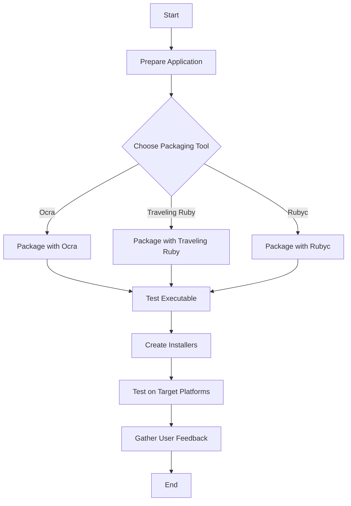

## 21.3 Packaging and Distributing Ruby Applications

In the world of software development, distributing applications efficiently and effectively is as crucial as building them. For Ruby developers, this often involves packaging applications in a way that they can be easily installed and run on target systems without requiring users to manually install Ruby or any dependencies. This section will guide you through the process of packaging and distributing Ruby applications, focusing on creating standalone executables.

### Understanding the Challenges

Before diving into the tools and techniques, let's first understand the challenges involved in distributing Ruby applications:

- **Dependency Management**: Ruby applications often rely on a variety of gems and libraries. Ensuring that all dependencies are included and correctly configured is essential.
- **Platform Compatibility**: Ruby applications need to run on different operating systems, each with its own set of requirements and configurations.
- **Executable Creation**: Unlike compiled languages, Ruby is interpreted, which means creating a standalone executable requires bundling the Ruby interpreter along with the application code.
- **User Experience**: The installation process should be seamless, requiring minimal effort from the user.

### Tools for Packaging Ruby Applications

Several tools can help package Ruby applications into standalone executables. Here, we'll introduce some of the most popular ones:

#### Ocra

[Ocra](https://github.com/larsch/ocra) is a tool specifically designed for packaging Ruby applications into standalone Windows executables. It scans your application for dependencies and bundles them into a single executable file.

#### Traveling Ruby

[Traveling Ruby](https://github.com/phusion/traveling-ruby) is a project that provides self-contained, portable Ruby binaries. It allows you to package your Ruby application along with a Ruby interpreter, making it easy to distribute across different platforms.

#### Ruby Packer (Rubyc)

[Ruby Packer (Rubyc)](https://github.com/pmq20/ruby-packer) is a cross-platform tool that compiles Ruby scripts into standalone executables. It supports Windows, macOS, and Linux, making it a versatile choice for developers targeting multiple platforms.

### Step-by-Step Guide to Packaging a Ruby Application

Let's walk through the process of packaging a Ruby application using these tools. We'll use a simple "Hello World" application as an example.

#### Step 1: Prepare Your Application

First, ensure your Ruby application is working correctly. For this example, we'll use a simple script:

```ruby
# hello_world.rb
puts "Hello, World!"
```

#### Step 2: Package with Ocra (Windows)

1. **Install Ocra**: Ensure you have Ocra installed. You can install it using the following command:

   ```bash
   gem install ocra
   ```

2. **Package the Application**: Use Ocra to package your application into an executable:

   ```bash
   ocra hello_world.rb
   ```

   This command will create a `hello_world.exe` file in the same directory.

3. **Test the Executable**: Run the executable to ensure it works as expected:

   ```bash
   ./hello_world.exe
   ```

   You should see "Hello, World!" printed to the console.

#### Step 3: Package with Traveling Ruby (Cross-Platform)

1. **Download Traveling Ruby**: Obtain the Traveling Ruby binaries for your target platforms from the [Traveling Ruby GitHub page](https://github.com/phusion/traveling-ruby).

2. **Create a Directory Structure**: Organize your application and dependencies in a directory structure:

   ```
   my_app/
   ├── bin/
   │   └── hello_world
   ├── lib/
   └── traveling-ruby/
   ```

3. **Copy Binaries**: Place the Traveling Ruby binaries in the `traveling-ruby` directory.

4. **Create a Launcher Script**: Write a script to launch your application using Traveling Ruby:

   ```bash
   #!/bin/bash
   DIR="$( cd "$( dirname "${BASH_SOURCE[0]}" )" && pwd )"
   "$DIR/traveling-ruby/bin/ruby" "$DIR/bin/hello_world"
   ```

5. **Test on Target Platforms**: Transfer the package to your target platforms and test the launcher script.

#### Step 4: Package with Ruby Packer (Rubyc)

1. **Install Rubyc**: Ensure you have Rubyc installed. You can install it using the following command:

   ```bash
   gem install rubyc
   ```

2. **Compile the Application**: Use Rubyc to compile your application into an executable:

   ```bash
   rubyc hello_world.rb
   ```

   This command will create a standalone executable for your platform.

3. **Test the Executable**: Run the executable to ensure it works as expected:

   ```bash
   ./hello_world
   ```

   You should see "Hello, World!" printed to the console.

### Handling Dependencies and Assets

When packaging Ruby applications, it's crucial to handle dependencies and assets properly:

- **Gems**: Ensure all required gems are included in the package. Tools like Bundler can help manage gem dependencies.
- **Assets**: Include any necessary assets (e.g., images, configuration files) in your package. Ensure paths are correctly configured in your application code.

### Creating Installers and Deployment Packages

For a professional distribution, consider creating installers or deployment packages:

- **Windows**: Use tools like Inno Setup or NSIS to create Windows installers.
- **macOS**: Use tools like Packages or create a DMG file for macOS distribution.
- **Linux**: Use package managers like DEB or RPM to create Linux packages.

### Best Practices for Testing Packaged Applications

Testing is a critical step in the packaging process. Here are some best practices:

- **Test on All Target Platforms**: Ensure your application works on all intended platforms.
- **Automate Testing**: Use automated testing tools to streamline the process.
- **User Feedback**: Gather feedback from users to identify any issues or improvements.

### Visualizing the Packaging Process

To better understand the packaging process, let's visualize it using a flowchart:



This flowchart outlines the steps involved in packaging a Ruby application, from preparation to user feedback.

### Knowledge Check

To reinforce your understanding, consider the following questions:

- What are the main challenges in distributing Ruby applications?
- How does Ocra differ from Traveling Ruby and Rubyc?
- What are some best practices for testing packaged applications?

### Embrace the Journey

Remember, packaging and distributing Ruby applications is an iterative process. As you gain experience, you'll develop more efficient workflows and discover new tools and techniques. Keep experimenting, stay curious, and enjoy the journey!

## Quiz: Packaging and Distributing Ruby Applications



### What is the primary challenge in distributing Ruby applications?

- [x] Managing dependencies and platform compatibility
- [ ] Writing the application code
- [ ] Designing the user interface
- [ ] Testing the application

> **Explanation:** The primary challenge in distributing Ruby applications is managing dependencies and ensuring platform compatibility.

### Which tool is specifically designed for packaging Ruby applications into standalone Windows executables?

- [x] Ocra
- [ ] Traveling Ruby
- [ ] Rubyc
- [ ] Bundler

> **Explanation:** Ocra is specifically designed for packaging Ruby applications into standalone Windows executables.

### What does Traveling Ruby provide?

- [x] Self-contained, portable Ruby binaries
- [ ] A Ruby interpreter for Windows only
- [ ] A tool for compiling Ruby scripts
- [ ] A gem dependency manager

> **Explanation:** Traveling Ruby provides self-contained, portable Ruby binaries for cross-platform distribution.

### What is the purpose of Ruby Packer (Rubyc)?

- [x] To compile Ruby scripts into standalone executables
- [ ] To manage gem dependencies
- [ ] To create Windows installers
- [ ] To provide a Ruby interpreter

> **Explanation:** Ruby Packer (Rubyc) is used to compile Ruby scripts into standalone executables.

### Which tool can be used to create Windows installers?

- [x] Inno Setup
- [ ] Traveling Ruby
- [ ] Rubyc
- [ ] Bundler

> **Explanation:** Inno Setup is a tool that can be used to create Windows installers.

### What should be included in the package when handling dependencies?

- [x] All required gems and assets
- [ ] Only the Ruby interpreter
- [ ] Only the application code
- [ ] Only configuration files

> **Explanation:** All required gems and assets should be included in the package when handling dependencies.

### What is a best practice for testing packaged applications?

- [x] Test on all target platforms
- [ ] Test only on the development platform
- [ ] Test only on the most popular platform
- [ ] Skip testing if the code is error-free

> **Explanation:** A best practice for testing packaged applications is to test on all target platforms.

### What is the first step in packaging a Ruby application?

- [x] Prepare your application
- [ ] Create an installer
- [ ] Choose a packaging tool
- [ ] Test the application

> **Explanation:** The first step in packaging a Ruby application is to prepare your application.

### What is the role of a launcher script in Traveling Ruby?

- [x] To launch the application using Traveling Ruby binaries
- [ ] To compile the Ruby script
- [ ] To create a Windows executable
- [ ] To manage gem dependencies

> **Explanation:** A launcher script in Traveling Ruby is used to launch the application using Traveling Ruby binaries.

### True or False: Packaging Ruby applications is a one-time process.

- [ ] True
- [x] False

> **Explanation:** Packaging Ruby applications is not a one-time process; it is iterative and may require adjustments based on user feedback and platform changes.


