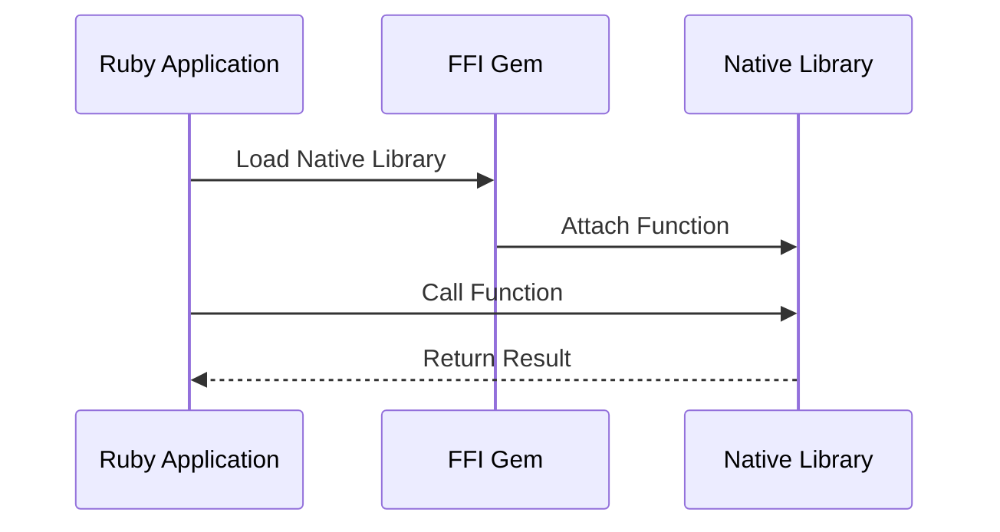

## 21.6 Integrating with Native APIs

In the realm of desktop and mobile applications, integrating with native APIs is crucial for accessing advanced features and functionalities that are otherwise unavailable through standard libraries. This section delves into the techniques for interfacing Ruby applications with native operating system APIs, enabling developers to harness the full potential of the underlying hardware and system capabilities.

### Why Integrate with Native APIs?

Integrating with native APIs allows Ruby applications to:

- **Access Hardware**: Utilize device-specific hardware features such as cameras, sensors, and GPS.
- **System Dialogs and Notifications**: Invoke native system dialogs for file selection, alerts, and notifications.
- **Performance Optimization**: Leverage optimized native code for performance-critical tasks.
- **Extended Functionality**: Access features not available in Ruby's standard library or third-party gems.

### Methods for Calling Native Code from Ruby

Ruby provides several methods for calling native code, with the most popular being the Foreign Function Interface (FFI). The `ffi` gem is a powerful tool that allows Ruby to interface with C libraries without writing C extensions.

#### Using the `ffi` Gem

The `ffi` gem simplifies the process of calling native functions and handling data types. Here's a basic example of using `ffi` to call a C library function:

```ruby
require 'ffi'

module MyLibrary
  extend FFI::Library
  ffi_lib 'c' # Load the standard C library

  # Attach the 'puts' function from the C library
  attach_function :puts, [:string], :int
end

# Call the native 'puts' function
MyLibrary.puts("Hello from native code!")
```

In this example, we load the standard C library and attach the `puts` function, allowing us to call it directly from Ruby.

### Integrating with APIs on Different Platforms

Different operating systems provide distinct APIs for accessing native features. Let's explore how to integrate with native APIs on Windows and macOS.

#### Windows API Integration

Windows provides a comprehensive set of APIs for interacting with the operating system. Here's an example of using `ffi` to call a Windows API function:

```ruby
require 'ffi'

module User32
  extend FFI::Library
  ffi_lib 'user32'
  
  # Attach the MessageBox function from user32.dll
  attach_function :MessageBoxA, [:pointer, :string, :string, :uint], :int
end

# Display a message box
User32.MessageBoxA(nil, "Hello, Windows!", "Ruby FFI", 0)
```

This code snippet demonstrates how to display a message box using the `MessageBoxA` function from the `user32.dll` library.

#### macOS Cocoa Integration

On macOS, the Cocoa framework provides APIs for building graphical user interfaces and accessing system features. Here's an example of using `ffi` to call a Cocoa API:

```ruby
require 'ffi'

module Cocoa
  extend FFI::Library
  ffi_lib '/System/Library/Frameworks/Cocoa.framework/Cocoa'
  
  # Attach the NSApplicationLoad function
  attach_function :NSApplicationLoad, [], :bool
end

# Load the Cocoa application environment
Cocoa.NSApplicationLoad()
```

This example demonstrates how to load the Cocoa application environment using the `NSApplicationLoad` function.

### Handling Differences Between Operating Systems

When integrating with native APIs, it's essential to handle differences between operating systems. Consider the following strategies:

- **Conditional Compilation**: Use conditional logic to determine the operating system and load the appropriate libraries.
- **Abstraction Layers**: Create an abstraction layer that provides a consistent interface for accessing native features across platforms.
- **Testing**: Thoroughly test your application on all target platforms to ensure compatibility and functionality.

### Error Handling and Resource Management

Working with native code introduces new challenges in error handling and resource management. Consider the following best practices:

- **Error Checking**: Always check the return values of native functions for errors and handle them appropriately.
- **Resource Cleanup**: Ensure that resources allocated by native code are properly released to prevent memory leaks.
- **Exception Handling**: Use Ruby's exception handling mechanisms to manage errors gracefully.

### Security Considerations and User Permissions

Integrating with native APIs requires careful consideration of security and user permissions:

- **Permissions**: Ensure that your application requests the necessary permissions to access hardware and system features.
- **Input Validation**: Validate all inputs to native functions to prevent injection attacks and buffer overflows.
- **Secure Coding Practices**: Follow secure coding practices to protect your application and users from vulnerabilities.

### Try It Yourself

To solidify your understanding, try modifying the code examples to call different native functions or integrate with other APIs. Experiment with error handling and resource management techniques to see how they affect your application's stability and performance.

### Visualizing API Integration

To better understand the process of integrating with native APIs, let's visualize the flow of a Ruby application calling a native function using `ffi`.



This sequence diagram illustrates the interaction between a Ruby application, the `ffi` gem, and a native library.

### Summary

Integrating with native APIs allows Ruby applications to access advanced features and functionalities, enhancing their capabilities and performance. By using tools like the `ffi` gem, developers can seamlessly interface with native code across different platforms. However, it's crucial to handle cross-platform differences, manage resources, and ensure security to build robust and reliable applications.

## Quiz: Integrating with Native APIs



### What is the primary reason for integrating Ruby applications with native APIs?

- [x] To access advanced features and functionalities not available in Ruby's standard library
- [ ] To make the application run faster
- [ ] To reduce the size of the application
- [ ] To simplify the codebase

> **Explanation:** Integrating with native APIs allows Ruby applications to access advanced features and functionalities that are not available in Ruby's standard library.

### Which gem is commonly used in Ruby for interfacing with native libraries?

- [x] ffi
- [ ] nokogiri
- [ ] sinatra
- [ ] rails

> **Explanation:** The `ffi` gem is commonly used in Ruby for interfacing with native libraries.

### What is a key consideration when working with native code in Ruby?

- [x] Error handling and resource management
- [ ] Reducing the number of lines of code
- [ ] Using only Ruby standard libraries
- [ ] Avoiding object-oriented programming

> **Explanation:** Error handling and resource management are crucial when working with native code to ensure stability and prevent memory leaks.

### What is the purpose of the `ffi_lib` method in the `ffi` gem?

- [x] To load a native library
- [ ] To define a Ruby class
- [ ] To create a new thread
- [ ] To handle exceptions

> **Explanation:** The `ffi_lib` method is used to load a native library so that its functions can be called from Ruby.

### How can you handle differences between operating systems when integrating with native APIs?

- [x] Use conditional logic and abstraction layers
- [ ] Use only one operating system
- [ ] Avoid using native APIs
- [ ] Write separate applications for each OS

> **Explanation:** Using conditional logic and abstraction layers helps handle differences between operating systems when integrating with native APIs.

### What is a potential security risk when calling native functions?

- [x] Injection attacks and buffer overflows
- [ ] Slow application performance
- [ ] Increased application size
- [ ] Reduced code readability

> **Explanation:** Injection attacks and buffer overflows are potential security risks when calling native functions.

### What is the role of the `attach_function` method in the `ffi` gem?

- [x] To bind a native function to a Ruby method
- [ ] To create a new Ruby object
- [ ] To start a new process
- [ ] To define a Ruby module

> **Explanation:** The `attach_function` method binds a native function to a Ruby method, allowing it to be called from Ruby.

### Why is it important to validate inputs to native functions?

- [x] To prevent security vulnerabilities
- [ ] To improve application speed
- [ ] To reduce memory usage
- [ ] To simplify the code

> **Explanation:** Validating inputs to native functions is important to prevent security vulnerabilities such as injection attacks.

### What is one way to ensure resources allocated by native code are properly released?

- [x] Implement resource cleanup routines
- [ ] Avoid using native code
- [ ] Use only Ruby's garbage collector
- [ ] Write all code in Ruby

> **Explanation:** Implementing resource cleanup routines ensures that resources allocated by native code are properly released.

### True or False: The `ffi` gem allows Ruby to interface with C libraries without writing C extensions.

- [x] True
- [ ] False

> **Explanation:** The `ffi` gem allows Ruby to interface with C libraries without the need to write C extensions, simplifying the process of calling native functions.



Remember, integrating with native APIs is a powerful technique that can significantly enhance your Ruby applications. Keep experimenting, stay curious, and enjoy the journey of building robust and feature-rich applications!
