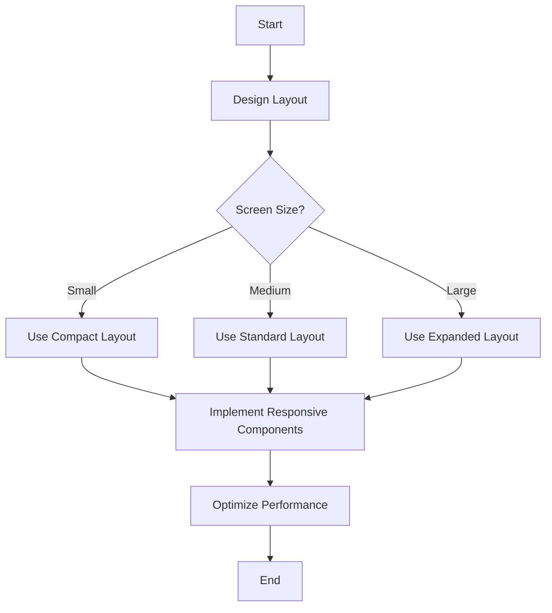

## 21.7 Designing Responsive User Interfaces

In today's digital landscape, creating responsive user interfaces (UIs) is crucial for delivering a seamless user experience across various devices and screen sizes. This section delves into the principles and practices of designing responsive UIs in Ruby applications, focusing on desktop and mobile environments. We'll explore layout management, adapting to different resolutions, handling high-DPI displays, and maintaining performance and accessibility.

### Principles of Responsive UI Design

Responsive UI design ensures that applications provide an optimal viewing experience, regardless of the device or screen size. The key principles include:

1. **Fluid Layouts**: Use flexible grids and layouts that adjust to the screen size.
2. **Adaptive Components**: Design UI components that can change their appearance and behavior based on the context.
3. **Consistency**: Maintain a consistent look and feel across different devices.
4. **Accessibility**: Ensure that the UI is usable by people with varying abilities.
5. **Performance**: Optimize the UI to remain responsive and fast.

### Using Layout Managers in GUI Toolkits

Layout managers are essential tools for creating flexible and adaptive UIs. They help manage the placement and sizing of UI components within a window. In Ruby, several GUI toolkits provide layout managers, such as Tk, GTK, and Shoes.

#### Example: Using Tk's Grid Layout

Tk is a popular GUI toolkit in Ruby that offers a grid layout manager. Here's a simple example of using Tk's grid layout to create a responsive UI:

```ruby
require 'tk'

root = TkRoot.new { title "Responsive UI Example" }

frame = TkFrame.new(root) { padx 15; pady 15 }.grid(sticky: 'nsew')

TkLabel.new(frame) { text 'Name:' }.grid(row: 0, column: 0, sticky: 'w')
TkEntry.new(frame).grid(row: 0, column: 1, sticky: 'ew')

TkLabel.new(frame) { text 'Email:' }.grid(row: 1, column: 0, sticky: 'w')
TkEntry.new(frame).grid(row: 1, column: 1, sticky: 'ew')

TkButton.new(frame) { text 'Submit' }.grid(row: 2, column: 0, columnspan: 2, sticky: 'ew')

TkGrid.columnconfigure(frame, 1, weight: 1)
TkGrid.rowconfigure(frame, 2, weight: 1)

Tk.mainloop
```

In this example, the grid layout manager is used to arrange labels, entries, and buttons. The `sticky` option ensures that components expand to fill available space, and `columnconfigure` and `rowconfigure` allow for resizing behavior.

### Adapting Layouts for Different Window Sizes

To create truly responsive applications, it's important to adapt layouts dynamically based on window size and resolution. This can be achieved by:

- **Using Relative Units**: Employ percentages or relative units for dimensions instead of fixed pixel values.
- **Media Queries**: Implement logic to adjust layouts based on specific conditions, such as window width.
- **Responsive Images**: Serve appropriately sized images based on the display resolution.

#### Example: Responsive Layout with Shoes

Shoes is another Ruby toolkit that simplifies creating responsive UIs. Here's an example of a responsive layout using Shoes:

```ruby
Shoes.app(title: "Responsive Shoes App", width: 400, height: 300) do
  stack(margin: 10) do
    para "Welcome to the Responsive Shoes App"
    flow do
      button "Button 1"
      button "Button 2"
    end
    flow do
      edit_line
      edit_line
    end
  end
end
```

In this example, the `stack` and `flow` containers help create a responsive layout that adjusts to the window size.

### Handling High-DPI Displays and Accessibility

High-DPI displays require special attention to ensure that UIs remain sharp and legible. Consider the following strategies:

- **Scalable Vector Graphics (SVG)**: Use SVGs for icons and graphics to maintain quality at any resolution.
- **Dynamic Scaling**: Adjust UI elements based on the DPI settings of the display.
- **Accessibility Features**: Implement features like keyboard navigation, screen reader support, and adjustable text sizes.

### Performance in the UI Thread

Performance is critical in UI design. A sluggish interface can frustrate users and degrade the overall experience. To keep interfaces responsive:

- **Minimize Blocking Operations**: Avoid long-running tasks on the UI thread. Use background threads or asynchronous operations.
- **Efficient Rendering**: Optimize rendering paths and reduce unnecessary redraws.
- **Lazy Loading**: Load resources and data only when needed.

### Design Patterns for Responsive UIs

Design patterns like Model-View-Controller (MVC) can help separate concerns and improve the maintainability of responsive UIs. By decoupling the UI from the business logic, you can create more flexible and testable applications.

#### Example: MVC Pattern in Ruby

```ruby
# Model
class User
  attr_accessor :name, :email

  def initialize(name, email)
    @name = name
    @email = email
  end
end

# View
class UserView
  def display(user)
    puts "Name: #{user.name}"
    puts "Email: #{user.email}"
  end
end

# Controller
class UserController
  def initialize(user, view)
    @user = user
    @view = view
  end

  def update_name(new_name)
    @user.name = new_name
    @view.display(@user)
  end
end

# Usage
user = User.new("Alice", "alice@example.com")
view = UserView.new
controller = UserController.new(user, view)

controller.update_name("Bob")
```

In this example, the MVC pattern is used to separate the user data (model), the display logic (view), and the control logic (controller).

### Try It Yourself

Experiment with the provided code examples by modifying layouts, adding new components, or changing styles. Try creating a responsive form with additional fields or implementing a new design pattern to manage UI state.

### Visualizing Responsive UI Design

To better understand the flow and structure of responsive UI design, let's visualize the process using a Mermaid.js diagram:



This flowchart illustrates the decision-making process in designing a responsive UI, from initial layout design to performance optimization.

### References and Further Reading

- [MDN Web Docs: Responsive Design](https://developer.mozilla.org/en-US/docs/Learn/CSS/CSS_layout/Responsive_Design)
- [W3Schools: Responsive Web Design](https://www.w3schools.com/css/css_rwd_intro.asp)
- [Ruby Tk Documentation](https://www.ruby-lang.org/en/documentation/)

### Knowledge Check

- What are the key principles of responsive UI design?
- How can layout managers help in creating flexible interfaces?
- What strategies can be used to handle high-DPI displays?
- Why is performance important in the UI thread?
- How does the MVC pattern contribute to responsive UI design?

### Embrace the Journey

Remember, designing responsive user interfaces is an ongoing journey. As you continue to build and refine your applications, keep experimenting with new techniques and patterns. Stay curious, and enjoy the process of creating user-friendly and adaptable interfaces.

## Quiz: Designing Responsive User Interfaces



### What is a key principle of responsive UI design?

- [x] Fluid Layouts
- [ ] Fixed Layouts
- [ ] Static Components
- [ ] Consistent Colors

> **Explanation:** Fluid layouts adjust to different screen sizes, making them a key principle of responsive UI design.

### Which Ruby GUI toolkit provides a grid layout manager?

- [x] Tk
- [ ] Shoes
- [ ] Rails
- [ ] Sinatra

> **Explanation:** Tk is a Ruby GUI toolkit that provides a grid layout manager for creating responsive UIs.

### What is the purpose of using relative units in UI design?

- [x] To adapt layouts to different screen sizes
- [ ] To fix the layout size
- [ ] To increase the complexity of the design
- [ ] To make the UI static

> **Explanation:** Relative units help adapt layouts to different screen sizes, ensuring responsiveness.

### How can high-DPI displays be handled in UI design?

- [x] Use Scalable Vector Graphics (SVG)
- [ ] Use only raster images
- [ ] Ignore DPI settings
- [ ] Fix the resolution

> **Explanation:** SVGs maintain quality at any resolution, making them suitable for high-DPI displays.

### Why is performance important in the UI thread?

- [x] To keep interfaces responsive
- [ ] To increase loading times
- [ ] To make the UI complex
- [ ] To reduce user interaction

> **Explanation:** Performance in the UI thread is crucial to keep interfaces responsive and fast.

### What design pattern helps separate concerns in UI design?

- [x] Model-View-Controller (MVC)
- [ ] Singleton
- [ ] Factory
- [ ] Observer

> **Explanation:** The MVC pattern helps separate concerns, improving maintainability and flexibility in UI design.

### What is a benefit of using layout managers in GUI toolkits?

- [x] They help manage the placement and sizing of UI components
- [ ] They make the UI static
- [ ] They increase the complexity of the design
- [ ] They fix the layout size

> **Explanation:** Layout managers help manage the placement and sizing of UI components, aiding in responsive design.

### What is a strategy to optimize performance in the UI thread?

- [x] Minimize Blocking Operations
- [ ] Increase the number of threads
- [ ] Use only synchronous operations
- [ ] Ignore performance

> **Explanation:** Minimizing blocking operations helps keep the UI thread responsive and fast.

### How can accessibility be ensured in UI design?

- [x] Implement keyboard navigation and screen reader support
- [ ] Use only mouse interactions
- [ ] Ignore accessibility settings
- [ ] Fix text sizes

> **Explanation:** Implementing keyboard navigation and screen reader support ensures accessibility in UI design.

### True or False: The MVC pattern is used to couple the UI with business logic.

- [ ] True
- [x] False

> **Explanation:** The MVC pattern is used to decouple the UI from business logic, improving maintainability.


