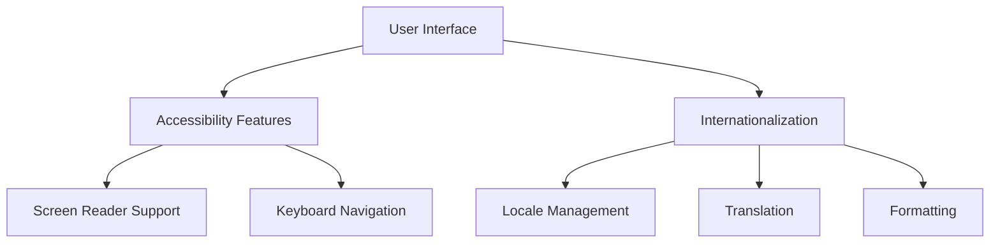

## 21.8 Accessibility and Internationalization

In today's global and diverse digital landscape, ensuring that your applications are accessible and internationalized is not just a best practice—it's a necessity. This section will guide you through the essential concepts and practical implementations of accessibility and internationalization in Ruby desktop and mobile applications.

### Importance of Accessibility in Software Applications

Accessibility ensures that your software can be used by as many people as possible, including those with disabilities. This is not only a moral and ethical obligation but also a legal requirement in many jurisdictions. By making your applications accessible, you open them up to a broader audience and improve the user experience for everyone.

#### Key Accessibility Features

1. **Screen Reader Support**: Ensure that your application can be navigated and understood by screen readers, which are essential for visually impaired users.
2. **Keyboard Navigation**: Allow users to navigate your application using only the keyboard, which is crucial for those who cannot use a mouse.
3. **Color Contrast and Text Size**: Use high contrast colors and adjustable text sizes to aid users with visual impairments.
4. **Alternative Text for Images**: Provide descriptive text for images to convey information to users who cannot see them.

### Implementing Accessibility Features Using GUI Toolkits

When developing desktop applications in Ruby, you might use GUI toolkits like Tk, GTK, or Shoes. These toolkits offer various features to help you implement accessibility.

#### Example: Implementing Keyboard Navigation with Tk

```ruby
require 'tk'

root = TkRoot.new { title "Accessible Application" }

TkLabel.new(root) do
  text 'Press Tab to navigate'
  pack { padx 15; pady 15; side 'left' }
end

TkButton.new(root) do
  text 'Button 1'
  pack { padx 15; pady 15; side 'left' }
end

TkButton.new(root) do
  text 'Button 2'
  pack { padx 15; pady 15; side 'left' }
end

Tk.mainloop
```

In this example, we create a simple Tk application with two buttons. Users can navigate between the buttons using the Tab key, enhancing keyboard accessibility.

#### Best Practices for Designing Accessible Interfaces

- **Use Semantic Elements**: Leverage semantic UI elements that inherently support accessibility.
- **Provide Feedback**: Ensure that all interactions provide feedback, such as focus indicators for keyboard navigation.
- **Test with Assistive Technologies**: Regularly test your application with screen readers and other assistive technologies to ensure compatibility.

### Introduction to Internationalization (i18n) and Localization (l10n)

Internationalization (i18n) is the process of designing your application so that it can be easily adapted to various languages and regions without engineering changes. Localization (l10n) is the adaptation of your application to a specific locale, including language translation and regional formatting.

#### Key Concepts

- **Locale**: A set of parameters that defines the user's language, region, and any special variant preferences.
- **Translation**: Converting text from one language to another.
- **Formatting**: Adjusting date, time, and currency formats to match local conventions.

### Using Libraries for Managing Translations

Ruby offers several libraries to help manage translations, with `gettext` being one of the most popular.

#### Example: Using `gettext` for Translations

First, install the `gettext` gem:

```bash
gem install gettext
```

Then, use it in your Ruby application:

```ruby
require 'gettext'
include GetText

bindtextdomain("myapp", path: "locale")

puts _("Hello, World!")
```

In this example, the `_("Hello, World!")` function call will retrieve the translated string for the current locale.

### Handling Date, Time, and Currency Formats

Handling different formats for dates, times, and currencies is crucial for localization. Ruby's `I18n` library provides robust support for these tasks.

#### Example: Formatting Dates and Times

```ruby
require 'i18n'

I18n.load_path << Dir['config/locales/*.yml']
I18n.default_locale = :en

puts I18n.l(Time.now, format: :short)
```

In this example, we load locale files and format the current time according to the user's locale.

### Testing Strategies for Accessibility and Internationalization

Testing is a critical component of both accessibility and internationalization.

#### Accessibility Testing

- **Automated Tools**: Use tools like Axe or Lighthouse to automatically check for accessibility issues.
- **Manual Testing**: Conduct manual testing with assistive technologies to ensure real-world usability.

#### Internationalization Testing

- **Locale Switching**: Test your application in different locales to ensure that translations and formats are applied correctly.
- **Content Overflow**: Check for UI issues caused by text expansion in different languages.

### Visualizing Accessibility and Internationalization

To better understand the flow of accessibility and internationalization in your application, consider the following diagram:



This diagram illustrates how the user interface connects to both accessibility features and internationalization processes.

### Conclusion

By prioritizing accessibility and internationalization in your Ruby applications, you ensure that your software is inclusive and ready for a global audience. Remember, accessibility and internationalization are not just features—they are fundamental aspects of modern software development.

### Try It Yourself

Experiment with the provided code examples by modifying them to include additional accessibility features or support for more languages. Consider adding more buttons to the Tk example or translating additional strings with `gettext`.

## Quiz: Accessibility and Internationalization



### What is the primary goal of accessibility in software applications?

- [x] To ensure that applications can be used by as many people as possible, including those with disabilities.
- [ ] To make applications look more visually appealing.
- [ ] To increase the speed of application performance.
- [ ] To reduce the cost of software development.

> **Explanation:** Accessibility aims to make applications usable by everyone, including people with disabilities, ensuring inclusivity.

### Which GUI toolkit is used in the provided Ruby example for implementing keyboard navigation?

- [x] Tk
- [ ] GTK
- [ ] Shoes
- [ ] Qt

> **Explanation:** The example uses the Tk toolkit to demonstrate keyboard navigation in a Ruby application.

### What does the acronym i18n stand for?

- [x] Internationalization
- [ ] Integration
- [ ] Innovation
- [ ] Interaction

> **Explanation:** i18n is a common abbreviation for internationalization, where the number 18 represents the number of letters between 'i' and 'n'.

### Which Ruby library is commonly used for managing translations?

- [x] gettext
- [ ] nokogiri
- [ ] rails
- [ ] sinatra

> **Explanation:** The `gettext` library is widely used in Ruby for managing translations and supporting internationalization.

### What is the purpose of localization (l10n)?

- [x] To adapt an application to a specific locale, including language translation and regional formatting.
- [ ] To improve the application's performance.
- [ ] To enhance the application's security.
- [ ] To reduce the application's size.

> **Explanation:** Localization involves adapting an application to meet the language and cultural needs of a specific locale.

### Which of the following is a best practice for designing accessible interfaces?

- [x] Use semantic elements and provide feedback for interactions.
- [ ] Use only images for navigation.
- [ ] Avoid using keyboard shortcuts.
- [ ] Use low contrast colors.

> **Explanation:** Using semantic elements and providing feedback are best practices for designing accessible interfaces.

### How can you test the accessibility of your application?

- [x] Use automated tools and conduct manual testing with assistive technologies.
- [ ] Only rely on user feedback.
- [ ] Test only on the latest devices.
- [ ] Ignore accessibility testing.

> **Explanation:** Combining automated tools with manual testing using assistive technologies ensures comprehensive accessibility testing.

### What is the role of the `I18n` library in Ruby?

- [x] To provide support for internationalization, including translations and formatting.
- [ ] To manage database connections.
- [ ] To handle HTTP requests.
- [ ] To perform mathematical calculations.

> **Explanation:** The `I18n` library in Ruby is used for internationalization, managing translations, and formatting according to locale.

### What should you test when switching locales in your application?

- [x] Ensure translations and formats are applied correctly.
- [ ] Only test the default language.
- [ ] Ignore content overflow issues.
- [ ] Test only on desktop devices.

> **Explanation:** When switching locales, it's important to test that translations and formats are applied correctly and check for content overflow issues.

### True or False: Accessibility and internationalization are optional features in modern software development.

- [ ] True
- [x] False

> **Explanation:** Accessibility and internationalization are essential features in modern software development, ensuring inclusivity and global readiness.



Remember, this is just the beginning. As you progress, you'll build more complex and interactive applications. Keep experimenting, stay curious, and enjoy the journey!
