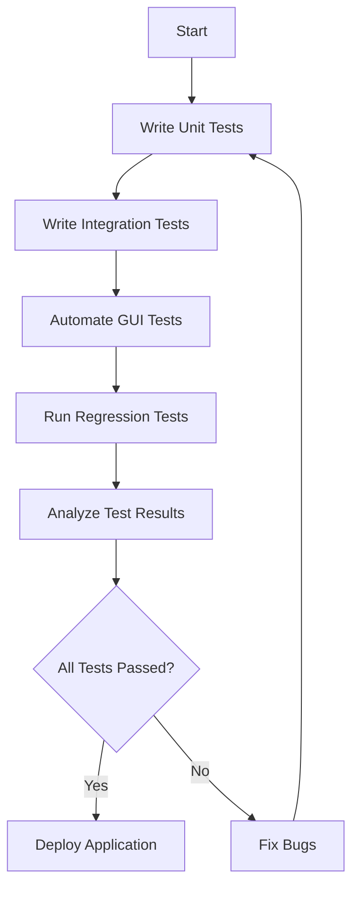

## 21.9 Testing Desktop and Mobile Applications

Testing desktop and mobile applications is a critical aspect of software development that ensures applications function correctly and provide a seamless user experience. In this section, we will explore the challenges of testing GUI applications, introduce suitable testing frameworks, and discuss automated testing tools. We will also provide examples of writing tests for user interactions and emphasize the importance of regression testing.

### Challenges of Testing GUI Applications

Testing GUI (Graphical User Interface) applications presents unique challenges compared to testing other types of software. These challenges include:

- **Complexity of User Interactions**: GUIs involve a wide range of user interactions, such as clicking buttons, entering text, and navigating menus. Testing these interactions requires simulating user behavior accurately.
- **Dynamic Content**: GUIs often display dynamic content that changes based on user actions or external data. Testing must account for these variations.
- **Cross-Platform Compatibility**: Desktop and mobile applications may need to run on multiple operating systems and devices, requiring tests to ensure consistent behavior across platforms.
- **Visual Layout and Design**: Ensuring that the visual layout and design of the application meet specifications and provide a good user experience is crucial.

### Testing Frameworks for Desktop Applications

Ruby offers several testing frameworks that can be used to test desktop applications. Two popular frameworks are RSpec and Test::Unit.

#### RSpec

RSpec is a behavior-driven development (BDD) framework for Ruby that provides a readable syntax for writing tests. It is widely used for testing Ruby applications, including desktop applications.

```ruby
# Example of a simple RSpec test
require 'rspec'

describe 'Calculator' do
  it 'adds two numbers' do
    expect(2 + 2).to eq(4)
  end
end
```

#### Test::Unit

Test::Unit is a unit testing framework that is part of Ruby's standard library. It provides a simple way to write and run tests.

```ruby
# Example of a simple Test::Unit test
require 'test/unit'

class TestCalculator < Test::Unit::TestCase
  def test_addition
    assert_equal(4, 2 + 2)
  end
end
```

### Performing Unit Tests on Application Logic

To effectively test desktop applications, it is important to separate application logic from the UI. This separation allows for unit testing of the logic independently from the GUI, making tests more reliable and easier to maintain.

```ruby
# Example of separating logic from UI
class Calculator
  def add(a, b)
    a + b
  end
end

# Unit test for Calculator logic
require 'rspec'

describe Calculator do
  it 'adds two numbers' do
    calculator = Calculator.new
    expect(calculator.add(2, 3)).to eq(5)
  end
end
```

### Automated GUI Testing Tools

Automated GUI testing tools can simulate user interactions and verify that the application behaves as expected. Some popular tools include Fusuma and Sikuli.

#### Fusuma

Fusuma is a Ruby gem that allows for gesture recognition on touchpads. While primarily used for gesture-based applications, it can be integrated into testing workflows to simulate user gestures.

#### Sikuli

Sikuli is a tool that uses image recognition to automate GUI interactions. It can be used to test desktop applications by simulating user actions based on visual elements.

```ruby
# Example of using Sikuli for GUI testing
# Note: This is a conceptual example; actual Sikuli scripts are written in Jython or Java.
# sikuli_script.sikuli
click("button.png")  # Clicks on a button identified by an image
type("Hello, World!")  # Types text into a text field
```

### Writing Tests for User Interactions

When writing tests for user interactions, it is important to simulate real user behavior and verify the application's response. This can include testing button clicks, form submissions, and navigation flows.

```ruby
# Example of testing a button click
require 'rspec'
require 'capybara/rspec'

feature 'User interacts with the application' do
  scenario 'User clicks a button' do
    visit '/home'
    click_button 'Submit'
    expect(page).to have_content('Submission successful')
  end
end
```

### Importance of Regression Testing

Regression testing ensures that new changes do not introduce bugs into existing functionality. It is crucial for maintaining the stability of desktop and mobile applications as they evolve.

- **Automate Regression Tests**: Use automated testing tools to run regression tests regularly, especially after code changes.
- **Maintain a Comprehensive Test Suite**: Ensure that your test suite covers all critical paths and user interactions.

### Visualizing Testing Workflows

To better understand the testing process, let's visualize a typical testing workflow using a flowchart.



### References and Further Reading

- [RSpec Documentation](https://rspec.info/documentation/)
- [Test::Unit Documentation](https://ruby-doc.org/stdlib-2.6.1/libdoc/test/unit/rdoc/Test/Unit.html)
- [SikuliX Documentation](http://sikulix.com/)
- [Capybara Documentation](https://teamcapybara.github.io/capybara/)

### Knowledge Check

- What are the main challenges of testing GUI applications?
- How can you separate application logic from the UI for testing purposes?
- What are some tools you can use for automated GUI testing?

### Embrace the Journey

Testing desktop and mobile applications is an ongoing process that requires attention to detail and a commitment to quality. Remember, this is just the beginning. As you progress, you'll build more complex and interactive applications. Keep experimenting, stay curious, and enjoy the journey!

## Quiz: Testing Desktop and Mobile Applications



### What is a key challenge of testing GUI applications?

- [x] Complexity of user interactions
- [ ] Lack of testing frameworks
- [ ] Inability to automate tests
- [ ] Limited platform support

> **Explanation:** GUI applications involve complex user interactions that must be accurately simulated during testing.

### Which Ruby framework is commonly used for behavior-driven development?

- [x] RSpec
- [ ] Test::Unit
- [ ] Minitest
- [ ] Cucumber

> **Explanation:** RSpec is a popular behavior-driven development framework for Ruby.

### What is the purpose of regression testing?

- [x] To ensure new changes do not introduce bugs
- [ ] To test only new features
- [ ] To test performance
- [ ] To test security vulnerabilities

> **Explanation:** Regression testing ensures that new changes do not negatively impact existing functionality.

### Which tool uses image recognition for GUI testing?

- [x] Sikuli
- [ ] Fusuma
- [ ] Capybara
- [ ] RSpec

> **Explanation:** Sikuli uses image recognition to automate GUI interactions.

### What is the benefit of separating application logic from the UI?

- [x] Easier unit testing
- [ ] Faster application performance
- [ ] Improved security
- [ ] Better user experience

> **Explanation:** Separating logic from the UI allows for easier unit testing of the application's functionality.

### What is Fusuma primarily used for?

- [x] Gesture recognition on touchpads
- [ ] Image recognition
- [ ] Security testing
- [ ] Performance optimization

> **Explanation:** Fusuma is used for gesture recognition on touchpads, which can be integrated into testing workflows.

### What is a common practice in regression testing?

- [x] Automating tests
- [ ] Manual testing only
- [ ] Testing only new features
- [ ] Ignoring existing functionality

> **Explanation:** Automating tests is a common practice in regression testing to ensure consistency and efficiency.

### What does Capybara help with in testing?

- [x] Simulating user interactions
- [ ] Performance testing
- [ ] Security testing
- [ ] Image recognition

> **Explanation:** Capybara helps simulate user interactions in web applications.

### Which of the following is a benefit of automated GUI testing?

- [x] Consistent test execution
- [ ] Reduced test coverage
- [ ] Increased manual effort
- [ ] Slower test execution

> **Explanation:** Automated GUI testing provides consistent test execution, reducing the chance of human error.

### True or False: Regression testing is only necessary for major releases.

- [ ] True
- [x] False

> **Explanation:** Regression testing is necessary for all releases to ensure that changes do not introduce new bugs.


