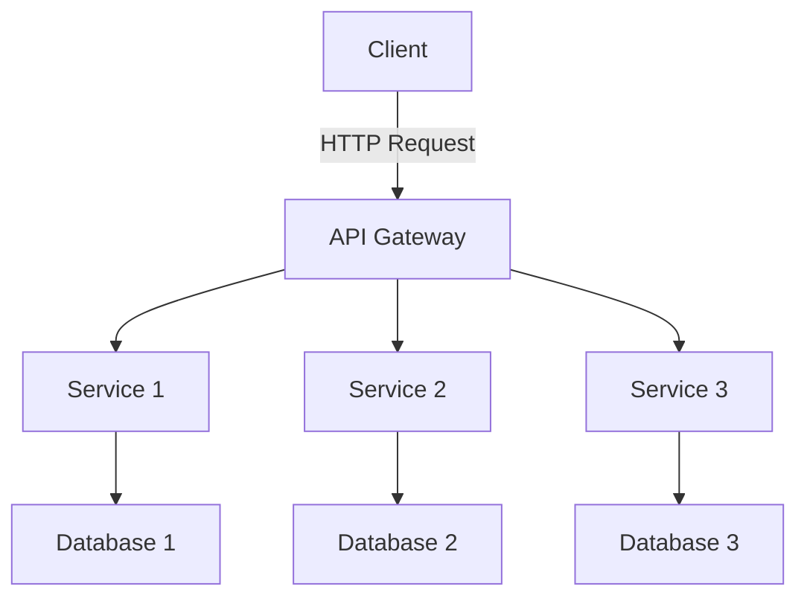

## 22.1 Introduction to Microservices Architecture

In the ever-evolving landscape of software development, microservices architecture has emerged as a powerful paradigm for building scalable and maintainable applications. This approach breaks down complex applications into smaller, independent services that communicate over a network, offering numerous benefits over traditional monolithic architectures. In this section, we will explore the core principles of microservices, their advantages and challenges, and provide guidance on when to adopt this architectural style.

### What is Microservices Architecture?

Microservices architecture is a design approach where an application is composed of multiple small, autonomous services, each responsible for a specific business capability. These services are independently deployable and communicate with each other through well-defined APIs, typically over HTTP or messaging protocols.

#### Core Principles of Microservices

1. **Single Responsibility**: Each microservice is designed to perform a specific function or business capability, adhering to the single responsibility principle.

2. **Independence**: Microservices are independently deployable and scalable, allowing teams to develop, test, and deploy services without affecting others.

3. **Decentralized Governance**: Microservices promote decentralized data management and decision-making, enabling teams to choose the best tools and technologies for their specific needs.

4. **Resilience**: Microservices are designed to handle failures gracefully, with mechanisms for fault tolerance and recovery.

5. **Automation**: Continuous integration and deployment (CI/CD) pipelines are essential for managing the lifecycle of microservices, ensuring rapid and reliable delivery.

### Benefits of Microservices

Microservices architecture offers several advantages that make it an attractive choice for modern software development:

- **Scalability**: Services can be scaled independently based on demand, optimizing resource utilization and performance.

- **Flexibility**: Teams can use different technologies and frameworks for each service, allowing for innovation and experimentation.

- **Faster Time to Market**: Independent deployments enable faster release cycles and quicker response to market changes.

- **Improved Fault Isolation**: Failures in one service do not impact the entire application, enhancing overall system reliability.

- **Enhanced Team Autonomy**: Smaller, cross-functional teams can own and manage individual services, fostering a culture of ownership and accountability.

### Contrasting Microservices with Monolithic Architectures

In a monolithic architecture, all components of an application are tightly coupled and deployed as a single unit. While this approach simplifies development and deployment initially, it can lead to several challenges as the application grows:

- **Limited Scalability**: Scaling a monolithic application requires scaling the entire system, which can be inefficient and costly.

- **Tight Coupling**: Changes in one part of the application can have unintended consequences elsewhere, increasing the risk of errors.

- **Slower Development Cycles**: Large codebases can slow down development and testing, leading to longer release cycles.

- **Difficult Maintenance**: As the application grows, maintaining and updating a monolithic system becomes increasingly complex.

Microservices address these challenges by decoupling application components, allowing for independent development, deployment, and scaling.

### Challenges of Microservices

Despite their benefits, microservices also introduce new complexities and challenges:

- **Increased Complexity**: Managing multiple services requires robust orchestration and coordination, increasing the complexity of the system.

- **Distributed System Issues**: Network latency, data consistency, and fault tolerance become critical concerns in a distributed architecture.

- **Operational Overhead**: Monitoring, logging, and managing numerous services can be resource-intensive and require sophisticated tooling.

- **Data Management**: Ensuring data consistency and integrity across services can be challenging, especially in distributed transactions.

### When to Choose Microservices

Microservices are not a one-size-fits-all solution. Consider adopting a microservices architecture when:

- **Scalability is a Priority**: If your application needs to handle varying loads and scale efficiently, microservices can provide the flexibility you need.

- **Rapid Development and Deployment**: If you require frequent updates and quick releases, microservices can enable faster development cycles.

- **Complex Business Domains**: For applications with diverse and complex business requirements, microservices allow for modular design and independent evolution.

- **Team Structure**: If your organization has multiple, autonomous teams, microservices can align with your development processes and enhance collaboration.

### Code Example: A Simple Microservice in Ruby

Let's explore a basic example of a microservice in Ruby using the Sinatra framework. This service provides a simple API for managing a list of tasks.

```ruby
# app.rb
require 'sinatra'
require 'json'

# In-memory storage for tasks
tasks = []

# Get all tasks
get '/tasks' do
  content_type :json
  tasks.to_json
end

# Add a new task
post '/tasks' do
  content_type :json
  task = JSON.parse(request.body.read)
  tasks << task
  status 201
  task.to_json
end

# Delete a task by index
delete '/tasks/:index' do
  index = params[:index].to_i
  if tasks[index]
    tasks.delete_at(index)
    status 204
  else
    status 404
  end
end
```

This simple microservice allows clients to retrieve, add, and delete tasks. Each endpoint is responsible for a specific operation, demonstrating the single responsibility principle.

### Visualizing Microservices Architecture

To better understand the structure and flow of a microservices architecture, let's visualize a typical setup using Mermaid.js.



**Diagram Description**: This diagram illustrates a basic microservices architecture where a client interacts with an API Gateway. The gateway routes requests to various services, each with its own database, highlighting the independence and decoupling of services.

### Key Takeaways

- Microservices architecture offers scalability, flexibility, and resilience, making it suitable for complex and dynamic applications.
- While microservices provide numerous benefits, they also introduce challenges such as increased complexity and operational overhead.
- Choosing microservices should be based on specific business needs, team structure, and technical requirements.

### Embrace the Journey

Remember, transitioning to a microservices architecture is a journey. It requires careful planning, a solid understanding of distributed systems, and a commitment to continuous improvement. As you explore this architectural style, keep experimenting, stay curious, and enjoy the process of building scalable and maintainable applications.

## Quiz: Introduction to Microservices Architecture



### What is a core principle of microservices architecture?

- [x] Single Responsibility
- [ ] Tight Coupling
- [ ] Centralized Governance
- [ ] Monolithic Deployment

> **Explanation:** Microservices adhere to the single responsibility principle, where each service is designed to perform a specific function or business capability.

### Which of the following is a benefit of microservices?

- [x] Scalability
- [ ] Increased Complexity
- [ ] Tight Coupling
- [ ] Slower Development Cycles

> **Explanation:** Microservices offer scalability by allowing services to be scaled independently based on demand.

### What is a challenge associated with microservices?

- [x] Distributed System Issues
- [ ] Improved Fault Isolation
- [ ] Faster Time to Market
- [ ] Enhanced Team Autonomy

> **Explanation:** Microservices introduce distributed system issues such as network latency and data consistency challenges.

### How do microservices differ from monolithic architectures?

- [x] Microservices are independently deployable.
- [ ] Microservices are tightly coupled.
- [ ] Microservices require scaling the entire system.
- [ ] Microservices have slower release cycles.

> **Explanation:** Microservices are independently deployable, allowing for more flexible and efficient scaling and deployment.

### When should you consider adopting a microservices architecture?

- [x] When scalability is a priority
- [ ] When you have a small, simple application
- [x] When you require rapid development and deployment
- [ ] When you want to maintain a tightly coupled system

> **Explanation:** Microservices are ideal for applications that need to scale efficiently and require frequent updates and quick releases.

### What is a common tool used for managing microservices?

- [x] API Gateway
- [ ] Monolithic Server
- [ ] Centralized Database
- [ ] Single Deployment Pipeline

> **Explanation:** An API Gateway is commonly used to manage and route requests to various microservices.

### Which of the following is NOT a benefit of microservices?

- [ ] Flexibility
- [x] Increased Complexity
- [ ] Faster Time to Market
- [ ] Improved Fault Isolation

> **Explanation:** While microservices offer many benefits, they also introduce increased complexity in managing multiple services.

### What is a key feature of microservices?

- [x] Decentralized Governance
- [ ] Centralized Data Management
- [ ] Single Deployment Unit
- [ ] Tight Coupling

> **Explanation:** Microservices promote decentralized governance, allowing teams to choose the best tools and technologies for their specific needs.

### What is a typical communication method between microservices?

- [x] HTTP or Messaging Protocols
- [ ] Direct Database Access
- [ ] Shared Memory
- [ ] File System

> **Explanation:** Microservices typically communicate over HTTP or messaging protocols, ensuring loose coupling and flexibility.

### True or False: Microservices architecture is suitable for all types of applications.

- [ ] True
- [x] False

> **Explanation:** Microservices architecture is not suitable for all applications. It is best suited for complex, scalable applications with specific business needs and team structures.


