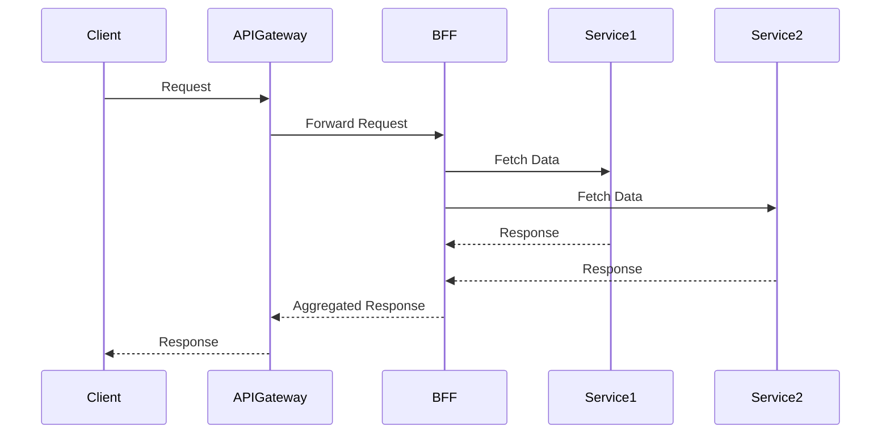

## 22.11 API Gateway and Backend for Frontend (BFF) Patterns

In the evolving landscape of software architecture, microservices have emerged as a popular approach to building scalable and maintainable applications. Within this architecture, API Gateways and Backend for Frontend (BFF) patterns play crucial roles in managing communication between clients and services. In this section, we will delve into these patterns, exploring their purposes, benefits, and implementation strategies in Ruby applications.

### Understanding API Gateways

An API Gateway acts as a single entry point for client requests, routing them to the appropriate microservices. It abstracts the complexity of the microservices architecture from the client, providing a unified interface. This pattern is essential in managing cross-cutting concerns such as authentication, rate limiting, and logging.

#### Responsibilities of an API Gateway

1. **Request Routing**: Directs client requests to the appropriate microservice based on the request path or other criteria.
2. **Authentication and Authorization**: Validates client credentials and ensures that requests have the necessary permissions.
3. **Rate Limiting**: Controls the number of requests a client can make in a given time period to prevent abuse.
4. **Caching**: Stores responses temporarily to reduce load on microservices and improve response times.
5. **Load Balancing**: Distributes incoming requests across multiple instances of a service to ensure even load distribution.
6. **Logging and Monitoring**: Captures request and response data for analysis and troubleshooting.

#### Implementing an API Gateway

API Gateways can be implemented using various tools and frameworks. One popular choice is [Kong](https://konghq.com/), an open-source API Gateway that provides a wide range of features out of the box. Alternatively, you can build a custom API Gateway in Ruby using frameworks like Sinatra or Rails.

##### Example: Building a Simple API Gateway in Ruby

```ruby
require 'sinatra'
require 'net/http'

class APIGateway < Sinatra::Base
  before do
    authenticate_request
  end

  get '/service1/*' do
    forward_request('http://service1.example.com', request.path_info)
  end

  get '/service2/*' do
    forward_request('http://service2.example.com', request.path_info)
  end

  private

  def authenticate_request
    # Implement authentication logic here
    halt 401, 'Unauthorized' unless request.env['HTTP_AUTHORIZATION']
  end

  def forward_request(service_url, path)
    uri = URI("#{service_url}#{path}")
    response = Net::HTTP.get_response(uri)
    status response.code.to_i
    body response.body
  end
end

APIGateway.run!
```

In this example, we use Sinatra to create a simple API Gateway that forwards requests to different services based on the request path. The `authenticate_request` method checks for an authorization header, and the `forward_request` method forwards the request to the appropriate service.

### Backend for Frontend (BFF) Pattern

The Backend for Frontend (BFF) pattern involves creating separate backend services tailored to the needs of specific frontend applications. This pattern addresses the limitations of a one-size-fits-all API by providing optimized endpoints for each client type, such as web, mobile, or IoT devices.

#### Benefits of the BFF Pattern

1. **Optimized APIs**: Tailor APIs to the specific needs of each client, reducing data transfer and processing on the client side.
2. **Simplified Frontend Development**: Provide frontend developers with a clear and consistent API, reducing the complexity of integrating with multiple services.
3. **Decoupled Frontend and Backend**: Allow frontend and backend teams to work independently, enabling faster development cycles.
4. **Improved Performance**: Reduce the amount of data sent over the network and minimize client-side processing.

#### Implementing the BFF Pattern

To implement the BFF pattern, create separate backend services for each client type. These services can aggregate data from multiple microservices and provide a unified response to the client.

##### Example: Implementing a BFF in Ruby

```ruby
require 'sinatra'
require 'json'
require 'net/http'

class MobileBFF < Sinatra::Base
  get '/user_profile' do
    user_data = fetch_user_data
    activity_data = fetch_user_activity
    content_type :json
    { user: user_data, activity: activity_data }.to_json
  end

  private

  def fetch_user_data
    uri = URI('http://user-service.example.com/user')
    response = Net::HTTP.get_response(uri)
    JSON.parse(response.body)
  end

  def fetch_user_activity
    uri = URI('http://activity-service.example.com/activity')
    response = Net::HTTP.get_response(uri)
    JSON.parse(response.body)
  end
end

MobileBFF.run!
```

In this example, we create a BFF for a mobile application using Sinatra. The BFF aggregates data from a user service and an activity service, providing a single endpoint for the mobile client to retrieve user profile information.

### Benefits and Considerations

Both API Gateway and BFF patterns offer significant benefits in a microservices architecture, but they also come with considerations.

#### Benefits

- **Scalability**: By offloading cross-cutting concerns to the API Gateway, microservices can focus on their core functionality, improving scalability.
- **Security**: Centralizing authentication and authorization in the API Gateway enhances security by providing a single point of control.
- **Flexibility**: The BFF pattern allows for flexible API design, enabling rapid adaptation to changing client requirements.

#### Considerations

- **Complexity**: Introducing an API Gateway and BFF services adds complexity to the architecture, requiring careful design and management.
- **Performance**: The additional network hop introduced by the API Gateway can impact performance. Mitigation strategies include caching and optimizing request routing.
- **Maintenance**: Maintaining multiple BFF services can increase the maintenance burden, especially if client requirements change frequently.

### Potential Performance Impacts and Mitigation Strategies

While API Gateways and BFF patterns provide numerous benefits, they can also introduce performance challenges. Here are some strategies to mitigate potential impacts:

1. **Caching**: Implement caching at the API Gateway to reduce the load on backend services and improve response times.
2. **Load Balancing**: Use load balancing to distribute requests evenly across service instances, preventing bottlenecks.
3. **Asynchronous Processing**: Offload long-running tasks to background jobs or message queues to improve responsiveness.
4. **Monitoring and Optimization**: Continuously monitor performance metrics and optimize service interactions to minimize latency.

### Visualizing API Gateway and BFF Patterns

To better understand the architecture, let's visualize the interaction between clients, the API Gateway, and BFF services using a sequence diagram.



In this diagram, the client sends a request to the API Gateway, which forwards it to the appropriate BFF service. The BFF service fetches data from multiple backend services, aggregates the responses, and sends the aggregated response back to the client via the API Gateway.

### Conclusion

API Gateway and Backend for Frontend (BFF) patterns are powerful tools in the microservices architecture toolkit. They provide a structured approach to managing client-service interactions, enhancing scalability, security, and flexibility. By understanding and implementing these patterns, you can build robust and maintainable Ruby applications that meet the diverse needs of modern clients.

Remember, this is just the beginning. As you progress, you'll build more complex and interactive systems. Keep experimenting, stay curious, and enjoy the journey!

## Quiz: API Gateway and Backend for Frontend (BFF) Patterns



### What is the primary role of an API Gateway in a microservices architecture?

- [x] To act as a single entry point for client requests
- [ ] To store data for microservices
- [ ] To replace microservices
- [ ] To handle database transactions

> **Explanation:** An API Gateway acts as a single entry point for client requests, routing them to the appropriate microservices.

### Which of the following is a responsibility of an API Gateway?

- [x] Request routing
- [x] Authentication and authorization
- [ ] Data storage
- [ ] User interface rendering

> **Explanation:** An API Gateway is responsible for request routing and authentication, among other cross-cutting concerns.

### What is the Backend for Frontend (BFF) pattern designed to do?

- [x] Tailor backend services for specific client needs
- [ ] Replace frontend applications
- [ ] Store frontend data
- [ ] Handle database transactions

> **Explanation:** The BFF pattern is designed to tailor backend services to meet the specific needs of different frontend applications.

### Which tool is commonly used to implement an API Gateway?

- [x] Kong
- [ ] Rails
- [ ] PostgreSQL
- [ ] Redis

> **Explanation:** Kong is a popular tool used to implement API Gateways.

### What is a potential performance impact of using an API Gateway?

- [x] Additional network hop
- [ ] Reduced security
- [ ] Increased data storage
- [ ] Simplified architecture

> **Explanation:** The additional network hop introduced by the API Gateway can impact performance.

### How can caching help mitigate performance impacts in an API Gateway?

- [x] By reducing the load on backend services
- [ ] By increasing the number of requests
- [ ] By storing more data
- [ ] By simplifying the architecture

> **Explanation:** Caching can reduce the load on backend services and improve response times.

### What is a benefit of using the BFF pattern?

- [x] Optimized APIs for specific clients
- [ ] Increased data storage
- [ ] Simplified backend services
- [ ] Reduced security

> **Explanation:** The BFF pattern allows for optimized APIs tailored to specific client needs.

### Which of the following is a consideration when using API Gateway and BFF patterns?

- [x] Increased complexity
- [ ] Reduced flexibility
- [ ] Simplified architecture
- [ ] Decreased scalability

> **Explanation:** Introducing an API Gateway and BFF services adds complexity to the architecture.

### What is a strategy to improve performance in an API Gateway?

- [x] Load balancing
- [ ] Data duplication
- [ ] User interface rendering
- [ ] Database transactions

> **Explanation:** Load balancing helps distribute requests evenly across service instances, improving performance.

### True or False: The BFF pattern allows frontend and backend teams to work independently.

- [x] True
- [ ] False

> **Explanation:** The BFF pattern decouples frontend and backend development, allowing teams to work independently.




