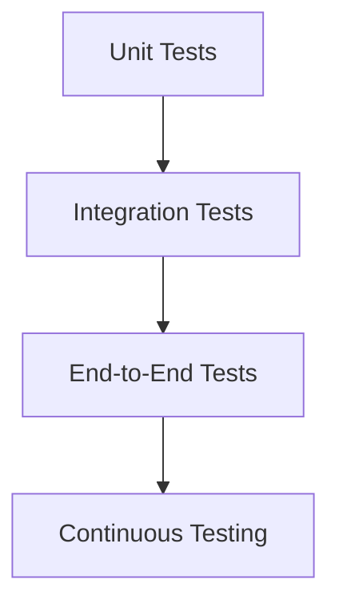

## 22.12 Microservices Testing Strategies

In the world of microservices, testing becomes a critical component to ensure the reliability and correctness of distributed systems. Unlike monolithic applications, microservices architecture involves multiple independent services that communicate over a network, making testing more complex. In this section, we will explore various testing strategies, including unit tests, integration tests, and end-to-end tests, to ensure that your microservices are robust and reliable.

### Understanding the Testing Pyramid

The testing pyramid is a concept that helps developers understand the different levels of testing required for a software application. It is particularly useful in the context of microservices, where the complexity of interactions between services can lead to potential issues if not properly tested.

#### The Layers of the Testing Pyramid

1. **Unit Tests**: These are the foundation of the testing pyramid. Unit tests focus on testing individual components or functions in isolation. In microservices, this means testing the smallest units of functionality within a service.

2. **Integration Tests**: These tests focus on the interactions between different components or services. In a microservices architecture, integration tests ensure that services can communicate and work together as expected.

3. **End-to-End Tests**: At the top of the pyramid, end-to-end tests verify that the entire system works as a whole. These tests simulate real-world scenarios to ensure that all services interact correctly and deliver the expected outcomes.

### Importance of Contract Testing

In a microservices architecture, services often depend on each other to function correctly. Contract testing is a strategy that ensures that these dependencies are reliable and that services can communicate effectively.

#### What is Contract Testing?

Contract testing verifies that the interactions between services adhere to a predefined contract. This contract defines the expectations of how services should interact, including the request and response formats.

#### Consumer-Driven Contract Testing with Pact

[Pact](https://pact.io/) is a popular tool for implementing consumer-driven contract testing. It allows service consumers to define the expected interactions with a service provider, and then verifies that the provider meets these expectations.

```ruby
# Example of a Pact test in Ruby

require 'pact/consumer/rspec'

Pact.service_consumer "Consumer" do
  has_pact_with "Provider" do
    mock_service :provider do
      port 1234
    end
  end
end

describe "Pact with Provider" do
  before do
    provider
      .given("a specific state")
      .upon_receiving("a request for data")
      .with(method: :get, path: '/data')
      .will_respond_with(status: 200, body: { key: 'value' })
  end

  it "can retrieve data" do
    response = Net::HTTP.get(URI('http://localhost:1234/data'))
    expect(response).to eq({ key: 'value' }.to_json)
  end
end
```

In this example, we define a contract between a consumer and a provider, specifying the expected request and response. Pact then verifies that the provider meets these expectations.

### Strategies for Mocking and Stubbing

When testing microservices, it's often necessary to mock or stub external service dependencies. This allows you to isolate the service under test and focus on its functionality without relying on other services.

#### Mocking External Services

Mocking involves creating a fake version of a service that mimics its behavior. This is useful for testing how a service interacts with its dependencies.

```ruby
# Example of mocking an external service in Ruby

require 'webmock/rspec'

describe 'External Service Interaction' do
  before do
    stub_request(:get, "https://api.example.com/data")
      .to_return(status: 200, body: { key: 'value' }.to_json)
  end

  it 'retrieves data from the external service' do
    response = Net::HTTP.get(URI('https://api.example.com/data'))
    expect(response).to eq({ key: 'value' }.to_json)
  end
end
```

In this example, we use the WebMock library to stub a request to an external service, allowing us to test the interaction without making an actual network call.

### Challenges in End-to-End Testing

End-to-end testing in microservices can be challenging due to the complexity of interactions between services. These tests need to simulate real-world scenarios and verify that all services work together as expected.

#### Approaches to End-to-End Testing

1. **Service Virtualization**: Use service virtualization to simulate the behavior of dependent services. This allows you to test the service under test in isolation.

2. **Environment Parity**: Ensure that your testing environment closely mirrors your production environment. This helps identify issues that may only occur in production.

3. **Data Management**: Manage test data carefully to ensure consistency across tests. Use tools like Docker to create isolated environments for testing.

### Continuous Testing in CI/CD Pipelines

Continuous testing is essential in a microservices architecture to ensure that changes do not introduce regressions. Integrate testing into your CI/CD pipelines to automate the testing process and provide rapid feedback.

#### Implementing Continuous Testing

1. **Automate Tests**: Use tools like Jenkins or GitLab CI to automate the execution of tests. This ensures that tests are run consistently and reliably.

2. **Parallel Testing**: Run tests in parallel to reduce the time required for testing. This is particularly useful for large test suites.

3. **Test Reporting**: Use tools like Allure or JUnit to generate detailed test reports. This helps identify issues quickly and provides insights into test coverage.

### Visualizing Microservices Testing Strategies

To better understand the testing strategies for microservices, let's visualize the testing pyramid and the interactions between services using Mermaid.js diagrams.



This diagram represents the testing pyramid, showing the progression from unit tests to integration tests, end-to-end tests, and continuous testing.

### Knowledge Check

- **What are the three layers of the testing pyramid?**
- **How does contract testing ensure reliable service interactions?**
- **What is the role of mocking in microservices testing?**
- **Why is continuous testing important in a CI/CD pipeline?**

### Try It Yourself

Experiment with the provided code examples by modifying the request and response formats. Try adding additional tests to verify different scenarios and interactions between services.

### Summary

In this section, we've explored various testing strategies for microservices, including the testing pyramid, contract testing, mocking and stubbing, and continuous testing. By implementing these strategies, you can ensure the reliability and correctness of your microservices architecture.

Remember, testing is an ongoing process. As your microservices evolve, continue to refine your testing strategies to address new challenges and ensure the robustness of your system.

## Quiz: Microservices Testing Strategies



### What is the foundation of the testing pyramid?

- [x] Unit Tests
- [ ] Integration Tests
- [ ] End-to-End Tests
- [ ] Continuous Testing

> **Explanation:** Unit tests are the foundation of the testing pyramid, focusing on testing individual components in isolation.

### Which tool is commonly used for consumer-driven contract testing?

- [ ] WebMock
- [x] Pact
- [ ] RSpec
- [ ] Jenkins

> **Explanation:** Pact is a popular tool for implementing consumer-driven contract testing.

### What is the purpose of mocking in microservices testing?

- [ ] To test the entire system as a whole
- [x] To isolate the service under test
- [ ] To automate the testing process
- [ ] To generate test reports

> **Explanation:** Mocking allows you to isolate the service under test by creating a fake version of its dependencies.

### Why is continuous testing important in a CI/CD pipeline?

- [ ] To reduce the time required for testing
- [ ] To simulate real-world scenarios
- [x] To ensure changes do not introduce regressions
- [ ] To manage test data

> **Explanation:** Continuous testing ensures that changes do not introduce regressions by automating the testing process.

### What is a challenge in end-to-end testing for microservices?

- [ ] Automating tests
- [ ] Running tests in parallel
- [x] Simulating real-world scenarios
- [ ] Generating test reports

> **Explanation:** End-to-end testing can be challenging due to the complexity of simulating real-world scenarios in microservices.

### What does contract testing verify?

- [ ] The performance of a service
- [ ] The security of a service
- [x] The interactions between services
- [ ] The user interface of a service

> **Explanation:** Contract testing verifies that the interactions between services adhere to a predefined contract.

### How can you reduce the time required for testing in a CI/CD pipeline?

- [ ] By using service virtualization
- [ ] By managing test data
- [x] By running tests in parallel
- [ ] By generating detailed test reports

> **Explanation:** Running tests in parallel can significantly reduce the time required for testing in a CI/CD pipeline.

### What is the role of service virtualization in end-to-end testing?

- [x] To simulate the behavior of dependent services
- [ ] To automate the testing process
- [ ] To manage test data
- [ ] To generate test reports

> **Explanation:** Service virtualization simulates the behavior of dependent services, allowing you to test the service under test in isolation.

### What tool can be used to generate detailed test reports?

- [ ] WebMock
- [ ] Pact
- [ ] RSpec
- [x] Allure

> **Explanation:** Allure is a tool that can be used to generate detailed test reports.

### True or False: Continuous testing is only necessary for end-to-end tests.

- [ ] True
- [x] False

> **Explanation:** Continuous testing is necessary for all levels of testing, including unit tests, integration tests, and end-to-end tests, to ensure the reliability of the system.



Remember, this is just the beginning. As you progress, you'll build more complex and interactive microservices. Keep experimenting, stay curious, and enjoy the journey!
