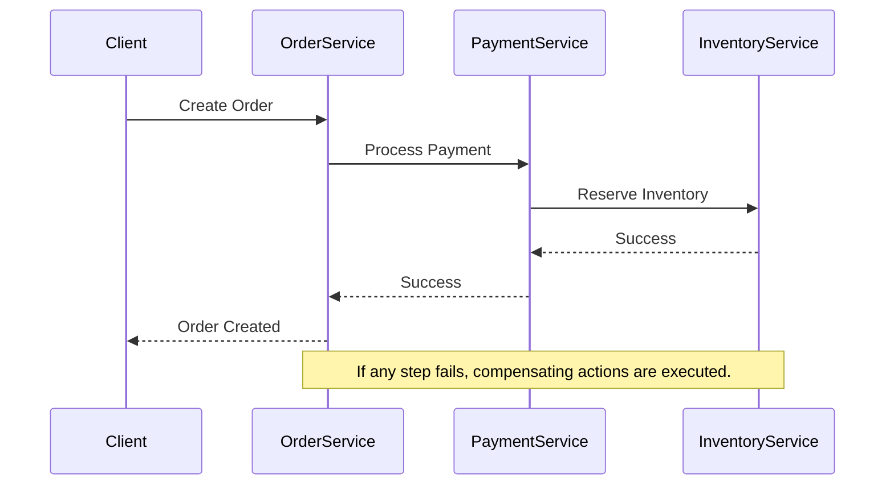

## 22.13 Handling Distributed Transactions

In the world of microservices and distributed systems, handling transactions that span multiple services is a complex yet crucial task. Unlike traditional monolithic applications where transactions can be managed using a single database transaction, distributed systems require a different approach to ensure data consistency and reliability. In this section, we will explore the challenges of handling distributed transactions, introduce patterns like the Saga pattern, discuss compensation-based approaches, and provide examples of implementing distributed transactions in Ruby. We will also highlight the trade-offs between consistency and availability and discuss monitoring and troubleshooting distributed transactions.

### Understanding the Challenges of Distributed Transactions

Distributed transactions involve multiple services that need to work together to complete a single logical operation. This introduces several challenges:

- **Consistency**: Ensuring that all services involved in a transaction reach a consistent state.
- **Availability**: Maintaining system availability even when some services are unavailable.
- **Latency**: Managing the increased latency due to network communication between services.
- **Failure Handling**: Dealing with partial failures where some services succeed while others fail.

These challenges necessitate the use of specialized patterns and techniques to manage distributed transactions effectively.

### Introducing the Saga Pattern

The Saga pattern is a popular approach for managing distributed transactions. It breaks down a transaction into a series of smaller, independent steps, each with its own compensating action. If a step fails, the compensating actions are executed to undo the changes made by the previous steps.

#### Key Participants in the Saga Pattern

- **Coordinator**: Manages the execution of the saga, ensuring that each step is executed in order and compensating actions are triggered if necessary.
- **Participants**: The individual services that perform the steps of the saga.

#### Implementing the Saga Pattern in Ruby

Let's consider a simple example of a distributed transaction involving an order service, a payment service, and an inventory service. We'll implement a saga to handle the transaction.

```ruby
class OrderSaga
  def initialize(order_service, payment_service, inventory_service)
    @order_service = order_service
    @payment_service = payment_service
    @inventory_service = inventory_service
  end

  def execute(order)
    begin
      @order_service.create_order(order)
      @payment_service.process_payment(order)
      @inventory_service.reserve_inventory(order)
    rescue => e
      compensate(order)
      raise "Saga failed: #{e.message}"
    end
  end

  private

  def compensate(order)
    @inventory_service.release_inventory(order)
    @payment_service.refund_payment(order)
    @order_service.cancel_order(order)
  end
end
```

In this example, the `OrderSaga` class coordinates the execution of the transaction steps. If any step fails, the `compensate` method is called to undo the changes.

### Compensation-Based Approaches

Compensation-based approaches are essential for maintaining consistency in distributed transactions. They involve defining compensating actions for each step of the transaction that can be executed to revert changes in case of failure.

#### Example: Implementing Compensation in Ruby

Let's extend our previous example to include compensating actions for each service.

```ruby
class PaymentService
  def process_payment(order)
    # Process payment logic
  end

  def refund_payment(order)
    # Refund payment logic
  end
end

class InventoryService
  def reserve_inventory(order)
    # Reserve inventory logic
  end

  def release_inventory(order)
    # Release inventory logic
  end
end

class OrderService
  def create_order(order)
    # Create order logic
  end

  def cancel_order(order)
    # Cancel order logic
  end
end
```

Each service defines its own compensating actions, which are called by the `OrderSaga` class in case of failure.

### Trade-offs Between Consistency and Availability

In distributed systems, there is often a trade-off between consistency and availability. The CAP theorem states that a distributed system can only provide two out of three guarantees: Consistency, Availability, and Partition Tolerance. In practice, this means that achieving strong consistency may require sacrificing availability, and vice versa.

#### Eventual Consistency

One approach to balancing this trade-off is eventual consistency, where the system guarantees that all services will eventually reach a consistent state, but not necessarily immediately. This approach is often used in systems where availability is prioritized over immediate consistency.

### Monitoring and Troubleshooting Distributed Transactions

Monitoring and troubleshooting distributed transactions is crucial for maintaining system reliability. Here are some techniques to consider:

- **Logging**: Implement detailed logging for each step of the transaction to track progress and identify failures.
- **Tracing**: Use distributed tracing tools to visualize the flow of transactions across services.
- **Alerts**: Set up alerts for transaction failures to enable quick response and resolution.

### Visualizing Distributed Transactions

To better understand the flow of distributed transactions, let's visualize the Saga pattern using a sequence diagram.



### Try It Yourself

Experiment with the code examples provided by modifying the services or adding new steps to the saga. Consider implementing additional compensating actions or introducing failures to test the robustness of the saga.

### Conclusion

Handling distributed transactions in Ruby requires careful consideration of consistency, availability, and failure handling. By using patterns like the Saga pattern and compensation-based approaches, we can manage distributed transactions effectively. Remember to monitor and troubleshoot transactions to maintain system reliability.

## Quiz: Handling Distributed Transactions



### What is a key challenge of handling distributed transactions?

- [x] Ensuring consistency across multiple services
- [ ] Managing a single database transaction
- [ ] Reducing code complexity
- [ ] Increasing network latency

> **Explanation:** Distributed transactions involve multiple services, making consistency a key challenge.

### What is the Saga pattern used for?

- [x] Managing distributed transactions
- [ ] Optimizing database queries
- [ ] Enhancing user interfaces
- [ ] Improving network security

> **Explanation:** The Saga pattern is used to manage distributed transactions by breaking them into smaller steps with compensating actions.

### Which component manages the execution of a saga?

- [x] Coordinator
- [ ] Participant
- [ ] Client
- [ ] Database

> **Explanation:** The coordinator manages the execution of the saga, ensuring steps are executed in order.

### What is a compensating action?

- [x] An action that reverts changes made by a transaction step
- [ ] An action that enhances transaction speed
- [ ] An action that improves user experience
- [ ] An action that secures data

> **Explanation:** Compensating actions are used to revert changes made by a transaction step in case of failure.

### What does eventual consistency prioritize?

- [x] Availability over immediate consistency
- [ ] Immediate consistency over availability
- [ ] Security over performance
- [ ] Performance over security

> **Explanation:** Eventual consistency prioritizes availability, allowing services to eventually reach a consistent state.

### What is a trade-off in distributed systems according to the CAP theorem?

- [x] Consistency and availability
- [ ] Security and performance
- [ ] Scalability and maintainability
- [ ] Usability and reliability

> **Explanation:** The CAP theorem states that a distributed system can only provide two out of three guarantees: Consistency, Availability, and Partition Tolerance.

### What tool can be used for visualizing the flow of distributed transactions?

- [x] Distributed tracing tools
- [ ] Code editors
- [ ] Database management systems
- [ ] Web browsers

> **Explanation:** Distributed tracing tools help visualize the flow of transactions across services.

### What is the role of logging in distributed transactions?

- [x] Tracking progress and identifying failures
- [ ] Enhancing user interfaces
- [ ] Securing data
- [ ] Reducing code complexity

> **Explanation:** Logging is used to track progress and identify failures in distributed transactions.

### What is the purpose of setting up alerts for transaction failures?

- [x] Enabling quick response and resolution
- [ ] Enhancing user experience
- [ ] Improving code readability
- [ ] Securing network communication

> **Explanation:** Alerts for transaction failures enable quick response and resolution.

### True or False: The Saga pattern eliminates the need for compensating actions.

- [ ] True
- [x] False

> **Explanation:** The Saga pattern relies on compensating actions to maintain consistency in case of failures.



Remember, this is just the beginning. As you progress, you'll build more complex and interactive distributed systems. Keep experimenting, stay curious, and enjoy the journey!

---
