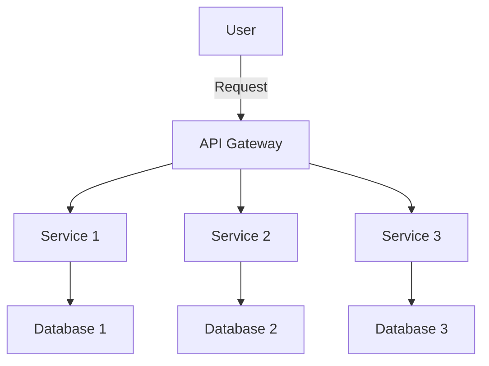

## 22.14 Best Practices for Microservices in Ruby

In the realm of modern software development, microservices architecture has emerged as a powerful paradigm for building scalable and maintainable applications. This approach involves decomposing a monolithic application into a collection of loosely coupled services, each responsible for a specific business capability. Ruby, with its elegant syntax and robust ecosystem, is well-suited for developing microservices. In this section, we will explore best practices for building, deploying, and maintaining Ruby microservices effectively.

### Key Practices for Ruby Microservices

#### 1. Embrace Automation with CI/CD Pipelines

Automation is the cornerstone of efficient microservices development. Continuous Integration (CI) and Continuous Deployment (CD) pipelines automate the process of building, testing, and deploying code changes, ensuring that new features and bug fixes are delivered quickly and reliably.

- **Set Up CI/CD Pipelines**: Use tools like Jenkins, GitHub Actions, or GitLab CI to automate the build and deployment process. Ensure that every code change triggers a pipeline that runs tests and deploys the service to a staging environment.

- **Automate Testing**: Implement automated tests at various levels, including unit tests, integration tests, and end-to-end tests. Use frameworks like RSpec and Minitest for Ruby testing.

- **Deploy with Confidence**: Use blue-green deployments or canary releases to minimize downtime and reduce the risk of introducing bugs into production.

```ruby
# Example of a simple CI/CD pipeline configuration using GitHub Actions

name: Ruby CI

on:
  push:
    branches:
      - main

jobs:
  build:
    runs-on: ubuntu-latest

    steps:
    - uses: actions/checkout@v2
    - name: Set up Ruby
      uses: ruby/setup-ruby@v1
      with:
        ruby-version: 3.0
    - name: Install dependencies
      run: bundle install
    - name: Run tests
      run: bundle exec rspec
```

#### 2. Prioritize Documentation and Communication

In a microservices architecture, clear documentation and effective communication are vital for ensuring that team members understand the responsibilities and interfaces of each service.

- **Document APIs**: Use tools like Swagger or OpenAPI to document your service APIs. This documentation should include endpoint details, request/response formats, and authentication requirements.

- **Maintain a Service Registry**: Keep an updated registry of all services, their versions, and their dependencies. This helps in understanding the system's architecture and managing service interactions.

- **Foster Communication**: Encourage regular meetings and discussions among team members to share knowledge and address challenges. Use collaboration tools like Slack or Microsoft Teams for real-time communication.

#### 3. Manage Dependencies and Versioning

Managing dependencies and versioning is crucial for maintaining the stability and compatibility of microservices.

- **Use Bundler for Dependency Management**: Bundler is a powerful tool for managing Ruby dependencies. Ensure that each service has a `Gemfile` that specifies its dependencies and their versions.

- **Version Your APIs**: Implement versioning for your APIs to ensure backward compatibility. Use URL versioning (e.g., `/api/v1/resource`) or header-based versioning.

- **Monitor Dependency Updates**: Regularly update dependencies to benefit from security patches and new features. Use tools like Dependabot to automate dependency updates.

```ruby
# Example of a Gemfile for managing dependencies

source 'https://rubygems.org'

gem 'rails', '~> 6.1'
gem 'pg', '~> 1.2'
gem 'puma', '~> 5.0'
gem 'rspec-rails', '~> 5.0'
```

#### 4. Conduct Regular Code Reviews and Adhere to Coding Standards

Code reviews are an essential practice for maintaining code quality and fostering a culture of continuous improvement.

- **Establish a Code Review Process**: Define a process for submitting and reviewing code changes. Use pull requests and code review tools like GitHub or GitLab to facilitate this process.

- **Adhere to Coding Standards**: Follow established coding standards and style guides, such as the Ruby Style Guide, to ensure consistency and readability across the codebase.

- **Encourage Constructive Feedback**: Promote a positive and constructive code review culture where team members provide actionable feedback and learn from each other.

#### 5. Optimize Performance, Security, and Scalability

Ensuring that your microservices are performant, secure, and scalable is critical for delivering a reliable user experience.

- **Profile and Optimize Performance**: Use profiling tools like RubyProf or StackProf to identify performance bottlenecks. Optimize database queries, reduce memory usage, and improve response times.

- **Implement Security Best Practices**: Follow security best practices, such as input validation, authentication, and encryption. Use tools like Brakeman for static security analysis.

- **Design for Scalability**: Architect your services to handle increased load by scaling horizontally. Use container orchestration tools like Kubernetes to manage service instances.

```ruby
# Example of a simple performance optimization using caching

class ArticlesController < ApplicationController
  def index
    @articles = Rails.cache.fetch('articles', expires_in: 12.hours) do
      Article.all
    end
  end
end
```

### Visualizing Microservices Architecture

To better understand the microservices architecture, let's visualize a typical setup using a Mermaid.js diagram.



**Diagram Description**: This diagram illustrates a microservices architecture where an API Gateway routes user requests to different services. Each service interacts with its own database, ensuring data isolation and independence.

### Knowledge Check

Before we conclude, let's reinforce our understanding with a few questions:

- What are the benefits of using CI/CD pipelines in microservices development?
- How can documentation improve the maintainability of microservices?
- Why is it important to manage dependencies and versioning in microservices?
- What role do code reviews play in maintaining code quality?
- How can we ensure the performance, security, and scalability of microservices?

### Embrace the Journey

Remember, building microservices is a journey that requires continuous learning and adaptation. As you implement these best practices, you'll gain valuable insights and experience that will help you build more robust and scalable systems. Keep experimenting, stay curious, and enjoy the journey!

## Quiz: Best Practices for Microservices in Ruby



### What is the primary benefit of using CI/CD pipelines in microservices?

- [x] Automating the build, test, and deployment process
- [ ] Reducing the number of developers needed
- [ ] Eliminating the need for documentation
- [ ] Increasing the complexity of the system

> **Explanation:** CI/CD pipelines automate the build, test, and deployment process, ensuring that code changes are delivered quickly and reliably.

### Which tool is commonly used for documenting APIs in microservices?

- [ ] GitHub
- [x] Swagger
- [ ] Jenkins
- [ ] Docker

> **Explanation:** Swagger is a popular tool for documenting APIs, providing a clear and interactive interface for understanding service endpoints.

### Why is versioning important in microservices?

- [x] To ensure backward compatibility
- [ ] To increase the number of services
- [ ] To reduce the need for testing
- [ ] To eliminate the need for documentation

> **Explanation:** Versioning ensures backward compatibility, allowing services to evolve without breaking existing clients.

### What is a key benefit of conducting regular code reviews?

- [x] Maintaining code quality and fostering continuous improvement
- [ ] Reducing the need for testing
- [ ] Increasing the number of developers
- [ ] Eliminating the need for documentation

> **Explanation:** Regular code reviews help maintain code quality and foster a culture of continuous improvement by providing actionable feedback.

### How can we optimize the performance of Ruby microservices?

- [x] By profiling and optimizing database queries
- [ ] By increasing the number of services
- [ ] By reducing the number of developers
- [ ] By eliminating documentation

> **Explanation:** Profiling and optimizing database queries can significantly improve the performance of Ruby microservices.

### What is the role of an API Gateway in a microservices architecture?

- [x] Routing user requests to the appropriate service
- [ ] Storing data for all services
- [ ] Managing service dependencies
- [ ] Eliminating the need for documentation

> **Explanation:** An API Gateway routes user requests to the appropriate service, acting as a single entry point for client interactions.

### Which tool can be used for static security analysis in Ruby?

- [ ] Docker
- [ ] GitHub
- [x] Brakeman
- [ ] Jenkins

> **Explanation:** Brakeman is a static analysis tool specifically designed for Ruby on Rails applications, helping identify security vulnerabilities.

### What is a common strategy for scaling microservices?

- [x] Horizontal scaling
- [ ] Vertical scaling
- [ ] Increasing the number of developers
- [ ] Reducing the number of services

> **Explanation:** Horizontal scaling involves adding more instances of a service to handle increased load, making it a common strategy for scaling microservices.

### How can we ensure the security of microservices?

- [x] By following security best practices such as input validation and encryption
- [ ] By increasing the number of services
- [ ] By reducing the number of developers
- [ ] By eliminating documentation

> **Explanation:** Following security best practices, such as input validation and encryption, helps ensure the security of microservices.

### True or False: Documentation is not necessary in a microservices architecture.

- [ ] True
- [x] False

> **Explanation:** Documentation is crucial in a microservices architecture to ensure that team members understand the responsibilities and interfaces of each service.



By following these best practices, you'll be well-equipped to build scalable and maintainable microservices in Ruby. Remember, the key to success lies in continuous learning and adaptation. Keep exploring, stay curious, and enjoy the journey of building robust systems!
