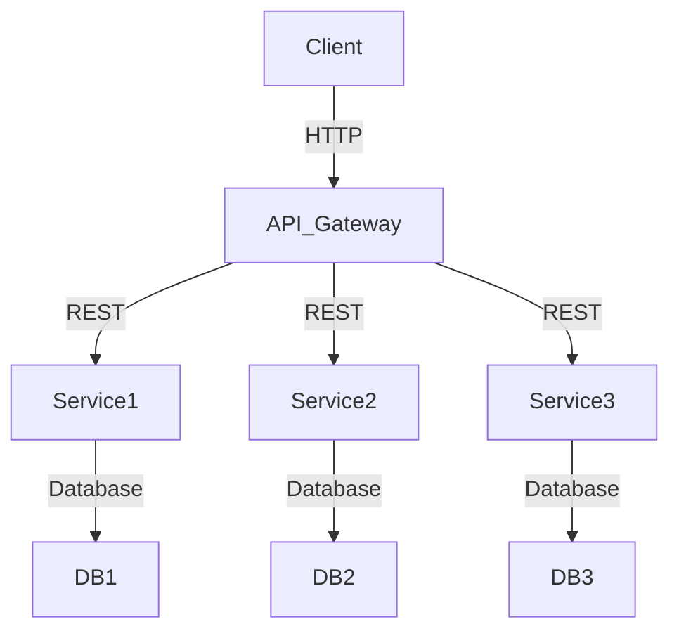

## 22.2 Designing Microservices with Ruby

In the evolving landscape of software development, microservices have emerged as a powerful architectural style that enables developers to build scalable and maintainable applications. Ruby, with its elegant syntax and rich ecosystem, is a compelling choice for designing microservices. In this section, we will explore how to effectively design microservices using Ruby, focusing on best practices, architectural considerations, and suitable frameworks.

### Understanding Microservices

Microservices architecture is a design approach where an application is composed of small, independent services that communicate over a network. Each service is focused on a specific business capability and can be developed, deployed, and scaled independently. This architecture promotes flexibility, scalability, and resilience.

#### Key Characteristics of Microservices

- **Independence**: Each microservice operates independently, allowing for isolated development and deployment.
- **Modularity**: Services are modular, focusing on specific business functions.
- **Scalability**: Services can be scaled independently based on demand.
- **Resilience**: Failure in one service does not affect the entire system.
- **Technology Agnostic**: Different services can be built using different technologies.

### Why Choose Ruby for Microservices?

Ruby is known for its simplicity and productivity, making it an excellent choice for developing microservices. Here are some reasons why Ruby is suitable for microservices:

- **Expressive Syntax**: Ruby's syntax is clean and expressive, allowing developers to write concise and readable code.
- **Rich Ecosystem**: Ruby has a vast collection of libraries and frameworks that facilitate rapid development.
- **Community Support**: The Ruby community is active and supportive, providing a wealth of resources and tools.
- **Flexibility**: Ruby's dynamic nature and metaprogramming capabilities allow for flexible and adaptable code.

### Defining Service Boundaries and Responsibilities

One of the critical aspects of designing microservices is defining clear service boundaries and responsibilities. This involves identifying distinct business capabilities and encapsulating them within individual services.

#### Guidelines for Defining Service Boundaries

1. **Identify Business Capabilities**: Break down the application into distinct business capabilities. Each capability should map to a specific service.
2. **Ensure Loose Coupling**: Services should be loosely coupled, minimizing dependencies between them.
3. **Promote High Cohesion**: Each service should have a well-defined purpose and focus on a single responsibility.
4. **Consider Data Ownership**: Each service should own its data, reducing the need for shared databases.

### Structuring Code for Microservices

Structuring code for microservices involves organizing it in a way that promotes modularity and independence. Here are some best practices for structuring code in Ruby microservices:

#### Emphasizing Modularity

- **Use Modules and Classes**: Organize code into modules and classes to encapsulate functionality and promote reuse.
- **Adopt a Layered Architecture**: Separate concerns by organizing code into layers, such as presentation, business logic, and data access.

#### Ensuring Independence

- **Isolate Dependencies**: Each service should manage its dependencies independently, using tools like Bundler for dependency management.
- **Implement API Contracts**: Define clear API contracts for communication between services, using tools like OpenAPI for documentation.

### Frameworks for Building Microservices in Ruby

Ruby offers several frameworks that are well-suited for building microservices. Two popular choices are Grape and Sinatra.

#### Grape

[Grape](https://github.com/ruby-grape/grape) is a REST-like API framework for Ruby. It is designed to create APIs quickly and efficiently.

- **Lightweight**: Grape is lightweight and focuses on building APIs with minimal overhead.
- **Convention Over Configuration**: Grape follows the convention over configuration principle, reducing boilerplate code.
- **Built-in Features**: It provides built-in support for parameter validation, error handling, and versioning.

#### Sinatra

[Sinatra](http://sinatrarb.com/) is a DSL for creating web applications in Ruby. It is known for its simplicity and minimalism.

- **Minimalistic**: Sinatra is minimalistic, allowing developers to build applications with minimal code.
- **Flexible**: It is highly flexible and can be extended with various plugins and middleware.
- **Ideal for Prototyping**: Sinatra is ideal for prototyping and building small to medium-sized services.

### Choosing the Right Tools and Libraries

Choosing the right tools and libraries is crucial for building effective microservices. Here are some considerations:

- **Performance**: Choose libraries that offer good performance and scalability.
- **Community Support**: Opt for libraries with active community support and regular updates.
- **Compatibility**: Ensure compatibility with existing systems and technologies.
- **Ease of Use**: Select tools that are easy to use and integrate into your workflow.

### Design Patterns for Microservices

Design patterns play a vital role in promoting loose coupling and high cohesion in microservices. Here are some patterns to consider:

#### Service Registry

A service registry maintains a list of available services and their locations, enabling dynamic discovery and load balancing.

#### Circuit Breaker

The circuit breaker pattern prevents a service from repeatedly trying to execute an operation that is likely to fail, enhancing resilience.

#### API Gateway

An API gateway acts as a single entry point for all client requests, routing them to the appropriate services.

### Code Example: Building a Simple Microservice with Sinatra

Let's build a simple microservice using Sinatra to demonstrate how to structure a microservice in Ruby.

```ruby
# app.rb
require 'sinatra'
require 'json'

# Define a simple service to manage books
class BookService < Sinatra::Base
  # In-memory storage for books
  BOOKS = []

  # Endpoint to get all books
  get '/books' do
    content_type :json
    BOOKS.to_json
  end

  # Endpoint to add a new book
  post '/books' do
    content_type :json
    book = JSON.parse(request.body.read)
    BOOKS << book
    status 201
    book.to_json
  end

  # Endpoint to get a book by ID
  get '/books/:id' do
    content_type :json
    book = BOOKS.find { |b| b['id'] == params['id'].to_i }
    halt 404, { error: 'Book not found' }.to_json unless book
    book.to_json
  end

  # Endpoint to delete a book by ID
  delete '/books/:id' do
    content_type :json
    book = BOOKS.find { |b| b['id'] == params['id'].to_i }
    halt 404, { error: 'Book not found' }.to_json unless book
    BOOKS.delete(book)
    status 204
  end
end

# Run the service
BookService.run!
```

### Try It Yourself

Experiment with the code example by adding new endpoints or modifying existing ones. Consider implementing additional features such as updating a book or adding authentication.

### Visualizing Microservices Architecture

To better understand the architecture of microservices, let's visualize a typical microservices setup using Mermaid.js.



**Diagram Description**: This diagram illustrates a typical microservices architecture where a client interacts with an API gateway. The API gateway routes requests to various services, each with its own database.

### Key Considerations for Designing Microservices

- **Scalability**: Design services to scale independently based on demand.
- **Resilience**: Implement patterns like circuit breakers to enhance resilience.
- **Security**: Secure communication between services using encryption and authentication.
- **Monitoring**: Implement monitoring and logging to track service performance and detect issues.

### Knowledge Check

- What are the key characteristics of microservices?
- Why is Ruby a suitable choice for building microservices?
- How can you define clear service boundaries in a microservices architecture?
- What are some popular frameworks for building microservices in Ruby?
- How does the circuit breaker pattern enhance resilience in microservices?

### Embrace the Journey

Designing microservices with Ruby is an exciting journey that empowers you to build scalable and maintainable applications. Remember, this is just the beginning. As you progress, you'll explore more advanced concepts and techniques. Keep experimenting, stay curious, and enjoy the journey!

## Quiz: Designing Microservices with Ruby



### What is a key characteristic of microservices architecture?

- [x] Independence
- [ ] Monolithic structure
- [ ] Tight coupling
- [ ] Centralized database

> **Explanation:** Microservices architecture is characterized by the independence of services, allowing them to be developed, deployed, and scaled independently.

### Why is Ruby considered a good choice for microservices?

- [x] Expressive syntax and rich ecosystem
- [ ] Lack of community support
- [ ] Limited libraries
- [ ] Complex syntax

> **Explanation:** Ruby's expressive syntax and rich ecosystem make it a compelling choice for developing microservices.

### Which framework is known for its minimalistic approach to building web applications in Ruby?

- [x] Sinatra
- [ ] Rails
- [ ] Grape
- [ ] Hanami

> **Explanation:** Sinatra is known for its minimalistic approach, allowing developers to build web applications with minimal code.

### What is the purpose of an API gateway in microservices architecture?

- [x] Acts as a single entry point for client requests
- [ ] Stores data for all services
- [ ] Manages service dependencies
- [ ] Provides direct access to databases

> **Explanation:** An API gateway acts as a single entry point for client requests, routing them to the appropriate services.

### How does the circuit breaker pattern enhance resilience?

- [x] Prevents repeated execution of likely-to-fail operations
- [ ] Increases service coupling
- [ ] Centralizes data storage
- [ ] Reduces service independence

> **Explanation:** The circuit breaker pattern enhances resilience by preventing a service from repeatedly trying to execute an operation that is likely to fail.

### What is a benefit of using Grape for building APIs in Ruby?

- [x] Lightweight and focuses on building APIs with minimal overhead
- [ ] Requires extensive configuration
- [ ] Limited to monolithic applications
- [ ] Lacks built-in features

> **Explanation:** Grape is lightweight and focuses on building APIs with minimal overhead, making it ideal for microservices.

### What should be considered when choosing tools and libraries for microservices?

- [x] Performance and community support
- [ ] Complexity and limited updates
- [ ] Incompatibility with existing systems
- [ ] Lack of documentation

> **Explanation:** When choosing tools and libraries, consider performance, community support, and compatibility with existing systems.

### What is a guideline for defining service boundaries?

- [x] Ensure loose coupling and high cohesion
- [ ] Centralize all data
- [ ] Increase dependencies between services
- [ ] Focus on multiple responsibilities per service

> **Explanation:** Ensuring loose coupling and high cohesion is a guideline for defining clear service boundaries in microservices.

### What is a key consideration for structuring code in microservices?

- [x] Emphasizing modularity and independence
- [ ] Centralizing all dependencies
- [ ] Increasing code complexity
- [ ] Reducing code reuse

> **Explanation:** Emphasizing modularity and independence is crucial for structuring code in microservices.

### True or False: Microservices architecture allows for isolated development and deployment of services.

- [x] True
- [ ] False

> **Explanation:** True. Microservices architecture allows for isolated development and deployment of services, promoting flexibility and scalability.


