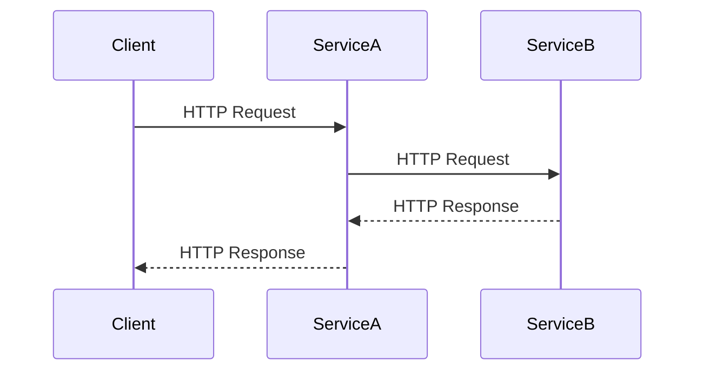

## 22.3 Communication Between Services

In the realm of microservices architecture, communication between services is a cornerstone for building scalable and maintainable applications. This section delves into the various methods of inter-service communication, focusing on both synchronous and asynchronous patterns, and how they can be effectively implemented in Ruby applications.

### Understanding Inter-Service Communication

Inter-service communication is the process by which microservices interact with each other to fulfill a business requirement. This communication can be broadly categorized into two types: synchronous and asynchronous.

#### Synchronous Communication

Synchronous communication involves a direct request-response interaction between services. The client service sends a request and waits for the response from the server service. Common protocols for synchronous communication include HTTP/REST and gRPC.

- **HTTP/REST**: A widely used protocol that leverages HTTP methods (GET, POST, PUT, DELETE) for communication. REST is stateless and uses JSON or XML for data interchange.
- **gRPC**: A high-performance RPC framework that uses HTTP/2 for transport, Protocol Buffers for serialization, and provides features like bi-directional streaming.

#### Asynchronous Communication

Asynchronous communication decouples the sender and receiver, allowing them to operate independently. This is typically achieved through message queues or event streams.

- **Message Queues**: Systems like RabbitMQ and Kafka facilitate asynchronous communication by allowing services to publish and consume messages.
- **Event Streams**: Services can publish events to a stream, which other services can subscribe to, enabling real-time data processing.

### Trade-offs Between Synchronous and Asynchronous Communication

Choosing between synchronous and asynchronous communication involves understanding the trade-offs:

- **Latency**: Synchronous communication can introduce latency as the client waits for a response. Asynchronous communication can reduce latency by allowing services to process requests independently.
- **Complexity**: Asynchronous systems can be more complex to design and debug due to the need for message brokers and handling eventual consistency.
- **Reliability**: Asynchronous communication can improve reliability by decoupling services and allowing for retries and fault tolerance.

### Implementing Inter-Service Communication in Ruby

Let's explore how to implement these communication patterns in Ruby applications using popular libraries and tools.

#### Synchronous Communication with HTTP/REST

For HTTP/REST communication, Ruby provides several libraries, with [Faraday](https://github.com/lostisland/faraday) being a popular choice.

```ruby
require 'faraday'
require 'json'

# Create a connection
conn = Faraday.new(url: 'http://example.com') do |faraday|
  faraday.adapter Faraday.default_adapter
end

# Send a GET request
response = conn.get('/api/resource')

# Parse the JSON response
data = JSON.parse(response.body)

puts data
```

**Key Points**:
- **Faraday**: A flexible HTTP client library that supports middleware for request/response processing.
- **JSON Parsing**: Use the `json` library to parse JSON responses.

#### Synchronous Communication with gRPC

To use gRPC in Ruby, you need to define your service in a `.proto` file and generate Ruby code using the Protocol Buffers compiler.

```proto
syntax = "proto3";

service ExampleService {
  rpc GetResource (ResourceRequest) returns (ResourceResponse);
}

message ResourceRequest {
  string id = 1;
}

message ResourceResponse {
  string data = 1;
}
```

Generate Ruby code:

```bash
protoc --ruby_out=lib --grpc_out=lib --plugin=protoc-gen-grpc=`which grpc_ruby_plugin` example.proto
```

Implement the client:

```ruby
require 'grpc'
require 'example_services_pb'

stub = ExampleService::Stub.new('localhost:50051', :this_channel_is_insecure)

request = ResourceRequest.new(id: '123')
response = stub.get_resource(request)

puts response.data
```

**Key Points**:
- **gRPC**: Provides strong typing and efficient serialization with Protocol Buffers.
- **Streaming**: Supports client, server, and bi-directional streaming.

#### Asynchronous Communication with RabbitMQ

For message queuing, [Bunny](https://github.com/ruby-amqp/bunny) is a popular Ruby client for RabbitMQ.

```ruby
require 'bunny'

# Start a connection
connection = Bunny.new
connection.start

# Create a channel
channel = connection.create_channel

# Declare a queue
queue = channel.queue('example_queue')

# Publish a message
channel.default_exchange.publish('Hello, World!', routing_key: queue.name)

# Subscribe to the queue
queue.subscribe(block: true) do |_delivery_info, _properties, body|
  puts "Received #{body}"
end

# Close the connection
connection.close
```

**Key Points**:
- **Bunny**: A robust RabbitMQ client for Ruby.
- **Queues**: Enable decoupled communication and message persistence.

#### Asynchronous Communication with Kafka

For event streaming, [ruby-kafka](https://github.com/zendesk/ruby-kafka) is a widely used library.

```ruby
require 'kafka'

# Create a Kafka client
kafka = Kafka.new(seed_brokers: ['kafka://localhost:9092'])

# Produce a message
kafka.deliver_message('Hello, Kafka!', topic: 'example_topic')

# Consume messages
consumer = kafka.consumer(group_id: 'example_group')
consumer.subscribe('example_topic')

consumer.each_message do |message|
  puts "Received #{message.value}"
end
```

**Key Points**:
- **ruby-kafka**: A client library for Apache Kafka.
- **Topics**: Allow for organized message streams and consumer groups.

### Service Discovery, Load Balancing, and Fault Tolerance

In a microservices architecture, managing service discovery, load balancing, and fault tolerance is crucial.

#### Service Discovery

Service discovery enables services to find each other dynamically. Tools like Consul, etcd, and Eureka provide service discovery mechanisms.

#### Load Balancing

Load balancing distributes incoming requests across multiple instances of a service. Nginx, HAProxy, and cloud-native solutions like AWS Elastic Load Balancing are commonly used.

#### Fault Tolerance

Fault tolerance ensures that services remain available despite failures. Techniques include retries, circuit breakers, and timeouts.

### Best Practices for API Design and Versioning

- **Design for Change**: Use versioning to manage API changes without breaking clients.
- **Consistency**: Maintain consistent naming conventions and response formats.
- **Documentation**: Provide comprehensive API documentation using tools like Swagger or OpenAPI.

### Visualizing Communication Patterns

Below is a sequence diagram illustrating a typical synchronous communication flow between services using HTTP/REST.



**Diagram Description**: This sequence diagram shows a client making an HTTP request to ServiceA, which in turn makes a request to ServiceB. ServiceB responds to ServiceA, which then responds to the client.

### Try It Yourself

Experiment with the provided code examples by modifying the endpoints, message contents, and protocols. Try implementing a simple microservice that communicates with another service using both HTTP/REST and RabbitMQ.

### Knowledge Check

- What are the main differences between synchronous and asynchronous communication?
- How does gRPC differ from HTTP/REST in terms of performance and serialization?
- What are some common tools for service discovery in microservices architecture?

### Summary

In this section, we've explored the various methods of inter-service communication in microservices architecture, focusing on both synchronous and asynchronous patterns. We've provided practical examples using Ruby libraries and discussed important considerations like service discovery, load balancing, and fault tolerance. By understanding these concepts, you can design robust and scalable microservices applications.

## Quiz: Communication Between Services



### Which protocol is commonly used for synchronous communication in microservices?

- [x] HTTP/REST
- [ ] AMQP
- [ ] MQTT
- [ ] WebSockets

> **Explanation:** HTTP/REST is a widely used protocol for synchronous communication in microservices.

### What is a key advantage of asynchronous communication?

- [x] Reduced latency
- [ ] Increased complexity
- [ ] Immediate response
- [ ] Strong typing

> **Explanation:** Asynchronous communication reduces latency by allowing services to process requests independently.

### Which Ruby library is commonly used for HTTP requests?

- [x] Faraday
- [ ] Bunny
- [ ] ruby-kafka
- [ ] Sidekiq

> **Explanation:** Faraday is a popular Ruby library for making HTTP requests.

### What serialization format does gRPC use?

- [x] Protocol Buffers
- [ ] JSON
- [ ] XML
- [ ] YAML

> **Explanation:** gRPC uses Protocol Buffers for serialization, which is efficient and strongly typed.

### Which tool is used for service discovery?

- [x] Consul
- [ ] RabbitMQ
- [ ] Kafka
- [ ] Nginx

> **Explanation:** Consul is a tool used for service discovery in microservices architecture.

### What is a common use case for message queues?

- [x] Decoupling services
- [ ] Immediate response
- [ ] Strong typing
- [ ] Direct communication

> **Explanation:** Message queues are used to decouple services, allowing them to operate independently.

### Which library is used for RabbitMQ in Ruby?

- [x] Bunny
- [ ] Faraday
- [ ] ruby-kafka
- [ ] Puma

> **Explanation:** Bunny is a Ruby client for RabbitMQ, used for message queuing.

### What is a benefit of using gRPC over HTTP/REST?

- [x] Bi-directional streaming
- [ ] Simplicity
- [ ] Text-based communication
- [ ] Statelessness

> **Explanation:** gRPC supports bi-directional streaming, which is an advantage over HTTP/REST.

### Which tool is used for load balancing?

- [x] Nginx
- [ ] Consul
- [ ] RabbitMQ
- [ ] Kafka

> **Explanation:** Nginx is commonly used for load balancing in microservices architecture.

### True or False: Asynchronous communication always requires a message broker.

- [x] False
- [ ] True

> **Explanation:** While message brokers are common in asynchronous communication, they are not always required. Other methods, like event streams, can also be used.



Remember, mastering inter-service communication is crucial for building scalable and maintainable microservices applications. Keep experimenting, stay curious, and enjoy the journey!
