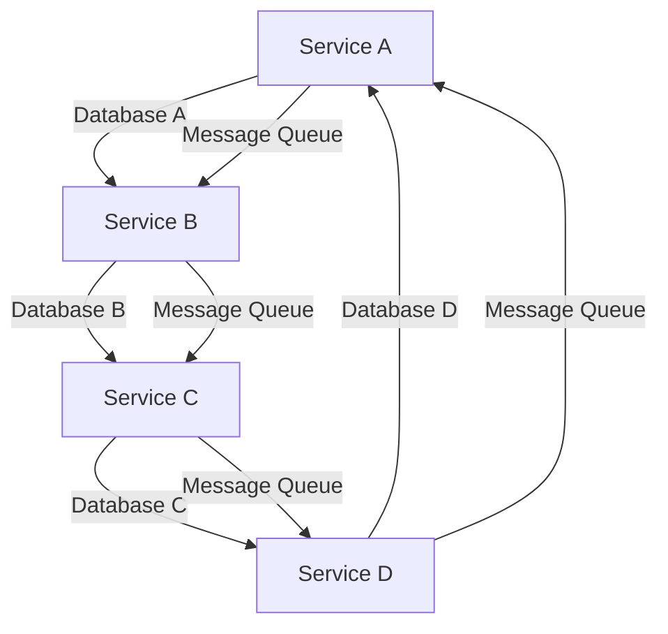

## 22.4 Data Management and Persistence

In the world of microservices architecture, managing data efficiently and effectively is crucial for building scalable and maintainable applications. This section delves into the strategies and patterns for data management and persistence in microservices, addressing challenges such as data partitioning, consistency, and transactions.

### Decentralized Data Management in Microservices

Microservices architecture promotes the idea of decentralized data management, where each service manages its own data. This approach contrasts with traditional monolithic architectures, where a single database is shared across the entire application. Decentralized data management offers several benefits, including:

- **Autonomy**: Each service can choose the most suitable database technology for its needs.
- **Scalability**: Services can scale independently, without being constrained by a centralized database.
- **Resilience**: The failure of one service does not directly impact the data management of others.

However, decentralized data management also introduces challenges, such as ensuring data consistency and managing transactions across services.

### Database per Service Pattern

One of the core principles of microservices architecture is the Database per Service pattern. This pattern dictates that each microservice should have its own database, which it exclusively manages. This approach provides several advantages:

- **Loose Coupling**: Services are decoupled from each other, allowing for independent development and deployment.
- **Data Isolation**: Each service has complete control over its data schema and storage technology.
- **Improved Security**: Access to data is restricted to the owning service, reducing the risk of unauthorized access.

#### Implementing Database per Service

To implement the Database per Service pattern, follow these steps:

1. **Identify Service Boundaries**: Clearly define the boundaries of each microservice and the data it needs to manage.
2. **Select Appropriate Databases**: Choose the database technology that best suits the needs of each service. For example, a service handling complex queries might benefit from a relational database, while a service managing large volumes of unstructured data might use a NoSQL database.
3. **Ensure Data Consistency**: Implement mechanisms to ensure data consistency across services, such as eventual consistency models or distributed transactions.

### Shared Databases

In some cases, it may be necessary to use a shared database across multiple services. This approach can simplify data management but comes with trade-offs:

- **Tight Coupling**: Services become more tightly coupled, making it harder to change the database schema without affecting multiple services.
- **Scalability Challenges**: A shared database can become a bottleneck as the number of services and data volume grows.

#### When to Use Shared Databases

Consider using a shared database when:

- **Data Needs to be Consistent**: If strong consistency is required across services, a shared database can simplify transaction management.
- **Legacy Systems**: When integrating with legacy systems that rely on a shared database, it may be more practical to continue using the existing setup.

### Ensuring Data Consistency

Data consistency is a critical concern in microservices architecture. With decentralized data management, achieving strong consistency can be challenging. Instead, many systems adopt eventual consistency models, where data is allowed to be temporarily inconsistent but will eventually become consistent.

#### Eventual Consistency Models

Eventual consistency models are suitable for systems where immediate consistency is not required. They offer several benefits:

- **High Availability**: Services can continue to operate even if some data is temporarily inconsistent.
- **Scalability**: Systems can scale more easily without the need for complex distributed transactions.

To implement eventual consistency, consider using techniques such as:

- **Asynchronous Communication**: Use message queues or event streams to propagate changes between services.
- **Conflict Resolution**: Implement conflict resolution strategies to handle data inconsistencies.

### Data Replication and Synchronization

Data replication and synchronization are essential for maintaining data consistency and availability in distributed systems. These techniques ensure that data changes in one service are propagated to other services that need the data.

#### Techniques for Data Replication

1. **Master-Slave Replication**: One service acts as the master, and others as slaves. Changes are made to the master and propagated to the slaves.
2. **Multi-Master Replication**: Multiple services can act as masters, allowing changes to be made in any service and synchronized across all masters.

#### Synchronization Strategies

- **Event Sourcing**: Capture all changes as events and replay them to synchronize data across services.
- **Change Data Capture (CDC)**: Monitor and capture changes in the database and propagate them to other services.

### Transaction Management Across Services

Managing transactions across services is a complex challenge in microservices architecture. Traditional ACID transactions are difficult to implement in a distributed environment. Instead, consider using patterns like the Saga pattern.

#### The Saga Pattern

The Saga pattern is a design pattern for managing distributed transactions. It breaks down a transaction into a series of smaller, independent transactions, each managed by a different service. If a step fails, compensating transactions are executed to undo the changes.

```ruby
# Example of a Saga pattern implementation in Ruby

class OrderSaga
  def initialize(order_service, payment_service, inventory_service)
    @order_service = order_service
    @payment_service = payment_service
    @inventory_service = inventory_service
  end

  def execute(order)
    begin
      @order_service.create_order(order)
      @payment_service.process_payment(order)
      @inventory_service.reserve_inventory(order)
    rescue => e
      compensate(order)
      raise "Saga failed: #{e.message}"
    end
  end

  def compensate(order)
    @inventory_service.release_inventory(order)
    @payment_service.refund_payment(order)
    @order_service.cancel_order(order)
  end
end
```

### Tools and Databases for Distributed Environments

Choosing the right tools and databases is crucial for effective data management in distributed environments. Consider the following options:

- **Relational Databases**: PostgreSQL and MySQL offer strong consistency and are suitable for services requiring complex queries.
- **NoSQL Databases**: MongoDB and Cassandra provide high availability and scalability for services managing large volumes of unstructured data.
- **Message Queues**: RabbitMQ and Apache Kafka facilitate asynchronous communication and eventual consistency.
- **Distributed Databases**: CockroachDB and Amazon Aurora offer distributed SQL capabilities for high availability and scalability.

### Visualizing Data Management in Microservices

To better understand the concepts discussed, let's visualize a typical microservices architecture with decentralized data management.



**Diagram Description**: This diagram illustrates a microservices architecture where each service manages its own database. Services communicate asynchronously through message queues to ensure eventual consistency.

### Knowledge Check

- **What are the benefits of decentralized data management in microservices?**
- **How does the Database per Service pattern promote loose coupling?**
- **What are the trade-offs of using a shared database in microservices?**
- **How can eventual consistency models improve scalability?**
- **What are the key components of the Saga pattern for transaction management?**

### Embrace the Journey

Remember, mastering data management and persistence in microservices is a journey. As you progress, you'll encounter new challenges and opportunities to optimize your architecture. Keep experimenting, stay curious, and enjoy the journey!

## Quiz: Data Management and Persistence



### What is a key benefit of decentralized data management in microservices?

- [x] Autonomy for each service
- [ ] Centralized control
- [ ] Easier schema changes
- [ ] Simplified data access

> **Explanation:** Decentralized data management allows each service to manage its own data, providing autonomy and flexibility.

### Which pattern dictates that each microservice should have its own database?

- [x] Database per Service
- [ ] Shared Database
- [ ] Event Sourcing
- [ ] Multi-Master Replication

> **Explanation:** The Database per Service pattern ensures that each microservice has its own database, promoting loose coupling and autonomy.

### What is a trade-off of using a shared database in microservices?

- [x] Tight coupling between services
- [ ] Improved scalability
- [ ] Easier data management
- [ ] Enhanced security

> **Explanation:** A shared database can lead to tight coupling between services, making it harder to change the database schema without affecting multiple services.

### How does eventual consistency benefit a microservices architecture?

- [x] Allows for high availability
- [ ] Ensures immediate consistency
- [ ] Simplifies transaction management
- [ ] Reduces data redundancy

> **Explanation:** Eventual consistency allows services to continue operating even if some data is temporarily inconsistent, improving availability.

### Which technique is used to manage distributed transactions in microservices?

- [x] Saga pattern
- [ ] ACID transactions
- [ ] Master-Slave Replication
- [ ] Change Data Capture

> **Explanation:** The Saga pattern is used to manage distributed transactions by breaking them down into smaller, independent transactions.

### What is a key advantage of using message queues in microservices?

- [x] Facilitates asynchronous communication
- [ ] Ensures strong consistency
- [ ] Simplifies data access
- [ ] Reduces latency

> **Explanation:** Message queues facilitate asynchronous communication, allowing services to propagate changes without blocking operations.

### Which database type is suitable for services managing large volumes of unstructured data?

- [x] NoSQL databases
- [ ] Relational databases
- [ ] In-memory databases
- [ ] Graph databases

> **Explanation:** NoSQL databases like MongoDB and Cassandra are suitable for managing large volumes of unstructured data.

### What is the role of Change Data Capture (CDC) in data synchronization?

- [x] Monitors and captures changes in the database
- [ ] Ensures immediate consistency
- [ ] Simplifies schema changes
- [ ] Reduces data redundancy

> **Explanation:** Change Data Capture (CDC) monitors and captures changes in the database, propagating them to other services for synchronization.

### Which tool is suitable for facilitating asynchronous communication in microservices?

- [x] RabbitMQ
- [ ] PostgreSQL
- [ ] MongoDB
- [ ] Redis

> **Explanation:** RabbitMQ is a message queue that facilitates asynchronous communication between services.

### True or False: The Saga pattern ensures strong consistency across all services.

- [ ] True
- [x] False

> **Explanation:** The Saga pattern does not ensure strong consistency; it manages distributed transactions by breaking them into smaller, independent transactions.




