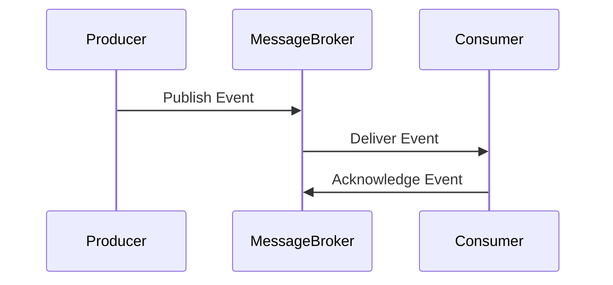

## 22.5 Event-Driven Architecture and Messaging

In the realm of microservices and distributed systems, **Event-Driven Architecture (EDA)** stands out as a powerful paradigm that enables services to react to events asynchronously. This section delves into the core concepts of EDA, its benefits, and practical implementation using popular messaging systems like RabbitMQ, Kafka, and Redis. We will also explore event sourcing, address challenges such as event ordering and idempotency, and emphasize the importance of reliable messaging protocols and error handling.

### Understanding Event-Driven Architecture

**Event-Driven Architecture** is a software design pattern in which decoupled components communicate through the production and consumption of events. An event is a significant change in state, such as a user making a purchase or a sensor detecting a temperature change. In EDA, components are designed to react to these events, enabling real-time processing and decision-making.

#### Benefits of Event-Driven Architecture

1. **Loose Coupling**: EDA promotes loose coupling between services, allowing them to operate independently. This reduces dependencies and makes it easier to modify or replace individual components without affecting the entire system.

2. **Scalability**: By decoupling services, EDA facilitates horizontal scaling. Services can be scaled independently based on demand, improving resource utilization and system performance.

3. **Resilience**: EDA enhances system resilience by isolating failures. If one service fails, others can continue to function, and the system can recover gracefully.

4. **Real-Time Processing**: EDA enables real-time data processing and analytics, making it ideal for applications that require immediate responses to events.

### Implementing Event-Driven Architecture

To implement EDA in microservices, we need a mechanism for services to publish and subscribe to events. This is typically achieved using an **event bus** or **message broker**. Let's explore how to implement these using RabbitMQ, Kafka, and Redis.

#### RabbitMQ

**RabbitMQ** is a widely-used message broker that facilitates communication between services through message queues. It supports multiple messaging protocols and provides features like message routing, delivery acknowledgments, and message persistence.

```ruby
require 'bunny'

# Establish a connection to RabbitMQ
connection = Bunny.new
connection.start

# Create a channel
channel = connection.create_channel

# Declare a queue
queue = channel.queue('order_created')

# Publish a message to the queue
channel.default_exchange.publish('Order #123 created', routing_key: queue.name)

puts " [x] Sent 'Order #123 created'"

# Close the connection
connection.close
```

In this example, we establish a connection to RabbitMQ, create a channel, declare a queue named `order_created`, and publish a message to the queue. RabbitMQ handles the delivery of messages to subscribed consumers.

#### Kafka

**Apache Kafka** is a distributed event streaming platform designed for high-throughput, fault-tolerant messaging. It is ideal for building real-time data pipelines and streaming applications.

```ruby
require 'kafka'

# Create a new Kafka client
kafka = Kafka.new(seed_brokers: ['kafka://localhost:9092'])

# Produce a message to a topic
kafka.deliver_message('Order #123 created', topic: 'orders')

puts " [x] Sent 'Order #123 created'"
```

In this Kafka example, we create a Kafka client and deliver a message to the `orders` topic. Kafka ensures that messages are distributed across partitions and replicated for fault tolerance.

#### Redis

**Redis** is an in-memory data structure store that can be used as a message broker through its Pub/Sub capabilities. It is suitable for lightweight messaging scenarios.

```ruby
require 'redis'

# Create a new Redis client
redis = Redis.new

# Publish a message to a channel
redis.publish('order_created', 'Order #123 created')

puts " [x] Sent 'Order #123 created'"
```

Here, we use Redis to publish a message to the `order_created` channel. Subscribers to this channel will receive the message in real-time.

### Event Sourcing in Microservices

**Event Sourcing** is a pattern where state changes are captured as a sequence of events. Instead of storing the current state, we store a log of state changes, allowing us to reconstruct the state at any point in time.

#### Benefits of Event Sourcing

- **Auditability**: Event sourcing provides a complete audit trail of all changes, making it easy to track the history of an entity.
- **Reproducibility**: By replaying events, we can reproduce the state of the system at any point in time, which is useful for debugging and testing.
- **Flexibility**: Event sourcing allows us to derive multiple views of the data by processing the event log in different ways.

#### Implementing Event Sourcing

To implement event sourcing, we need to persist events in a durable store and provide mechanisms to replay them. Here's a simple example using a Ruby class to represent an event store:

```ruby
class EventStore
  def initialize
    @events = []
  end

  def add_event(event)
    @events << event
  end

  def replay_events
    @events.each do |event|
      # Process each event
      puts "Replaying event: #{event}"
    end
  end
end

# Usage
store = EventStore.new
store.add_event('Order #123 created')
store.add_event('Order #123 shipped')

store.replay_events
```

In this example, we define an `EventStore` class that stores events in an array. The `replay_events` method iterates over the events and processes them.

### Challenges in Event-Driven Architecture

While EDA offers many benefits, it also presents challenges that must be addressed to ensure reliable and consistent systems.

#### Event Ordering

In distributed systems, maintaining the order of events can be challenging. Out-of-order events can lead to inconsistent states. To address this, we can use techniques like:

- **Partitioning**: Ensure that related events are processed by the same consumer by partitioning events based on a key.
- **Sequence Numbers**: Include sequence numbers in events to detect and handle out-of-order delivery.

#### Idempotency

Idempotency ensures that processing an event multiple times has the same effect as processing it once. This is crucial in EDA, where duplicate events can occur. To achieve idempotency:

- **Use Unique Identifiers**: Assign unique identifiers to events and track processed events to avoid reprocessing.
- **Design Idempotent Operations**: Ensure that operations are naturally idempotent, such as updating a record to a specific value.

### Reliable Messaging Protocols and Error Handling

To ensure reliable communication in EDA, we must use robust messaging protocols and implement proper error handling.

#### Reliable Messaging Protocols

- **AMQP (Advanced Message Queuing Protocol)**: Used by RabbitMQ, AMQP provides features like message acknowledgments, durable queues, and transactions.
- **Kafka's Protocol**: Kafka's protocol ensures message durability and fault tolerance through replication and partitioning.

#### Error Handling

- **Dead Letter Queues**: Use dead letter queues to handle messages that cannot be processed successfully after multiple attempts.
- **Retries and Backoff**: Implement retry mechanisms with exponential backoff to handle transient errors.

### Visualizing Event-Driven Architecture

To better understand the flow of events in an event-driven system, let's visualize a simple EDA using a sequence diagram.



In this diagram, the producer publishes an event to the message broker, which then delivers the event to the consumer. The consumer processes the event and sends an acknowledgment back to the broker.

### Try It Yourself

To deepen your understanding of EDA, try modifying the code examples to:

- Implement a consumer that processes messages from RabbitMQ, Kafka, or Redis.
- Add error handling and retry logic to the consumer.
- Experiment with different message formats and protocols.

### Conclusion

Event-Driven Architecture is a powerful paradigm for building scalable, resilient, and real-time systems. By leveraging messaging systems like RabbitMQ, Kafka, and Redis, we can implement EDA in microservices, enabling them to react to events asynchronously. While EDA presents challenges such as event ordering and idempotency, these can be addressed with careful design and robust error handling. As you continue your journey in software development, remember that EDA is just one of many tools available to create scalable and maintainable applications.

## Quiz: Event-Driven Architecture and Messaging



### What is a key benefit of Event-Driven Architecture?

- [x] Loose coupling between services
- [ ] Increased complexity
- [ ] Reduced scalability
- [ ] Synchronous processing

> **Explanation:** Event-Driven Architecture promotes loose coupling, allowing services to operate independently.

### Which messaging system is known for high-throughput and fault-tolerant messaging?

- [ ] RabbitMQ
- [x] Kafka
- [ ] Redis
- [ ] AMQP

> **Explanation:** Kafka is designed for high-throughput, fault-tolerant messaging, making it ideal for real-time data pipelines.

### What is the purpose of event sourcing?

- [x] To capture state changes as a sequence of events
- [ ] To store the current state of an entity
- [ ] To reduce system complexity
- [ ] To eliminate the need for a database

> **Explanation:** Event sourcing captures state changes as events, allowing the reconstruction of state at any point in time.

### How can we ensure idempotency in event processing?

- [x] Use unique identifiers for events
- [ ] Ignore duplicate events
- [ ] Process events multiple times
- [ ] Use synchronous processing

> **Explanation:** Using unique identifiers helps track processed events and ensures idempotency.

### What is a dead letter queue used for?

- [x] Handling messages that cannot be processed successfully
- [ ] Storing all processed messages
- [ ] Increasing message throughput
- [ ] Reducing message latency

> **Explanation:** Dead letter queues handle messages that fail to process after multiple attempts.

### Which protocol is used by RabbitMQ for reliable messaging?

- [x] AMQP
- [ ] HTTP
- [ ] SMTP
- [ ] FTP

> **Explanation:** RabbitMQ uses AMQP, which provides features like message acknowledgments and durable queues.

### What is a common challenge in Event-Driven Architecture?

- [x] Event ordering
- [ ] Synchronous processing
- [ ] Reduced scalability
- [ ] Increased coupling

> **Explanation:** Maintaining event order can be challenging in distributed systems.

### How can we visualize the flow of events in an EDA?

- [x] Using sequence diagrams
- [ ] Using bar charts
- [ ] Using pie charts
- [ ] Using histograms

> **Explanation:** Sequence diagrams are effective for visualizing the flow of events in an EDA.

### What is the role of a message broker in EDA?

- [x] To facilitate communication between services
- [ ] To store the current state of services
- [ ] To increase system complexity
- [ ] To reduce message throughput

> **Explanation:** A message broker facilitates communication by routing messages between services.

### True or False: Event-Driven Architecture is suitable for real-time processing.

- [x] True
- [ ] False

> **Explanation:** EDA enables real-time processing by allowing services to react to events as they occur.



Remember, this is just the beginning. As you progress, you'll build more complex and interactive systems. Keep experimenting, stay curious, and enjoy the journey!
