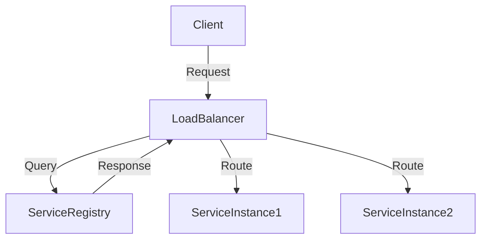

## 22.6 Service Discovery and Load Balancing

In the world of microservices and distributed systems, service discovery and load balancing are critical components that ensure seamless communication and efficient resource utilization. As we delve into these concepts, we will explore the need for service discovery, various mechanisms to achieve it, and how load balancing plays a pivotal role in maintaining service availability and performance.

### The Need for Service Discovery

In a dynamic environment where services are constantly being added, removed, or relocated, hardcoding service locations is impractical. Service discovery provides a mechanism for services to find each other dynamically, allowing for greater flexibility and scalability.

#### Key Concepts

- **Dynamic Environments**: Services can scale up or down, move across hosts, or be replaced, necessitating a dynamic way to locate them.
- **Decoupling**: Service discovery decouples service consumers from service providers, allowing for independent scaling and deployment.
- **Resilience**: By enabling services to discover healthy instances, service discovery contributes to system resilience.

### Service Discovery Mechanisms

Service discovery can be broadly categorized into two types: client-side and server-side discovery.

#### Client-Side Discovery

In client-side discovery, the client is responsible for determining the location of service instances. This approach typically involves a service registry where instances register themselves.

- **Service Registry**: A centralized database where service instances register their availability.
- **Client Logic**: Clients query the registry to find available instances and implement load balancing logic.

##### Example with Consul

Consul is a popular tool for service discovery and configuration. Here's how you can implement client-side discovery using Consul in a Ruby microservice:

```ruby
require 'diplomat'

# Register a service with Consul
Diplomat::Service.register('my_service', '127.0.0.1', 8080, tags: ['ruby', 'microservice'])

# Discover services
services = Diplomat::Service.get('my_service')

# Implement client-side load balancing
selected_service = services.sample # Simple random selection
puts "Connecting to service at #{selected_service['ServiceAddress']}:#{selected_service['ServicePort']}"
```

#### Server-Side Discovery

In server-side discovery, the client makes a request to a load balancer, which then queries the service registry and routes the request to an appropriate service instance.

- **Load Balancer**: Acts as an intermediary, handling service discovery and request routing.
- **Simplified Client**: Clients are relieved from the burden of service discovery logic.

##### Example with HAProxy

HAProxy is a robust load balancer that can be used for server-side discovery. Here's a basic configuration:

```plaintext
# HAProxy configuration for server-side service discovery
frontend http_front
    bind *:80
    default_backend http_back

backend http_back
    balance roundrobin
    server app1 127.0.0.1:8080 check
    server app2 127.0.0.1:8081 check
```

### Tools for Service Discovery

Several tools facilitate service discovery, each with unique features and capabilities.

#### Consul

- **Features**: Service discovery, health checking, key/value storage.
- **Integration**: Easily integrates with various platforms and languages, including Ruby.

#### Etcd

- **Features**: Distributed key/value store, service discovery, configuration management.
- **Use Case**: Ideal for Kubernetes and other container orchestration platforms.

#### ZooKeeper

- **Features**: Centralized service for maintaining configuration information, naming, and providing distributed synchronization.
- **Use Case**: Often used in large-scale distributed systems.

### Load Balancing Strategies

Load balancing is crucial for distributing incoming requests across multiple service instances, ensuring no single instance is overwhelmed.

#### Common Strategies

- **Round Robin**: Distributes requests evenly across all instances.
- **Least Connections**: Directs traffic to the instance with the fewest active connections.
- **IP Hash**: Routes requests based on the client's IP address, ensuring consistent routing.

#### DNS-Based Discovery

DNS-based service discovery leverages DNS records to provide service locations. This approach is simple and widely supported but may lack the granularity of other methods.

#### Health Checks

Health checks are vital for ensuring that only healthy instances receive traffic. They can be implemented at various levels:

- **Application-Level**: Checks specific application endpoints.
- **System-Level**: Monitors system resources like CPU and memory.

### Best Practices for Service Availability

To maintain high availability and reliability, consider the following best practices:

- **Redundancy**: Deploy multiple instances of each service.
- **Failover Mechanisms**: Implement automatic failover to healthy instances.
- **Monitoring and Alerts**: Continuously monitor service health and set up alerts for anomalies.

### Implementing Service Discovery in Ruby Microservices

Let's explore a practical example of implementing service discovery in a Ruby microservice architecture using Consul.

#### Setting Up Consul

1. **Install Consul**: Follow the [Consul installation guide](https://www.consul.io/docs/install) to set up a Consul agent.
2. **Register Services**: Use the Consul API to register your services.

```ruby
require 'diplomat'

# Register a service
Diplomat::Service.register('my_ruby_service', '127.0.0.1', 4567, tags: ['api', 'ruby'])
```

3. **Discover Services**: Query Consul to discover available services.

```ruby
# Discover services
services = Diplomat::Service.get('my_ruby_service')
services.each do |service|
  puts "Service available at #{service['ServiceAddress']}:#{service['ServicePort']}"
end
```

### Load Balancing with HAProxy

1. **Install HAProxy**: Follow the [HAProxy installation guide](http://www.haproxy.org/#down) to set up HAProxy.
2. **Configure HAProxy**: Define frontend and backend configurations to route traffic.

```plaintext
# HAProxy configuration
frontend http_front
    bind *:80
    default_backend ruby_services

backend ruby_services
    balance roundrobin
    server ruby1 127.0.0.1:4567 check
    server ruby2 127.0.0.1:4568 check
```

3. **Test Load Balancing**: Send requests to the HAProxy frontend and observe traffic distribution.

### Try It Yourself

Experiment with the provided code examples by:

- Modifying the service registration details in Consul.
- Changing the load balancing strategy in HAProxy.
- Implementing additional health checks to enhance reliability.

### Visualizing Service Discovery and Load Balancing

To better understand the flow of service discovery and load balancing, let's visualize the architecture using Mermaid.js:



**Diagram Description**: This diagram illustrates the flow of a client request through a load balancer, which queries a service registry to discover available service instances and routes the request accordingly.

### References and Further Reading

- [Consul Documentation](https://www.consul.io/docs)
- [Etcd Documentation](https://etcd.io/docs)
- [ZooKeeper Documentation](https://zookeeper.apache.org/doc/current/)
- [HAProxy Documentation](http://www.haproxy.org/#docs)

### Knowledge Check

- What are the differences between client-side and server-side service discovery?
- How does DNS-based service discovery work, and what are its limitations?
- Why are health checks important in load balancing?

### Embrace the Journey

Remember, mastering service discovery and load balancing is a journey. As you implement these concepts, you'll enhance the resilience and scalability of your applications. Keep experimenting, stay curious, and enjoy the journey!

## Quiz: Service Discovery and Load Balancing



### What is the primary purpose of service discovery in microservices?

- [x] To dynamically locate service instances
- [ ] To hardcode service locations
- [ ] To reduce the number of services
- [ ] To increase service complexity

> **Explanation:** Service discovery allows services to dynamically locate each other, enabling flexibility and scalability.

### Which tool is commonly used for client-side service discovery in Ruby?

- [x] Consul
- [ ] HAProxy
- [ ] Nginx
- [ ] Apache

> **Explanation:** Consul is a popular tool for client-side service discovery, providing a service registry and health checking.

### What is the role of a load balancer in server-side discovery?

- [x] To route requests to appropriate service instances
- [ ] To register services
- [ ] To query databases
- [ ] To store configuration files

> **Explanation:** In server-side discovery, the load balancer routes requests to the appropriate service instances based on the service registry.

### Which load balancing strategy distributes requests evenly across instances?

- [x] Round Robin
- [ ] Least Connections
- [ ] IP Hash
- [ ] Random

> **Explanation:** Round Robin distributes requests evenly across all available instances.

### What is a key feature of DNS-based service discovery?

- [x] Simplicity and wide support
- [ ] Granular control over instances
- [ ] Built-in health checks
- [ ] Automatic scaling

> **Explanation:** DNS-based service discovery is simple and widely supported, though it may lack granularity.

### Why are health checks important in load balancing?

- [x] To ensure only healthy instances receive traffic
- [ ] To increase traffic to unhealthy instances
- [ ] To reduce the number of instances
- [ ] To simplify service discovery

> **Explanation:** Health checks ensure that only healthy instances receive traffic, contributing to system resilience.

### Which tool is often used for server-side load balancing?

- [x] HAProxy
- [ ] Consul
- [ ] Etcd
- [ ] ZooKeeper

> **Explanation:** HAProxy is a robust tool commonly used for server-side load balancing.

### What is a benefit of using client-side service discovery?

- [x] Clients have control over load balancing logic
- [ ] Simplified client logic
- [ ] Centralized request routing
- [ ] Reduced client complexity

> **Explanation:** In client-side discovery, clients have control over the load balancing logic, allowing for custom strategies.

### How does Consul facilitate service discovery?

- [x] By providing a service registry and health checks
- [ ] By storing configuration files
- [ ] By querying databases
- [ ] By managing DNS records

> **Explanation:** Consul provides a service registry and health checks, facilitating dynamic service discovery.

### True or False: Load balancing is only necessary in large-scale systems.

- [ ] True
- [x] False

> **Explanation:** Load balancing is important in systems of all sizes to ensure efficient resource utilization and service availability.




