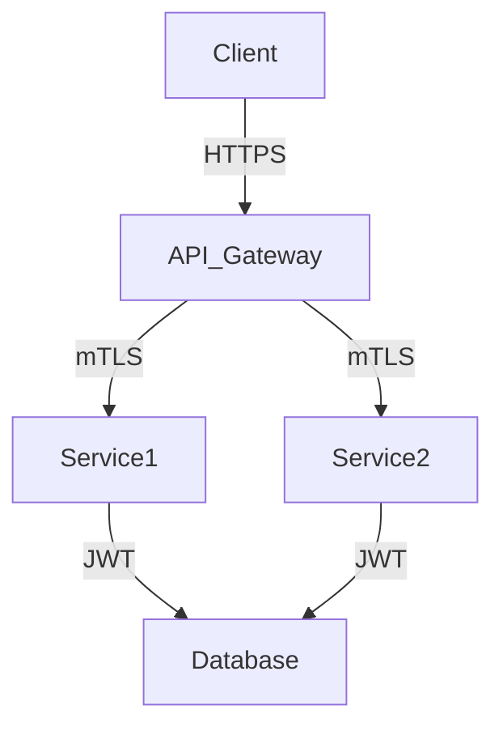

## 22.9 Security Considerations in Distributed Systems

In the world of distributed systems and microservices, security is a paramount concern. As we move from monolithic architectures to distributed ones, the attack surface increases significantly. This section will guide you through the security challenges unique to microservices, focusing on securing inter-service communication, managing authentication and authorization, and implementing best practices for secrets management in Ruby applications.

### Understanding the Increased Attack Surface

In a monolithic architecture, all components of an application are bundled together, making it easier to secure the application as a whole. However, in a distributed system, the application is broken down into multiple services that communicate over a network. This introduces several security challenges:

- **Increased Entry Points**: Each service in a distributed system can be a potential entry point for attackers.
- **Data in Transit**: Data exchanged between services can be intercepted if not properly secured.
- **Complex Authentication and Authorization**: Ensuring that only authorized services and users can access specific resources becomes more complex.

### Securing Service Communications

To secure communications between services, it's crucial to implement encryption and authentication mechanisms. Here are some strategies:

#### Mutual TLS (mTLS)

Mutual TLS is a protocol that ensures both the client and server authenticate each other. This is particularly useful in microservices architectures where services need to trust each other.

```ruby
# Example of setting up a server with mTLS in Ruby using OpenSSL
require 'openssl'
require 'socket'

server = TCPServer.new(4433)

ssl_context = OpenSSL::SSL::SSLContext.new
ssl_context.cert = OpenSSL::X509::Certificate.new(File.read("server.crt"))
ssl_context.key = OpenSSL::PKey::RSA.new(File.read("server.key"))
ssl_context.verify_mode = OpenSSL::SSL::VERIFY_PEER
ssl_context.ca_file = "ca.crt"

ssl_server = OpenSSL::SSL::SSLServer.new(server, ssl_context)

loop do
  ssl_client = ssl_server.accept
  puts "Client connected: #{ssl_client.peer_cert.subject}"
  ssl_client.puts "Hello from server!"
  ssl_client.close
end
```

#### API Gateways

An API Gateway acts as a single entry point for all client requests to your microservices. It can handle request routing, composition, and protocol translation, and it provides a centralized point for implementing security policies.

- **Rate Limiting**: Prevent abuse by limiting the number of requests a client can make.
- **Authentication**: Validate client credentials before forwarding requests to services.
- **Logging and Monitoring**: Track requests and responses for auditing and debugging.

### Zero Trust Networking

Zero Trust Networking is a security model that assumes no part of the network is inherently secure. It requires verification of every request, regardless of its origin.

- **Verify Explicitly**: Always authenticate and authorize based on all available data points.
- **Least Privilege Access**: Limit access rights for users and services to the bare minimum.
- **Assume Breach**: Design systems with the assumption that a breach will occur, and minimize the impact.

### Authentication and Authorization

Managing authentication and authorization in distributed systems can be challenging. Here are some common mechanisms:

#### OAuth2

OAuth2 is an open standard for access delegation, commonly used for token-based authentication.

- **Authorization Code Flow**: Used for server-side applications.
- **Implicit Flow**: Used for client-side applications.
- **Client Credentials Flow**: Used for service-to-service communication.

#### JSON Web Tokens (JWT)

JWTs are a compact, URL-safe means of representing claims to be transferred between two parties. They are often used in microservices for stateless authentication.

```ruby
require 'jwt'

# Encode a JWT
payload = { data: 'test' }
secret = 'my$ecretK3y'
token = JWT.encode(payload, secret, 'HS256')

# Decode a JWT
decoded_token = JWT.decode(token, secret, true, { algorithm: 'HS256' })
puts decoded_token
```

### Implementing Security Measures in Ruby Services

Ruby provides several libraries and tools to help implement security measures in your microservices.

#### Securing HTTP Requests with Faraday

Faraday is a popular HTTP client library in Ruby that can be used to make secure HTTP requests.

```ruby
require 'faraday'

conn = Faraday.new(url: 'https://api.example.com') do |faraday|
  faraday.request :url_encoded
  faraday.response :logger
  faraday.adapter Faraday.default_adapter
  faraday.ssl[:verify] = true
end

response = conn.get('/secure-endpoint')
puts response.body
```

#### Using Devise for Authentication

Devise is a flexible authentication solution for Rails applications, providing a full suite of features for user authentication.

```ruby
# Gemfile
gem 'devise'

# Run the devise generator
rails generate devise:install

# Generate a User model with Devise
rails generate devise User
```

### Best Practices for Secrets Management

Managing secrets such as API keys, passwords, and certificates is critical in distributed systems. Here are some best practices:

- **Environment Variables**: Store secrets in environment variables instead of hardcoding them in your source code.
- **Secret Management Tools**: Use tools like HashiCorp Vault or AWS Secrets Manager to securely store and access secrets.
- **Access Control**: Limit access to secrets to only those who need it.

### Compliance and Legal Considerations

When dealing with distributed systems, it's important to consider compliance with legal and regulatory requirements, such as GDPR or HIPAA. Ensure that your systems are designed to protect user data and privacy.

### Visualizing Security in Distributed Systems

To better understand the flow of security in distributed systems, let's visualize a typical architecture using Mermaid.js.



**Diagram Description**: This diagram shows a client communicating with an API Gateway over HTTPS. The API Gateway then communicates with Service1 and Service2 using mutual TLS. Both services access a database using JWT for authentication.

### Knowledge Check

Before we conclude, let's reinforce what we've learned with a few questions:

- What is the primary purpose of an API Gateway in a microservices architecture?
- How does mutual TLS enhance security in service communications?
- What are the benefits of using JWTs for authentication in distributed systems?

### Embrace the Journey

Remember, securing distributed systems is an ongoing process. As you continue to build and scale your applications, keep security at the forefront of your design and development practices. Stay curious, keep learning, and enjoy the journey of building secure, scalable, and maintainable applications.

## Quiz: Security Considerations in Distributed Systems



### What is the primary purpose of an API Gateway in a microservices architecture?

- [x] To act as a single entry point for client requests and implement security policies
- [ ] To store all microservices data
- [ ] To replace the need for authentication in microservices
- [ ] To handle database transactions

> **Explanation:** An API Gateway acts as a single entry point for all client requests to your microservices, providing a centralized point for implementing security policies such as authentication, rate limiting, and logging.

### How does mutual TLS enhance security in service communications?

- [x] By ensuring both the client and server authenticate each other
- [ ] By encrypting only the server's response
- [ ] By using a single shared secret for all communications
- [ ] By replacing the need for encryption

> **Explanation:** Mutual TLS ensures both the client and server authenticate each other, providing a secure channel for communication and preventing unauthorized access.

### What are the benefits of using JWTs for authentication in distributed systems?

- [x] They provide a stateless means of authentication
- [x] They are compact and URL-safe
- [ ] They require a centralized authentication server
- [ ] They are only used for encrypting data

> **Explanation:** JWTs are a compact, URL-safe means of representing claims to be transferred between two parties, often used for stateless authentication in distributed systems.

### What is Zero Trust Networking?

- [x] A security model that assumes no part of the network is inherently secure
- [ ] A network configuration that requires no authentication
- [ ] A method for encrypting data at rest
- [ ] A protocol for fast data transfer

> **Explanation:** Zero Trust Networking is a security model that assumes no part of the network is inherently secure, requiring verification of every request, regardless of its origin.

### Which tool can be used for secrets management in distributed systems?

- [x] HashiCorp Vault
- [x] AWS Secrets Manager
- [ ] Faraday
- [ ] Devise

> **Explanation:** HashiCorp Vault and AWS Secrets Manager are tools used for securely storing and accessing secrets in distributed systems.

### What is the role of OAuth2 in distributed systems?

- [x] It is an open standard for access delegation
- [ ] It encrypts all data in transit
- [ ] It replaces the need for user authentication
- [ ] It is a database management system

> **Explanation:** OAuth2 is an open standard for access delegation, commonly used for token-based authentication in distributed systems.

### How can you secure HTTP requests in Ruby?

- [x] By using Faraday with SSL verification
- [ ] By disabling SSL verification
- [ ] By using plain HTTP requests
- [ ] By storing secrets in the source code

> **Explanation:** Faraday is a popular HTTP client library in Ruby that can be used to make secure HTTP requests with SSL verification enabled.

### What is the least privilege access principle?

- [x] Limiting access rights for users and services to the bare minimum
- [ ] Granting all users full access to all resources
- [ ] Allowing unrestricted access to the network
- [ ] Encrypting all data at rest

> **Explanation:** The least privilege access principle involves limiting access rights for users and services to the bare minimum necessary to perform their functions.

### What is the significance of environment variables in secrets management?

- [x] They allow storing secrets outside the source code
- [ ] They encrypt secrets automatically
- [ ] They replace the need for authentication
- [ ] They are only used for debugging

> **Explanation:** Environment variables allow storing secrets outside the source code, reducing the risk of exposing sensitive information in version control systems.

### True or False: Compliance with legal and regulatory requirements is optional in distributed systems.

- [ ] True
- [x] False

> **Explanation:** Compliance with legal and regulatory requirements is mandatory in distributed systems to protect user data and privacy, and to avoid legal repercussions.




