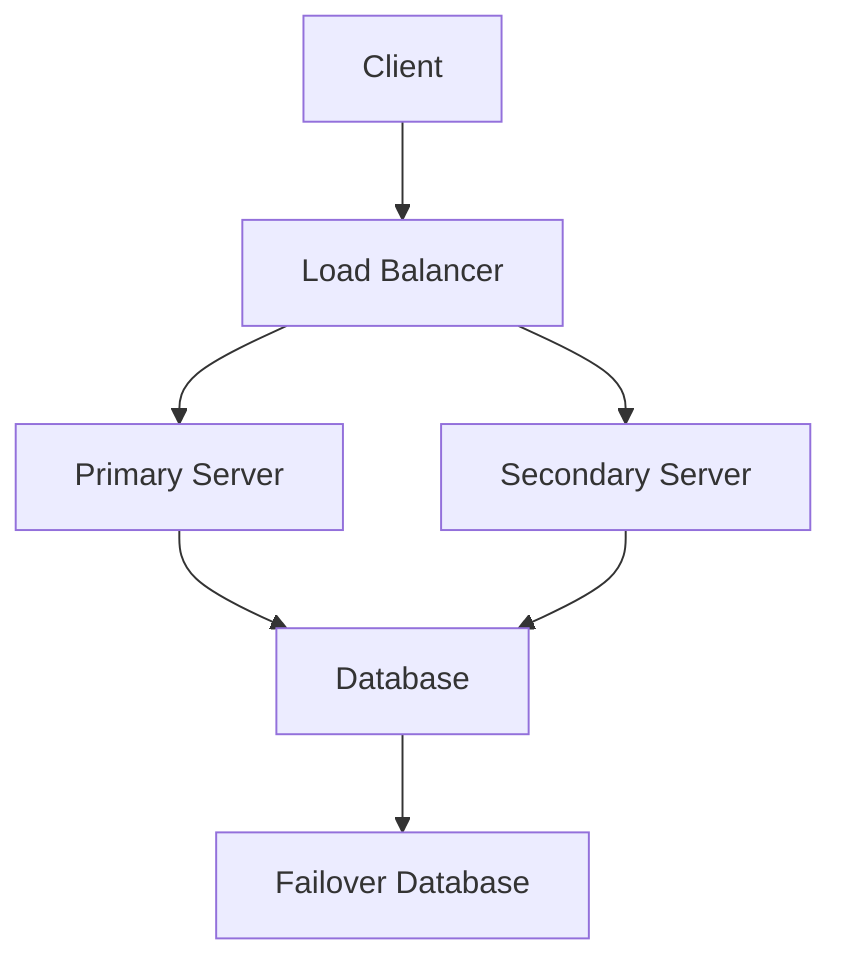

## 23.11 Designing for Scalability and High Availability

In today's fast-paced digital world, designing applications that can handle increasing loads and remain operational during failures is crucial. Scalability and high availability are two key aspects that ensure your Ruby applications can meet these demands. In this section, we will explore the principles and techniques to achieve scalability and high availability in Ruby applications.

### Understanding Scalability

Scalability refers to an application's ability to handle a growing amount of work or its potential to accommodate growth. There are two primary types of scalability:

- **Horizontal Scalability**: This involves adding more machines or nodes to your system. It is often referred to as "scaling out." Horizontal scaling is beneficial for distributed systems and can provide redundancy and fault tolerance.

- **Vertical Scalability**: This involves adding more resources (CPU, RAM) to an existing machine. It is often referred to as "scaling up." Vertical scaling is limited by the capacity of a single machine.

#### Horizontal vs. Vertical Scaling

| Aspect                | Horizontal Scaling                  | Vertical Scaling                  |
|-----------------------|-------------------------------------|-----------------------------------|
| **Cost**              | Can be more cost-effective          | Can become expensive              |
| **Complexity**        | Requires distributed system design  | Simpler to implement              |
| **Limitations**       | Limited by network and coordination | Limited by hardware capabilities  |
| **Redundancy**        | Provides redundancy                 | Limited redundancy                |

### Designing for Scalability

To design scalable Ruby applications, consider the following strategies:

#### Load Balancing

Load balancing distributes incoming network traffic across multiple servers to ensure no single server becomes overwhelmed. This improves responsiveness and availability.

```ruby
# Example of a simple load balancer using Ruby
require 'socket'

servers = ['192.168.1.1', '192.168.1.2', '192.168.1.3']
server_index = 0

server = TCPServer.new(8080)

loop do
  client = server.accept
  server_ip = servers[server_index]
  server_index = (server_index + 1) % servers.size

  # Forward the request to the selected server
  # This is a simplified example; in practice, use a library or tool for load balancing
  puts "Forwarding request to #{server_ip}"
  client.close
end
```

#### Stateless Services

Designing stateless services means that each request from a client contains all the information needed to process that request. This allows any server to handle any request, making it easier to scale horizontally.

#### Database Replication

Database replication involves copying and maintaining database objects in multiple databases that make up a distributed database system. This improves data availability and fault tolerance.

```ruby
# Example of setting up a read replica in ActiveRecord
ActiveRecord::Base.establish_connection(
  adapter: 'postgresql',
  host: 'primary-db.example.com',
  username: 'user',
  password: 'password',
  database: 'myapp_production'
)

# Read replica configuration
ActiveRecord::Base.establish_connection(
  adapter: 'postgresql',
  host: 'replica-db.example.com',
  username: 'user',
  password: 'password',
  database: 'myapp_production',
  replica: true
)
```

### High Availability

High availability ensures that your application remains operational even in the event of failures. This involves redundancy, failover mechanisms, and disaster recovery planning.

#### Implementing Redundancy

Redundancy involves having multiple instances of critical components to ensure that if one fails, others can take over. This can be achieved through:

- **Multiple Application Servers**: Deploying your application on multiple servers.
- **Database Replication**: As discussed, having read replicas or a failover database.
- **Load Balancers**: Distributing traffic to healthy servers.

#### Failover Mechanisms

Failover is the process of switching to a redundant or standby system upon the failure of the currently active system. This can be automated using tools like HAProxy or AWS Elastic Load Balancing.



### Patterns for Scalability and High Availability

#### Sharding and Partitioning

Sharding involves splitting your database into smaller, more manageable pieces, called shards. Each shard is a separate database, and together they form a single logical database.

#### Content Delivery Networks (CDNs)

CDNs distribute content to servers closer to the user, reducing latency and improving load times. This is especially useful for static assets like images, CSS, and JavaScript files.

### Monitoring and Auto-Scaling

Monitoring your application is crucial for identifying bottlenecks and scaling needs. Tools like New Relic, Datadog, and Prometheus can help monitor performance and trigger auto-scaling.

#### Auto-Scaling

Auto-scaling automatically adjusts the number of servers based on current demand. This ensures that you have enough resources to handle traffic spikes without over-provisioning.

### Performance Testing and Disaster Recovery

#### Performance Testing

Regular performance testing helps identify bottlenecks and ensure your application can handle expected loads. Use tools like JMeter or Apache Bench for load testing.

#### Disaster Recovery

Planning for disaster recovery involves creating a strategy to recover from catastrophic failures. This includes regular backups, off-site storage, and a tested recovery plan.

### Try It Yourself

Experiment with the following:

- Modify the load balancer example to use a round-robin algorithm.
- Set up a simple database replication using PostgreSQL.
- Implement a basic monitoring script using Ruby to track server uptime.

### Summary

Designing for scalability and high availability involves a combination of strategies and techniques. By understanding the principles of horizontal and vertical scaling, implementing load balancing, stateless services, and database replication, and planning for redundancy and failover, you can ensure your Ruby applications are robust and resilient.

Remember, this is just the beginning. As you progress, you'll build more complex and interactive applications. Keep experimenting, stay curious, and enjoy the journey!

## Quiz: Designing for Scalability and High Availability



### What is horizontal scalability?

- [x] Adding more machines or nodes to your system
- [ ] Adding more resources to an existing machine
- [ ] Reducing the number of servers
- [ ] Increasing the CPU of a single server

> **Explanation:** Horizontal scalability involves adding more machines or nodes to your system, often referred to as "scaling out."

### Which of the following is a benefit of stateless services?

- [x] Easier to scale horizontally
- [ ] Requires more memory
- [ ] Increases server dependency
- [ ] Reduces redundancy

> **Explanation:** Stateless services are easier to scale horizontally because any server can handle any request.

### What is the purpose of a load balancer?

- [x] Distribute incoming network traffic across multiple servers
- [ ] Increase the CPU of a single server
- [ ] Reduce the number of servers
- [ ] Store data in a database

> **Explanation:** A load balancer distributes incoming network traffic across multiple servers to ensure no single server becomes overwhelmed.

### What is sharding?

- [x] Splitting a database into smaller, more manageable pieces
- [ ] Increasing the size of a database
- [ ] Reducing the number of database servers
- [ ] Combining multiple databases into one

> **Explanation:** Sharding involves splitting a database into smaller, more manageable pieces, called shards.

### Which tool can be used for monitoring application performance?

- [x] New Relic
- [ ] PostgreSQL
- [ ] HAProxy
- [ ] Redis

> **Explanation:** New Relic is a tool that can be used for monitoring application performance.

### What is the role of a CDN?

- [x] Distribute content to servers closer to the user
- [ ] Increase server memory
- [ ] Store data in a database
- [ ] Reduce the number of servers

> **Explanation:** A CDN distributes content to servers closer to the user, reducing latency and improving load times.

### What is a failover mechanism?

- [x] Switching to a redundant system upon failure
- [ ] Increasing server CPU
- [ ] Reducing server memory
- [ ] Combining multiple servers into one

> **Explanation:** A failover mechanism involves switching to a redundant or standby system upon the failure of the currently active system.

### What is the benefit of auto-scaling?

- [x] Automatically adjusts the number of servers based on demand
- [ ] Increases server memory
- [ ] Reduces server CPU
- [ ] Stores data in a database

> **Explanation:** Auto-scaling automatically adjusts the number of servers based on current demand, ensuring enough resources to handle traffic spikes.

### What is the purpose of disaster recovery planning?

- [x] Recover from catastrophic failures
- [ ] Increase server CPU
- [ ] Reduce server memory
- [ ] Store data in a database

> **Explanation:** Disaster recovery planning involves creating a strategy to recover from catastrophic failures, including backups and a tested recovery plan.

### True or False: Vertical scalability involves adding more machines to your system.

- [ ] True
- [x] False

> **Explanation:** Vertical scalability involves adding more resources (CPU, RAM) to an existing machine, not adding more machines.




