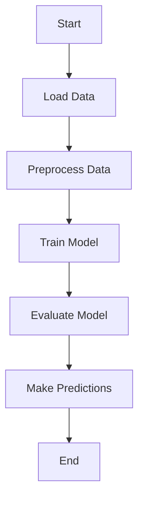

## 23.3 Machine Learning and Data Science with Ruby

In the ever-evolving landscape of machine learning and data science, Ruby, traditionally known for its web development prowess, is carving out a niche for itself. While not as mainstream as Python or R in this domain, Ruby offers a unique blend of simplicity and power, making it an attractive option for developers familiar with the language. In this section, we will explore how Ruby can be leveraged for machine learning and data science applications, utilizing a variety of libraries and tools.

### The Role of Ruby in Data Science and Machine Learning

Ruby's role in data science and machine learning is often overshadowed by languages like Python and R, which have a more extensive ecosystem of libraries and community support. However, Ruby's elegant syntax and object-oriented nature make it a viable option for certain data science tasks, especially when integrated with other languages and tools.

Ruby's strengths lie in its ability to handle data manipulation, perform numerical computations, and integrate seamlessly with other languages. This makes it a suitable choice for developers who are already proficient in Ruby and wish to extend their skills into the realm of data science and machine learning.

### Key Libraries and Tools

To effectively use Ruby for machine learning and data science, it's essential to familiarize yourself with some of the key libraries and tools available in the Ruby ecosystem. Let's explore a few of these:

#### RubyMVC

[RubyMVC](https://github.com/kiyoka/rubymvc) is a machine learning library for Ruby that provides a simple interface for building and training machine learning models. It supports various algorithms and is designed to be easy to use, making it a great starting point for Ruby developers new to machine learning.

#### Numo::NArray

[Numo::NArray](https://github.com/ruby-numo/narray) is a numerical computation library for Ruby, similar to NumPy in Python. It provides a powerful array class for numerical data manipulation, making it an essential tool for data scientists working with Ruby.

```ruby
require 'numo/narray'

# Create a Numo::NArray
a = Numo::DFloat[1, 2, 3, 4, 5]
b = Numo::DFloat[5, 4, 3, 2, 1]

# Perform element-wise addition
c = a + b
puts c
# Output: [6, 6, 6, 6, 6]
```

#### Daru

[Daru](https://github.com/SciRuby/daru) is a data analysis library for Ruby, providing data structures and methods for data manipulation and analysis. It is similar to Pandas in Python and is part of the SciRuby project, which aims to bring scientific computing capabilities to Ruby.

```ruby
require 'daru'

# Create a Daru::DataFrame
data = Daru::DataFrame.new({
  a: [1, 2, 3, 4, 5],
  b: [5, 4, 3, 2, 1]
})

# Perform data manipulation
data[:c] = data[:a] + data[:b]
puts data
```

### Building Simple Machine Learning Models

With the foundational libraries in place, let's explore how to build simple machine learning models using Ruby. We'll use RubyMVC to demonstrate this process.

#### Example: Linear Regression with RubyMVC

```ruby
require 'rubymvc'

# Create a dataset
data = [
  { x: 1, y: 2 },
  { x: 2, y: 3 },
  { x: 3, y: 5 },
  { x: 4, y: 7 },
  { x: 5, y: 11 }
]

# Initialize a linear regression model
model = RubyMVC::LinearRegression.new

# Train the model
model.train(data, :x, :y)

# Make predictions
prediction = model.predict(6)
puts "Prediction for x=6: #{prediction}"
```

### Integration with Other Languages and Toolkits

One of Ruby's strengths is its ability to integrate with other languages and toolkits, allowing developers to leverage the best of both worlds. A notable tool for this purpose is [PyCall](https://github.com/mrkn/pycall.rb), which enables calling Python libraries from Ruby.

#### Example: Using scikit-learn via PyCall

```ruby
require 'pycall/import'
include PyCall::Import

# Import scikit-learn's LinearRegression
pyimport 'sklearn.linear_model', as: 'lm'

# Create a linear regression model
model = lm.LinearRegression.new

# Prepare data
x = [[1], [2], [3], [4], [5]]
y = [2, 3, 5, 7, 11]

# Train the model
model.fit(x, y)

# Make predictions
prediction = model.predict([[6]])
puts "Prediction for x=6: #{prediction[0]}"
```

### Limitations and Considerations

While Ruby offers several tools for machine learning and data science, there are limitations to consider:

- **Library Ecosystem**: Ruby's library ecosystem for data science is not as extensive as Python's, which can limit the complexity of projects you can undertake solely in Ruby.
- **Performance**: Ruby may not be as performant as languages like C++ or Java for computationally intensive tasks, though this can be mitigated by using C extensions or integrating with faster languages.
- **Community and Support**: The community and support for Ruby in the data science domain are smaller compared to Python or R, which can impact the availability of resources and community-driven improvements.

### Exploring the SciRuby Ecosystem

The [SciRuby](http://sciruby.com/) project is an initiative to bring scientific computing capabilities to Ruby. It includes libraries like Numo::NArray and Daru, as well as others for visualization and statistical analysis. Exploring the SciRuby ecosystem can provide Ruby developers with the tools needed to perform data science tasks effectively.

### Try It Yourself

To truly grasp the power of Ruby in machine learning and data science, it's essential to experiment with the code examples provided. Try modifying the datasets, experimenting with different algorithms, or integrating additional libraries to see how Ruby can be tailored to your specific needs.

### Visualizing Data Flow and Model Building

To better understand the flow of data and the process of building machine learning models in Ruby, let's visualize a simple workflow using Mermaid.js.



This diagram represents a typical machine learning workflow, from loading and preprocessing data to training and evaluating a model, and finally making predictions.

### Knowledge Check

Before we wrap up, let's reinforce what we've learned with a few questions:

- What are the key libraries for machine learning and data science in Ruby?
- How can Ruby integrate with Python for machine learning tasks?
- What are some limitations of using Ruby for data science?

### Conclusion

Ruby may not be the first language that comes to mind for machine learning and data science, but it offers a unique set of tools and capabilities that can be leveraged effectively. By understanding its strengths and limitations, and by integrating with other languages and ecosystems, Ruby developers can expand their skill set into the exciting world of data science and machine learning.

Remember, this is just the beginning. As you progress, you'll discover more advanced techniques and tools that will enable you to tackle complex data science challenges. Keep experimenting, stay curious, and enjoy the journey!

## Quiz: Machine Learning and Data Science with Ruby



### Which Ruby library is similar to NumPy in Python for numerical computations?

- [x] Numo::NArray
- [ ] Daru
- [ ] RubyMVC
- [ ] PyCall

> **Explanation:** Numo::NArray is a numerical computation library for Ruby, similar to NumPy in Python.

### What is the primary use of the Daru library in Ruby?

- [x] Data analysis
- [ ] Machine learning model training
- [ ] Numerical computations
- [ ] Integrating with Python

> **Explanation:** Daru is used for data analysis in Ruby, providing data structures and methods for data manipulation.

### How can Ruby integrate with Python libraries for machine learning?

- [x] Using PyCall
- [ ] Using RubyMVC
- [ ] Using Numo::NArray
- [ ] Using Daru

> **Explanation:** PyCall allows Ruby to call Python libraries, enabling integration with Python's machine learning tools.

### What is a limitation of using Ruby for data science?

- [x] Smaller library ecosystem
- [ ] Lack of object-oriented features
- [ ] Inability to handle data manipulation
- [ ] Poor syntax

> **Explanation:** Ruby's library ecosystem for data science is not as extensive as Python's, which can limit the complexity of projects.

### Which library is part of the SciRuby project?

- [x] Daru
- [x] Numo::NArray
- [ ] PyCall
- [ ] RubyMVC

> **Explanation:** Both Daru and Numo::NArray are part of the SciRuby project, which aims to bring scientific computing to Ruby.

### What is the purpose of RubyMVC?

- [x] Building machine learning models
- [ ] Data visualization
- [ ] Numerical computations
- [ ] Integrating with other languages

> **Explanation:** RubyMVC is a machine learning library for Ruby, providing a simple interface for building and training models.

### Which tool allows Ruby to call Python libraries?

- [x] PyCall
- [ ] RubyMVC
- [ ] Numo::NArray
- [ ] Daru

> **Explanation:** PyCall enables Ruby to call Python libraries, facilitating integration with Python's ecosystem.

### What is a benefit of using Ruby for machine learning?

- [x] Elegant syntax
- [ ] Extensive library ecosystem
- [ ] High performance
- [ ] Large community support

> **Explanation:** Ruby's elegant syntax makes it an attractive option for developers familiar with the language.

### What is the output of the following code snippet using Numo::NArray?
```ruby
a = Numo::DFloat[1, 2, 3]
b = Numo::DFloat[4, 5, 6]
c = a + b
puts c
```

- [x] [5, 7, 9]
- [ ] [4, 5, 6]
- [ ] [1, 2, 3]
- [ ] [0, 0, 0]

> **Explanation:** The code performs element-wise addition of two Numo::NArray objects, resulting in [5, 7, 9].

### True or False: Ruby can be used for machine learning without integrating with other languages.

- [x] True
- [ ] False

> **Explanation:** While Ruby can be used for machine learning, integrating with other languages like Python can enhance its capabilities.


