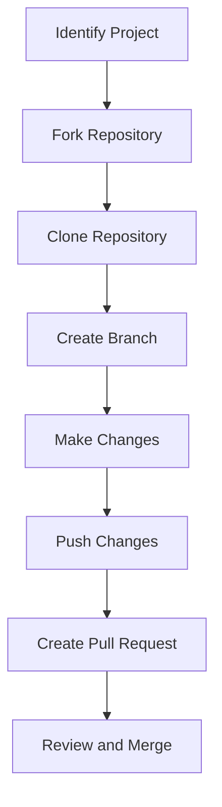

## 23.4 Contributing to Open-Source Ruby Projects

Contributing to open-source Ruby projects is a rewarding endeavor that not only enhances your programming skills but also connects you with a vibrant community of developers. This guide will walk you through the benefits of contributing, how to find projects, the process of contributing, and best practices for effective collaboration.

### Benefits of Contributing to Open-Source Projects

Contributing to open-source projects offers numerous advantages:

- **Skill Enhancement**: Working on real-world projects helps you hone your coding skills, learn new technologies, and understand different coding styles.
- **Networking**: Engaging with the open-source community allows you to connect with like-minded developers, which can lead to new opportunities and collaborations.
- **Portfolio Building**: Contributions to well-known projects can enhance your resume and demonstrate your commitment to continuous learning and improvement.
- **Giving Back**: Open-source projects rely on community contributions. By participating, you help improve software that others use and benefit from.
- **Mentorship Opportunities**: Many projects have experienced developers who can provide guidance and mentorship, helping you grow as a developer.

### Finding Projects to Contribute To

Finding the right project to contribute to can be daunting, but these steps can help streamline the process:

1. **Identify Your Interests**: Start by considering what areas of Ruby development interest you the most. Whether it's web development, data processing, or tooling, focusing on your interests will keep you motivated.

2. **Explore GitHub**: GitHub is the largest platform for open-source projects. Use the search feature to find Ruby projects by language, topic, or popularity. Look for repositories with labels like `good first issue` or `help wanted`.

3. **Check Community Platforms**: Platforms like Reddit, Ruby forums, and Stack Overflow often have discussions about open-source projects seeking contributors.

4. **Follow Influential Developers**: Many experienced developers share their projects and contributions on social media. Following them can lead you to interesting projects.

5. **Participate in Hackathons**: Events like Hacktoberfest encourage contributions to open-source projects and can be a great way to start.

### The Process of Contributing

Once you've identified a project, follow these steps to contribute effectively:

#### Forking the Repository

Forking creates a personal copy of the repository on your GitHub account, allowing you to make changes without affecting the original project.

```bash
# Navigate to the repository on GitHub and click the "Fork" button.
```

#### Cloning the Repository

Clone the forked repository to your local machine to start working on it.

```bash
git clone https://github.com/your-username/repository-name.git
cd repository-name
```

#### Creating a Branch

Create a new branch for your changes. This keeps your work organized and makes it easier to manage multiple contributions.

```bash
git checkout -b feature/your-feature-name
```

#### Making Changes

Implement your changes, ensuring they align with the project's coding standards and guidelines. Use clear and concise commit messages to document your changes.

```bash
git add .
git commit -m "Add feature: your feature description"
```

#### Pushing Changes

Push your changes to your forked repository on GitHub.

```bash
git push origin feature/your-feature-name
```

#### Creating a Pull Request

Navigate to the original repository and create a pull request from your branch. Provide a detailed description of your changes and any relevant information for the maintainers.

```markdown
# Pull Request Template
## Description
Provide a brief description of the changes you made and why.

## Related Issues
Link any related issues or discussions.

## Checklist
- [ ] Code adheres to coding standards
- [ ] Tests have been added or updated
- [ ] Documentation has been updated
```

### Adhering to Project Guidelines and Coding Standards

Respecting the project's guidelines and coding standards is crucial for a successful contribution:

- **Read the Documentation**: Familiarize yourself with the project's README, contribution guidelines, and code of conduct.
- **Follow Coding Standards**: Adhere to the project's coding style, which may include naming conventions, indentation, and file organization.
- **Write Tests**: Ensure your changes are covered by tests and that existing tests pass.
- **Update Documentation**: If your changes affect the documentation, update it accordingly.

### Effective Communication Within the Community

Communication is key to successful collaboration in open-source projects:

- **Be Respectful**: Always communicate respectfully and professionally with maintainers and other contributors.
- **Ask Questions**: If you're unsure about something, don't hesitate to ask questions. Most communities are welcoming and willing to help.
- **Provide Feedback**: Constructive feedback is valuable. If you notice areas for improvement, share your thoughts respectfully.
- **Stay Active**: Regularly check for updates on your pull requests and respond promptly to any feedback.

### Encouraging Mentorship and Learning

Open-source contributions offer excellent opportunities for mentorship and learning:

- **Seek Mentorship**: Reach out to experienced contributors for guidance. Many are willing to mentor newcomers.
- **Learn from Reviews**: Use feedback on your pull requests as a learning opportunity to improve your skills.
- **Contribute to Documentation**: Writing or improving documentation is a great way to start contributing and learn about the project.
- **Participate in Community Events**: Join community calls, webinars, or meetups to learn from others and share your experiences.

### Try It Yourself

To get started, try contributing to a small Ruby project. Look for issues labeled `good first issue` on GitHub and follow the steps outlined in this guide. Experiment with different types of contributions, such as fixing bugs, adding features, or improving documentation.

### Visualizing the Contribution Workflow



This diagram illustrates the typical workflow for contributing to an open-source project, from identifying a project to having your changes reviewed and merged.

### References and Links

- [GitHub's Guide to Open Source](https://opensource.guide/)
- [Ruby on Rails Contribution Guide](https://guides.rubyonrails.org/contributing_to_ruby_on_rails.html)
- [Open Source Guides](https://opensource.guide/how-to-contribute/)
- [GitHub's Forking Workflow](https://guides.github.com/activities/forking/)

### Knowledge Check

- What are the benefits of contributing to open-source projects?
- How can you find Ruby projects to contribute to?
- What are the steps involved in making a contribution?
- Why is it important to adhere to project guidelines and coding standards?
- How can effective communication enhance your contribution experience?

### Embrace the Journey

Remember, contributing to open-source projects is a journey of learning and growth. As you progress, you'll gain valuable skills, make meaningful connections, and contribute to software that impacts users worldwide. Keep experimenting, stay curious, and enjoy the journey!

## Quiz: Contributing to Open-Source Ruby Projects



### What is one of the primary benefits of contributing to open-source projects?

- [x] Skill Enhancement
- [ ] Financial Gain
- [ ] Guaranteed Employment
- [ ] Free Software

> **Explanation:** Contributing to open-source projects enhances your coding skills and provides learning opportunities.

### Which platform is most commonly used to find open-source Ruby projects?

- [x] GitHub
- [ ] LinkedIn
- [ ] Facebook
- [ ] Twitter

> **Explanation:** GitHub is the largest platform for hosting and contributing to open-source projects.

### What is the first step in contributing to an open-source project?

- [x] Forking the repository
- [ ] Creating a branch
- [ ] Making changes
- [ ] Creating a pull request

> **Explanation:** Forking the repository creates a personal copy that you can work on.

### Why is it important to adhere to project guidelines?

- [x] To ensure consistency and quality
- [ ] To increase the number of commits
- [ ] To avoid writing tests
- [ ] To bypass code reviews

> **Explanation:** Adhering to guidelines ensures that contributions are consistent with the project's standards.

### How can you effectively communicate within the open-source community?

- [x] Be respectful and ask questions
- [ ] Ignore feedback
- [ ] Demand immediate responses
- [ ] Use informal language

> **Explanation:** Respectful communication and asking questions foster a positive collaborative environment.

### What should you do if you're unsure about a contribution?

- [x] Ask questions
- [ ] Proceed without checking
- [ ] Delete your changes
- [ ] Wait for someone else to fix it

> **Explanation:** Asking questions helps clarify uncertainties and ensures your contribution aligns with project goals.

### What is a good way to start contributing to a project?

- [x] Improve documentation
- [ ] Rewrite the entire codebase
- [ ] Ignore existing issues
- [ ] Change the project name

> **Explanation:** Improving documentation is a valuable and accessible way to start contributing.

### What is the purpose of creating a branch for your changes?

- [x] To organize and manage changes separately
- [ ] To delete the main branch
- [ ] To avoid using Git
- [ ] To merge without review

> **Explanation:** Branches help manage changes separately and facilitate organized contributions.

### What is a pull request?

- [x] A request to merge your changes into the main repository
- [ ] A request to delete a repository
- [ ] A request to create a new repository
- [ ] A request to change repository ownership

> **Explanation:** A pull request is a request to merge your changes into the original repository.

### True or False: Open-source contributions can lead to mentorship opportunities.

- [x] True
- [ ] False

> **Explanation:** Open-source projects often have experienced developers who can provide mentorship and guidance.


