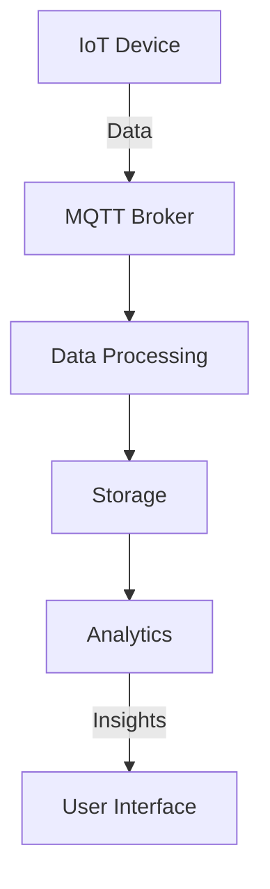

## 23.6 Internet of Things (IoT) with Ruby

The Internet of Things (IoT) represents a transformative shift in how we interact with the world around us, enabling devices to communicate and collaborate in ways previously unimaginable. Ruby, with its elegant syntax and robust ecosystem, offers unique advantages for IoT development. In this section, we will explore how Ruby can be leveraged to build IoT applications, focusing on connecting and controlling devices, processing data from sensors, and ensuring security.

### The Role of Ruby in IoT Development

Ruby is traditionally known for web development, but its versatility extends to IoT applications. Ruby's readability and ease of use make it an attractive choice for prototyping and developing IoT solutions. While Ruby may not be the first language that comes to mind for IoT due to its higher memory consumption compared to languages like C or Python, it offers several benefits:

- **Rapid Prototyping**: Ruby's concise syntax allows developers to quickly prototype IoT applications.
- **Rich Ecosystem**: Ruby's extensive libraries and gems provide tools for various IoT tasks.
- **Community Support**: A vibrant community offers support and resources for IoT development.

### Tools for IoT Development in Ruby

#### Artoo

[Artoo](http://artoo.io/) is a Ruby framework designed for robotics, physical computing, and the Internet of Things. It provides a simple and consistent API for interacting with hardware devices.

- **Features**: Artoo supports a wide range of devices and platforms, including Arduino, Raspberry Pi, and more.
- **Installation**: You can install Artoo via RubyGems:

  ```bash
  gem install artoo
  ```

- **Example**: Controlling an LED with Artoo

  ```ruby
  require 'artoo'

  connection :arduino, adaptor: :firmata, port: '/dev/ttyUSB0'
  device :led, driver: :led, pin: 13

  work do
    every(1.second) do
      led.toggle
    end
  end
  ```

  > **Explanation**: This code toggles an LED connected to pin 13 of an Arduino board every second.

#### Ruby Serialport

[Ruby Serialport](https://github.com/hparra/ruby-serialport) is a library for serial communication, essential for interacting with many IoT devices.

- **Installation**: Install via RubyGems:

  ```bash
  gem install ruby-serialport
  ```

- **Example**: Reading data from a sensor

  ```ruby
  require 'serialport'

  port_str = "/dev/ttyUSB0"
  baud_rate = 9600
  data_bits = 8
  stop_bits = 1
  parity = SerialPort::NONE

  sp = SerialPort.new(port_str, baud_rate, data_bits, stop_bits, parity)

  while true do
    data = sp.gets
    puts "Sensor data: #{data}"
  end

  sp.close
  ```

  > **Explanation**: This script reads data from a sensor connected via a serial port.

### Controlling Hardware with Ruby

Ruby can control various hardware components such as LEDs, motors, and sensors. Let's explore some examples.

#### Controlling an LED

Using Artoo, we can easily control an LED:

```ruby
require 'artoo'

connection :arduino, adaptor: :firmata, port: '/dev/ttyUSB0'
device :led, driver: :led, pin: 13

work do
  every(1.second) do
    led.toggle
  end
end
```

#### Reading Sensor Data

Sensors are crucial in IoT for gathering data. Here's how you can read data from a temperature sensor using Ruby Serialport:

```ruby
require 'serialport'

port_str = "/dev/ttyUSB0"
baud_rate = 9600
data_bits = 8
stop_bits = 1
parity = SerialPort::NONE

sp = SerialPort.new(port_str, baud_rate, data_bits, stop_bits, parity)

while true do
  data = sp.gets
  puts "Temperature: #{data}"
end

sp.close
```

### Communication Protocols in IoT

Communication protocols are essential for IoT devices to exchange data. One of the most popular protocols is MQTT (Message Queuing Telemetry Transport).

#### MQTT with Ruby

MQTT is a lightweight messaging protocol ideal for IoT due to its low bandwidth requirements.

- **Installation**: Use the `mqtt` gem:

  ```bash
  gem install mqtt
  ```

- **Example**: Publishing and subscribing to MQTT topics

  ```ruby
  require 'mqtt'

  # Connect to the MQTT broker
  client = MQTT::Client.connect('mqtt://broker.hivemq.com')

  # Subscribe to a topic
  client.subscribe('test/topic')

  # Publish a message
  client.publish('test/topic', 'Hello, MQTT!')

  # Receive messages
  client.get do |topic, message|
    puts "#{topic}: #{message}"
  end
  ```

  > **Explanation**: This script connects to an MQTT broker, subscribes to a topic, publishes a message, and listens for incoming messages.

### Security Considerations in IoT Applications

Security is paramount in IoT applications due to the sensitive nature of the data and the potential for unauthorized access.

- **Data Encryption**: Ensure data is encrypted during transmission and storage.
- **Authentication**: Implement robust authentication mechanisms to prevent unauthorized access.
- **Regular Updates**: Keep software and firmware updated to protect against vulnerabilities.
- **Network Security**: Use secure communication protocols and firewalls to protect the network.

### Limitations and Language Considerations

While Ruby offers many advantages, it may not be suitable for all IoT applications, especially those running on resource-constrained devices.

- **Memory Usage**: Ruby's higher memory consumption can be a limitation on devices with limited resources.
- **Performance**: For performance-critical applications, consider using languages like C or Python.
- **Integration**: Ruby can be used in conjunction with other languages to leverage its strengths while addressing its limitations.

### Try It Yourself

Experiment with the examples provided by modifying the code to control different hardware components or interact with various sensors. Consider integrating Ruby with other languages to create a hybrid IoT solution that leverages the strengths of each language.

### Visualizing IoT Architecture with Ruby



> **Diagram Explanation**: This diagram illustrates a typical IoT architecture where devices send data to an MQTT broker, which is then processed, stored, and analyzed to provide insights through a user interface.

### Knowledge Check

- What are the benefits of using Ruby for IoT development?
- How can Artoo be used to control hardware devices?
- What is MQTT, and why is it suitable for IoT applications?
- What are some security considerations for IoT applications?
- When might you need to use another language alongside Ruby in IoT development?

### Summary

In this section, we've explored how Ruby can be used in IoT development, from controlling hardware to processing data and ensuring security. While Ruby may not be the first choice for resource-constrained devices, its ease of use and rich ecosystem make it a valuable tool for prototyping and developing IoT solutions. Remember, this is just the beginning. As you progress, you'll build more complex and interactive IoT applications. Keep experimenting, stay curious, and enjoy the journey!

## Quiz: Internet of Things (IoT) with Ruby



### What is one of the main advantages of using Ruby for IoT development?

- [x] Rapid prototyping
- [ ] Low memory usage
- [ ] High performance
- [ ] Built-in IoT libraries

> **Explanation:** Ruby's concise syntax allows for rapid prototyping, making it easier to develop and test IoT applications quickly.

### Which Ruby framework is designed for robotics and IoT?

- [x] Artoo
- [ ] Rails
- [ ] Sinatra
- [ ] Hanami

> **Explanation:** Artoo is a Ruby framework specifically designed for robotics, physical computing, and IoT applications.

### What protocol is commonly used in IoT for lightweight messaging?

- [x] MQTT
- [ ] HTTP
- [ ] FTP
- [ ] SMTP

> **Explanation:** MQTT is a lightweight messaging protocol ideal for IoT due to its low bandwidth requirements.

### What is a key security consideration in IoT applications?

- [x] Data encryption
- [ ] Open network access
- [ ] Using default passwords
- [ ] Disabling updates

> **Explanation:** Data encryption is crucial to protect sensitive information transmitted between IoT devices and servers.

### Which Ruby library is used for serial communication?

- [x] Ruby Serialport
- [ ] Net::HTTP
- [ ] Nokogiri
- [ ] ActiveRecord

> **Explanation:** Ruby Serialport is a library used for serial communication, essential for interacting with many IoT devices.

### What is a limitation of using Ruby in IoT applications?

- [x] Higher memory consumption
- [ ] Lack of libraries
- [ ] Poor community support
- [ ] Inability to handle HTTP requests

> **Explanation:** Ruby's higher memory consumption can be a limitation on devices with limited resources.

### How can you ensure secure communication in IoT applications?

- [x] Use secure communication protocols
- [ ] Disable encryption
- [ ] Use default credentials
- [ ] Allow open network access

> **Explanation:** Using secure communication protocols helps protect data transmitted between IoT devices and servers.

### What is the purpose of the `mqtt` gem in Ruby?

- [x] To facilitate MQTT communication
- [ ] To manage database connections
- [ ] To parse XML files
- [ ] To handle HTTP requests

> **Explanation:** The `mqtt` gem in Ruby is used to facilitate communication using the MQTT protocol.

### True or False: Ruby is the best choice for all IoT applications.

- [ ] True
- [x] False

> **Explanation:** While Ruby is excellent for rapid prototyping and development, it may not be suitable for all IoT applications, especially those on resource-constrained devices.

### What is a common use case for Ruby in IoT?

- [x] Prototyping IoT solutions
- [ ] Developing operating systems
- [ ] Building low-level device drivers
- [ ] Creating real-time systems

> **Explanation:** Ruby is often used for prototyping IoT solutions due to its ease of use and rapid development capabilities.


