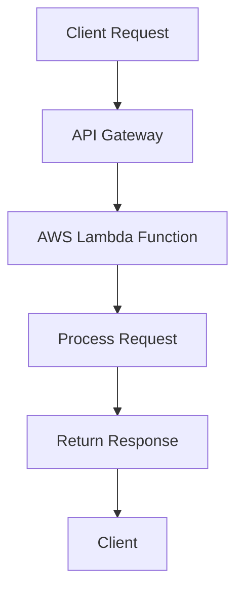

## 23.7 Serverless Computing with Ruby

In this section, we delve into the world of serverless computing, a paradigm that has revolutionized how applications are built and deployed. We'll focus on how Ruby developers can leverage serverless architectures, particularly using AWS Lambda, to create scalable and efficient applications. 

### Understanding Serverless Computing

**Serverless computing** is a cloud-computing execution model where the cloud provider dynamically manages the allocation and provisioning of servers. Despite its name, serverless computing does not mean that servers are no longer involved. Instead, it abstracts the server management tasks away from the developer, allowing them to focus solely on writing code.

#### Benefits of Serverless Computing

1. **Cost Efficiency**: Pay only for the compute time you consume. There is no charge when your code is not running.
2. **Scalability**: Automatically scales your application by running code in response to each trigger.
3. **Reduced Operational Overhead**: No need to manage or provision servers, reducing the complexity of infrastructure management.
4. **Faster Time to Market**: Focus on writing code and deploying applications without worrying about the underlying infrastructure.

### Deploying Ruby Functions on AWS Lambda

AWS Lambda is a serverless compute service that lets you run code without provisioning or managing servers. You can execute your Ruby code in response to various events, such as HTTP requests via Amazon API Gateway, changes to data in an Amazon S3 bucket, or updates to a DynamoDB table.

#### Setting Up AWS Lambda for Ruby

To deploy Ruby functions on AWS Lambda, follow these steps:

1. **Create an AWS Account**: If you don't have one, sign up at [AWS](https://aws.amazon.com/).

2. **Install AWS CLI**: The AWS Command Line Interface (CLI) is a unified tool to manage your AWS services. Install it from the [AWS CLI page](https://aws.amazon.com/cli/).

3. **Set Up Your Environment**: Configure your AWS CLI with your credentials using the command:
   ```bash
   aws configure
   ```

4. **Create a Lambda Function**: Use the AWS Management Console, AWS CLI, or AWS SDKs to create a Lambda function. For Ruby, you can specify the runtime as `ruby2.7` or `ruby3.2`.

#### Writing a Simple Ruby Lambda Function

Here is a basic example of a Ruby function that returns a simple JSON response:

```ruby
# lambda_function.rb
require 'json'

def lambda_handler(event:, context:)
  {
    statusCode: 200,
    body: JSON.generate('Hello from Ruby Lambda!')
  }
end
```

#### Deploying the Ruby Function

To deploy the function, you can use the AWS Management Console or tools like the AWS CLI. Here's a simple deployment using the AWS CLI:

```bash
zip function.zip lambda_function.rb

aws lambda create-function --function-name MyRubyFunction \
--zip-file fileb://function.zip --handler lambda_function.lambda_handler \
--runtime ruby2.7 --role arn:aws:iam::123456789012:role/execution_role
```

### Tools for Serverless Development

#### Serverless Framework

The [Serverless Framework](https://www.serverless.com/) is an open-source framework that simplifies building serverless applications. It provides a powerful CLI that helps automate the deployment of serverless functions.

**Installation and Setup**:

1. **Install Node.js**: The Serverless Framework requires Node.js. Download and install it from [Node.js](https://nodejs.org/).

2. **Install Serverless Framework**: Use npm to install the Serverless Framework globally:
   ```bash
   npm install -g serverless
   ```

3. **Create a Serverless Project**: Initialize a new serverless project with Ruby:
   ```bash
   serverless create --template aws-ruby --path my-service
   cd my-service
   ```

4. **Deploy Your Service**: Deploy your service using the command:
   ```bash
   serverless deploy
   ```

#### AWS Serverless Application Model (SAM)

AWS SAM is an open-source framework that you can use to build serverless applications on AWS. It extends AWS CloudFormation to provide a simplified way of defining the Amazon API Gateway APIs, AWS Lambda functions, and Amazon DynamoDB tables needed by your serverless application.

**Key Features**:

- **Simplified Syntax**: Define serverless applications using a simplified syntax.
- **Local Testing**: Test Lambda functions locally using SAM CLI.
- **Integration with AWS Services**: Seamlessly integrate with other AWS services.

### Considerations for Serverless Architectures

#### Cold Starts

**Cold starts** occur when a serverless function is invoked after being idle, leading to increased latency. To mitigate cold starts:

- **Optimize Function Initialization**: Minimize the initialization code and dependencies.
- **Provisioned Concurrency**: Use AWS Lambda's provisioned concurrency to keep functions warm.

#### Execution Limits

AWS Lambda has certain execution limits, such as a maximum execution time of 15 minutes. Ensure your functions are designed to complete within these limits.

#### Cost Optimization

- **Monitor Usage**: Use AWS CloudWatch to monitor function usage and optimize accordingly.
- **Optimize Code**: Reduce the function's memory footprint and execution time to lower costs.

### Appropriate Use Cases for Serverless Architectures

Serverless architectures are ideal for:

- **Event-Driven Applications**: Such as processing files uploaded to S3 or responding to database changes.
- **Microservices**: Building small, independent services that can scale independently.
- **Real-Time Data Processing**: Handling streams of data in real-time.
- **Web Applications**: Serving HTTP requests with minimal latency.

### Try It Yourself

Experiment with the provided Ruby Lambda function by modifying the response message or adding additional logic. Deploy the modified function using the AWS CLI or Serverless Framework and observe the changes.

### Visualizing Serverless Architecture



**Diagram Description**: This flowchart illustrates a typical serverless architecture where a client request is processed by an AWS Lambda function via an API Gateway, and the response is returned to the client.

### References and Links

- [AWS Lambda Documentation](https://docs.aws.amazon.com/lambda/latest/dg/welcome.html)
- [Serverless Framework Documentation](https://www.serverless.com/framework/docs/)
- [AWS SAM Documentation](https://docs.aws.amazon.com/serverless-application-model/latest/developerguide/what-is-sam.html)

### Knowledge Check

- What are the benefits of using serverless computing?
- How can you mitigate cold starts in AWS Lambda?
- What are some appropriate use cases for serverless architectures?

### Embrace the Journey

Remember, this is just the beginning. As you progress, you'll build more complex and interactive serverless applications. Keep experimenting, stay curious, and enjoy the journey!

## Quiz: Serverless Computing with Ruby



### What is a primary benefit of serverless computing?

- [x] Cost efficiency
- [ ] Increased server management
- [ ] Fixed pricing
- [ ] Manual scaling

> **Explanation:** Serverless computing offers cost efficiency as you only pay for the compute time you consume.

### Which AWS service is primarily used for serverless computing?

- [x] AWS Lambda
- [ ] Amazon EC2
- [ ] Amazon RDS
- [ ] AWS S3

> **Explanation:** AWS Lambda is the primary service for serverless computing, allowing you to run code without managing servers.

### How can you mitigate cold starts in AWS Lambda?

- [x] Use provisioned concurrency
- [ ] Increase function memory
- [ ] Decrease function timeout
- [ ] Use larger instances

> **Explanation:** Provisioned concurrency keeps functions warm, reducing the latency associated with cold starts.

### What is the maximum execution time for an AWS Lambda function?

- [x] 15 minutes
- [ ] 5 minutes
- [ ] 30 minutes
- [ ] 1 hour

> **Explanation:** AWS Lambda functions have a maximum execution time of 15 minutes.

### Which tool can be used to simplify serverless application deployment?

- [x] Serverless Framework
- [ ] AWS EC2
- [ ] Docker
- [ ] Kubernetes

> **Explanation:** The Serverless Framework simplifies the deployment of serverless applications.

### What is a common use case for serverless architectures?

- [x] Event-driven applications
- [ ] Long-running batch jobs
- [ ] Static website hosting
- [ ] High-performance computing

> **Explanation:** Serverless architectures are ideal for event-driven applications, such as processing files uploaded to S3.

### Which of the following is a tool for local testing of AWS Lambda functions?

- [x] AWS SAM CLI
- [ ] AWS CloudFormation
- [ ] AWS CloudWatch
- [ ] AWS S3

> **Explanation:** AWS SAM CLI allows for local testing of AWS Lambda functions.

### What is a key feature of AWS SAM?

- [x] Simplified syntax for defining serverless applications
- [ ] Manual server provisioning
- [ ] Fixed pricing model
- [ ] Requires extensive server management

> **Explanation:** AWS SAM provides a simplified syntax for defining serverless applications.

### What is a potential downside of serverless computing?

- [x] Cold starts
- [ ] Increased server management
- [ ] High fixed costs
- [ ] Manual scaling

> **Explanation:** Cold starts can lead to increased latency in serverless computing.

### True or False: Serverless computing eliminates the need for servers.

- [x] False
- [ ] True

> **Explanation:** Serverless computing abstracts server management but does not eliminate the need for servers.


