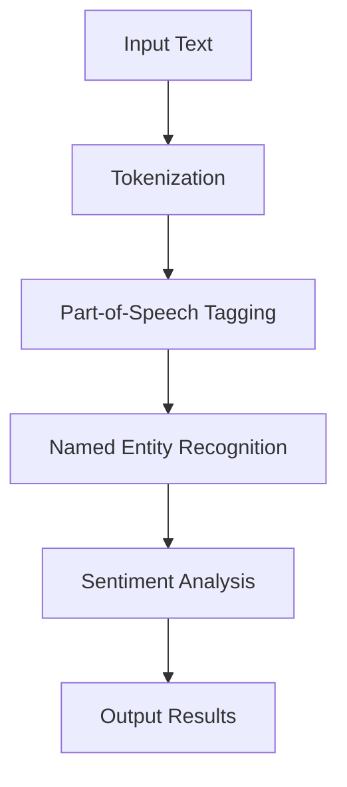

## 23.8 Artificial Intelligence and Natural Language Processing

Artificial Intelligence (AI) and Natural Language Processing (NLP) are rapidly evolving fields that are transforming how we interact with technology. While Ruby is not traditionally associated with AI and NLP, it offers several libraries and tools that make it possible to build intelligent applications. In this section, we will explore how Ruby developers can leverage AI and NLP capabilities to create scalable and maintainable applications.

### Introduction to AI and NLP in Ruby

Artificial Intelligence refers to the simulation of human intelligence processes by machines, especially computer systems. These processes include learning, reasoning, and self-correction. Natural Language Processing, a subfield of AI, focuses on the interaction between computers and humans through natural language.

Ruby, known for its simplicity and productivity, provides several gems and libraries that facilitate AI and NLP tasks. While Ruby may not be as popular as Python in these domains, it offers unique advantages, particularly in web development and rapid prototyping.

### Key Concepts in AI and NLP

Before diving into Ruby-specific tools, let's briefly cover some fundamental concepts in AI and NLP:

- **Machine Learning (ML):** A subset of AI that involves training algorithms to learn from data and make predictions or decisions without being explicitly programmed.
- **Deep Learning:** A type of ML that uses neural networks with many layers (deep networks) to model complex patterns in data.
- **Natural Language Processing (NLP):** Techniques used to analyze, understand, and generate human language, including tasks like sentiment analysis, language translation, and chatbot development.

### Ruby Libraries for AI and NLP

Ruby offers several libraries that make it possible to perform AI and NLP tasks. Let's explore some of the most popular ones:

#### Treat: A Comprehensive NLP Library

[Treat](https://github.com/louismullie/treat) is a powerful Ruby library for natural language processing and computational linguistics. It provides tools for text analysis, including tokenization, part-of-speech tagging, and named entity recognition.

```ruby
require 'treat'
include Treat::Core::DSL

# Analyze a sentence
sentence = "Ruby is a beautiful programming language."
parsed_sentence = sentence.sentence

# Tokenize the sentence
tokens = parsed_sentence.words
puts "Tokens: #{tokens.map(&:to_s)}"

# Part-of-speech tagging
tags = parsed_sentence.tag
puts "Tags: #{tags.map(&:to_s)}"
```

#### DecisionTree: Simple Machine Learning

[DecisionTree](https://github.com/igrigorik/decisiontree) is a Ruby gem that provides a simple implementation of decision trees for classification tasks. It's useful for building models that can make decisions based on input data.

```ruby
require 'decisiontree'

# Define attributes and training data
attributes = ['Outlook', 'Temperature', 'Humidity', 'Windy']
training_data = [
  ['Sunny', 'Hot', 'High', false, 'No'],
  ['Sunny', 'Hot', 'High', true, 'No'],
  ['Overcast', 'Hot', 'High', false, 'Yes'],
  ['Rainy', 'Mild', 'High', false, 'Yes'],
  ['Rainy', 'Cool', 'Normal', false, 'Yes'],
  ['Rainy', 'Cool', 'Normal', true, 'No'],
  ['Overcast', 'Cool', 'Normal', true, 'Yes'],
  ['Sunny', 'Mild', 'High', false, 'No'],
  ['Sunny', 'Cool', 'Normal', false, 'Yes'],
  ['Rainy', 'Mild', 'Normal', false, 'Yes'],
  ['Sunny', 'Mild', 'Normal', true, 'Yes'],
  ['Overcast', 'Mild', 'High', true, 'Yes'],
  ['Overcast', 'Hot', 'Normal', false, 'Yes'],
  ['Rainy', 'Mild', 'High', true, 'No']
]

# Create and train the decision tree
dec_tree = DecisionTree::ID3Tree.new(attributes, training_data, 'No', :discrete)
dec_tree.train

# Predict the outcome for new data
test_data = ['Sunny', 'Cool', 'High', true]
prediction = dec_tree.predict(test_data)
puts "Prediction: #{prediction}"
```

### Text Processing and Sentiment Analysis

Text processing is a crucial aspect of NLP. It involves cleaning and preparing text data for analysis. Sentiment analysis, a popular NLP task, involves determining the sentiment or emotion expressed in a piece of text.

#### Example: Sentiment Analysis with Treat

Let's use the Treat library to perform sentiment analysis on a sample text.

```ruby
require 'treat'
include Treat::Core::DSL

# Analyze a text for sentiment
text = "I love programming with Ruby. It's so elegant and expressive!"
document = text.document

# Perform sentiment analysis
sentiment = document.sentiment
puts "Sentiment: #{sentiment}"
```

### Building a Simple Chatbot

Chatbots are a practical application of NLP. They can simulate human conversation and provide automated responses to user queries.

#### Example: Building a Chatbot with Ruby

Let's build a simple rule-based chatbot using Ruby.

```ruby
class SimpleChatbot
  def initialize
    @responses = {
      "hello" => "Hi there! How can I help you today?",
      "bye" => "Goodbye! Have a great day!",
      "how are you" => "I'm just a bot, but I'm doing great! How about you?"
    }
  end

  def get_response(input)
    @responses[input.downcase] || "I'm sorry, I don't understand that."
  end
end

# Interact with the chatbot
chatbot = SimpleChatbot.new
puts "Chatbot: #{chatbot.get_response('hello')}"
puts "Chatbot: #{chatbot.get_response('how are you')}"
puts "Chatbot: #{chatbot.get_response('bye')}"
```

### Integrating with External AI Services

Ruby can be integrated with external AI services via APIs to leverage advanced AI capabilities. Popular services include Google Cloud AI, IBM Watson, and Microsoft Azure Cognitive Services.

#### Example: Using Google Cloud Natural Language API

To use Google Cloud Natural Language API, you'll need to set up a Google Cloud account and obtain API credentials.

```ruby
require 'google/cloud/language'

# Initialize the Google Cloud Language client
language = Google::Cloud::Language.language_service

# Analyze sentiment of a text
text_content = "Ruby is an amazing programming language!"
document = { content: text_content, type: :PLAIN_TEXT }
response = language.analyze_sentiment document: document

# Output the sentiment score
sentiment = response.document_sentiment
puts "Sentiment score: #{sentiment.score}"
```

### Limitations of Ruby in AI and NLP

While Ruby offers several tools for AI and NLP, it has limitations compared to languages like Python, which has a more extensive ecosystem for these fields. Python's libraries, such as TensorFlow, PyTorch, and NLTK, provide more advanced capabilities and are widely used in the AI community.

However, Ruby's strengths in web development and rapid prototyping make it a valuable tool for integrating AI and NLP into web applications and services.

### Encouraging Experimentation

Experimentation is key to mastering AI and NLP in Ruby. By combining Ruby with other technologies, such as Python or JavaScript, developers can create powerful and flexible applications.

#### Try It Yourself

- Modify the chatbot example to include more responses and handle different types of user input.
- Experiment with the Treat library to perform more complex text analysis tasks.
- Integrate Ruby with an external AI service of your choice and explore its capabilities.

### Visualizing AI and NLP Workflows

To better understand the flow of AI and NLP tasks, let's visualize a simple NLP workflow using Mermaid.js.



This diagram represents a typical NLP workflow, where input text is processed through various stages to extract meaningful information.

### References and Further Reading

- [Treat GitHub Repository](https://github.com/louismullie/treat)
- [DecisionTree GitHub Repository](https://github.com/igrigorik/decisiontree)
- [Google Cloud Natural Language API](https://cloud.google.com/natural-language)
- [Ruby AI and Machine Learning Resources](https://www.ruby-toolbox.com/categories/machine_learning)

### Knowledge Check

- What are the key differences between AI and NLP?
- How can Ruby be integrated with external AI services?
- What are some limitations of using Ruby for AI and NLP tasks?

### Embrace the Journey

Remember, this is just the beginning. As you progress, you'll discover more advanced techniques and tools for AI and NLP in Ruby. Keep experimenting, stay curious, and enjoy the journey!

## Quiz: Artificial Intelligence and Natural Language Processing



### What is the primary focus of Natural Language Processing (NLP)?

- [x] Interaction between computers and humans through natural language
- [ ] Simulation of human intelligence processes by machines
- [ ] Training algorithms to learn from data
- [ ] Modeling complex patterns in data

> **Explanation:** NLP focuses on the interaction between computers and humans through natural language.

### Which Ruby library is used for natural language processing and computational linguistics?

- [x] Treat
- [ ] DecisionTree
- [ ] TensorFlow
- [ ] PyTorch

> **Explanation:** Treat is a Ruby library for natural language processing and computational linguistics.

### What is the purpose of the DecisionTree gem in Ruby?

- [x] To provide a simple implementation of decision trees for classification tasks
- [ ] To perform sentiment analysis on text
- [ ] To integrate with external AI services
- [ ] To tokenize and tag parts of speech

> **Explanation:** DecisionTree provides a simple implementation of decision trees for classification tasks.

### How can Ruby be integrated with external AI services?

- [x] Via APIs
- [ ] By using built-in libraries
- [ ] Through command-line tools
- [ ] By writing custom scripts

> **Explanation:** Ruby can be integrated with external AI services via APIs.

### What is a common limitation of Ruby in AI compared to Python?

- [x] Limited ecosystem for AI and NLP libraries
- [ ] Lack of web development capabilities
- [ ] Inability to handle text processing
- [ ] Poor performance in web applications

> **Explanation:** Ruby has a limited ecosystem for AI and NLP libraries compared to Python.

### Which of the following is a typical NLP task?

- [x] Sentiment analysis
- [ ] Image recognition
- [ ] Data encryption
- [ ] Network routing

> **Explanation:** Sentiment analysis is a typical NLP task.

### What is the role of tokenization in NLP?

- [x] Breaking down text into smaller units
- [ ] Analyzing the sentiment of a text
- [ ] Integrating with external APIs
- [ ] Building decision trees

> **Explanation:** Tokenization involves breaking down text into smaller units.

### Which service can be used to perform sentiment analysis with Ruby?

- [x] Google Cloud Natural Language API
- [ ] Ruby on Rails
- [ ] TensorFlow
- [ ] PyTorch

> **Explanation:** Google Cloud Natural Language API can be used to perform sentiment analysis with Ruby.

### What is a chatbot?

- [x] A program that simulates human conversation
- [ ] A tool for building decision trees
- [ ] A library for natural language processing
- [ ] An API for integrating AI services

> **Explanation:** A chatbot is a program that simulates human conversation.

### True or False: Ruby is the most popular language for AI and NLP.

- [ ] True
- [x] False

> **Explanation:** Ruby is not the most popular language for AI and NLP; Python is more widely used in these fields.




