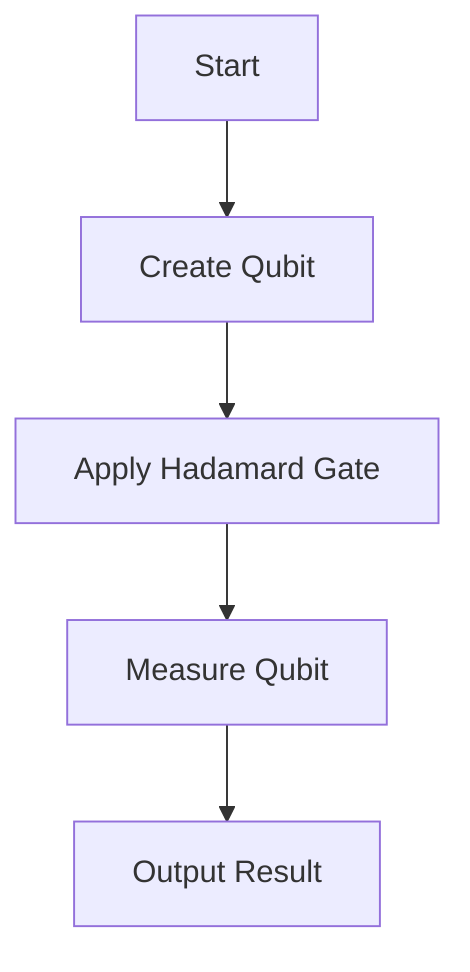

## 23.9 Quantum Computing Concepts in Ruby

Quantum computing is an exciting and rapidly evolving field that promises to revolutionize the way we process information. While traditional computers use bits as the smallest unit of data, quantum computers use qubits, which can exist in multiple states simultaneously. This section will introduce you to the fundamental concepts of quantum computing, such as qubits, superposition, and entanglement, and explore how Ruby can be used to simulate these concepts.

### Introduction to Quantum Computing

Quantum computing leverages the principles of quantum mechanics to process information in fundamentally new ways. Let's break down some of the key concepts:

#### Qubits

A qubit, or quantum bit, is the basic unit of quantum information. Unlike a classical bit, which can be either 0 or 1, a qubit can be in a state of 0, 1, or any quantum superposition of these states. This property allows quantum computers to process a vast amount of information simultaneously.

#### Superposition

Superposition is a principle of quantum mechanics where a quantum system can exist in multiple states at once. For qubits, this means they can be in a combination of the 0 and 1 states. This ability to be in multiple states simultaneously is what gives quantum computers their power.

#### Entanglement

Entanglement is a quantum phenomenon where two or more qubits become interconnected such that the state of one qubit can depend on the state of another, no matter the distance between them. This property is crucial for quantum computing as it allows for complex correlations between qubits.

### Quantum Computing Simulations in Ruby

While Ruby is not traditionally associated with quantum computing, it can be used to simulate quantum algorithms and concepts. One such library is [QuRuby](https://github.com/isaac/rb_quantum), which provides tools for simulating quantum circuits and operations.

#### Installing QuRuby

To get started with QuRuby, you'll need to install the gem. You can do this by running:

```bash
gem install rb_quantum
```

#### Simulating a Qubit

Let's simulate a simple qubit using QuRuby. We'll create a qubit and put it into a superposition state.

```ruby
require 'rb_quantum'

# Create a new qubit
qubit = Quantum::Qubit.new

# Apply a Hadamard gate to put the qubit into superposition
qubit.hadamard

# Measure the qubit
result = qubit.measure

puts "The qubit is in state: #{result}"
```

In this example, we create a new qubit and apply a Hadamard gate, which puts the qubit into a superposition of 0 and 1. When we measure the qubit, it collapses to either 0 or 1, and we print the result.

#### Simulating Entanglement

Next, let's simulate entanglement between two qubits.

```ruby
require 'rb_quantum'

# Create two qubits
qubit1 = Quantum::Qubit.new
qubit2 = Quantum::Qubit.new

# Apply a Hadamard gate to the first qubit
qubit1.hadamard

# Entangle the two qubits
qubit1.cnot(qubit2)

# Measure the qubits
result1 = qubit1.measure
result2 = qubit2.measure

puts "Qubit 1 is in state: #{result1}"
puts "Qubit 2 is in state: #{result2}"
```

In this example, we create two qubits and apply a Hadamard gate to the first qubit. We then use a CNOT gate to entangle the two qubits. When we measure them, the results are correlated due to entanglement.

### Educational Value and Limitations

Simulating quantum computing in Ruby provides educational value by allowing developers to explore quantum concepts without needing access to a physical quantum computer. These simulations can help build an understanding of quantum mechanics and quantum algorithms.

However, it's important to note the limitations of such simulations. Ruby, being a classical programming language, cannot fully capture the complexities of quantum mechanics. Simulations are approximations and may not accurately reflect the behavior of real quantum systems.

### Encouraging Further Learning

Quantum computing is an emerging field with vast potential. As you explore these concepts in Ruby, consider diving deeper into quantum mechanics and quantum algorithms. There are many resources available, including online courses, textbooks, and research papers, to further your understanding.

### Visualizing Quantum Concepts

To better understand these concepts, let's visualize the process of creating and measuring qubits using a simple flowchart.



This flowchart represents the process of creating a qubit, applying a Hadamard gate to put it into superposition, measuring the qubit, and outputting the result.

### Try It Yourself

Experiment with the code examples provided. Try modifying the code to create more qubits, apply different quantum gates, or simulate other quantum algorithms. This hands-on approach will deepen your understanding of quantum computing concepts.

### References and Further Reading

- [QuRuby GitHub Repository](https://github.com/isaac/rb_quantum)
- [Quantum Computing for Computer Scientists](https://www.amazon.com/Quantum-Computing-Computer-Scientists-Yanofsky/dp/0521879965)
- [IBM Quantum Experience](https://quantum-computing.ibm.com/)

### Knowledge Check

- What is a qubit and how does it differ from a classical bit?
- Explain the concept of superposition in your own words.
- How does entanglement allow qubits to be correlated?
- What are the limitations of simulating quantum computing in Ruby?

### Embrace the Journey

Remember, this is just the beginning of your journey into quantum computing. As you progress, you'll encounter more complex algorithms and concepts. Keep experimenting, stay curious, and enjoy the journey!

## Quiz: Quantum Computing Concepts in Ruby



### What is a qubit?

- [x] A quantum bit that can exist in multiple states simultaneously
- [ ] A classical bit that can be either 0 or 1
- [ ] A type of quantum gate
- [ ] A unit of classical information

> **Explanation:** A qubit is a quantum bit that can exist in a superposition of states, unlike a classical bit which is either 0 or 1.

### What does the Hadamard gate do to a qubit?

- [x] Puts the qubit into a superposition of 0 and 1
- [ ] Measures the qubit
- [ ] Entangles the qubit with another qubit
- [ ] Collapses the qubit to a definite state

> **Explanation:** The Hadamard gate is used to put a qubit into a superposition of 0 and 1.

### What is entanglement in quantum computing?

- [x] A phenomenon where qubits become interconnected
- [ ] A process of measuring qubits
- [ ] A type of quantum gate
- [ ] A method of error correction

> **Explanation:** Entanglement is a quantum phenomenon where the state of one qubit can depend on the state of another, regardless of distance.

### What is the primary limitation of simulating quantum computing in Ruby?

- [x] Simulations are approximations and may not accurately reflect real quantum systems
- [ ] Ruby cannot perform any quantum operations
- [ ] Ruby is too slow for any simulations
- [ ] Simulations require a quantum computer

> **Explanation:** Simulations in Ruby are approximations and cannot fully capture the complexities of quantum mechanics.

### How can Ruby be used in quantum computing?

- [x] By simulating quantum algorithms and concepts
- [ ] By directly controlling quantum hardware
- [ ] By replacing classical computers
- [ ] By creating quantum gates

> **Explanation:** Ruby can be used to simulate quantum algorithms and concepts, providing educational value.

### What is superposition?

- [x] A principle where a quantum system can exist in multiple states at once
- [ ] A method of measuring qubits
- [ ] A type of quantum gate
- [ ] A classical computing concept

> **Explanation:** Superposition is a principle of quantum mechanics where a quantum system can exist in multiple states simultaneously.

### What is the educational value of simulating quantum computing in Ruby?

- [x] It helps build an understanding of quantum mechanics and quantum algorithms
- [ ] It replaces the need for quantum computers
- [ ] It provides exact results of quantum operations
- [ ] It is used for commercial quantum computing

> **Explanation:** Simulating quantum computing in Ruby helps build an understanding of quantum mechanics and quantum algorithms.

### What is the purpose of the CNOT gate in quantum computing?

- [x] To entangle two qubits
- [ ] To measure a qubit
- [ ] To put a qubit into superposition
- [ ] To collapse a qubit to a definite state

> **Explanation:** The CNOT gate is used to entangle two qubits, creating a correlation between their states.

### What should you do to deepen your understanding of quantum computing?

- [x] Experiment with code examples and explore more resources
- [ ] Only read theoretical papers
- [ ] Avoid practical exercises
- [ ] Focus solely on classical computing

> **Explanation:** Experimenting with code examples and exploring more resources will deepen your understanding of quantum computing.

### True or False: Ruby can fully capture the complexities of quantum mechanics.

- [ ] True
- [x] False

> **Explanation:** Ruby, being a classical programming language, cannot fully capture the complexities of quantum mechanics. Simulations are approximations.


