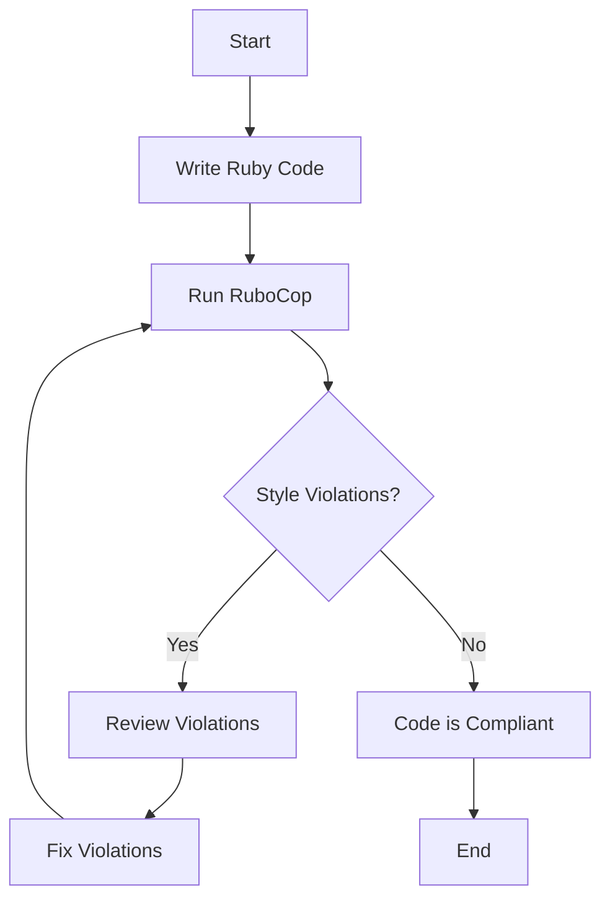

## 24.1 Adhering to Ruby Style Guides

In the world of software development, writing code is only part of the equation. Ensuring that code is clean, consistent, and maintainable is equally important. This is where style guides come into play. In this section, we'll delve into the significance of adhering to Ruby style guides, explore popular guides, and discuss tools and practices that can help you maintain high-quality Ruby code.

### Introduction to Ruby Style Guides

Ruby style guides provide a set of conventions and best practices for writing Ruby code. These guidelines help developers maintain a consistent coding style across projects, making code easier to read, understand, and maintain. One of the most popular Ruby style guides is the [Ruby Style Guide](https://rubystyle.guide/), which serves as a comprehensive reference for Ruby developers.

#### Why Follow a Style Guide?

- **Consistency**: A consistent style across a codebase makes it easier for developers to read and understand each other's code.
- **Readability**: Code that adheres to a style guide is generally more readable, reducing the cognitive load on developers.
- **Maintainability**: Consistent code is easier to maintain and refactor, leading to fewer bugs and a more robust application.
- **Collaboration**: A shared style guide fosters better collaboration among team members, as everyone follows the same conventions.
- **Professionalism**: Adhering to a style guide demonstrates professionalism and attention to detail, which can be crucial in team environments and open-source projects.

### Key Style Guidelines

Let's explore some key style guidelines from the Ruby Style Guide and other popular sources. These guidelines cover various aspects of Ruby programming, including naming conventions, code layout, and more.

#### Naming Conventions

Naming conventions are crucial for making code self-explanatory. Here are some common naming conventions in Ruby:

- **Classes and Modules**: Use CamelCase for class and module names.
  ```ruby
  class UserAccount
  end

  module PaymentGateway
  end
  ```

- **Methods and Variables**: Use snake_case for method and variable names.
  ```ruby
  def calculate_total
    total_amount = 0
  end
  ```

- **Constants**: Use ALL_CAPS for constants.
  ```ruby
  MAX_USERS = 100
  ```

#### Code Layout

Proper code layout enhances readability and helps maintain a clean codebase. Here are some layout guidelines:

- **Indentation**: Use two spaces per indentation level. Avoid using tabs.
  ```ruby
  def example_method
    if condition
      do_something
    end
  end
  ```

- **Line Length**: Limit lines to a maximum of 80 characters. This helps keep code readable on smaller screens and in side-by-side comparisons.
- **Blank Lines**: Use blank lines to separate logical sections of code, such as between method definitions.

#### Syntax and Semantics

- **Avoid Trailing Whitespace**: Ensure there is no trailing whitespace at the end of lines.
- **Use `&&` and `||` for Boolean Expressions**: Prefer `&&` and `||` over `and` and `or` for boolean expressions to avoid precedence issues.
  ```ruby
  if user.active? && user.admin?
    grant_access
  end
  ```

- **Use `def` with Parentheses**: When defining methods, use parentheses for method parameters, even if there are none.
  ```ruby
  def greet(name)
    puts "Hello, #{name}!"
  end
  ```

#### Comments and Documentation

- **Write Meaningful Comments**: Use comments to explain why code exists, not what it does. The code should be self-explanatory.
- **Use RDoc for Documentation**: Use RDoc to document classes and methods, providing a clear understanding of their purpose and usage.

### Tools for Enforcing Style Rules

To ensure adherence to style guides, several tools can automatically check and enforce style rules in your Ruby code. One of the most popular tools is [RuboCop](https://rubocop.org/).

#### RuboCop

RuboCop is a Ruby static code analyzer and formatter that enforces many of the guidelines outlined in the Ruby Style Guide. It integrates seamlessly with most editors and CI/CD pipelines, making it an essential tool for maintaining code quality.

- **Installation**: You can install RuboCop via RubyGems:
  ```bash
  gem install rubocop
  ```

- **Basic Usage**: Run RuboCop in your project directory to analyze your code:
  ```bash
  rubocop
  ```

- **Configuration**: Customize RuboCop's behavior by creating a `.rubocop.yml` file in your project. This file allows you to enable or disable specific cops (checks) and configure their settings.

- **Auto-correct**: RuboCop can automatically fix some style violations with the `--auto-correct` option:
  ```bash
  rubocop --auto-correct
  ```

### Encouraging Teamwide Adoption

For style guides to be effective, it's crucial that all team members agree on and adhere to the same coding standards. Here are some strategies to encourage teamwide adoption:

- **Document Standards**: Create a document outlining your team's coding standards and make it easily accessible to all team members.
- **Regular Code Reviews**: Conduct regular code reviews to ensure adherence to the style guide and provide feedback.
- **Training and Workshops**: Organize training sessions or workshops to educate team members about the importance of style guides and how to use tools like RuboCop.
- **Lead by Example**: Encourage senior developers to lead by example, demonstrating adherence to the style guide in their code.

### Impact on Readability and Collaboration

Adhering to a consistent style guide has a significant impact on code readability and collaboration. When code is consistent, developers can quickly understand and navigate the codebase, reducing the time spent deciphering unfamiliar code. This leads to more efficient collaboration, as team members can focus on solving problems rather than interpreting code.

### Try It Yourself

To get hands-on experience with Ruby style guides, try the following exercises:

1. **Install RuboCop**: Install RuboCop in a Ruby project and run it to identify style violations. Experiment with the `.rubocop.yml` configuration file to customize its behavior.

2. **Refactor Code**: Take a piece of Ruby code that doesn't adhere to a style guide and refactor it to follow the guidelines discussed in this section.

3. **Create a Team Style Guide**: If you're working in a team, collaborate with your team members to create a custom style guide that suits your project's needs.

### Visualizing Ruby Style Guide Compliance

To better understand how RuboCop enforces style guide compliance, let's visualize the process using a flowchart.



**Diagram Description**: This flowchart illustrates the process of writing Ruby code, running RuboCop to check for style violations, reviewing and fixing any violations, and achieving code compliance.

### Conclusion

Adhering to Ruby style guides is a fundamental practice for writing clean, consistent, and maintainable code. By following established guidelines, using tools like RuboCop, and fostering a culture of collaboration, you can ensure that your Ruby codebase remains high-quality and professional. Remember, consistency is key, and a shared style guide is a powerful tool for achieving it.

## Quiz: Adhering to Ruby Style Guides



### What is the primary purpose of a Ruby style guide?

- [x] To ensure consistency and readability in code
- [ ] To enforce strict rules on code performance
- [ ] To limit the use of certain Ruby features
- [ ] To provide a comprehensive list of Ruby libraries

> **Explanation:** The primary purpose of a Ruby style guide is to ensure consistency and readability in code, making it easier for developers to understand and maintain.

### Which naming convention is used for Ruby class names?

- [x] CamelCase
- [ ] snake_case
- [ ] ALL_CAPS
- [ ] kebab-case

> **Explanation:** Ruby class names use CamelCase, where each word is capitalized and concatenated without spaces.

### What tool is commonly used to enforce Ruby style guidelines?

- [x] RuboCop
- [ ] RSpec
- [ ] Bundler
- [ ] Pry

> **Explanation:** RuboCop is a popular tool used to enforce Ruby style guidelines by analyzing code and identifying violations.

### How can RuboCop automatically fix some style violations?

- [x] Using the `--auto-correct` option
- [ ] By modifying the `.rubocop.yml` file
- [ ] Through manual code reviews
- [ ] By running `rubocop --fix`

> **Explanation:** RuboCop can automatically fix some style violations using the `--auto-correct` option.

### What is the recommended line length for Ruby code according to style guides?

- [x] 80 characters
- [ ] 100 characters
- [ ] 120 characters
- [ ] 60 characters

> **Explanation:** The recommended line length for Ruby code is 80 characters, promoting readability and maintainability.

### Why is it important to use meaningful comments in code?

- [x] To explain why code exists
- [ ] To describe every line of code
- [ ] To increase code length
- [ ] To make code execution faster

> **Explanation:** Meaningful comments explain why code exists, providing context and understanding for future developers.

### What is the purpose of a `.rubocop.yml` file?

- [x] To customize RuboCop's behavior
- [ ] To store Ruby dependencies
- [ ] To define Ruby class hierarchies
- [ ] To document code changes

> **Explanation:** A `.rubocop.yml` file is used to customize RuboCop's behavior, enabling or disabling specific checks and configuring settings.

### How does adhering to a style guide impact collaboration?

- [x] It fosters better collaboration by ensuring everyone follows the same conventions
- [ ] It limits collaboration by enforcing strict rules
- [ ] It has no impact on collaboration
- [ ] It complicates collaboration by adding extra steps

> **Explanation:** Adhering to a style guide fosters better collaboration by ensuring everyone follows the same conventions, making code easier to understand and work with.

### What is the benefit of using RDoc for documentation?

- [x] It provides a clear understanding of class and method purposes
- [ ] It automatically generates code
- [ ] It enforces style guidelines
- [ ] It optimizes code performance

> **Explanation:** RDoc is used for documenting classes and methods, providing a clear understanding of their purposes and usage.

### True or False: Consistent code is easier to maintain and refactor.

- [x] True
- [ ] False

> **Explanation:** Consistent code is indeed easier to maintain and refactor, leading to fewer bugs and a more robust application.



Remember, this is just the beginning. As you progress, you'll build more complex and interactive Ruby applications. Keep experimenting, stay curious, and enjoy the journey!
