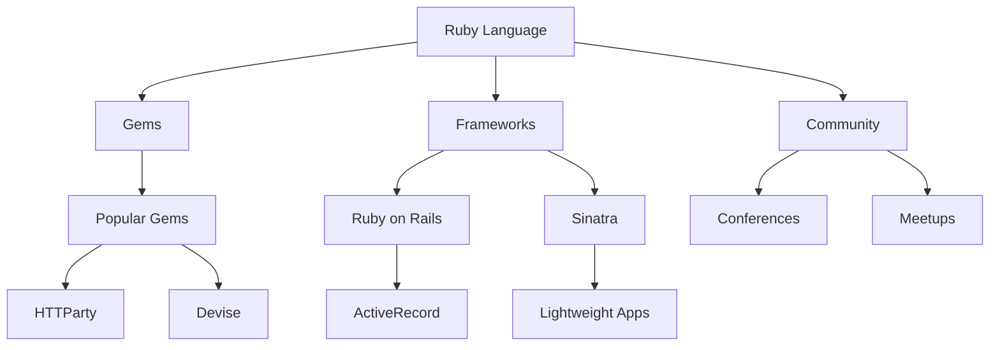

## 24.10 Staying Current with Ruby and Ecosystem Updates

In the ever-evolving world of software development, staying current with the latest trends and updates is crucial for maintaining a competitive edge. This is especially true for Ruby developers, given the dynamic nature of the Ruby ecosystem. In this section, we will explore strategies to keep your skills sharp and your knowledge up-to-date, ensuring you remain at the forefront of Ruby development.

### Emphasizing the Importance of Continuous Learning

Continuous learning is not just a buzzword; it's a necessity in the tech industry. As Ruby and its ecosystem evolve, new features, gems, and best practices emerge. By committing to lifelong learning, you can:

- **Enhance your skill set**: Stay proficient in the latest Ruby features and libraries.
- **Boost your career prospects**: Employers value developers who are proactive about learning.
- **Contribute to the community**: Share your knowledge and help others grow.

### Resources for Staying Updated

#### Blogs and News Sites

Blogs and news sites are excellent resources for staying informed about the latest developments in Ruby. Some of the most reputable sources include:

- **[Ruby Weekly](https://rubyweekly.com/)**: A weekly newsletter that curates the best Ruby news, articles, and tutorials.
- **[Ruby Inside](http://www.rubyinside.com/)**: Offers news, tutorials, and insights into Ruby programming.
- **[The Ruby Blog](https://www.ruby-lang.org/en/news/)**: Official Ruby blog with updates on new releases and features.

#### Podcasts

Podcasts provide a convenient way to learn while on the go. Consider subscribing to:

- **[Ruby Rogues](https://devchat.tv/ruby-rogues/)**: A podcast featuring discussions on Ruby programming, interviews with experts, and insights into the Ruby community.
- **[The Ruby on Rails Podcast](https://5by5.tv/rubyonrails)**: Focuses on Ruby on Rails, covering topics from beginner to advanced levels.

#### Social Media and Influential Developers

Following influential developers and projects on social media platforms like Twitter and GitHub can provide real-time updates and insights. Some notable figures in the Ruby community include:

- **Matz (Yukihiro Matsumoto)**: The creator of Ruby, often shares updates and thoughts on Ruby's direction.
- **DHH (David Heinemeier Hansson)**: Creator of Ruby on Rails, provides insights into Rails development and the broader Ruby ecosystem.

### Experimenting with New Gems and Technologies

Ruby's ecosystem is rich with gems that extend its functionality. Regularly experimenting with new gems can:

- **Broaden your toolkit**: Discover new ways to solve problems.
- **Keep your projects modern**: Incorporate the latest technologies and practices.

#### Code Example: Experimenting with a New Gem

Let's explore how to experiment with a new gem, such as `httparty`, which simplifies HTTP requests.

```ruby
# First, install the gem by adding it to your Gemfile
# gem 'httparty'

# Then, run bundle install to install the gem

require 'httparty'

# Making a simple GET request
response = HTTParty.get('https://jsonplaceholder.typicode.com/posts/1')

# Output the response body
puts response.body

# Output the response code
puts "Response code: #{response.code}"

# Output the response message
puts "Response message: #{response.message}"

# Output the headers
puts "Headers: #{response.headers.inspect}"
```

**Try It Yourself**: Modify the code to make a POST request or explore other endpoints. Experiment with different options provided by the `httparty` gem.

### Formal Training, Workshops, and Certifications

While self-learning is invaluable, formal training can provide structured learning paths and certifications that validate your skills. Consider:

- **Online Courses**: Platforms like Coursera, Udemy, and Pluralsight offer courses on Ruby and Ruby on Rails.
- **Workshops and Conferences**: Attend events like RubyConf and RailsConf to learn from experts and network with peers.
- **Certifications**: While not mandatory, certifications can enhance your resume and demonstrate your commitment to professional development.

### Visualizing the Ruby Ecosystem

To better understand the Ruby ecosystem, let's visualize its components and how they interact using a Mermaid.js diagram.



**Diagram Description**: This diagram illustrates the core components of the Ruby ecosystem, including the language itself, gems, frameworks, and the community. It highlights the interconnectedness of these elements and their contributions to the ecosystem.

### Knowledge Check

To reinforce your understanding, consider these questions:

- What are the benefits of continuous learning in Ruby development?
- How can following influential developers on social media enhance your knowledge?
- Why is experimenting with new gems important for staying current?

### Embrace the Journey

Remember, staying current with Ruby and its ecosystem is a journey, not a destination. As you progress, you'll encounter new challenges and opportunities to grow. Keep experimenting, stay curious, and enjoy the journey!

### Quiz: Staying Current with Ruby and Ecosystem Updates



### Which of the following is a benefit of continuous learning in Ruby development?

- [x] Enhances skill set
- [ ] Guarantees a job
- [ ] Eliminates the need for collaboration
- [ ] Reduces the need for documentation

> **Explanation:** Continuous learning enhances your skill set, making you more proficient in the latest Ruby features and libraries.

### What is Ruby Weekly?

- [x] A weekly newsletter about Ruby
- [ ] A Ruby podcast
- [ ] A Ruby conference
- [ ] A Ruby gem

> **Explanation:** Ruby Weekly is a weekly newsletter that curates the best Ruby news, articles, and tutorials.

### Who is the creator of Ruby?

- [x] Yukihiro Matsumoto
- [ ] David Heinemeier Hansson
- [ ] Matz
- [ ] DHH

> **Explanation:** Yukihiro Matsumoto, also known as Matz, is the creator of Ruby.

### What is the purpose of experimenting with new gems?

- [x] To broaden your toolkit
- [ ] To replace all existing code
- [ ] To avoid using Ruby on Rails
- [ ] To eliminate the need for testing

> **Explanation:** Experimenting with new gems broadens your toolkit and helps you discover new ways to solve problems.

### Which platform offers online courses on Ruby?

- [x] Coursera
- [x] Udemy
- [ ] GitHub
- [ ] Twitter

> **Explanation:** Coursera and Udemy offer online courses on Ruby and Ruby on Rails.

### What is the benefit of attending Ruby conferences?

- [x] Networking with peers
- [ ] Avoiding new technologies
- [ ] Learning outdated practices
- [ ] Reducing coding skills

> **Explanation:** Attending Ruby conferences allows you to network with peers and learn from experts.

### What does the `httparty` gem simplify?

- [x] HTTP requests
- [ ] Database connections
- [ ] User authentication
- [ ] File I/O operations

> **Explanation:** The `httparty` gem simplifies making HTTP requests in Ruby.

### Which of the following is a popular Ruby framework?

- [x] Ruby on Rails
- [ ] Django
- [ ] Laravel
- [ ] Express.js

> **Explanation:** Ruby on Rails is a popular Ruby framework for web development.

### What is the purpose of certifications in Ruby development?

- [x] Validate skills
- [ ] Guarantee employment
- [ ] Eliminate the need for experience
- [ ] Reduce learning opportunities

> **Explanation:** Certifications validate your skills and demonstrate your commitment to professional development.

### True or False: Following influential developers on social media can provide real-time updates and insights.

- [x] True
- [ ] False

> **Explanation:** Following influential developers on social media can provide real-time updates and insights into the Ruby community.



By following these strategies and resources, you'll be well-equipped to stay current with Ruby and its ecosystem, ensuring your skills remain sharp and relevant in the ever-changing world of software development.
