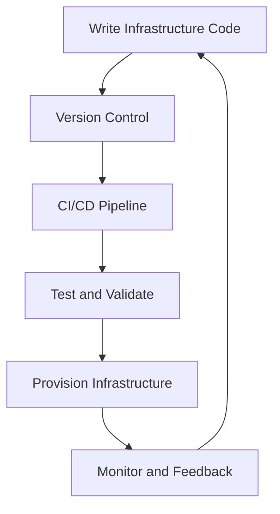

## 24.11 Infrastructure as Code (IaC)

Infrastructure as Code (IaC) is a transformative approach to managing and provisioning computing infrastructure through machine-readable definition files, rather than physical hardware configuration or interactive configuration tools. This practice is a cornerstone of modern DevOps and continuous delivery pipelines, enabling teams to automate infrastructure management, ensure consistency, and scale efficiently.

### Understanding Infrastructure as Code

Infrastructure as Code is the process of managing and provisioning infrastructure through code. This approach allows developers and operations teams to treat infrastructure the same way they treat application code. By using configuration files, teams can automate the setup and management of servers, networks, and other infrastructure components.

#### Benefits of IaC

- **Consistency**: By defining infrastructure in code, you ensure that every environment is configured identically, reducing the chances of discrepancies between development, testing, and production environments.
- **Scalability**: IaC allows for rapid scaling of infrastructure to meet demand, as configurations can be replicated across multiple environments.
- **Version Control**: Infrastructure configurations can be stored in version control systems, allowing teams to track changes, revert to previous states, and collaborate more effectively.
- **Automation**: Automating infrastructure setup reduces manual errors and frees up time for more strategic tasks.
- **Cost Efficiency**: By automating infrastructure management, organizations can reduce the time and resources spent on manual configuration and maintenance.

### Key Tools for Infrastructure as Code

Several tools have emerged to facilitate the implementation of IaC. Each tool has its strengths and is suited to different use cases.

#### Chef

[Chef](https://www.chef.io/) is a powerful automation platform that transforms infrastructure into code. It uses a Ruby-based DSL to define infrastructure configurations, known as "recipes" and "cookbooks."

```ruby
# Example Chef Recipe
package 'nginx' do
  action :install
end

service 'nginx' do
  action [:enable, :start]
end

file '/var/www/html/index.html' do
  content '<html>This is a test page</html>'
  mode '0755'
  owner 'root'
  group 'root'
end
```

#### Puppet

[Puppet](https://puppet.com/) is another popular configuration management tool that uses a declarative language to define system configurations. It is known for its robust reporting and management capabilities.

```puppet
# Example Puppet Manifest
package { 'nginx':
  ensure => installed,
}

service { 'nginx':
  ensure => running,
  enable => true,
}

file { '/var/www/html/index.html':
  ensure  => file,
  content => '<html>This is a test page</html>',
  mode    => '0755',
  owner   => 'root',
  group   => 'root',
}
```

#### Ansible

[Ansible](https://www.ansible.com/) is a simple, agentless tool that uses YAML to define configurations. It is known for its ease of use and ability to manage complex deployments.

```yaml
# Example Ansible Playbook
- hosts: webservers
  become: yes
  tasks:
    - name: Ensure nginx is installed
      apt:
        name: nginx
        state: present

    - name: Start nginx service
      service:
        name: nginx
        state: started
```

#### Terraform

[Terraform](https://www.terraform.io/) is an open-source tool that allows you to define infrastructure as code using a high-level configuration language. It is particularly well-suited for managing cloud resources.

```hcl
# Example Terraform Configuration
provider "aws" {
  region = "us-west-2"
}

resource "aws_instance" "example" {
  ami           = "ami-0c55b159cbfafe1f0"
  instance_type = "t2.micro"

  tags = {
    Name = "ExampleInstance"
  }
}
```

### Version Control and Collaboration

Version control is a critical component of IaC, enabling teams to track changes, collaborate, and ensure consistency across environments. By storing infrastructure code in repositories like Git, teams can:

- **Track Changes**: Monitor who made changes, when, and why.
- **Revert Changes**: Roll back to previous configurations if needed.
- **Collaborate**: Work together on infrastructure code, using branching and merging strategies.
- **Automate Deployments**: Integrate with CI/CD pipelines to automate infrastructure provisioning and updates.

### Best Practices for Testing and Validation

Testing and validating infrastructure code is essential to ensure that configurations work as expected and do not introduce errors. Here are some best practices:

- **Use Testing Frameworks**: Tools like Test Kitchen for Chef, Serverspec for Puppet, and Molecule for Ansible can help test infrastructure code.
- **Validate Syntax**: Use linters and syntax checkers to catch errors before deployment.
- **Perform Dry Runs**: Use tools' built-in capabilities to simulate changes without applying them.
- **Implement Continuous Testing**: Integrate testing into CI/CD pipelines to catch issues early.

### IaC in DevOps and Continuous Delivery

IaC plays a pivotal role in DevOps and continuous delivery by enabling teams to automate infrastructure provisioning and management. This automation supports rapid deployment cycles, reduces manual intervention, and ensures that infrastructure is always in a known, consistent state.

#### Role in DevOps

- **Collaboration**: Breaks down silos between development and operations teams.
- **Automation**: Reduces manual tasks and accelerates deployment cycles.
- **Feedback Loops**: Provides immediate feedback on infrastructure changes.

#### Role in Continuous Delivery

- **Consistency**: Ensures that environments are consistent across the delivery pipeline.
- **Speed**: Accelerates the deployment process by automating infrastructure provisioning.
- **Reliability**: Reduces the risk of errors and downtime by ensuring infrastructure is always in a known state.

### Try It Yourself

To get hands-on experience with IaC, try setting up a simple web server using one of the tools mentioned above. Experiment with modifying configurations, adding new resources, and testing changes. This practical experience will deepen your understanding of IaC and its benefits.

### Visualizing Infrastructure as Code

Below is a simple diagram illustrating the flow of Infrastructure as Code in a DevOps pipeline:



This diagram shows how infrastructure code is written, stored in version control, tested, and then used to provision infrastructure. The feedback loop ensures continuous improvement and adaptation.

### Knowledge Check

- **What are the key benefits of Infrastructure as Code?**
- **How does version control enhance collaboration in IaC?**
- **What are some best practices for testing infrastructure code?**
- **How does IaC support DevOps and continuous delivery?**

### Embrace the Journey

Remember, adopting Infrastructure as Code is a journey. Start small, experiment, and gradually integrate IaC practices into your workflows. As you gain experience, you'll unlock new efficiencies and capabilities, transforming how you manage infrastructure.

## Quiz: Infrastructure as Code (IaC)



### What is Infrastructure as Code (IaC)?

- [x] Managing infrastructure through code
- [ ] Manual configuration of servers
- [ ] Using physical hardware for infrastructure
- [ ] Interactive configuration tools

> **Explanation:** Infrastructure as Code (IaC) involves managing and provisioning infrastructure through machine-readable definition files.

### Which of the following is a benefit of IaC?

- [x] Consistency across environments
- [x] Automation of infrastructure setup
- [ ] Increased manual intervention
- [ ] Higher costs

> **Explanation:** IaC ensures consistency and automates infrastructure setup, reducing manual errors and costs.

### Which tool uses a Ruby-based DSL for defining infrastructure?

- [x] Chef
- [ ] Puppet
- [ ] Ansible
- [ ] Terraform

> **Explanation:** Chef uses a Ruby-based DSL to define infrastructure configurations.

### What is the primary language used by Ansible for configuration?

- [x] YAML
- [ ] Ruby
- [ ] HCL
- [ ] JSON

> **Explanation:** Ansible uses YAML to define configurations.

### How does version control benefit IaC?

- [x] Tracks changes and enables collaboration
- [x] Allows reverting to previous states
- [ ] Increases manual configuration
- [ ] Reduces automation

> **Explanation:** Version control tracks changes, enables collaboration, and allows reverting to previous states, enhancing IaC.

### What is a best practice for testing infrastructure code?

- [x] Use testing frameworks
- [ ] Avoid syntax validation
- [ ] Skip dry runs
- [ ] Ignore continuous testing

> **Explanation:** Using testing frameworks and performing dry runs are best practices for testing infrastructure code.

### How does IaC support DevOps?

- [x] Breaks down silos between teams
- [x] Automates manual tasks
- [ ] Increases manual intervention
- [ ] Slows down deployment cycles

> **Explanation:** IaC supports DevOps by breaking down silos, automating tasks, and accelerating deployment cycles.

### What role does IaC play in continuous delivery?

- [x] Ensures consistency across environments
- [x] Accelerates deployment process
- [ ] Increases risk of errors
- [ ] Reduces reliability

> **Explanation:** IaC ensures consistency and accelerates the deployment process, reducing errors and increasing reliability.

### Which tool is particularly suited for managing cloud resources?

- [x] Terraform
- [ ] Chef
- [ ] Puppet
- [ ] Ansible

> **Explanation:** Terraform is well-suited for managing cloud resources using a high-level configuration language.

### True or False: IaC can be integrated into CI/CD pipelines.

- [x] True
- [ ] False

> **Explanation:** IaC can be integrated into CI/CD pipelines to automate infrastructure provisioning and updates.



By embracing Infrastructure as Code, you are taking a significant step toward modernizing your infrastructure management practices. Keep experimenting, stay curious, and enjoy the journey!
