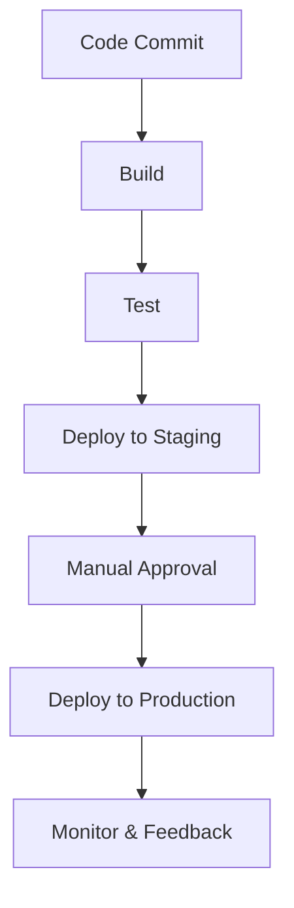

## 24.12 DevOps Practices in Ruby

In the ever-evolving landscape of software development, the DevOps culture has emerged as a pivotal approach to bridging the gap between development and operations. By fostering collaboration, enhancing automation, and streamlining processes, DevOps aims to deliver high-quality software more efficiently. In this section, we will delve into how DevOps principles apply to Ruby development, exploring continuous integration, delivery, and deployment, along with the tools and practices that make this possible.

### Understanding DevOps Culture and Goals

DevOps is more than just a set of tools or practices; it's a cultural shift that emphasizes collaboration between development and operations teams. The primary goals of DevOps include:

- **Enhanced Collaboration**: Breaking down silos between teams to foster a culture of shared responsibility.
- **Faster Delivery**: Streamlining processes to reduce the time from code commit to deployment.
- **Improved Quality**: Implementing practices that ensure high-quality software through automation and continuous feedback.
- **Increased Efficiency**: Automating repetitive tasks to free up time for innovation and problem-solving.

### Continuous Integration, Delivery, and Deployment

#### Continuous Integration (CI)

Continuous Integration is the practice of merging all developer working copies to a shared mainline several times a day. The key benefits include:

- **Early Detection of Errors**: By integrating frequently, errors are detected early, making them easier to fix.
- **Reduced Integration Problems**: Frequent integration reduces the risk of integration conflicts.
- **Automated Testing**: Automated tests run with each integration, ensuring that new changes do not break existing functionality.

**Example CI Tools for Ruby**:

- **Travis CI**: A popular CI service that integrates seamlessly with GitHub, allowing you to automatically test your Ruby applications.
- **CircleCI**: Offers robust support for Ruby projects with easy configuration and powerful features.

```yaml
# .travis.yml example for a Ruby project
language: ruby
rvm:
  - 2.7
  - 3.0
script:
  - bundle exec rake test
```

#### Continuous Delivery (CD)

Continuous Delivery extends CI by ensuring that the software can be released to production at any time. This involves:

- **Automated Deployment Pipelines**: Automating the deployment process to ensure consistency and reliability.
- **Environment Consistency**: Ensuring that all environments (development, testing, production) are as similar as possible.
- **Frequent Releases**: Enabling frequent releases to production, reducing the risk of large, disruptive changes.

**Example CD Tools for Ruby**:

- **Capistrano**: A remote server automation and deployment tool written in Ruby, ideal for deploying web applications.
- **Heroku**: A platform as a service (PaaS) that enables developers to build, run, and operate applications entirely in the cloud.

```ruby
# Capistrano configuration example
lock "~> 3.16.0"

set :application, "my_ruby_app"
set :repo_url, "git@example.com:me/my_repo.git"

namespace :deploy do
  after :finishing, 'deploy:cleanup'
end
```

#### Continuous Deployment

Continuous Deployment takes Continuous Delivery a step further by automatically deploying every change that passes the automated tests to production. This requires:

- **Robust Testing**: Ensuring that automated tests are comprehensive and reliable.
- **Monitoring and Rollback**: Implementing monitoring to detect issues quickly and rollback mechanisms to revert changes if necessary.

### Tooling and Automation in the Ruby Ecosystem

Automation is a cornerstone of DevOps, and the Ruby ecosystem offers a plethora of tools to facilitate this:

- **Rake**: A Ruby-based build program with capabilities similar to Make, allowing you to automate tasks such as testing and deployment.
- **Bundler**: Manages gem dependencies for Ruby projects, ensuring that the right versions are used across environments.
- **Docker**: Containerization tool that allows you to package applications and their dependencies into a standardized unit for software development.

```ruby
# Rakefile example
task :default => [:test]

task :test do
  sh "ruby -Ilib:test test/test_*.rb"
end
```

### Monitoring, Logging, and Feedback Loops

Effective monitoring and logging are crucial for maintaining the health of applications and infrastructure. They provide the feedback loops necessary for continuous improvement:

- **Monitoring Tools**: Tools like Prometheus and Grafana can be used to monitor application performance and infrastructure health.
- **Logging**: Structured logging with tools like Lograge can help in capturing detailed logs for analysis and debugging.
- **Feedback Loops**: Implementing feedback loops through tools like New Relic or Datadog helps in identifying performance bottlenecks and user experience issues.

### Importance of Cross-Functional Teams and Communication

DevOps thrives on the collaboration of cross-functional teams. Key practices include:

- **Shared Responsibility**: Encouraging a culture where development and operations share the responsibility for the software lifecycle.
- **Regular Communication**: Holding regular meetings and using collaboration tools like Slack or Microsoft Teams to facilitate communication.
- **Integrated Workflows**: Using tools like Jira or Trello to manage workflows and ensure transparency across teams.

### Challenges and How to Address Them

Implementing DevOps practices can present several challenges:

- **Cultural Resistance**: Overcoming resistance to change requires strong leadership and clear communication of the benefits.
- **Tool Integration**: Ensuring that tools integrate seamlessly into existing workflows can be complex and may require custom solutions.
- **Security Concerns**: Automating deployments can introduce security risks, which must be mitigated through practices like automated security testing and regular audits.

### Visualizing DevOps Workflow

To better understand the DevOps workflow, let's visualize a typical CI/CD pipeline using Mermaid.js:



This diagram illustrates the flow from code commit to deployment, highlighting the stages of build, test, deployment, and monitoring.

### Try It Yourself

To solidify your understanding, try setting up a simple CI/CD pipeline for a Ruby project using Travis CI and Capistrano. Experiment with different configurations and observe how changes affect the deployment process.

### Conclusion

DevOps practices in Ruby development offer a powerful framework for enhancing collaboration, efficiency, and quality. By embracing continuous integration, delivery, and deployment, along with robust tooling and automation, Ruby developers can streamline their workflows and deliver high-quality software more rapidly. Remember, the journey to DevOps is ongoing, and continuous learning and adaptation are key to success.

## Quiz: DevOps Practices in Ruby



### What is the primary goal of DevOps?

- [x] Enhance collaboration between development and operations
- [ ] Increase the number of deployments
- [ ] Reduce the number of developers
- [ ] Eliminate testing

> **Explanation:** DevOps aims to enhance collaboration between development and operations teams to improve software delivery.

### Which tool is commonly used for continuous integration in Ruby projects?

- [x] Travis CI
- [ ] Docker
- [ ] Capistrano
- [ ] Rake

> **Explanation:** Travis CI is a popular continuous integration tool used in Ruby projects.

### What is the difference between Continuous Delivery and Continuous Deployment?

- [x] Continuous Delivery requires manual approval for production deployment, while Continuous Deployment does not.
- [ ] Continuous Delivery involves automated testing, while Continuous Deployment does not.
- [ ] Continuous Delivery is only for web applications, while Continuous Deployment is for all applications.
- [ ] Continuous Delivery is a subset of Continuous Deployment.

> **Explanation:** Continuous Delivery requires manual approval before deploying to production, whereas Continuous Deployment automatically deploys changes to production.

### Which tool is used for automating tasks in Ruby?

- [x] Rake
- [ ] Bundler
- [ ] Docker
- [ ] Capistrano

> **Explanation:** Rake is a Ruby-based build program used for automating tasks.

### What is a key benefit of using Docker in a Ruby project?

- [x] Containerization for consistent environments
- [ ] Faster code execution
- [ ] Reduced code size
- [ ] Enhanced security

> **Explanation:** Docker provides containerization, ensuring consistent environments across development, testing, and production.

### Which practice is crucial for maintaining application health in DevOps?

- [x] Monitoring and logging
- [ ] Manual testing
- [ ] Code reviews
- [ ] Frequent meetings

> **Explanation:** Monitoring and logging are crucial for maintaining application health and providing feedback loops.

### What is a common challenge in implementing DevOps?

- [x] Cultural resistance
- [ ] Lack of tools
- [ ] Excessive automation
- [ ] Too many developers

> **Explanation:** Cultural resistance is a common challenge as it requires a shift in mindset and practices.

### Which tool is used for managing gem dependencies in Ruby?

- [x] Bundler
- [ ] Rake
- [ ] Capistrano
- [ ] Docker

> **Explanation:** Bundler is used for managing gem dependencies in Ruby projects.

### What is the role of feedback loops in DevOps?

- [x] Identify performance bottlenecks and user experience issues
- [ ] Increase deployment frequency
- [ ] Reduce code size
- [ ] Enhance security

> **Explanation:** Feedback loops help identify performance bottlenecks and user experience issues, enabling continuous improvement.

### True or False: DevOps practices eliminate the need for testing.

- [ ] True
- [x] False

> **Explanation:** DevOps practices do not eliminate the need for testing; instead, they emphasize automated testing as a core component.



Remember, this is just the beginning. As you progress, you'll build more complex and interactive applications. Keep experimenting, stay curious, and enjoy the journey!
