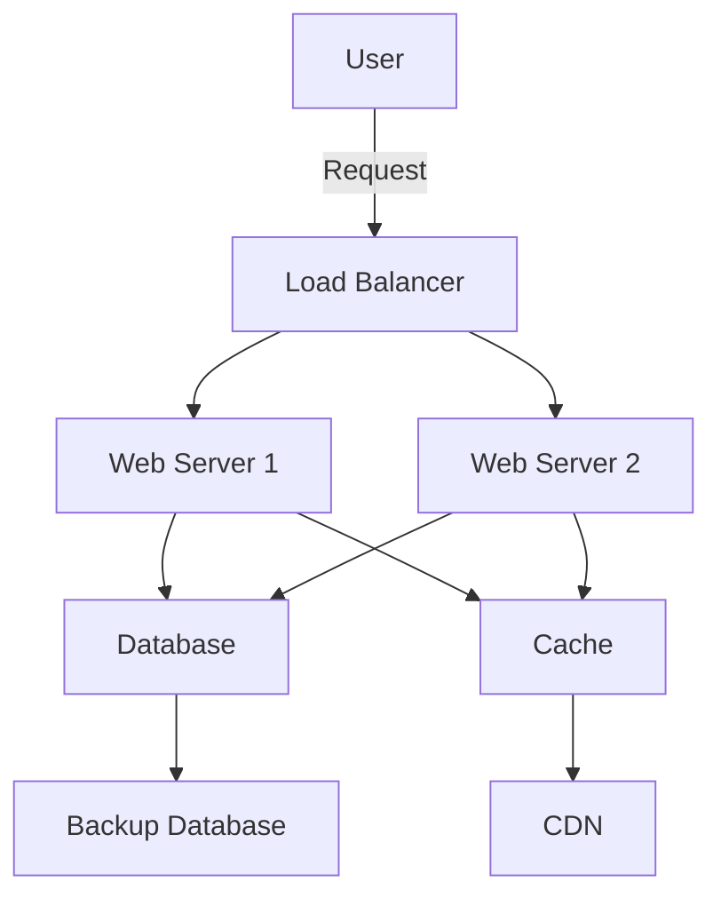

## 24.13 Designing for Resilience and Scalability

In the ever-evolving landscape of software development, designing applications that are both resilient and scalable is crucial for ensuring reliability and performance. As Ruby developers, we have a plethora of tools and patterns at our disposal to achieve these goals. In this section, we will delve into the concepts of resilience and scalability, explore key design patterns, and discuss strategies for building robust Ruby applications.

### Understanding Resilience and Scalability

**Resilience** in software design refers to the ability of an application to withstand failures and continue operating. It involves anticipating potential points of failure and implementing strategies to recover from them gracefully.

**Scalability**, on the other hand, is the capability of an application to handle increased load without compromising performance. It involves designing systems that can grow and adapt to changing demands.

Both resilience and scalability are essential for building applications that provide a seamless user experience, even under adverse conditions.

### Key Design Patterns for Resilience and Scalability

Let's explore some of the most effective design patterns that can help us achieve resilience and scalability in Ruby applications.

#### Bulkheads

The **Bulkhead pattern** is inspired by the compartments in a ship, which prevent it from sinking if one section is breached. In software design, bulkheads isolate different parts of the system to prevent a failure in one component from affecting others.

**Implementation in Ruby:**

```ruby
class Bulkhead
  def initialize(max_concurrent_requests)
    @max_concurrent_requests = max_concurrent_requests
    @semaphore = Mutex.new
    @current_requests = 0
  end

  def execute(&block)
    @semaphore.synchronize do
      if @current_requests < @max_concurrent_requests
        @current_requests += 1
        begin
          block.call
        ensure
          @current_requests -= 1
        end
      else
        raise "Too many concurrent requests"
      end
    end
  end
end

# Usage
bulkhead = Bulkhead.new(5)
bulkhead.execute do
  # Perform operation
end
```

**Key Points:**
- Use bulkheads to isolate critical components.
- Limit the number of concurrent requests to prevent overload.
- Ensure that failures in one component do not cascade to others.

#### Circuit Breakers

The **Circuit Breaker pattern** prevents an application from repeatedly trying to execute an operation that is likely to fail. It acts as a switch that opens when a failure threshold is reached, allowing the system to recover before retrying.

**Implementation in Ruby:**

```ruby
class CircuitBreaker
  def initialize(failure_threshold, reset_timeout)
    @failure_threshold = failure_threshold
    @reset_timeout = reset_timeout
    @failure_count = 0
    @last_failure_time = nil
    @state = :closed
  end

  def execute(&block)
    if @state == :open
      if Time.now - @last_failure_time > @reset_timeout
        @state = :half_open
      else
        raise "Circuit is open"
      end
    end

    begin
      result = block.call
      reset
      result
    rescue
      record_failure
      raise
    end
  end

  private

  def record_failure
    @failure_count += 1
    @last_failure_time = Time.now
    if @failure_count >= @failure_threshold
      @state = :open
    end
  end

  def reset
    @failure_count = 0
    @state = :closed
  end
end

# Usage
circuit_breaker = CircuitBreaker.new(3, 60)
circuit_breaker.execute do
  # Perform operation
end
```

**Key Points:**
- Use circuit breakers to prevent cascading failures.
- Define thresholds for failures and timeouts for resetting.
- Monitor the state of the circuit to ensure timely recovery.

#### Backpressure

**Backpressure** is a mechanism to control the flow of data and prevent overwhelming a system. It involves applying pressure back to the source of data to slow down the rate of incoming requests.

**Implementation in Ruby:**

```ruby
class BackpressureQueue
  def initialize(max_size)
    @max_size = max_size
    @queue = Queue.new
  end

  def enqueue(item)
    if @queue.size < @max_size
      @queue << item
    else
      raise "Queue is full, apply backpressure"
    end
  end

  def dequeue
    @queue.pop
  end
end

# Usage
queue = BackpressureQueue.new(10)
queue.enqueue("data")
```

**Key Points:**
- Implement backpressure to manage data flow.
- Use queues to buffer incoming requests.
- Apply pressure to slow down the source when necessary.

### Strategies for Resilience and Scalability

In addition to design patterns, there are several strategies that can enhance the resilience and scalability of Ruby applications.

#### Redundancy

**Redundancy** involves duplicating critical components to ensure availability in case of failure. This can be achieved through:

- **Database Replication**: Use master-slave or multi-master replication to ensure data availability.
- **Load Balancers**: Distribute traffic across multiple servers to prevent overload.
- **Failover Mechanisms**: Automatically switch to backup systems when primary systems fail.

#### Load Balancing

**Load balancing** distributes incoming traffic across multiple servers to ensure no single server is overwhelmed. It can be implemented using:

- **Round Robin**: Distribute requests evenly across servers.
- **Least Connections**: Direct traffic to the server with the fewest active connections.
- **IP Hash**: Route requests based on the client's IP address.

#### Auto-Scaling

**Auto-scaling** automatically adjusts the number of servers based on demand. It ensures that resources are available when needed and reduces costs during low demand periods.

- **Horizontal Scaling**: Add more servers to handle increased load.
- **Vertical Scaling**: Increase the capacity of existing servers.

#### Monitoring and Proactive Maintenance

Monitoring is crucial for identifying issues before they impact users. Implement:

- **Health Checks**: Regularly test the availability and performance of services.
- **Logging**: Record events and errors for analysis.
- **Alerts**: Notify administrators of potential issues.

#### Cloud Services and Infrastructure Planning

Leveraging cloud services can enhance resilience and scalability:

- **Elastic Compute**: Use cloud providers like AWS or Azure for scalable compute resources.
- **Managed Databases**: Utilize cloud-based databases for automatic scaling and redundancy.
- **Content Delivery Networks (CDNs)**: Distribute content globally to reduce latency.

#### Regular Testing of Failure Scenarios

Regularly test your application's ability to handle failures:

- **Chaos Engineering**: Introduce failures in a controlled environment to test resilience.
- **Load Testing**: Simulate high traffic to assess scalability.
- **Disaster Recovery Drills**: Practice recovery procedures to ensure readiness.

### Visualizing Resilience and Scalability

To better understand the concepts of resilience and scalability, let's visualize a typical architecture using Mermaid.js.



**Diagram Explanation:**
- **Load Balancer**: Distributes requests to multiple web servers.
- **Web Servers**: Handle incoming requests and interact with the database.
- **Database**: Stores application data with a backup for redundancy.
- **Cache**: Speeds up data retrieval.
- **CDN**: Delivers content to users globally.

### Encouragement and Next Steps

Designing for resilience and scalability is an ongoing journey. As you implement these patterns and strategies, remember to:

- Continuously monitor and optimize your systems.
- Stay informed about new tools and techniques.
- Collaborate with your team to identify and address potential weaknesses.

By embracing these practices, you'll be well-equipped to build robust Ruby applications that can withstand the test of time.

## Quiz: Designing for Resilience and Scalability



### What is the primary goal of the Bulkhead pattern?

- [x] To isolate components and prevent cascading failures
- [ ] To distribute load evenly across servers
- [ ] To automatically scale resources based on demand
- [ ] To apply backpressure to data sources

> **Explanation:** The Bulkhead pattern isolates components to prevent failures in one part of the system from affecting others.

### How does the Circuit Breaker pattern enhance resilience?

- [x] By preventing repeated execution of failing operations
- [ ] By distributing traffic across multiple servers
- [ ] By applying backpressure to slow down data flow
- [ ] By duplicating critical components for redundancy

> **Explanation:** The Circuit Breaker pattern stops repeated execution of operations that are likely to fail, allowing the system to recover.

### What is the purpose of backpressure in a system?

- [x] To control data flow and prevent system overload
- [ ] To distribute requests evenly across servers
- [ ] To automatically scale resources based on demand
- [ ] To isolate components and prevent cascading failures

> **Explanation:** Backpressure controls the flow of data to prevent overwhelming the system.

### Which strategy involves duplicating critical components to ensure availability?

- [x] Redundancy
- [ ] Load Balancing
- [ ] Auto-Scaling
- [ ] Backpressure

> **Explanation:** Redundancy involves duplicating components to ensure availability in case of failure.

### What is the benefit of using a Content Delivery Network (CDN)?

- [x] To distribute content globally and reduce latency
- [ ] To automatically scale resources based on demand
- [ ] To isolate components and prevent cascading failures
- [ ] To apply backpressure to data sources

> **Explanation:** CDNs distribute content globally, reducing latency and improving user experience.

### What is the primary purpose of load balancing?

- [x] To distribute incoming traffic across multiple servers
- [ ] To duplicate critical components for redundancy
- [ ] To automatically scale resources based on demand
- [ ] To control data flow and prevent system overload

> **Explanation:** Load balancing distributes traffic across servers to prevent any single server from being overwhelmed.

### How does auto-scaling benefit an application?

- [x] By automatically adjusting resources based on demand
- [ ] By isolating components to prevent cascading failures
- [ ] By distributing traffic evenly across servers
- [ ] By applying backpressure to data sources

> **Explanation:** Auto-scaling adjusts resources automatically, ensuring availability during high demand and cost savings during low demand.

### What is the role of monitoring in resilience and scalability?

- [x] To identify issues before they impact users
- [ ] To distribute traffic across multiple servers
- [ ] To duplicate critical components for redundancy
- [ ] To control data flow and prevent system overload

> **Explanation:** Monitoring helps identify potential issues early, allowing for proactive maintenance and ensuring system reliability.

### Which cloud service can enhance scalability by providing scalable compute resources?

- [x] Elastic Compute
- [ ] Content Delivery Network (CDN)
- [ ] Managed Databases
- [ ] Load Balancer

> **Explanation:** Elastic Compute services provide scalable compute resources, enhancing scalability.

### True or False: Chaos Engineering involves introducing failures in a controlled environment to test resilience.

- [x] True
- [ ] False

> **Explanation:** Chaos Engineering involves intentionally introducing failures to test and improve system resilience.



Remember, this is just the beginning. As you progress, you'll build more complex and resilient applications. Keep experimenting, stay curious, and enjoy the journey!
