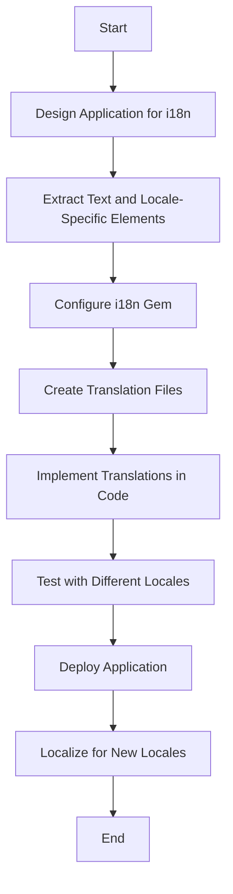

## 24.15 Internationalization and Localization

In today's globalized world, making your Ruby applications accessible to users across different locales is crucial. This involves supporting multiple languages, regional settings, and cultural nuances. In this section, we will delve into the concepts of internationalization (i18n) and localization (l10n), explore the use of the [i18n gem](https://github.com/ruby-i18n/i18n) in Ruby applications, and provide practical examples and best practices.

### Understanding Internationalization (i18n) and Localization (l10n)

**Internationalization (i18n)** is the process of designing your application so that it can be adapted to various languages and regions without requiring engineering changes. It involves abstracting text and locale-specific elements from the codebase.

**Localization (l10n)** refers to the process of adapting your internationalized application to a specific locale, which includes translating text and adjusting formats for dates, numbers, and currencies according to regional preferences.

#### Key Differences

- **Internationalization** is about preparing your application for localization.
- **Localization** is the actual adaptation of the application for a specific locale.

### Using the i18n Gem in Ruby Applications

The i18n gem is a powerful tool for managing translations and locale data in Ruby applications. It provides a flexible framework for internationalization and localization, allowing developers to easily manage translations and format locale-specific data.

#### Setting Up the i18n Gem

To get started with the i18n gem, add it to your Gemfile:

```ruby
gem 'i18n'
```

Run `bundle install` to install the gem.

#### Configuring i18n

The i18n gem requires some configuration to specify the available locales and the default locale. This is typically done in an initializer file in a Rails application:

```ruby
# config/initializers/locale.rb

# Set default locale to something other than :en
I18n.default_locale = :en

# Whitelist locales available for the application
I18n.available_locales = [:en, :es, :fr, :de]
```

#### Managing Translations

Translations are stored in YAML files, typically located in the `config/locales` directory. Each file corresponds to a locale and contains key-value pairs for translations.

Example of an English translation file (`en.yml`):

```yaml
en:
  hello: "Hello"
  goodbye: "Goodbye"
```

Example of a Spanish translation file (`es.yml`):

```yaml
es:
  hello: "Hola"
  goodbye: "Adiós"
```

#### Using Translations in Code

To use translations in your Ruby code, utilize the `I18n.t` method:

```ruby
puts I18n.t('hello') # Outputs "Hello" or "Hola" based on the current locale
```

### Best Practices for Internationalization and Localization

#### Formatting Dates, Numbers, and Currencies

When dealing with dates, numbers, and currencies, it's essential to format them according to the user's locale. The i18n gem provides helpers for this purpose.

Example of formatting a date:

```ruby
date = Date.today
puts I18n.l(date, format: :long) # Outputs date in long format based on locale
```

Example of formatting a currency:

```ruby
amount = 1234.56
puts I18n.l(amount, format: :currency) # Outputs currency formatted based on locale
```

#### Considerations for Right-to-Left Languages

Supporting right-to-left (RTL) languages like Arabic and Hebrew requires additional considerations, such as adjusting the layout and text direction.

- Use CSS to set the `direction` property to `rtl` for RTL languages.
- Ensure that UI elements are mirrored appropriately.

#### Cultural Nuances

Localization is not just about translating text; it's also about respecting cultural differences. This includes:

- Using appropriate colors and symbols.
- Adapting content to local customs and traditions.
- Being sensitive to cultural taboos.

### Testing with Different Locales

Testing your application with different locales is crucial to ensure that translations are accurate and that the application behaves correctly in various regional settings.

- Use automated tests to verify translations and locale-specific formatting.
- Manually test the application with different locale settings to catch any issues that automated tests might miss.

### Try It Yourself

To solidify your understanding of internationalization and localization in Ruby, try modifying the code examples provided. Add a new locale, create translation files, and test the application with different locale settings. Experiment with formatting dates and currencies for various locales.

### Visualizing the i18n Workflow

To better understand the workflow of internationalization and localization, let's visualize the process using a flowchart.



### Summary

Internationalization and localization are essential for making your Ruby applications accessible to a global audience. By using the i18n gem, you can manage translations, format locale-specific data, and ensure that your application respects cultural nuances. Remember to test thoroughly with different locales to ensure correctness.

## Quiz: Internationalization and Localization



### What is the primary purpose of internationalization (i18n)?

- [x] To prepare an application for localization
- [ ] To translate text into multiple languages
- [ ] To format dates and numbers according to locale
- [ ] To adapt an application to a specific locale

> **Explanation:** Internationalization is about preparing an application for localization, making it adaptable to various languages and regions.

### Which gem is commonly used for internationalization in Ruby applications?

- [x] i18n
- [ ] devise
- [ ] nokogiri
- [ ] rails

> **Explanation:** The i18n gem is commonly used for managing translations and locale data in Ruby applications.

### How are translations typically stored in a Ruby application using the i18n gem?

- [x] In YAML files
- [ ] In JSON files
- [ ] In XML files
- [ ] In plain text files

> **Explanation:** Translations are typically stored in YAML files located in the `config/locales` directory.

### What method is used to retrieve translations in Ruby code?

- [x] I18n.t
- [ ] I18n.translate
- [ ] I18n.get
- [ ] I18n.fetch

> **Explanation:** The `I18n.t` method is used to retrieve translations in Ruby code.

### What is a key consideration when supporting right-to-left languages?

- [x] Adjusting the layout and text direction
- [ ] Using different fonts
- [ ] Changing the color scheme
- [ ] Modifying the application logic

> **Explanation:** Supporting right-to-left languages requires adjusting the layout and text direction to accommodate the reading order.

### Which of the following is NOT a best practice for internationalization?

- [ ] Using the i18n gem
- [ ] Formatting dates and numbers according to locale
- [x] Hardcoding translations in the code
- [ ] Testing with different locales

> **Explanation:** Hardcoding translations in the code is not a best practice; translations should be managed using the i18n gem.

### What is the purpose of the `I18n.l` method?

- [x] To format locale-specific data
- [ ] To load translation files
- [ ] To list available locales
- [ ] To log translation errors

> **Explanation:** The `I18n.l` method is used to format locale-specific data, such as dates and numbers.

### Why is it important to test with different locales?

- [x] To ensure translations are accurate and the application behaves correctly
- [ ] To increase code coverage
- [ ] To improve application performance
- [ ] To reduce the number of bugs

> **Explanation:** Testing with different locales ensures that translations are accurate and the application behaves correctly in various regional settings.

### What should you consider when localizing content for different cultures?

- [x] Cultural differences and sensitivities
- [ ] Application performance
- [ ] Code readability
- [ ] Database schema

> **Explanation:** When localizing content, it's important to consider cultural differences and sensitivities to ensure the content is appropriate for the target audience.

### True or False: Localization involves adapting an application to a specific locale.

- [x] True
- [ ] False

> **Explanation:** Localization involves adapting an application to a specific locale, including translating text and adjusting formats for dates, numbers, and currencies.



Remember, internationalization and localization are ongoing processes. As you expand your application's reach, continue to refine and adapt your localization strategy to meet the needs of your global audience. Keep experimenting, stay curious, and enjoy the journey!
