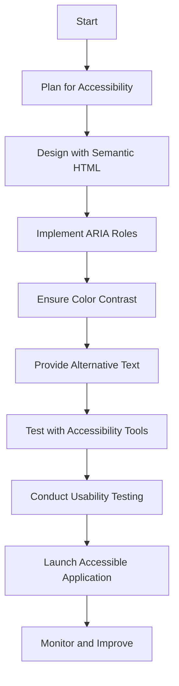

## 24.16 Designing for Accessibility

In today's digital age, designing for accessibility is not just a legal obligation but a moral imperative. Accessibility ensures that applications are usable by everyone, including people with disabilities. This section will guide you through the importance of accessibility in software design, introduce key guidelines like the Web Content Accessibility Guidelines (WCAG), and provide strategies for making web applications accessible. We will also discuss tools for testing accessibility and highlight the role of contrast, navigation, and alternative text in design. Let's embark on this journey to make the web a more inclusive place for all.

### Importance of Accessibility in Software Design

Accessibility in software design is crucial for several reasons:

1. **Inclusivity**: By designing accessible applications, we ensure that people with disabilities can use our software, promoting inclusivity and equal access to information and services.

2. **Legal Compliance**: Many countries have laws and regulations that require digital content to be accessible. Non-compliance can lead to legal consequences.

3. **Enhanced User Experience**: Accessible design often leads to a better overall user experience, benefiting all users, not just those with disabilities.

4. **Wider Audience Reach**: By making your application accessible, you can reach a broader audience, including the elderly and those with temporary disabilities.

5. **SEO Benefits**: Accessibility features like semantic HTML and alternative text can improve search engine optimization (SEO), making your content more discoverable.

### Web Content Accessibility Guidelines (WCAG)

The Web Content Accessibility Guidelines (WCAG) are a set of recommendations for making web content more accessible. They are organized around four principles, often abbreviated as POUR:

1. **Perceivable**: Information and user interface components must be presentable to users in ways they can perceive. This includes providing text alternatives for non-text content and ensuring content is adaptable.

2. **Operable**: User interface components and navigation must be operable. This means making all functionality available from a keyboard and providing users enough time to read and use content.

3. **Understandable**: Information and the operation of the user interface must be understandable. This involves making text readable and predictable, and helping users avoid and correct mistakes.

4. **Robust**: Content must be robust enough to be interpreted reliably by a wide variety of user agents, including assistive technologies.

For more detailed information, you can refer to the [WCAG guidelines](https://www.w3.org/WAI/standards-guidelines/wcag/).

### Strategies for Making Web Applications Accessible

#### Semantic HTML

Semantic HTML is the foundation of accessible web design. By using HTML elements according to their intended purpose, we can create a more meaningful structure that assistive technologies can interpret. For example, use `<header>`, `<nav>`, `<main>`, and `<footer>` to define the structure of your page.

```html
<!DOCTYPE html>
<html lang="en">
<head>
    <meta charset="UTF-8">
    <title>Accessible Web Page</title>
</head>
<body>
    <header>
        <h1>Welcome to Our Accessible Site</h1>
    </header>
    <nav>
        <ul>
            <li><a href="#home">Home</a></li>
            <li><a href="#about">About</a></li>
            <li><a href="#contact">Contact</a></li>
        </ul>
    </nav>
    <main>
        <section id="home">
            <h2>Home</h2>
            <p>Welcome to our website. We are committed to accessibility.</p>
        </section>
        <section id="about">
            <h2>About Us</h2>
            <p>Learn more about our mission and values.</p>
        </section>
    </main>
    <footer>
        <p>&copy; 2024 Our Accessible Site</p>
    </footer>
</body>
</html>
```

#### ARIA Roles

Accessible Rich Internet Applications (ARIA) roles help enhance the accessibility of web applications by providing additional context to assistive technologies. Use ARIA roles to define the purpose of elements that do not have a semantic equivalent in HTML.

```html
<div role="navigation" aria-label="Main Navigation">
    <ul>
        <li><a href="#home">Home</a></li>
        <li><a href="#about">About</a></li>
        <li><a href="#contact">Contact</a></li>
    </ul>
</div>
```

#### Contrast and Color

Ensure sufficient contrast between text and background colors to make content readable for users with visual impairments. Tools like [Contrast Checker](https://webaim.org/resources/contrastchecker/) can help you verify color contrast ratios.

#### Navigation

Provide clear and consistent navigation to help users find information easily. Use skip links to allow keyboard users to bypass repetitive content.

```html
<a href="#maincontent" class="skip-link">Skip to main content</a>
```

#### Alternative Text

Provide alternative text for images to describe their content and function. This helps users who rely on screen readers understand the context of the images.

```html

```

### Tools for Testing Accessibility

Testing is a crucial part of ensuring accessibility. Several tools can help you identify and fix accessibility issues:

- **[axe](https://www.deque.com/axe/)**: A browser extension that analyzes web pages for accessibility issues and provides detailed reports.

- **[WAVE](https://wave.webaim.org/)**: A web accessibility evaluation tool that provides visual feedback about the accessibility of your web content.

- **[Lighthouse](https://developers.google.com/web/tools/lighthouse)**: An open-source tool by Google that audits web pages for performance, accessibility, and more.

### Incorporating Accessibility from the Beginning

Incorporating accessibility from the beginning of development is essential for creating inclusive applications. Here are some best practices:

- **Plan for Accessibility**: Consider accessibility requirements during the planning phase of your project. Identify potential barriers and design solutions to address them.

- **Use Accessible Components**: Choose libraries and frameworks that prioritize accessibility. Ensure that components like buttons, forms, and modals are accessible by default.

- **Involve Users with Disabilities**: Conduct usability testing with people who have disabilities to gain insights into their experiences and identify areas for improvement.

- **Educate Your Team**: Provide training and resources to your development team to raise awareness about accessibility and equip them with the skills to implement it effectively.

### Visualizing Accessibility in Web Design

To better understand how accessibility fits into web design, let's visualize the process using a flowchart. This diagram illustrates the steps involved in designing an accessible web application.



### Knowledge Check

Before we wrap up, let's reinforce what we've learned with a few questions:

- What are the four principles of the WCAG guidelines?
- How can semantic HTML improve accessibility?
- Why is color contrast important in web design?
- What role do ARIA attributes play in accessibility?
- Name three tools for testing web accessibility.

### Embrace the Journey

Remember, designing for accessibility is an ongoing process. As you continue to develop applications, keep accessibility at the forefront of your mind. Experiment with different strategies, stay curious about new tools and techniques, and enjoy the journey of creating inclusive digital experiences for everyone.

## Quiz: Designing for Accessibility



### What are the four principles of the WCAG guidelines?

- [x] Perceivable, Operable, Understandable, Robust
- [ ] Accessible, Usable, Reliable, Secure
- [ ] Visible, Navigable, Predictable, Flexible
- [ ] Readable, Clickable, Scalable, Maintainable

> **Explanation:** The four principles of WCAG are Perceivable, Operable, Understandable, and Robust, which form the acronym POUR.

### How can semantic HTML improve accessibility?

- [x] By providing meaningful structure to web content
- [ ] By adding more styles to the page
- [ ] By increasing the page load speed
- [ ] By reducing the number of HTTP requests

> **Explanation:** Semantic HTML provides meaningful structure to web content, making it easier for assistive technologies to interpret and navigate.

### Why is color contrast important in web design?

- [x] To ensure text is readable for users with visual impairments
- [ ] To make the website look more attractive
- [ ] To reduce the number of colors used on a page
- [ ] To improve the website's SEO

> **Explanation:** Color contrast is important to ensure that text is readable for users with visual impairments, enhancing accessibility.

### What role do ARIA attributes play in accessibility?

- [x] They provide additional context to assistive technologies
- [ ] They increase the page's loading speed
- [ ] They enhance the visual design of the page
- [ ] They reduce the number of HTML elements needed

> **Explanation:** ARIA attributes provide additional context to assistive technologies, helping them interpret the purpose of elements that do not have a semantic equivalent in HTML.

### Name three tools for testing web accessibility.

- [x] axe, WAVE, Lighthouse
- [ ] Photoshop, Illustrator, Sketch
- [ ] Git, GitHub, GitLab
- [ ] Docker, Kubernetes, Jenkins

> **Explanation:** axe, WAVE, and Lighthouse are tools used for testing web accessibility, helping identify and fix accessibility issues.

### What is the purpose of alternative text for images?

- [x] To describe the content and function of images for screen readers
- [ ] To increase the image's resolution
- [ ] To add a caption to the image
- [ ] To change the image's file format

> **Explanation:** Alternative text describes the content and function of images for screen readers, making them accessible to users with visual impairments.

### How can skip links improve accessibility?

- [x] By allowing keyboard users to bypass repetitive content
- [ ] By adding more links to the page
- [ ] By increasing the page's loading speed
- [ ] By reducing the number of HTTP requests

> **Explanation:** Skip links allow keyboard users to bypass repetitive content, improving navigation and accessibility.

### What is the role of usability testing in accessibility?

- [x] To gain insights into the experiences of users with disabilities
- [ ] To increase the website's loading speed
- [ ] To enhance the visual design of the page
- [ ] To reduce the number of HTML elements needed

> **Explanation:** Usability testing with users who have disabilities provides insights into their experiences and helps identify areas for improvement in accessibility.

### Why is it important to involve users with disabilities in the design process?

- [x] To ensure the application meets their needs and expectations
- [ ] To increase the page's loading speed
- [ ] To enhance the visual design of the page
- [ ] To reduce the number of HTML elements needed

> **Explanation:** Involving users with disabilities in the design process ensures that the application meets their needs and expectations, leading to more inclusive and accessible designs.

### True or False: Accessibility should be considered only at the end of the development process.

- [ ] True
- [x] False

> **Explanation:** Accessibility should be considered from the beginning of the development process to ensure that applications are inclusive and meet accessibility standards.



By following these guidelines and incorporating accessibility into your development process, you can create applications that are not only compliant with legal standards but also inclusive and welcoming to all users. Keep experimenting, stay curious, and enjoy the journey of making the web a more accessible place for everyone!
