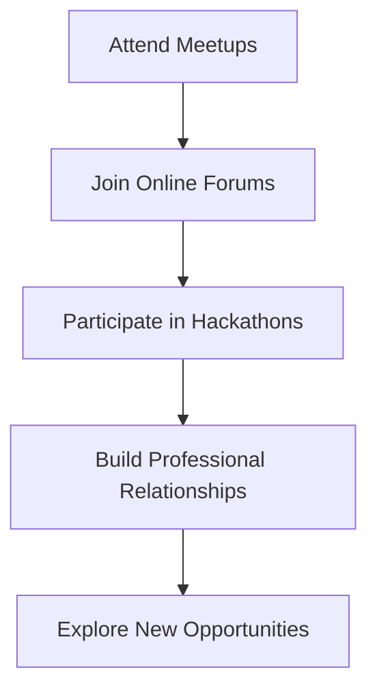

## 24.18 Career Development and Continuous Learning

In the ever-evolving field of software development, career development and continuous learning are not just beneficial—they are essential. As Ruby developers, we must stay ahead of the curve by setting clear career goals, acquiring new skills, seeking mentorship, and engaging with the community. This section will guide you through strategies to enhance your career, emphasizing the importance of lifelong learning and personal well-being.

### Setting Short-Term and Long-Term Career Goals

**Define Your Vision**

To navigate your career effectively, start by defining your vision. What do you want to achieve in the next year? In five years? Consider both your professional aspirations and personal values. A clear vision will guide your decisions and keep you motivated.

**Short-Term Goals**

Short-term goals are stepping stones toward your long-term vision. They should be specific, measurable, achievable, relevant, and time-bound (SMART). Examples include mastering a new Ruby design pattern, contributing to an open-source project, or obtaining a certification.

**Long-Term Goals**

Long-term goals require more planning and commitment. They might involve becoming a lead developer, transitioning into a managerial role, or specializing in a niche area like machine learning or cybersecurity. Regularly review and adjust your goals as your career progresses.

### Strategies for Acquiring New Skills

**Embrace Lifelong Learning**

The tech industry is dynamic, with new tools and frameworks emerging regularly. Lifelong learning is crucial to staying relevant. Dedicate time each week to learning, whether through online courses, books, or hands-on projects.

**Online Learning Platforms**

Platforms like Coursera, Udemy, and Pluralsight offer courses on a wide range of topics, including advanced Ruby programming and design patterns. These resources allow you to learn at your own pace and often provide certificates upon completion.

**Code Examples**

```ruby
# Example of a simple Ruby script to practice a new design pattern
class SingletonExample
  @@instance = nil

  def self.instance
    @@instance ||= new
  end

  private_class_method :new
end

# Usage
singleton = SingletonExample.instance
puts singleton.object_id
```

**Try It Yourself**

Experiment with modifying the Singleton pattern example above. Try implementing a thread-safe version or adapting it for a different use case.

**Attend Workshops and Conferences**

Workshops and conferences are excellent opportunities to learn from experts and stay updated on industry trends. They also provide a platform to network with peers and potential mentors.

### Importance of Seeking Mentorship and Networking

**Find a Mentor**

A mentor can provide guidance, support, and insights based on their experience. Look for someone whose career path you admire and who is willing to invest time in your development. Mentorship can be formal or informal, and it can significantly accelerate your growth.

**Networking**

Networking is about building relationships with other professionals. Attend meetups, join online forums, and participate in hackathons. Networking can lead to new opportunities, collaborations, and friendships.

**Visualizing Networking Opportunities**



### Opportunities for Career Progression

**Leadership Roles**

As you gain experience, consider moving into leadership roles. This could involve managing a team, leading projects, or becoming a technical lead. Leadership roles require strong communication and organizational skills.

**Specialization**

Specializing in a niche area can make you an expert in your field. Consider areas like cloud computing, artificial intelligence, or cybersecurity. Specialization can lead to higher demand and compensation.

### Involvement in Communities and Sharing Knowledge

**Contribute to Open Source**

Contributing to open-source projects is a great way to give back to the community and improve your skills. It also enhances your visibility and credibility as a developer.

**Write and Speak**

Share your knowledge by writing blog posts, giving talks, or creating tutorials. This not only helps others but also reinforces your understanding of the subject.

### Balancing Work with Personal Well-Being

**Prioritize Well-Being**

Career development should not come at the expense of your well-being. Maintain a healthy work-life balance by setting boundaries, taking breaks, and engaging in activities outside of work.

**Mindfulness and Stress Management**

Practice mindfulness and stress management techniques to maintain mental health. This can include meditation, exercise, or hobbies that help you relax and recharge.

### Conclusion

Career development and continuous learning are lifelong journeys. By setting clear goals, acquiring new skills, seeking mentorship, and engaging with the community, you can advance your career while maintaining personal well-being. Remember, the key to success is not just hard work but also smart work and a commitment to growth.

## Quiz: Career Development and Continuous Learning



### What is the first step in effective career navigation?

- [x] Define your vision
- [ ] Attend conferences
- [ ] Find a mentor
- [ ] Specialize in a niche area

> **Explanation:** Defining your vision helps guide your career decisions and keeps you motivated.

### Which of the following is a short-term goal example?

- [x] Mastering a new Ruby design pattern
- [ ] Becoming a lead developer
- [ ] Transitioning into a managerial role
- [ ] Specializing in cybersecurity

> **Explanation:** Short-term goals are specific and achievable within a shorter timeframe.

### What is the benefit of lifelong learning?

- [x] Staying relevant in a dynamic industry
- [ ] Avoiding networking
- [ ] Reducing workload
- [ ] Eliminating the need for mentorship

> **Explanation:** Lifelong learning helps you stay updated with industry trends and tools.

### How can you practice a new design pattern?

- [x] Implement it in a simple Ruby script
- [ ] Avoid using it in projects
- [ ] Only read about it
- [ ] Ignore it

> **Explanation:** Practicing through implementation helps reinforce understanding.

### What is the role of a mentor?

- [x] Provide guidance and support
- [ ] Complete your tasks
- [x] Share insights based on experience
- [ ] Make decisions for you

> **Explanation:** A mentor guides and supports your development with their experience.

### What is a key aspect of networking?

- [x] Building relationships with professionals
- [ ] Avoiding meetups
- [ ] Working alone
- [ ] Focusing only on online forums

> **Explanation:** Networking involves building professional relationships for opportunities and growth.

### What is an opportunity for career progression?

- [x] Moving into leadership roles
- [ ] Avoiding specialization
- [x] Specializing in a niche area
- [ ] Ignoring community involvement

> **Explanation:** Leadership roles and specialization are paths for career advancement.

### How can you contribute to the community?

- [x] Contribute to open-source projects
- [ ] Keep knowledge to yourself
- [ ] Avoid writing or speaking
- [ ] Focus only on personal projects

> **Explanation:** Contributing to open-source projects helps the community and enhances your skills.

### What is important for maintaining well-being?

- [x] Setting boundaries and taking breaks
- [ ] Working continuously
- [ ] Ignoring stress management
- [ ] Prioritizing work over health

> **Explanation:** Maintaining a work-life balance and managing stress are crucial for well-being.

### True or False: Career development should come at the expense of personal well-being.

- [ ] True
- [x] False

> **Explanation:** Career development should not compromise personal well-being; balance is essential.



Remember, this is just the beginning. As you progress, you'll find new opportunities and challenges. Keep learning, stay curious, and enjoy the journey!
