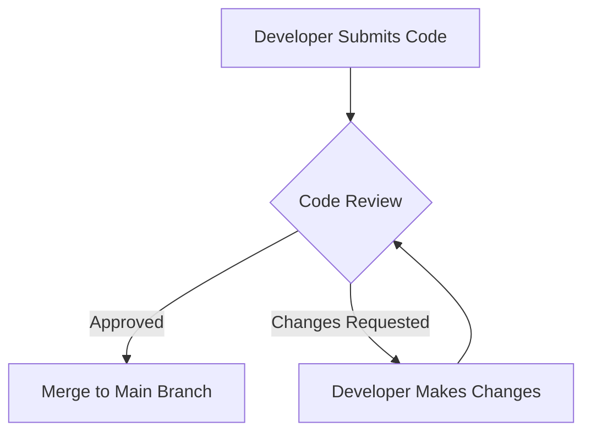

## 24.2 Effective Code Reviews and Pair Programming

In the realm of Ruby development, maintaining high code quality and fostering team collaboration are paramount. Two practices that significantly contribute to these goals are code reviews and pair programming. This section delves into the purpose, benefits, and best practices for conducting effective code reviews and engaging in successful pair programming sessions.

### The Purpose and Benefits of Code Reviews

Code reviews are a systematic examination of source code intended to find and fix mistakes overlooked in the initial development phase. They serve several purposes:

- **Enhancing Code Quality**: By catching bugs and improving code structure, reviews ensure that the codebase remains clean and maintainable.
- **Knowledge Sharing**: Reviews provide an opportunity for team members to learn from each other, spreading knowledge about the codebase and best practices.
- **Consistency**: They help enforce coding standards and conventions, ensuring consistency across the codebase.
- **Improved Collaboration**: Code reviews foster a culture of collaboration and open communication within the team.

#### Guidelines for Giving and Receiving Constructive Feedback

Effective code reviews hinge on constructive feedback. Here are some guidelines:

- **Be Respectful and Objective**: Focus on the code, not the coder. Use objective language and avoid personal criticism.
- **Be Specific**: Provide clear, actionable feedback. Instead of saying "This is wrong," explain why it's wrong and suggest improvements.
- **Balance Criticism with Praise**: Acknowledge what is done well to encourage positive practices.
- **Be Open to Discussion**: Encourage dialogue. The review process should be a two-way street where both parties can learn and grow.
- **Receive Feedback Gracefully**: When on the receiving end, be open to suggestions and view feedback as an opportunity for improvement.

#### Tools for Facilitating Code Reviews

Several tools can streamline the code review process:

- **GitHub Pull Requests**: A popular choice for many teams, GitHub provides a robust platform for code reviews with features like inline comments and change requests.
- **GitLab Merge Requests**: Similar to GitHub, GitLab offers comprehensive code review tools integrated with CI/CD pipelines.
- **Bitbucket**: Another alternative that integrates well with Jira, providing a seamless workflow for code reviews.

These tools not only facilitate the review process but also integrate with version control systems, making it easier to track changes and manage feedback.

### Principles of Pair Programming

Pair programming is a collaborative programming technique where two developers work together at one workstation. One, the "driver," writes code while the other, the "observer" or "navigator," reviews each line of code as it is typed. The roles are frequently switched.

#### Advantages of Pair Programming

- **Improved Code Quality**: With two sets of eyes on the code, errors are caught early, and better solutions are often devised.
- **Faster Problem Solving**: Two developers can brainstorm and solve problems more quickly than one.
- **Knowledge Transfer**: Pair programming is an excellent way to onboard new team members and share domain knowledge.
- **Enhanced Team Collaboration**: It fosters a culture of teamwork and open communication.

#### Tips for Successful Pair Programming Sessions

- **Communicate Clearly**: Maintain open lines of communication. Discuss the task at hand and agree on the approach before diving into coding.
- **Switch Roles Regularly**: Regularly switch roles to keep both developers engaged and to leverage each other's strengths.
- **Take Breaks**: Pair programming can be intense. Regular breaks help maintain focus and productivity.
- **Be Patient and Respectful**: Respect your partner's ideas and be patient. Pair programming is about collaboration, not competition.

### How Code Reviews and Pair Programming Contribute to Knowledge Sharing and Code Quality

Both code reviews and pair programming are instrumental in fostering a culture of continuous learning and improvement. They ensure that knowledge is shared across the team, reducing the risk of knowledge silos. By regularly engaging in these practices, teams can maintain a high standard of code quality, leading to more robust and maintainable applications.

### Code Example: Implementing a Simple Ruby Class with Code Review Comments

Let's look at a simple Ruby class and how code review comments might be applied:

```ruby
# Define a simple class to represent a Book
class Book
  attr_accessor :title, :author, :pages

  def initialize(title, author, pages)
    @title = title
    @title = author
    @pages = pages
  end

  # Method to display book details
  def display_details
    puts "Title: #{@title}, Author: #{@title}, Pages: #{@pages}"
  end
end

# Create a new book instance
book = Book.new("The Ruby Way", "Hal Fulton", 500)
book.display_details
```

**Code Review Comments:**

1. **Typo in Attribute Assignment**: The `initialize` method assigns `@title` twice. This is likely a typo. It should be `@title = title` and `@title = author`.

2. **Method Naming**: Consider renaming `display_details` to `print_details` to better reflect its functionality.

3. **Use of `puts`**: Instead of using `puts` directly, consider returning a formatted string. This makes the method more versatile.

**Revised Code:**

```ruby
# Define a simple class to represent a Book
class Book
  attr_accessor :title, :author, :pages

  def initialize(title, author, pages)
    @title = title
    @author = author
    @pages = pages
  end

  # Method to return book details as a formatted string
  def print_details
    "Title: #{@title}, Author: #{@author}, Pages: #{@pages}"
  end
end

# Create a new book instance
book = Book.new("The Ruby Way", "Hal Fulton", 500)
puts book.print_details
```

### Try It Yourself

Experiment with the code above by adding new methods or attributes to the `Book` class. Consider how you might refactor the code to improve its design or functionality.

### Visualizing the Code Review Process

Below is a simple flowchart representing the code review process using Mermaid.js:



**Description**: This flowchart illustrates the typical code review process, where a developer submits code, it undergoes review, and either gets approved or sent back for changes.

### References and Further Reading

- [GitHub Code Review Tools](https://docs.github.com/en/pull-requests)
- [GitLab Merge Requests](https://docs.gitlab.com/ee/user/project/merge_requests/)
- [Bitbucket Code Review](https://support.atlassian.com/bitbucket-cloud/docs/code-review-with-pull-requests/)

### Knowledge Check

- What are the key benefits of code reviews?
- How can pair programming improve team collaboration?
- What tools can facilitate code reviews?
- How should feedback be given during a code review?
- What are some tips for successful pair programming?

### Embrace the Journey

Remember, mastering code reviews and pair programming is a journey. These practices not only improve code quality but also enhance team dynamics and personal growth. Keep experimenting, stay open to feedback, and enjoy the collaborative process!

## Quiz: Effective Code Reviews and Pair Programming



### What is one of the primary purposes of code reviews?

- [x] Enhancing code quality
- [ ] Increasing code complexity
- [ ] Reducing team communication
- [ ] Limiting knowledge sharing

> **Explanation:** Code reviews enhance code quality by identifying bugs and improving code structure.

### Which tool is commonly used for code reviews in GitHub?

- [x] Pull Requests
- [ ] Issues
- [ ] Wikis
- [ ] Projects

> **Explanation:** GitHub Pull Requests are used for code reviews, allowing for inline comments and change requests.

### What is a key benefit of pair programming?

- [x] Faster problem solving
- [ ] Increased individual work
- [ ] Reduced collaboration
- [ ] Decreased code quality

> **Explanation:** Pair programming allows for faster problem solving as two developers can brainstorm and solve issues together.

### How should feedback be given during a code review?

- [x] Respectfully and objectively
- [ ] Harshly and subjectively
- [ ] Vaguely and indirectly
- [ ] Critically and personally

> **Explanation:** Feedback should be respectful and objective, focusing on the code, not the coder.

### What is a tip for successful pair programming?

- [x] Switch roles regularly
- [ ] Work in silence
- [ ] Avoid communication
- [ ] Stick to one role

> **Explanation:** Regularly switching roles keeps both developers engaged and leverages each other's strengths.

### What is a common mistake in code reviews?

- [x] Focusing on the coder instead of the code
- [ ] Providing specific feedback
- [ ] Encouraging dialogue
- [ ] Balancing criticism with praise

> **Explanation:** Focusing on the coder instead of the code can lead to personal criticism, which is not constructive.

### Which of the following is NOT a benefit of code reviews?

- [ ] Knowledge sharing
- [ ] Consistency
- [x] Increased code complexity
- [ ] Improved collaboration

> **Explanation:** Code reviews aim to reduce complexity, not increase it.

### What is the role of the "navigator" in pair programming?

- [x] Reviewing each line of code as it is typed
- [ ] Writing code
- [ ] Managing project timelines
- [ ] Testing code

> **Explanation:** The navigator reviews each line of code as it is typed, providing feedback and suggestions.

### What is a benefit of using GitHub for code reviews?

- [x] Integration with version control systems
- [ ] Lack of collaboration features
- [ ] Limited tracking of changes
- [ ] Absence of feedback tools

> **Explanation:** GitHub integrates with version control systems, making it easier to track changes and manage feedback.

### True or False: Pair programming reduces the risk of knowledge silos.

- [x] True
- [ ] False

> **Explanation:** Pair programming facilitates knowledge sharing, reducing the risk of knowledge silos.


