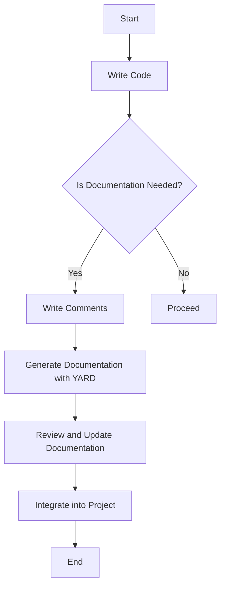

## 24.3 Documentation and Commenting Standards

In the realm of software development, documentation and commenting are pivotal for ensuring that code is not only functional but also understandable and maintainable. This section delves into the strategies and tools that Ruby developers can employ to create effective documentation and meaningful comments, enhancing both code comprehension and maintenance.

### The Importance of Documentation

Documentation serves as the bridge between the developer's intent and the user's understanding. It plays a crucial role in:

- **Facilitating Collaboration**: Clear documentation allows team members to understand each other's code, fostering collaboration and reducing the learning curve for new developers.
- **Enhancing Maintenance**: Well-documented code is easier to maintain and update, as the purpose and functionality of code segments are clearly outlined.
- **Improving Usability**: For end-users, documentation provides guidance on how to use the software effectively, including installation instructions, usage examples, and troubleshooting tips.

### Code Comments vs. External Documentation

Before diving into the specifics, it's essential to distinguish between code comments and external documentation:

- **Code Comments**: These are annotations within the code itself, intended to explain the logic, purpose, or functionality of specific code blocks. They are primarily for developers who will read or maintain the code.
  
- **External Documentation**: This includes README files, API documentation, user manuals, and other forms of documentation that exist outside the codebase. It is intended for both developers and end-users.

### Guidelines for Effective Code Commenting

Effective commenting is an art. Here are some guidelines to ensure your comments are helpful and not just noise:

1. **Comment the Why, Not the What**: Focus on explaining why a particular piece of code exists or why a specific approach was taken, rather than what the code is doing. The code itself should be clear enough to convey the "what."

2. **Keep Comments Up-to-Date**: As code evolves, ensure that comments are updated to reflect any changes. Outdated comments can be misleading and more harmful than no comments at all.

3. **Avoid Redundant Comments**: Comments should add value. Avoid stating the obvious or repeating information that is clear from the code itself.

4. **Use Comments for Complex Logic**: When dealing with complex algorithms or logic, use comments to break down the steps and explain the reasoning.

5. **Document Assumptions and Dependencies**: If your code relies on certain assumptions or external dependencies, make sure to document these to prevent future issues.

6. **Standardize Commenting Style**: Adopt a consistent commenting style across your codebase to maintain uniformity and readability.

### Tools for Generating Documentation

Ruby developers have access to several tools that can automate the generation of documentation. One of the most popular is [YARD](https://yardoc.org/).

#### YARD: Your Ruby Documentation Companion

YARD is a documentation generation tool for Ruby that allows developers to create beautiful, easy-to-read documentation for their code. It supports a variety of formats and is highly customizable.

- **Installation**: You can install YARD using RubyGems with the command `gem install yard`.

- **Basic Usage**: To generate documentation, navigate to your project directory and run `yardoc`. This will parse your code and generate HTML documentation.

- **Tagging**: YARD supports various tags to enhance documentation, such as `@param` for method parameters, `@return` for return values, and `@example` for usage examples.

- **Customization**: YARD allows you to customize the output format and style, making it adaptable to your project's needs.

Here's a simple example of using YARD tags in a Ruby method:

```ruby
# Calculates the factorial of a number.
#
# @param n [Integer] The number to calculate the factorial for.
# @return [Integer] The factorial of the number.
# @example Calculate the factorial of 5
#   factorial(5) # => 120
def factorial(n)
  return 1 if n <= 1
  n * factorial(n - 1)
end
```

### Writing Clear README Files and API Documentation

A well-crafted README file is often the first point of contact for users and developers. It should provide a concise overview of the project, including:

- **Project Description**: A brief summary of what the project does and its key features.
- **Installation Instructions**: Step-by-step guidance on how to set up the project.
- **Usage Examples**: Code snippets or examples demonstrating how to use the project.
- **Contributing Guidelines**: Instructions for developers who wish to contribute to the project.
- **License Information**: Details about the project's licensing.

API documentation should be comprehensive and include:

- **Endpoint Descriptions**: Detailed information about each API endpoint, including the HTTP method, URL, parameters, and response format.
- **Authentication Requirements**: Information on how to authenticate requests.
- **Error Handling**: Descriptions of possible error responses and how to handle them.

### Best Practices for Keeping Documentation Up-to-Date

Keeping documentation current is a continuous process. Here are some best practices:

- **Integrate Documentation into the Development Workflow**: Make documentation a part of the development process, not an afterthought. Encourage developers to update documentation as they write or modify code.

- **Regular Reviews**: Schedule regular documentation reviews to ensure accuracy and completeness.

- **Automate Where Possible**: Use tools like YARD to automate the generation of documentation, reducing manual effort and ensuring consistency.

- **Encourage Contributions**: Foster a culture where team members are encouraged to contribute to documentation, whether by updating existing content or creating new sections.

### Visualizing Documentation Workflow

To better understand the documentation workflow, let's visualize it using a Mermaid.js flowchart:



This flowchart outlines the process of integrating documentation into the development workflow, emphasizing the importance of reviewing and updating documentation regularly.

### Knowledge Check

To reinforce your understanding, consider these questions:

- What is the primary purpose of code comments?
- How can YARD enhance your documentation process?
- Why is it important to keep documentation up-to-date?

### Embrace the Journey

Remember, documentation is not just a task to be completed but an integral part of the development process. It enhances collaboration, improves code quality, and ensures that your projects are accessible to others. As you continue your journey in Ruby development, keep experimenting with different documentation styles and tools, stay curious, and enjoy the process of making your code more understandable and maintainable.

## Quiz: Documentation and Commenting Standards



### What is the primary purpose of code comments?

- [x] To explain why a particular piece of code exists
- [ ] To describe every line of code
- [ ] To replace external documentation
- [ ] To increase the file size

> **Explanation:** Code comments should focus on explaining the reasoning behind the code, not describing every line or replacing external documentation.

### Which tool is commonly used for generating Ruby documentation?

- [x] YARD
- [ ] Javadoc
- [ ] Sphinx
- [ ] Doxygen

> **Explanation:** YARD is a popular tool for generating documentation in Ruby, allowing developers to create detailed and customizable documentation.

### What should a README file include?

- [x] Project description, installation instructions, usage examples
- [ ] Only the project name
- [ ] A list of contributors
- [ ] The project's entire codebase

> **Explanation:** A README file should provide a concise overview of the project, including a description, installation instructions, and usage examples.

### Why is it important to keep documentation up-to-date?

- [x] To ensure accuracy and prevent misleading information
- [ ] To increase the size of the documentation
- [ ] To make it harder for new developers to understand the project
- [ ] To add more work for developers

> **Explanation:** Keeping documentation up-to-date ensures that it remains accurate and helpful, preventing confusion and errors.

### What is a key benefit of using YARD for documentation?

- [x] It automates the generation of documentation
- [ ] It requires manual updates for every change
- [ ] It only works with Python code
- [ ] It does not support customization

> **Explanation:** YARD automates the documentation process, making it easier to maintain and ensuring consistency across the project.

### What should comments in code focus on?

- [x] Explaining complex logic and assumptions
- [ ] Describing every variable
- [ ] Repeating what the code already shows
- [ ] Increasing the number of lines in the file

> **Explanation:** Comments should focus on explaining complex logic and any assumptions made, rather than stating the obvious.

### How can developers ensure documentation is part of the workflow?

- [x] Integrate it into the development process
- [ ] Ignore it until the project is complete
- [ ] Only update it once a year
- [ ] Leave it to a single team member

> **Explanation:** Integrating documentation into the development process ensures it is consistently updated and maintained.

### What is the role of external documentation?

- [x] To provide guidance for both developers and end-users
- [ ] To replace code comments
- [ ] To increase the project's complexity
- [ ] To serve as a backup for the codebase

> **Explanation:** External documentation provides guidance and information for both developers and end-users, complementing code comments.

### What is a common mistake in code commenting?

- [x] Writing redundant comments
- [ ] Explaining complex logic
- [ ] Documenting assumptions
- [ ] Keeping comments up-to-date

> **Explanation:** Redundant comments that state the obvious do not add value and can clutter the code.

### True or False: YARD can only generate documentation in HTML format.

- [ ] True
- [x] False

> **Explanation:** YARD supports multiple output formats, not just HTML, allowing for flexibility in documentation presentation.


