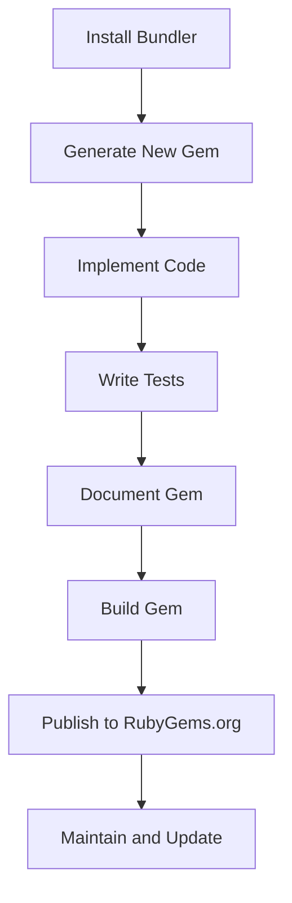

## 24.4 Maintaining Reusable Libraries and Gems

Creating and maintaining reusable libraries and gems is a cornerstone of efficient and scalable Ruby development. By encapsulating functionality into well-defined, reusable components, developers can foster code reuse, consistency, and maintainability across projects. This section provides a comprehensive guide to building and managing Ruby gems, covering everything from creation to publication and maintenance.

### Benefits of Building Reusable Components

Reusable components offer numerous advantages:

- **Consistency**: By using the same library across multiple projects, you ensure consistent behavior and reduce the likelihood of bugs.
- **Efficiency**: Reusable libraries save time and effort, as you don't need to rewrite code for each new project.
- **Maintainability**: Centralizing code in a library makes it easier to update and maintain.
- **Community Contribution**: Sharing your libraries with the community can lead to valuable feedback and contributions.

### Creating a New Gem with Bundler

Bundler is a powerful tool for managing Ruby project dependencies and creating new gems. Follow these steps to create a new gem:

1. **Install Bundler**: Ensure Bundler is installed on your system.
   ```bash
   gem install bundler
   ```

2. **Generate a New Gem**: Use Bundler to create a new gem scaffold.
   ```bash
   bundle gem my_new_gem
   ```

3. **Understand the Generated Files**: Bundler generates a directory structure with essential files:
   - `my_new_gem.gemspec`: Defines the gem's metadata and dependencies.
   - `lib/my_new_gem.rb`: The main file for your gem's code.
   - `Rakefile`: Used for task automation.
   - `Gemfile`: Manages dependencies for development.

4. **Implement Your Code**: Add your library's functionality in the `lib` directory. Ensure your code is modular and follows Ruby conventions.

5. **Versioning Your Gem**: Use semantic versioning (SemVer) to manage your gem's versions. SemVer uses a `MAJOR.MINOR.PATCH` format:
   - **MAJOR**: Increment for incompatible API changes.
   - **MINOR**: Increment for backward-compatible functionality.
   - **PATCH**: Increment for backward-compatible bug fixes.

### Best Practices for Versioning and Changelogs

- **Semantic Versioning**: Adhere to semantic versioning principles to communicate changes clearly.
- **Changelogs**: Maintain a changelog to document changes, improvements, and bug fixes. This helps users understand the evolution of your gem.

### Importance of Tests, Documentation, and Clear APIs

- **Testing**: Write comprehensive tests to ensure your gem functions as expected. Use testing frameworks like RSpec or Minitest.
- **Documentation**: Provide clear documentation for your gem. Use tools like YARD to generate documentation from comments in your code.
- **Clear APIs**: Design intuitive and consistent APIs. Follow Ruby conventions and provide examples in your documentation.

### Managing Dependencies and Minimizing Conflicts

- **Specify Dependencies**: Clearly define your gem's dependencies in the `.gemspec` file. Use version constraints to avoid conflicts.
- **Minimize Dependencies**: Keep dependencies to a minimum to reduce the risk of conflicts and make your gem easier to maintain.
- **Use Bundler**: Leverage Bundler to manage dependencies during development and ensure compatibility.

### Publishing Gems to RubyGems.org

1. **Create an Account**: Sign up for an account on [RubyGems.org](https://rubygems.org/).
2. **Build the Gem**: Use the `gem build` command to package your gem.
   ```bash
   gem build my_new_gem.gemspec
   ```

3. **Push the Gem**: Publish your gem to RubyGems.org using the `gem push` command.
   ```bash
   gem push my_new_gem-0.1.0.gem
   ```

4. **Maintain Your Gem**: Regularly update your gem to fix bugs, add features, and improve performance. Engage with the community for feedback and contributions.

### Try It Yourself

Experiment with creating a simple gem using Bundler. Start by generating a new gem scaffold, implement a basic feature, and publish it to RubyGems.org. Modify the code to add new features or fix bugs, and observe how versioning and changelogs help manage changes.

### Visualizing the Gem Creation Process



*Figure: The process of creating and maintaining a Ruby gem.*

### Knowledge Check

- What are the benefits of building reusable components?
- How does semantic versioning help in managing gem versions?
- Why is documentation important for a gem?
- How can you minimize dependency conflicts in your gem?

### Embrace the Journey

Remember, creating and maintaining reusable libraries and gems is an ongoing process. As you gain experience, you'll refine your skills and contribute more effectively to the Ruby community. Keep experimenting, stay curious, and enjoy the journey!

## Quiz: Maintaining Reusable Libraries and Gems



### What is the primary benefit of creating reusable libraries and gems?

- [x] Consistency across projects
- [ ] Increased code complexity
- [ ] Higher maintenance costs
- [ ] Reduced code readability

> **Explanation:** Reusable libraries and gems promote consistency across projects, making it easier to maintain and update code.

### Which tool is commonly used to create a new Ruby gem?

- [x] Bundler
- [ ] Rake
- [ ] Rails
- [ ] Sinatra

> **Explanation:** Bundler is a tool used to create and manage Ruby gems, providing a scaffold and managing dependencies.

### What is the format used in semantic versioning?

- [x] MAJOR.MINOR.PATCH
- [ ] PATCH.MINOR.MAJOR
- [ ] MINOR.MAJOR.PATCH
- [ ] MAJOR.PATCH.MINOR

> **Explanation:** Semantic versioning uses the MAJOR.MINOR.PATCH format to indicate changes in the gem.

### Why is it important to maintain a changelog for your gem?

- [x] To document changes and improvements
- [ ] To increase the gem's size
- [ ] To confuse users
- [ ] To hide bugs

> **Explanation:** A changelog documents changes, improvements, and bug fixes, helping users understand the evolution of the gem.

### What should be minimized in a gem to reduce the risk of conflicts?

- [x] Dependencies
- [ ] Documentation
- [ ] Code comments
- [ ] Tests

> **Explanation:** Minimizing dependencies reduces the risk of conflicts and makes the gem easier to maintain.

### What is the purpose of writing tests for a gem?

- [x] To ensure the gem functions as expected
- [ ] To increase the gem's complexity
- [ ] To reduce development time
- [ ] To make the gem harder to use

> **Explanation:** Writing tests ensures that the gem functions as expected and helps catch bugs early.

### How can you publish a gem to RubyGems.org?

- [x] Use the `gem push` command
- [ ] Use the `gem install` command
- [ ] Use the `gem build` command
- [ ] Use the `gem fetch` command

> **Explanation:** The `gem push` command is used to publish a gem to RubyGems.org.

### What is a key consideration when designing a gem's API?

- [x] Intuitiveness and consistency
- [ ] Complexity and obscurity
- [ ] Length and verbosity
- [ ] Lack of documentation

> **Explanation:** A gem's API should be intuitive and consistent, following Ruby conventions and providing clear examples.

### What tool can be used to generate documentation from comments in your code?

- [x] YARD
- [ ] RSpec
- [ ] Bundler
- [ ] Rails

> **Explanation:** YARD is a tool used to generate documentation from comments in Ruby code.

### True or False: Semantic versioning is not important for managing gem versions.

- [ ] True
- [x] False

> **Explanation:** Semantic versioning is crucial for managing gem versions, as it communicates changes clearly to users.




